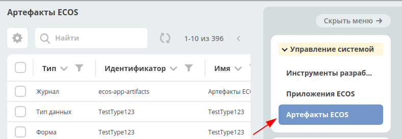

========================
**ECOS Приложения**
========================

Определения
~~~~~~~~~~~

Артефакт - единица расширения системы. Примеры артефактов: Тип, Форма, Журнал

ECOS Приложение (ECOS App) - приложение, которое содержит в себе артефакты. Основная цель - переносимость артефактов между стендами и возможность версионирования. ECOS Application является артефактом, но его нельзя включить в другие приложения т.к. это системный тип.

Работа с приложениями 
~~~~~~~~~~~~~~~~~~~~~

Работа сприложениями осуществляется на странице администратора системы.

http://host/v2/bpmn-designer?journalId=ecos-apps

.. image:: _static/ecos-apps/apps_page.png
       :align: center

На этой странице можно:
1. Cоздавать и редактировать приложения
2. Скачивать приложения

Структура архива приложения
~~~~~~~~~~~~~~~~~~~~

::

  meta.json // метаданные приложения
  artifacts: // папка с артефактами приложения
    type0:
      subType0:
        artifact0.json
        artifact1.json
        ...
      subType1:
        artifact0.json
        artifact1.json
        ...
    typ1:
      subType0:
        artifact0.json
        ...
      subType1:
        artifact0.json
        ...
    ...

Артефакты
~~~~~~~~~

Для управления артефактами предусмотрен журнал "Артефакты ECOS". В данный журнал попадают все артефакты, которые достигли микросервиса ecos-apps. 

В данном журнале есть возможность выполнить следующие действия:

1. Скачать историю артефакта

При нажатии на действие можно выбрать дату, с которой необходимо выгрузить историю артефакта.
При сабмите формы скачивается zip архив со всеми версиями артефакта с указанной даты.
Если последний артефакт был загружен ранее чем выбраная дата, то будет выгружен только он (т.е. всегда будет как минимум 1 артефакт).

Формат имени папки с версией артефакта: дата_созданияTвремя_созданияZ-[USER | APPLICATION | ECOS_APP]
Дата создания указывается в часовом поясе UTC.

.. image:: _static/ecos-apps/artifact-history.png
       :align: center

2. Скачать артафакт

Всегда скачивается zip архив с выбранным артефактом

3. Передеплоить артефакт вручную

Отправить артефакт из ecos-apps в микросервис. Может быть полезно при разработке или после сбоя в базе целевого микросервиса т.е. ecos-apps не пропускает артефакт если он ранее был успешно задеплоен.

4. Сбросить пользовательскую версию артефакта

Сброс происходит до той версии, которая была установлена из приложения (APPLICATION или ECOS_APP). Сбрасывать можно только артефакты, которые в колонке "Тип источника" имеют USER.

Источники артефактов
~~~~~~~~~~~~~~~~~~~~

Есть 3 возможных источника артефактов:

1. **USER** - артефакт добавляет или модифицирует пользователь;
2. **APPLICATION** - артефакт загружается из приложений, которые подключены к интерфейсу команд;
3. **ECOS_APP** - артефакт загружается из приложения ECOS;

Все 3 источника имеют свою политику по обновлению артефактов:

USER
----

Артефакт обновляется безусловно. Любое изменение артефакта приводит к его изменению в базе микросервиса ecos-apps.

APPLICATION
-----------

Артефакт обновляется если он не принадлежит никакому приложению ECOS и была загружена версия артефакта, которая отличается от предыдущей загруженной из APPLICATION.
Пример: Если у нас есть следующие ревизии артефакта:

- rev2 USER
- rev1 USER
- rev0 APPLICATION

rev0 - самая первая версия артефакта
rec2 - самая последняя версия артефакта

Видим, что первая версия артефакта поступила из приложения, а другие две от пользователя.
Если в такой ситуации в микросервис приходит версия rev0 от APPLICATION, то ничего не поменяется не смотря на то что rev2 != rev0.
Если из приложения придет rev3, то новая ревизия загрузится и станет актуальной:

- rev3 APPLICATION
- rev2 USER
- rev1 USER
- rev0 APPLICATION

ECOS_APP
--------

Работает аналогично APPLICATION, но при загрузке артефакту проставляется признак принадлежности приложению. Если артефакт принадлежит приложению, то он не обновляется из APPLICATION.

