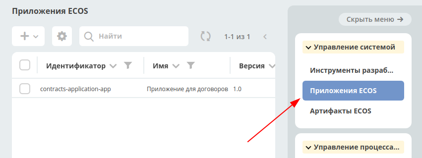

========================
**ECOS Приложения**
========================

Определения
~~~~~~~~~~~

Артифакт - единица расширения системы. Примеры артифактов: Тип, Форма, Журнал

ECOS Aapplication (ECOS App) - приложение ECOS, которое содержит в себе артифакты. Основная цель - переносимость артифактов между стендами и возможность версионирования. ECOS Application является артифактом, но его нельзя включить в другие приложения т.к. это системный тип.

Работа с приложениями 
~~~~~~~~~~~~~~~~~~~

Работа сприложениями осуществляется на странице администратора системы.

http://host/v2/bpmn-designer?journalId=ecos-apps

На этой странице можно:
1. Cоздавать и редактировать приложения
2. Скачивать приложения
3. 

Структура архива приложения
~~~~~~~~~~~~~~~~~~~~

::

  meta.json // метаданные приложения
  artifacts: // папка с артифактами приложения
    type0:
      subType0:
        artifact0.json
        artifact1.json
        ...
      subType1:
        artifact0.json
        artifact1.json
        ...
    typ1:
      subType0:
        artifact0.json
        ...
      subType1:
        artifact0.json
        ...
    ...

Источники артифактов
~~~~~~~~~~~~~~~~~~~~

Есть 3 возможных источника артифактов: 

1. **USER** - артифакт добавляет или модифицирует пользователь;
2. **APPLICATION** - артифакт загружается из приложений, которые подключены к интерфейсу команд;
3. **ECOS_APP** - артифакт загружается из приложения ECOS;

Все 3 источника имеют свою политику по обновлению артифактов:

USER
----

Артифакт обновляется безусловно. Любое изменение артифакта приводит к его изменению в базе микросервиса ecos-apps.

APPLICATION
-----------

Артифакт обновляется если он не принадлежит никакому приложению ECOS и была загружена версия артифакта, которая отличается от предыдущей загруженной из APPLICATION.
Пример: Если у нас есть следующие ревизии артифакта:

- rev2 USER
- rev1 USER
- rev0 APPLICATION

rev0 - самая первая версия артифакта
rec2 - самая последняя версия артифакта

Видим, что первая версия артифакта поступила из приложения, а другие две от пользователя.
Если в такой ситуации в микросервис приходит версия rev0 от APPLICATION, то ничего не поменяется не смотря на то что rev2 != rev0.
Если из приложения придет rev3, то новая ревизия загрузится и станет актуальной:

- rev3 APPLICATION
- rev2 USER
- rev1 USER
- rev0 APPLICATION

ECOS_APP
--------

Работает аналогично APPLICATION, но при загрузке артифакту проставляется признак принадлежности приложению. Если артифакт принадлежит приложению, то он не обновляется из APPLICATION.

