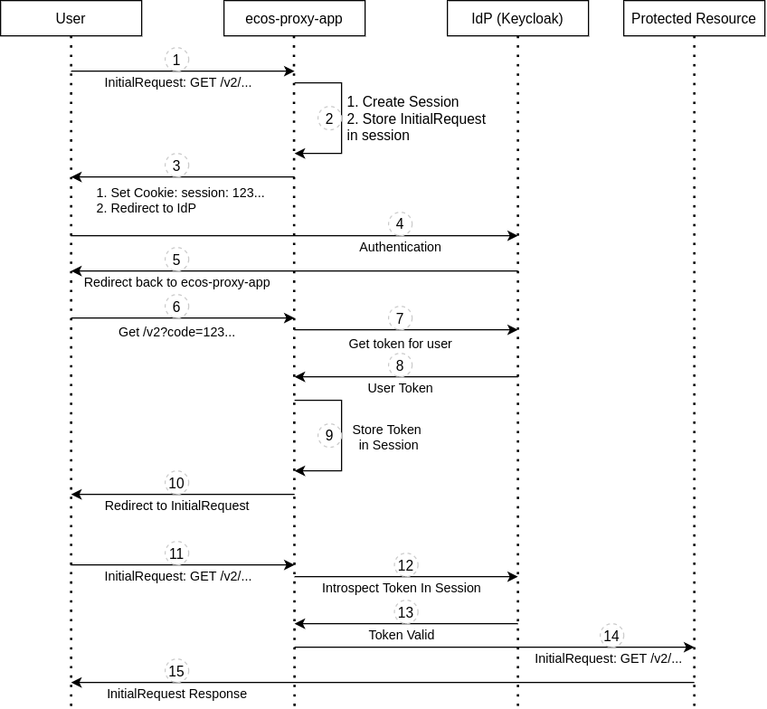
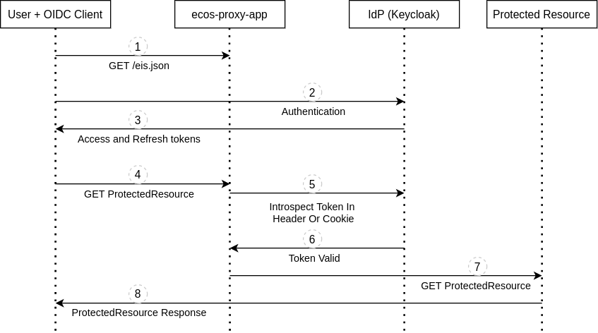

Аутентификация
===============

Терминология
------------

* IdP (Identity provider) - Провайдер аутентификации, который отвечает за аутентификацию пользователей и внешних систем. 
  В Citeck ECOS в качестве протокола для аутентификации используется OpenID Connect. В качестве стандартного IdP используется `Keycloak <https://www.keycloak.org/>`_.
* `OIDC (OpenID Connect) <https://openid.net/connect/>`_ - Открытый стандарт децентрализованной системы аутентификации.
* Access Token - Токен доступа. Используется при доступе к защищенным ресурсам. Как правило имеет малое время жизни (порядка пяти минут) и регулярно обновляется с помощью токена обновления (Refresh Token).
* Refresh Token - Токен обновления. Используется OIDC клиентом при обращении к IdP для получения нового токена доступа (Access Token).
* IdP Realm - это независимое пространство со своими настройками аутентификации для конкретного сервера. 
  Если проводить аналогию с базами данных, то IdP - это СУБД, а реалм - это БД.  

Общая информация
----------------

В Citeck ECOS поддерживается два способа аутентификации:

1. Аутентификация через встроенный OIDC клиент
2. Аутентификация через внешний OIDC клиент 

Аутентификация через встроенный OIDC клиент
-------------------------------------------

Логика аутентификации находится в приложении ecos-proxy-app и реализована через модуль `lua-resty-openidc <https://luarocks.org/modules/hanszandbelt/lua-resty-openidc>`_

Настройка модуля выполняется через переменные среды контейнера ecos-proxy-app:

.. list-table::

 * - **Переменная**
   - **Значение**
   - **Описание**
 * - EIS_TARGET
   - | Строка вида ``host[:port]``
   - | Внутренний хост IdP. Используется, чтобы определить куда нужно направить запросы
     | с ``http://{{SERVER_HOST}}/ecos-idp/auth/``. Этот параметр нужен только тогда, когда IdP
     | разворачивается в комплекте с ECOS. Для использования внешнего IdP эту настройку 
     | следует опустить.
 * - ENABLE_OIDC_FULL_ACCESS
   - | ``true`` или ``false``
   - | Включить интеграцию с IdP. Как правило здесь всегда должно стоять ``true``. 
 * - CLIENT_ID
   - | Строка
   - | Идентификатор клиента для работы с IdP. По умолчанию ``nginx``.
 * - CLIENT_SECRET
   - | Строка
   - | Секрет для аутентификации OIDC клиента (ecos-proxy-app) на IdP.
 * - EIS_SCHEME
   - | ``http`` или ``https``
   - | Схема для запросов от OIDC клиента (ecos-proxy-app) к IdP. По умолчанию ``https``.
 * - EIS_ID
   - | Строка вида ``host[:port]``
   - | Хост для доступа к IdP от OIDC клиента и от браузера пользователя.
 * - EIS_LOCATION
   - | Строка
   - | Локация, по которой доступен IdP на хосте EIS_ID. По умолчанию ``auth`` 
 * - REALM_ID
   - | Строка
   - | Идентификатор реалма, в рамках которого выполняется интеграция с IdP.
 * - REDIRECT_LOGOUT_URI
   - | URI строка
   - | URI для переадресации после успешного входа, который произошел после логаута.
 * - ENABLE_LOGGING
   - | ``debug`` или ``warn``
   - | Включение дебага для ecos-proxy-app. При значении ``debug`` в логах пишутся все шаги 
     | взаимодействия с IdP. Если этот параметр не задан, то все логи отправляются в ``/dev/null``

При включенной интеграции с IdP ecos-proxy-app отправляет GET запрос за информацией для работы протокола OIDC по адресу:

``EIS_SCHEME://EIS_ID/EIS_LOCATION/realms/REALM_ID/.well-known/openid-configuration``

В ответе IdP возвращает параметры, которые нужны нашему клиенту для работы по протоколу OIDC. Например:

1. Адреса для получения и обновления токенов;
2. Адрес для проверки токена пользователя;
3. Адрес для логаута;
4. Поддерживаемые алгоритмы шифрования;
5. и т.д.

Алгоритм аутентификация через встроенный OIDC клиент
~~~~~~~~~~~~~~~~~~~~~~~~~~~~~~~~~~~~~~~~~~~~~~~~~~~~

1. Приходит запрос от пользователя на защищенный ресурс;
2. ecos-proxy-app создает сессию для пользователя и сохраняет там исходный запрос из п.1;
3. ecos-proxy-app отправляет ответ пользователю с установкой куки с идентификатором сессии и редиректом на IdP для входа;
4. Пользователь проходит аутентификацию на IdP через ввод логина/пароля или используя альтернативные способы для входа;
5. IdP после успешного входа редиректит пользователя на URI, который был указан в параметре redirect_uri при редиректе на п.3 и при этом добавляет в этот URI параметр с кодом, по которому ecos-proxy-app сможет запросить токены пользователя у IdP;
6. Пользователь открывает URI, который является колбэком для аутентификации (по дефолту в ECOS это ``/v2``) и попадает на ecos-proxy-app;
7. ecos-proxy-app получает код от пользователя и отправляет с ним запрос на IdP для получения Access и Refresh токенов для пользователя;
8. ecos-proxy-app получает токены пользователя от IdP;
9. ecos-proxy-app сохраняет у себя токены пользователя в его сессии;
10. ecos-proxy-app отправляет пользователю редирект на исходный URI, который он запрашивал в п.1;
11. Пользователь отправляет запрос на исходный URI из п.1;
12. ecos-proxy-app достает Access токен пользователя из сессии и отправляет запрос в IdP на проверку валидности;
13. IdP отвечает ecos-proxy-app, что токен валидный;
14. ecos-proxy-app предоставляет доступ пользователю к защищенному ресурсу и при этом добавляет в запрос хидер ``X-ECOS-User``, который равен имени пользователя;
15. Пользователь получает ожидаемый ответ от защищенного ресурса.

Во всем процессе аутентификации от пользователя требуется только действия на шаге 4 (аутентификация на IdP). 
Все остальные пункты проходят прозрачно и незаметно для пользователя.

Шаги 11-15 выполняются при каждом последующем запросе с поправкой на то, что результат проверки токена на валидность кэшируется.
Время хранения кэша зависит от настоек IdP и как правило равно времени жизни токена доступа (Access Token).

Аутентификация через внешний OIDC клиент
----------------------------------------

1. Клиент получает базовую конфигурацию для работы с IdP (realmId, eisId, logoutUrl) отправив GET запрос на ``{{SERVER_HOST}}/eis.json``;
2. Клиент предлагает пользователю пройти аутентификацию на IdP;
3. Клиент получает Access и Refresh токены от IdP;
4. Клиент отправляет запрос на защищенный ресурс с Access Token;
5. ecos-proxy-app валидирует Access токен отправляя запрос на IdP;
6. IdP отвечает, что токен валидный;
7. ecos-proxy-app отправляет запрос на защищенный ресурс, который нужен клиенту добавив в запрос хидер ``X-ECOS-User`` с именем пользователя;
8. Клиент получает ответ от защищенного ресурса. 

Во всем процессе аутентификации от пользователя требуется только действия на шаге 2 (аутентификация на IdP). 
Все остальные пункты проходят прозрачно и незаметно для пользователя.

Клиент может отправлять токен при запросах в следующем виде:

1. В хидере Authentication в формате ``Bearer {{TOKEN}}``.
2. В куке PA

Настройки /eis.json заполняются значениями из переменных среды ecos-proxy-app - REALM_ID и EIS_ID

Настройка времени жизни сессий на Keycloak
------------------------------------------

Настройки на уровне реалма (действуют для всех клиентов в этом реалме по умолчанию):

``Realm Settings -> Tokens``

Настройки на уровне клиента (переопределяют настройки реалма):

``Clients -> CLIENT_ID -> Settings -> Advanced Settings``

.. list-table::

 * - **Параметр**
   - **Описание**
 * - SSO Session Idle
   - | Время жизни сессии пользователя при неактивности. Если от пользователя 
     | нет никакой активности в течении этого времени, то сессия прерывается. 
 * - SSO Session Max
   - | Максимальное время жизни сессии пользователя. Сессия прерывается если 
     | с момента аутентификации прошло указанное время вне зависимости от активности пользователя.
 * - Client Session Idle
   - | Время жизни сессии OIDC клиента при неактивности. Если от OIDC клиента 
     | нет никакой активности в течении этого времени, то сессия клиента прерывается. 
     | Если значение не задано, то по умолчанию берется значение SSO Session Idle.
 * - Client Session Max
   - | Максимальное время жизни сессии клиента. Сессия прерывается если 
     | с момента аутентификации клиента прошло указанное время вне зависимости от активности клиента.
     | Если значение не задано, то по умолчанию берется значение SSO Session Max.
 * - Access Token Lifespan
   - | Время жизни Access токена. Это время жизни должно быть 
     | небольшим (по умолчанию 5 минут) из соображений безопасности. 
     | Токены доступа меняются автоматически и прозрачно для пользователя.

Примечания:

1. Если сессия пользователя прерывается, то выданные в этой сессии Access и Refresh токены отзываются.
2. Если сессия OIDC клиента прерывается, то выданные в этой сессии Access и Refresh токены для всех пользователей отзываются.

Если пользователь работает с сервером через встроенный OIDC клиент в ecos-proxy-app, то следует учитывать, что OIDC клиент
кэширует результат запросов к IdP и не каждый запрос приводит к обновлению условного "таймера активности" на IdP. Активность
обновляется как минимум при обновлении Access Token'а.

Из особенности работы OIDC клиента с кэшем так же следует, что если мы прерываем сессию в IdP, то это не гарантирует, 
что пользователь сразу же потеряет доступ к серверу. Пользователь сможет отправлять запросы и получать данные от 
сервера до тех пор пока действует его Access Token. 

Touch запросы
-------------

Для того, чтобы сессия пользователя неожиданно не прерывалась без явных действий пользователя, 
которые приводят к запросам на сервер, в ecos-ui добавлена логика с периодическй отправкой 
touch запроса. Задача этого запроса в проходе через механизм проверки токена пользователя и обновления 
условного таймера неактивности в IdP. Touch запросы отправляются периодически до тех пор пока 
пользователь что-то делает в системе (двигает мышкой, нажимает клавиши и т.д.).

Тайминги touch запросов для версии ecos-ui 2.9.0+:

* Период отправки touch запросов: 30с.
* Время неактивности после которого перестают отправляться touch запросы: 1ч.

В журнале конфигурации ECOS можно настроить поведение touch запросов:

* Scope: **app/gateway**
* Id: **touch**

Содержимое настройки::

  {
    "enabled": Boolean //включить или отключить touch запросы
    "uri": String // URI для touch запросов
  }

Интеграция с внешними IdP
-------------------------

Для организации аутентификации в Citeck ECOS с использованием IdP отличных от Keycloak или c Keycloak,
который не поставляется вместе с Citeck ECOS мы рекомендуем использовать архитектуру

``[Citeck ECOS <-> Keycloak] <-> External IdP``

Citeck ECOS продолжает использовать свой Keycloak для аутентификации, а внешний IdP прозрачно подключается
с использованием обширных возможностей Keycloak по интеграции с внешними IdP. Такая архитектура проверена
временем и является оптимальной для использования.
