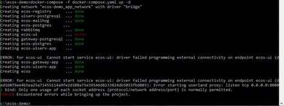
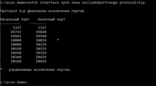
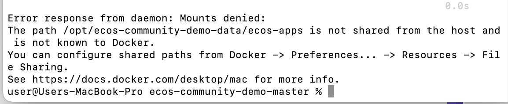
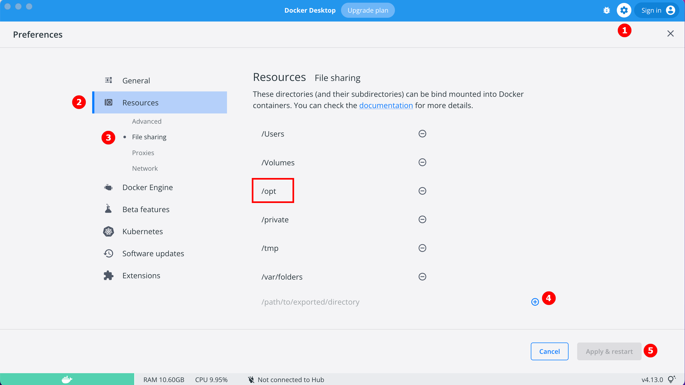

.. _docker_compose:

Установка Citeck c помощью Docker Compose
==========================================

.. contents::
    :depth: 5

Системные требования
--------------------

- Установлен `Docker <https://docs.docker.com/get-docker/>`_
- Установлен `Docker Compose <https://docs.docker.com/compose/install/>`_
- **16 ГБ** ОЗУ для корректного запуска Citeck

Установка и запуск Citeck Community
-------------------------------------

.. important::

    Комплект поставляется с предзаполненными :ref:`демонстрационными данными<ecos_modules>`.

    Для отключения данной настройки перед разворачиванием стенда перейдите в папку ``\services\environments``, в файле **demo_data.env** в настройке **WITH_DEMO_DATA** укажите **false**.

    Мы анонимно собираем статистику с использованием сервиса `Umami <https://umami.is/docs>`_. Сервис не собирает и не хранит персональные данные, избегая необходимости использования файлов cookie.

1. Установите `Docker и Docker Compose <https://docs.docker.com/get-docker/>`_ на вашу ОС.

2. Клонируйте репозиторий:

   .. code-block:: bash

       git clone https://github.com/citeck/citeck-community.git

3. Перейдите в папку с клонированным репозиторием:

   .. code-block:: bash

       cd /полный/путь/до/папки

4. Запустите Citeck:

   .. code-block:: bash

       docker-compose up -d

5. Подождите, пока система запустится (время зависит от мощности системы).

6. Откройте браузер и перейдите по адресу: ``http://localhost/``

7. Войдите в систему:

   .. image:: _static/docker-compose/09.png
       :width: 600
       :align: center

   .. code-block:: text

       Username: admin
       Password: admin

   Если необходимо сменить пароль, см. `инструкцию Keycloak <https://www.keycloak.org/docs/latest/getting_started/index.html#creating-a-user>`_.

   .. note::

       При первом развёртывании без демонстрационных данных Keycloak попросит сменить пароль.

8. После входа станет доступна страница :ref:`персонального рабочего пространства<ws_personal>`:

   .. image:: _static/docker-compose/11.png
       :width: 700
       :align: center

   В левом верхнем углу доступна кнопка для выбора рабочих пространств и создания нового:

   .. image:: _static/docker-compose/11_1.png
       :width: 450
       :align: center

Подробнее о:

- :ref:`рабочих пространствах<workspaces>`
- :ref:`корпоративном портале<corp_portal>`
- :ref:`модулях и учётных записях<ecos_modules>`
- :ref:`разделе администратора<admin>`

.. note::

    При первом запуске в течение первых 5 минут после успешной установки и входа в систему могут возникать ошибки, например:

    .. image:: _static/docker-compose/08.png
        :width: 300
        :align: center

    Развёртывание и запуск Citeck продолжается — необходимо подождать.

Обновление до последнего релиза
--------------------------------

Выполните следующие команды в терминале:

1. Остановите Citeck:

   .. code-block:: bash

       docker-compose down

2. Перейдите в папку ``citeck-community``:

   .. code-block:: bash

       cd /полный/путь/до/папки/citeck-community

3. Получите актуальную версию:

   .. code-block:: bash

       git pull

4. Загрузите последние версии образов:

   .. code-block:: bash

       docker-compose pull

5. Запустите Citeck:

   .. code-block:: bash

       docker-compose up -d

Подготовка окружения и установка Citeck
------------------------------------------

.. tabs::

   .. tab:: CentOS 7.x

       Обновите систему и пакеты:

       .. code-block:: bash

           yum update -y && yum upgrade -y

       Отключите SELinux и перезагрузите сервер:

       .. code-block:: bash

           sed -i 's/enforcing/disabled/g' /etc/selinux/config
           reboot

       Установите Python:

       .. code-block:: bash

           yum install epel-release -y
           yum install python3 -y && yum install python3-pip -y

       Установите вспомогательные пакеты:

       .. code-block:: bash

           yum install -y mc yum-utils nano ethtool ntp ntpdate firewalld lvm2 \
               device-mapper-persistent-data htop fail2ban wget screen pigz

       Установите Docker Engine:

       .. code-block:: bash

           yum-config-manager --add-repo https://download.docker.com/linux/centos/docker-ce.repo
           yum install -y docker-ce docker-ce-cli containerd.io
           systemctl enable docker && systemctl start docker

       Установите Docker Compose:

       .. code-block:: bash

           curl -L "https://github.com/docker/compose/releases/download/v2.21.0/docker-compose-$(uname -s)-$(uname -m)" \
               -o /usr/local/bin/docker-compose
           chmod +x /usr/local/bin/docker-compose

       Если локальная сеть может пересекаться с сетью Docker, задайте предопределённую подсеть в файле **/etc/docker/daemon.json** (переменная **default-address-pools**):

       .. code-block:: json

           {
               "default-address-pools": [
                   {"base": "172.19.0.0/16", "size": 24}
               ]
           }

       Клонируйте репозиторий и запустите Citeck:

       .. code-block:: bash

           git clone https://github.com/citeck/citeck-community.git && cd citeck-community
           docker-compose pull
           docker-compose up -d

       Система будет инициализирована и после полного запуска готова к работе.

       **Настройка прокси в Docker**

       Настройки прокси задаются в файле ``/etc/systemd/system/docker.service.d/http-proxy.conf``.
       Если файл или папка отсутствуют — создайте их. Содержимое файла:

       .. code-block:: ini

           [Service]
           Environment="HTTP_PROXY=http://<USER_NAME>:<PASSWORD>@<PROXY_HOST>:<PROXY_PORT>"
           Environment="HTTPS_PROXY=http://<USER_NAME>:<PASSWORD>@<PROXY_HOST>:<PROXY_PORT>"
           Environment="NO_PROXY=localhost,127.0.0.1,ecos-app,ecos-apps-app,ecos-gateway-app,ecos-history-app,ecos-identity-app,ecos-integrations-app,ecos-logger-app,ecos-microservices-postgresql-app,ecos-model-app,ecos-notifications-app,ecos-process-app,ecos-proxy-app,ecos-registry-app,ecos-search-app,ecos-uiserv-app,mailhog-app,mongodb-app,node-exporter-app,only-office-app,portainer-agent-app,postgres-exporter-app,rabbitmq-app,zookeeper-app"

       В раздел **NO_PROXY** можно добавить внутренние домены вашей компании, например: ``*.someco.com``, ``*.someco.ru``.

       После добавления файла перезапустите демон Docker:

       .. code-block:: bash

           systemctl daemon-reload
           systemctl restart docker

   .. tab:: Ubuntu Server 24.04 LTS

       Установите Docker:

       .. code-block:: bash

           sudo apt-get update
           sudo apt-get install ca-certificates curl
           sudo install -m 0755 -d /etc/apt/keyrings
           sudo curl -fsSL https://download.docker.com/linux/ubuntu/gpg -o /etc/apt/keyrings/docker.asc
           sudo chmod a+r /etc/apt/keyrings/docker.asc

           # Добавьте репозиторий в источники Apt:
           echo \
             "deb [arch=$(dpkg --print-architecture) signed-by=/etc/apt/keyrings/docker.asc] https://download.docker.com/linux/ubuntu \
             $(. /etc/os-release && echo "$VERSION_CODENAME") stable" | \
             sudo tee /etc/apt/sources.list.d/docker.list > /dev/null
           sudo apt-get update

       Установите последнюю доступную версию:

       .. code-block:: bash

           sudo apt-get install docker-ce docker-ce-cli containerd.io docker-buildx-plugin docker-compose-plugin

       Или установите конкретную версию:

       .. code-block:: bash

           apt-cache madison docker-ce | awk '{ print $3 }'
           VERSION_STRING={Your Specific version}
           sudo apt-get install docker-ce=$VERSION_STRING docker-ce-cli=$VERSION_STRING \
               containerd.io docker-buildx-plugin docker-compose-plugin

       Настройте автозапуск Docker:

       .. code-block:: bash

           sudo systemctl enable docker

       Установите Docker Compose:

       .. code-block:: bash

           curl -L "https://github.com/docker/compose/releases/latest/download/docker-compose-$(uname -s)-$(uname -m)" \
               -o /usr/local/bin/docker-compose
           chmod +x /usr/local/bin/docker-compose

       Проверьте установку:

       .. code-block:: bash

           docker-compose --version

       На этом установка Docker Engine и Docker Compose завершена.

       Клонируйте репозиторий и запустите Citeck:

       .. code-block:: bash

           wget https://github.com/Citeck/citeck-community/archive/refs/heads/master.zip
           unzip master.zip
           cd citeck-community-master
           docker-compose pull
           docker-compose up -d

       .. note::

           Выполняйте команды из директории ``citeck-community-master``.

       Если локальная сеть может пересекаться с сетью Docker, задайте предопределённую подсеть в файле **/etc/docker/daemon.json** (переменная **default-address-pools**):

       .. code-block:: json

           {
               "default-address-pools": [
                   {"base": "172.19.0.0/16", "size": 24}
               ]
           }

   .. tab:: Debian 11 "Bullseye"

       Установите Docker:

       .. code-block:: bash

           sudo apt-get update
           sudo apt-get install ca-certificates curl
           sudo install -m 0755 -d /etc/apt/keyrings
           sudo curl -fsSL https://download.docker.com/linux/debian/gpg -o /etc/apt/keyrings/docker.asc
           sudo chmod a+r /etc/apt/keyrings/docker.asc

           # Добавьте репозиторий в источники Apt:
           echo \
             "deb [arch=$(dpkg --print-architecture) signed-by=/etc/apt/keyrings/docker.asc] https://download.docker.com/linux/debian \
             $(. /etc/os-release && echo "$VERSION_CODENAME") stable" | \
             sudo tee /etc/apt/sources.list.d/docker.list > /dev/null
           sudo apt-get update

       Установите последнюю доступную версию:

       .. code-block:: bash

           sudo apt-get install docker-ce docker-ce-cli containerd.io docker-buildx-plugin docker-compose-plugin

       Или установите конкретную версию:

       .. code-block:: bash

           apt-cache madison docker-ce | awk '{ print $3 }'
           VERSION_STRING={Your Specific version}
           sudo apt-get install docker-ce=$VERSION_STRING docker-ce-cli=$VERSION_STRING \
               containerd.io docker-buildx-plugin docker-compose-plugin

       Настройте автозапуск Docker:

       .. code-block:: bash

           sudo systemctl enable docker

       Установите Docker Compose:

       .. code-block:: bash

           wget https://github.com/docker/compose/releases/download/v2.29.1/docker-compose-Linux-x86_64
           mv ./docker-compose-Linux-x86_64 /usr/local/bin/docker-compose
           sudo chmod +x /usr/local/bin/docker-compose

       .. note::

           Версию можно изменить на более актуальную, заменив ``v2.29.1``.

       На этом установка Docker Engine и Docker Compose завершена.

       Клонируйте репозиторий и запустите Citeck:

       .. code-block:: bash

           wget https://github.com/Citeck/citeck-community/archive/refs/heads/master.zip
           unzip master.zip
           cd citeck-community-master
           docker-compose pull
           docker-compose up -d

       .. note::

           Выполняйте команды из директории ``citeck-community-master``.

       Если локальная сеть может пересекаться с сетью Docker, задайте предопределённую подсеть в файле **/etc/docker/daemon.json** (переменная **default-address-pools**):

       .. code-block:: json

           {
               "default-address-pools": [
                   {"base": "172.19.0.0/16", "size": 24}
               ]
           }

   .. tab:: Astra Linux Орел

       .. note::

           Инструкция проверялась с Astra Linux Common Edition 2.12.46.

       Установите Docker:

       .. code-block:: bash

           sudo apt update
           sudo apt install apt-transport-https ca-certificates curl gnupg2 software-properties-common
           curl -fsSL https://download.docker.com/linux/debian/gpg | sudo apt-key add -
           sudo printf "deb [arch=amd64] https://download.docker.com/linux/debian stretch stable \n" \
               > /etc/apt/sources.list.d/docker.list
           sudo apt-get update
           sudo apt-get install docker-ce docker-ce-cli containerd.io

       Настройте группы Docker:

       .. code-block:: bash

           sudo groupadd docker
           sudo usermod -aG docker $USER
           sudo systemctl enable docker.service
           sudo systemctl enable containerd.service

       Установите Docker Compose:

       .. code-block:: bash

           wget https://github.com/docker/compose/releases/download/1.27.4/docker-compose-Linux-x86_64
           mv ./docker-compose-Linux-x86_64 /usr/local/bin/docker-compose
           sudo chmod +x /usr/local/bin/docker-compose

       .. note::

           Версию можно изменить на более актуальную, заменив ``1.27.4``.

       Клонируйте репозиторий и запустите Citeck (выполняется в терминале, **Alt+T**):

       .. code-block:: bash

           git clone https://github.com/Citeck/citeck-community.git && cd citeck-community
           docker-compose pull
           docker-compose up -d

       .. note::

           Выполняйте команды из директории ``citeck-community``.

       Если локальная сеть может пересекаться с сетью Docker, задайте предопределённую подсеть в файле **/etc/docker/daemon.json** (переменная **default-address-pools**):

       .. code-block:: json

           {
               "default-address-pools": [
                   {"base": "172.19.0.0/16", "size": 24}
               ]
           }

   .. tab:: Ред ОС (Red OS)

       .. note::

           Инструкция проверялась на РЕД ОС 7.3, ядро Linux 5.15.72.

       Обновите пакеты и отключите SELINUX:

       .. code-block:: bash

           dnf update
           echo 'SELINUX=disabled' > /etc/sysconfig/selinux
           reboot

       Установите Docker и Docker Compose:

       .. code-block:: bash

           sudo dnf install docker-ce docker-ce-cli docker-compose
           systemctl enable docker

       Клонируйте репозиторий и запустите Citeck (выполняется в терминале, **Alt+T**):

       .. code-block:: bash

           git clone https://github.com/Citeck/citeck-community.git && cd citeck-community
           docker-compose pull
           docker-compose up -d

       .. note::

           Если встречается ошибка **unknown log opt 'max-size' for journald log driver**, откройте **/etc/docker/daemon.json** и замените ``"log-driver": "journald"`` на ``"log-driver": "json-file"``.

       Если локальная сеть может пересекаться с сетью Docker, задайте предопределённую подсеть в файле **/etc/docker/daemon.json** (переменная **default-address-pools**):

       .. code-block:: json

           {
               "default-address-pools": [
                   {"base": "172.19.0.0/16", "size": 24}
               ]
           }

   .. tab:: Oracle Enterprise Linux 8.9

       Установите Docker:

       .. code-block:: bash

           sudo dnf update -y
           sudo dnf install -y dnf-utils ca-certificates curl
           sudo dnf config-manager --add-repo https://download.docker.com/linux/centos/docker-ce.repo
           sudo dnf makecache
           sudo dnf install -y docker-ce docker-ce-cli containerd.io docker-buildx-plugin docker-compose-plugin

       Настройте автозапуск Docker:

       .. code-block:: bash

           sudo systemctl start docker
           sudo systemctl enable docker

       Чтобы команда ``docker-compose`` была доступна напрямую (а не только ``docker compose``):

       .. code-block:: bash

           sudo ln -s /usr/libexec/docker/cli-plugins/docker-compose /usr/bin/docker-compose

       На этом установка Docker Engine и Docker Compose завершена.

       .. note::

           В случае Enterprise-сборки подключитесь к registry: ``docker login <registry host>``.

           **Registry URL** и **данные для аутентификации** можно запросить у контактного лица со стороны Citeck.

       Клонируйте репозиторий и запустите Citeck:

       .. code-block:: bash

           wget https://github.com/Citeck/citeck-community/archive/refs/heads/master.zip
           unzip master.zip
           cd citeck-community-master
           docker-compose pull
           docker-compose up -d

       .. note::

           Выполняйте команды из директории ``citeck-community-master``.

       Если локальная сеть может пересекаться с сетью Docker, задайте предопределённую подсеть в файле **/etc/docker/daemon.json** (переменная **default-address-pools**):

       .. code-block:: json

           {
               "default-address-pools": [
                   {"base": "172.19.0.0/16", "size": 24}
               ]
           }

Переключение на BASIC аутентификацию вместо Keycloak
-----------------------------------------------------

Если нужен простой способ настройки доступа в систему, минуя Keycloak, можно настроить BASIC Auth (не рекомендуется для production-сред).

1. Откройте файл **ecos-proxy-app.env**:

   .. code-block:: bash

       nano citeck-community-master/services/environments/ecos-proxy-app.env

   Замените строку:

   .. code-block:: text

       ENABLE_OIDC_FULL_ACCESS=true

   на:

   .. code-block:: text

       ENABLE_OIDC_FULL_ACCESS=false

2. В этом же файле добавьте:

   .. code-block:: text

       BASIC_AUTH_ACCESS=admin:admin,fet:fet

   .. note::

       ``admin:admin,fet:fet`` — список пользователей, имеющих доступ в систему.
       Формат: ``{{пользователь_0}}:{{пароль_0}},{{пользователь_1}}:{{пароль_1}}``.
       После изменения файла необходимо перезапустить контейнер **ecos-proxy-app**, чтобы изменения вступили в силу.

3. Из директории **citeck-community-master** остановите проект:

   .. code-block:: bash

       docker-compose down

4. Запустите проект:

   .. code-block:: bash

       docker-compose up -d

Данные для входа в Citeck:

.. code-block:: text

    Username: admin
    Password: admin

Сервисы Docker
---------------

:ref:`По ссылке <docker_services>` перечислены сервисы с точки зрения Docker и их настройки.

.. note::

    Некоторые контейнеры запускаются один раз и далее находятся в статусе **exited**, например:

    - ``citeck-community-master-ecos-meetings-ecos-apps-1``
    - ``citeck-community-master-ecos-order-pass-ecos-apps-1``
    - ``citeck-community-master-ecos-common-data-list-ecos-apps-1``
    - ``citeck-community-master-ecos-assignments-ecos-apps-1``

Возможные проблемы
-------------------

Windows
~~~~~~~~

Включение WSL 2
""""""""""""""""

Docker Desktop использует функцию динамического распределения памяти в WSL 2, что значительно снижает потребление ресурсов. WSL 2 улучшает совместное использование файловой системы, время загрузки и предоставляет доступ к новым функциям Docker Desktop.

1. Включите компонент **Платформа виртуальных машин** в **PowerShell**:

   .. code-block:: powershell

       dism.exe /online /enable-feature /featurename:VirtualMachinePlatform /all /norestart

2. Скачайте и установите `пакет обновления ядра Linux для WSL 2 (64-разрядные компьютеры) <https://wslstorestorage.blob.core.windows.net/wslblob/wsl_update_x64.msi>`_.

3. Задайте WSL 2 версией по умолчанию:

   .. code-block:: powershell

       wsl --set-default-version 2

4. Проверьте версию WSL:

   .. code-block:: powershell

       wsl --list --verbose

   Подробная инструкция: `docs.microsoft.com — установка WSL 2 <https://docs.microsoft.com/ru-ru/windows/wsl/install-win10>`_

5. При установке Docker в окне конфигурации установите галочку **Use WSL 2 instead of Hyper-V (recommended)**.

   Подробная инструкция: `docs.docker.com — Docker Desktop WSL 2 <https://docs.docker.com/docker-for-windows/wsl/>`_

Порт 8080 уже занят
"""""""""""""""""""""

Citeck UI использует порт **8080**. Если он занят другой программой, появится ошибка:

    *«Error starting userland proxy: listen tcp 0.0.0.0:8080: bind: Only one usage of each socket address is normally permitted.»*

Чтобы найти, какой процесс занимает порт, выполните:

.. code-block:: powershell

    netstat -ono
    # или
    netstat -ono | findstr 8080

Если команда не находит виновника, воспользуйтесь сторонней утилитой, например **CurrPorts**.

Порт зарезервирован Windows
"""""""""""""""""""""""""""""

Некоторые порты (например, **50432**, используемый **ecos-postgres**) могут быть зарезервированы Windows. Проверьте зарезервированные диапазоны:

.. code-block:: powershell

    netsh int ipv4 show excludedportrange protocol=tcp

Если нужный порт попадает в зарезервированный диапазон, появится ошибка:

    *«Cannot start service ecos-postgres: driver failed programming external connectivity on endpoint»*

Чтобы исправить это, выполните в командной строке с повышенными правами:

1. Отключите Hyper-V и перезагрузите систему:

   .. code-block:: powershell

       dism.exe /Online /Disable-Feature:Microsoft-Hyper-V

2. Добавьте нужный порт в исключения:

   .. code-block:: powershell

       netsh int ipv4 add excludedportrange protocol=tcp startport=50432 numberofports=1

3. Включите Hyper-V обратно и перезагрузите систему:

   .. code-block:: powershell

       dism.exe /Online /Enable-Feature:Microsoft-Hyper-V /All

После перезагрузки порт попадёт в исключения и ошибка не возникнет.

Настройка дополнительных параметров WSL
"""""""""""""""""""""""""""""""""""""""""

`Настройка глобальных параметров WSL <https://learn.microsoft.com/en-us/windows/wsl/wsl-config#configure-global-options-with-wslconfig>`_

MacOS
~~~~~~

Запускаются не все контейнеры
"""""""""""""""""""""""""""""""

Если при разворачивании приложения в Docker запускаются не все контейнеры:

Добавьте путь **/opt** в настройках Docker:

How to
------

Изменить адрес с localhost на пользовательский домен
~~~~~~~~~~~~~~~~~~~~~~~~~~~~~~~~~~~~~~~~~~~~~~~~~~~~~

С чистой БД
""""""""""""

1. В файле **citeck-community/services/environments/ecos-identity-app.env** замените:

   .. code-block:: text

       KEYCLOAK_FRONTEND_URL=http://localhost/ecos-idp/auth

   на:

   .. code-block:: text

       KEYCLOAK_FRONTEND_URL=http://mydomain.ru/ecos-idp/auth

2. В файле **citeck-community/services/environments/ecos-proxy-app.env** замените:

   .. code-block:: text

       EIS_ID=citeck-community
       REDIRECT_LOGOUT_URI=http://localhost

   на:

   .. code-block:: text

       EIS_ID=mydomain.ru
       REDIRECT_LOGOUT_URI=http://mydomain.ru

3. В файле **citeck-community/services/configs/ecos-identity-app/realm-export.json** замените:

   .. code-block:: json

       "redirectUris": [
           "http://localhost*"
       ]

   на:

   .. code-block:: json

       "redirectUris": [
           "http://mydomain.ru*"
       ]

   .. note::

       Шаги 3 и 4 имеют смысл только при разворачивании на чистых БД.

4. В файле **citeck-community/services/configs/ecos-identity-app/realm-export.yaml** замените:

   .. code-block:: text

       "redirectUris": [
           "http://localhost*"
       ]

   на:

   .. code-block:: text

       "redirectUris": [
           "http://mydomain.ru*"
       ]

5. Добавьте запись в файл **hosts**:

   .. code-block:: text

       127.0.0.1 mydomain.ru

Не с чистой БД
"""""""""""""""

1. Войдите в панель администратора Keycloak.
2. Откройте реалм **ecos-app**.
3. Перейдите в раздел **Clients**.
4. Откройте **ecos-proxy-app**.
5. В поле **Valid Redirect URIs** замените ``http://localhost`` на ``http://mydomain.ru``.
6. Сохраните изменения.

Исключить адрес из авторизации Keycloak
~~~~~~~~~~~~~~~~~~~~~~~~~~~~~~~~~~~~~~~~

Временно это можно сделать на уровне модификации **ecos-proxy-app**.

Зайдите в контейнер:

.. code-block:: bash

    docker-compose exec ecos-proxy-app /bin/bash

Отредактируйте конфигурационный файл:

.. code-block:: text

    /etc/nginx/conf.d/default.conf

Перезагрузите nginx:

.. code-block:: bash

    nginx -s reload

На постоянной основе это возможно только путём сборки собственной версии контейнера **ecos-proxy-app** или путём отправки Pull Request с возможностью передавать незащищаемые URL в качестве параметра.
