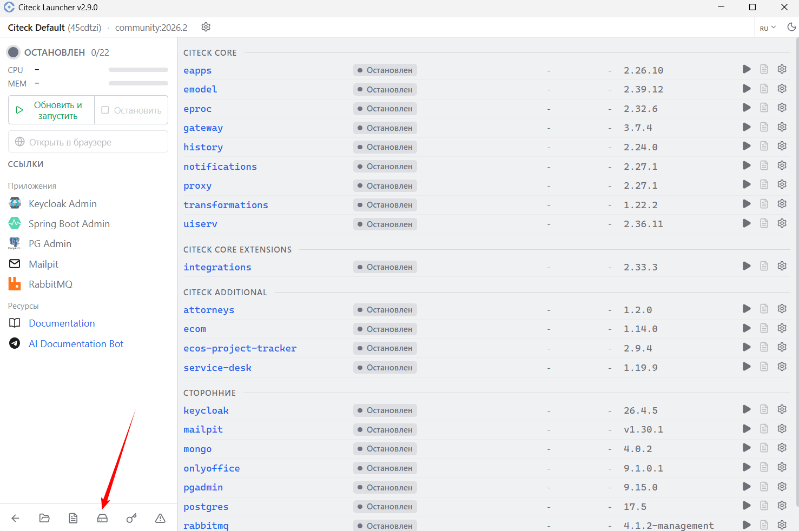
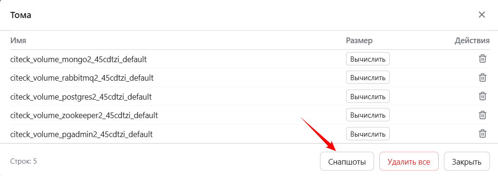
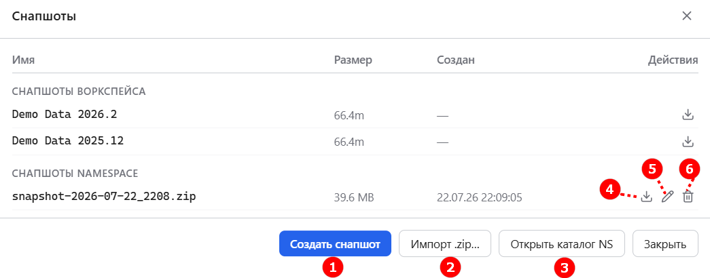

.. _launcher_dump:

Работа со снэпшотами
=====================

**Снэпшоты** — моментальные снимки состояния тома (volume) на определённый момент времени. Они позволяют быстро вернуться к ранее зафиксированной точке и используются преимущественно для отладки и тестирования, а не как полноценное средство резервного копирования.

Снэпшоты сохраняют изменения относительно базового образа, создавая новый слой, и применяются для фиксации состояния данных на томах или экспорта конфигурации контейнера.

.. note::

    Создание и разворачивание из снэпшота возможно только при полной остановке системы.

Перейдите в **список томов**:

Далее нажмите **Снапшоты**:

В списке представлены два типа снэпшотов:

- **Снэпшоты воркспейса** — снэпшоты, настроенные в конфигурации workspace (например, демо-данные).
- **Снэпшоты Namespace** — локальные для namespace снэпшоты, которыми можно управлять вручную.

|

Доступные действия со снэпшотами:

1. **Создать новый снэпшот** — укажите название и подтвердите создание:

 .. list-table::
    :widths: 50 50
    :align: center

    * - | 

            .. image:: _static/snapshot_04.png
                 :width: 400
                 :align: center

      - | 

             .. image:: _static/snapshot_05.png
                 :width: 400
                 :align: center

2. **Импорт zip-архива снэпшота** — добавляет архив в список снэпшотов.

3. **Перейти в директорию со снэпшотами** — открывает папку с созданными архивами:

   .. image:: _static/snapshot_06.png
       :width: 600
       :align: center

4. **Переименовать** снэпшот:

   .. image:: _static/snapshot_09.png
       :width: 400
       :align: center

5. **Развернуть данные** из снэпшота:

   .. image:: _static/snapshot_07.png
       :width: 400
       :align: center

6. **Удалить** снэпшот:

   .. image:: _static/snapshot_08.png
       :width: 400
       :align: center

Развернуть снэпшот на другом компьютере
-----------------------------------------

**На исходном рабочем месте:**

    #. Создайте снэпшот, как описано выше.
    #. Перейдите в директорию со снэпшотами по кнопке **(3)**.
    #. Скопируйте и передайте необходимый архив.

**На целевом рабочем месте:**

    #. Создайте новый :ref:`namespace <launcher_new_space>`.
    #. Перейдите в список снэпшотов.
    #. Нажмите **Импорт zip-архива снэпшота (2)** и выберите полученный файл.
    #. Снэпшот появится в списке.
    #. Разверните данные из снэпшота, нажав **(4)**.
