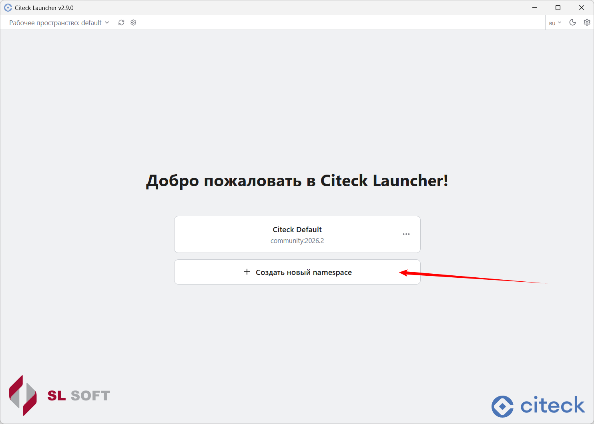
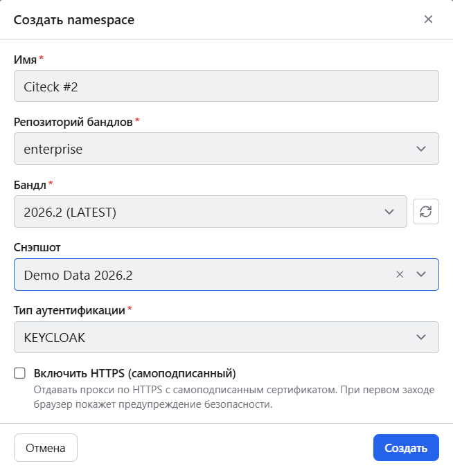
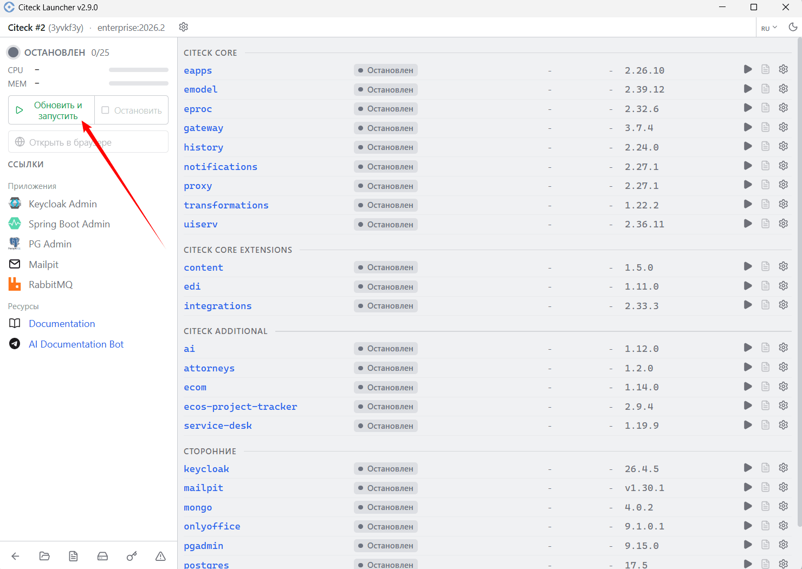
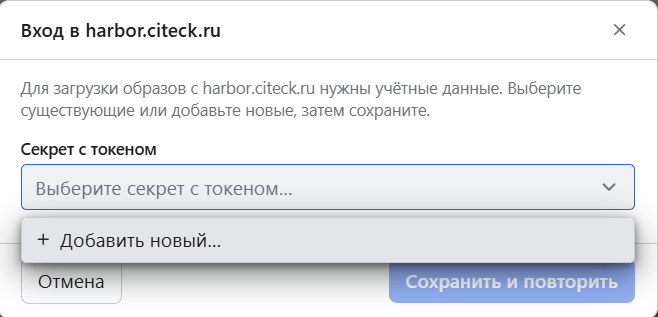
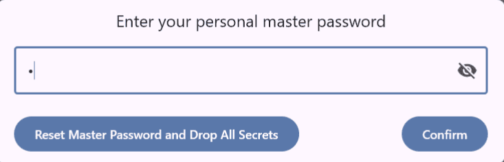
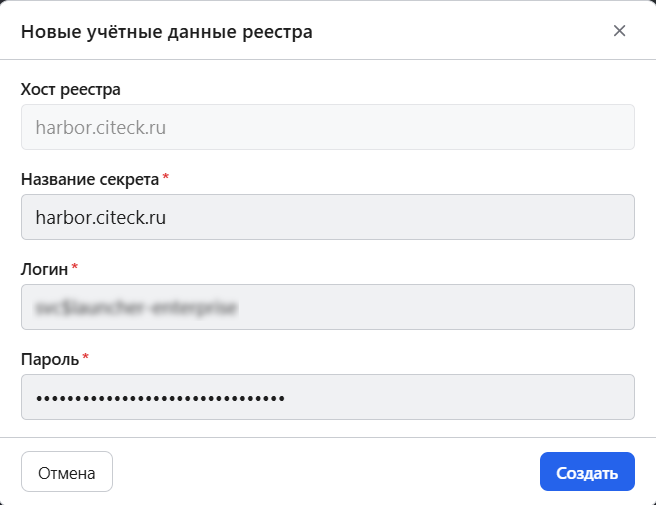
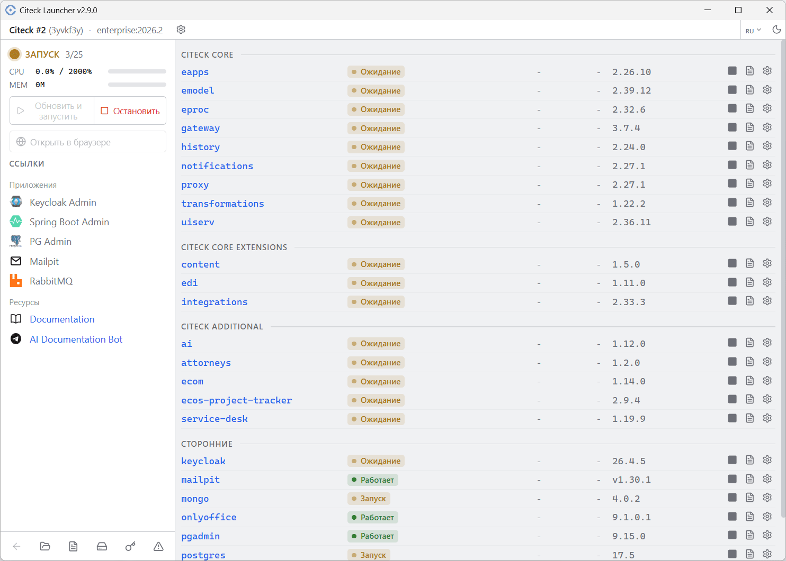

.. _launcher_new_space:

Создание нового пространства имён
-----------------------------------

Для запуска другого комплекта поставки создайте новый namespace — нажмите **Создать новый namespace**:

Укажите параметры нового пространства имён:

.. list-table::
   :header-rows: 1
   :class: tight-table

   * - Параметр
     - Описание
   * - **Имя**
     - Имя namespace.
   * - **Репозиторий бандла**
     - Enterprise или community.
   * - **Бандл**
     - Версия поставки.
   * - **Снэпшот**
     - Снэпшот данных (при необходимости).
   * - **Тип аутентификации**
     - —
   * - **Включить HTTPS (самоподписанный)**
     - В диалоге неймспейса отдаёт прокси по HTTPS с автоматически сгенерированным сертификатом. Порт следует за схемой автоматически — 443 для HTTPS, 80 для HTTP — поэтому включение и выключение HTTPS просто работает. При первом входе браузер покажет предупреждение о самоподписанном сертификате.

Нажмите **Создать**.

Если выбран снэпшот данных, дождитесь его загрузки и проверки. Для запуска нажмите **Обновить и запустить**:

Для загрузки образов Enterprise версии необходимы учетные данные. Выберите существующие или добавьте новые:

Введите мастер-пароль или установите его, если он ещё не задан:

Введите пароль для скачивания закрытых образов:

Далее процесс аналогичен :ref:`быстрому запуску <quick_start>`:

