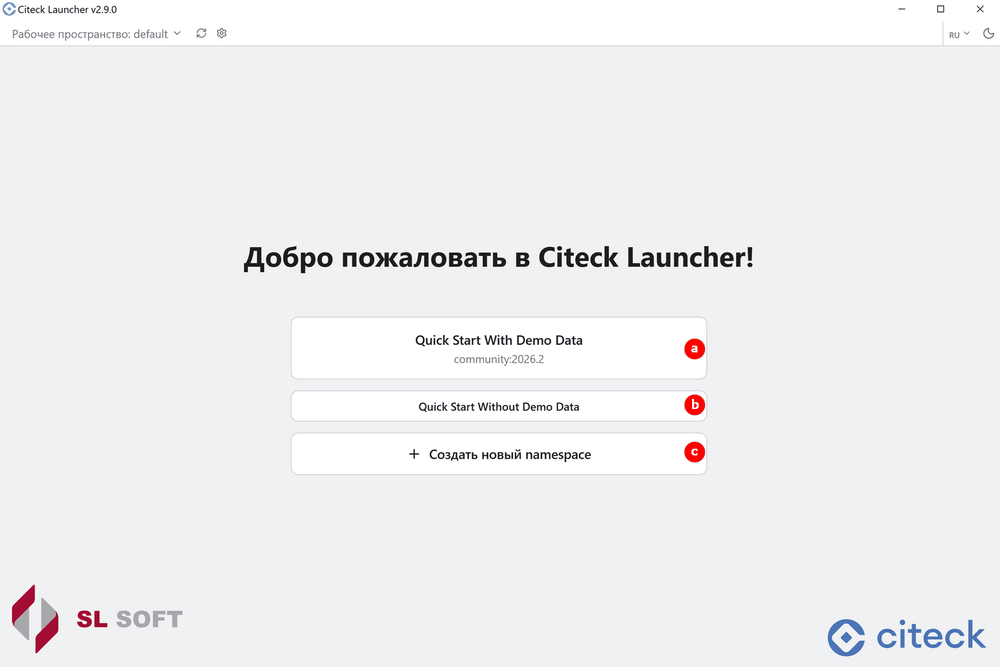
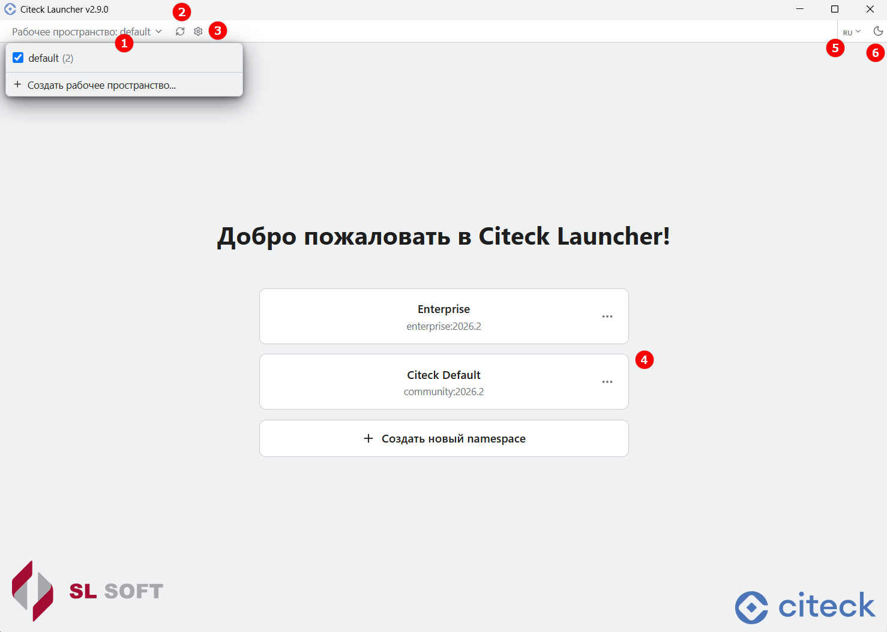
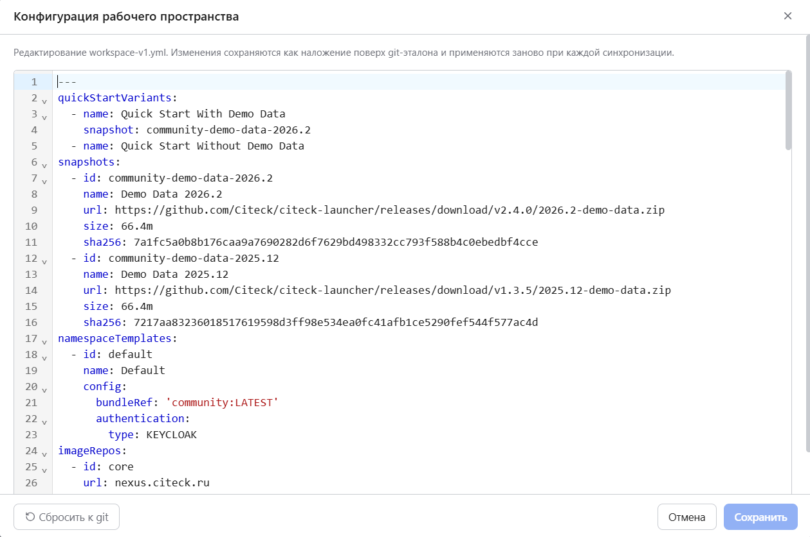
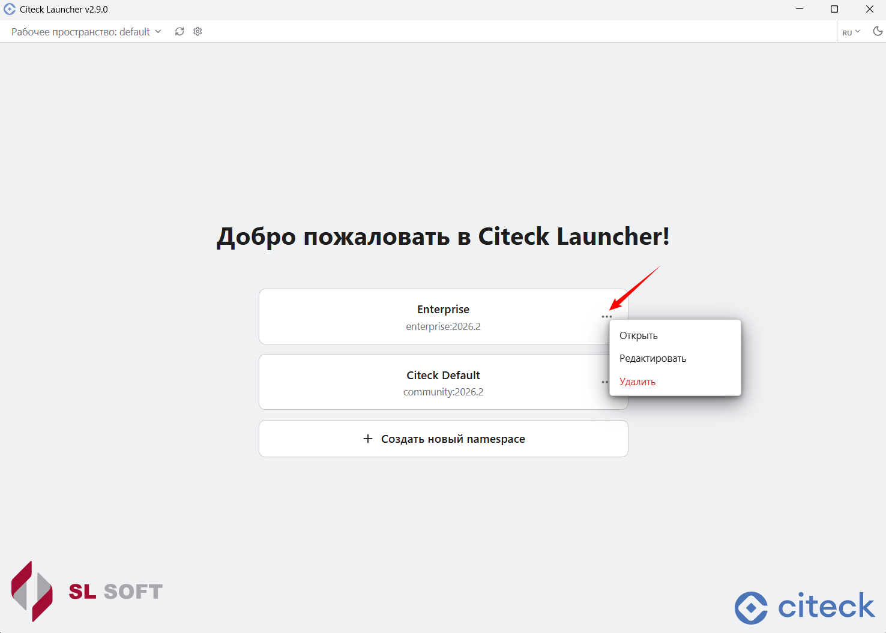
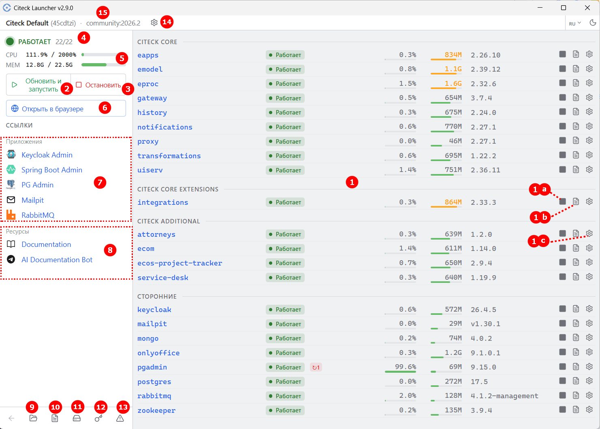
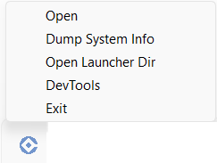

.. _launcher_overview:

Описание интерфейса
====================

При первом запуске доступны установка Citeck с :ref:`демонстрационными данными <ecos_modules>` **(a)**, без демо-данных **(b)** и создание нового :ref:`пространства имён (namespace) <launcher_new_space>` для разворачивания Citeck **(с)**:

После успешного запуска отображается  рабочее пространство **(1)** и список доступных в нем namespace **(4)**:

- **(1)** - выбор и создание :ref:`рабочего пространства <launcher_workspace>`
- **(2)** - принудительное обновление рабочего пространства
- **(3)** - конфигурация рабочего пространства

- **(4)** - список namespace выбранного рабочего пространства
- **(5)** - выбор языка интерфейса
- **(6)** - выбор светлой/темной темы интерфейса

Для namespace доступны следующие действия:

При выборе namespace доступна актуальная информация о микросервисах и приложениях в его составе, а также действия:

|

1. **Запускаемые микросервисы и приложения**: микросервисы ядра, приложения Citeck, сторонние — с указанием статуса и потребляемых ресурсов CPU и оперативной памяти. Доступные действия:

   - **1a** — остановить/запустить;
   - **1b** — лог микросервиса;
   - **1c** — ручная настройка микросервиса/приложения:

   **Левый клик** — редактировать конфигурацию Docker-приложения:

   .. image:: _static/setting_left.png
       :width: 600
       :align: center

   **Правый клик** — редактировать файлы томов:

   .. image:: _static/setting_right.png
       :width: 600
       :align: center

   **Синий маркер** означает, что у приложения есть ручная конфигурация, которая не управляется лончером. Чтобы сбросить ручные изменения, откройте редактор и нажмите **«Сброс»**.

   **Правый клик** по микросервису/приложению — открывает подробную информацию иконтекстное меню с действиями:

   .. image:: _static/ms_info.png
       :width: 600
       :align: center

2. **Обновить/запустить** все микросервисы и приложения. При клике правой кнопкой мыши доступно действие **Force Update And Start** — принудительное обновление данных из git-репозиториев с конфигурацией рабочего пространства и bundle (китов):

   .. image:: _static/force_update.png
       :width: 350
       :align: center

3. **Остановка** всех микросервисов и приложений.

4. Актуальный **статус** процесса разворачивания.

5. Общие **потребляемые ресурсы CPU/RAM**.

6. **Открыть Citeck в браузере** (только при статусе Running).

7. Доступ к **сопутствующим сервисам** — открываются в браузере в отдельной вкладке:

   - **Keycloak Admin** — интерфейс управления Keycloak (система управления идентификацией и авторизацией). Отображается, если при настройке пространства имён выбран тип авторизации Keycloak. **Логин / пароль:** ``admin / admin``
   - **Spring Boot Admin** — :ref:`интерфейс <spring_boot_admin>` для мониторинга и администрирования Spring Boot-приложений: просмотр состояния, метрик, логов и управление приложениями.
   - **PG Admin** — интерфейс для администрирования и управления базами данных PostgreSQL. **Логин / пароль:** ``admin@admin.com / admin``. **Пароль для БД:** ``postgres``
   - **Mailpit** — инструмент для тестирования и отладки электронной почты во время разработки: перехватывает письма и отображает их в веб-интерфейсе без реальной отправки.
   - **RabbitMQ** — интерфейс брокера сообщений (message broker), который обеспечивает асинхронный обмен данными между компонентами распределённых систем. **Логин / пароль:** ``admin / admin``

8. Документация по платформе Citeck:

   - **Documentation** — переход на `ресурс <https://citeck-ecos.readthedocs.io/ru/latest/index.html>`_, содержащий документацию по платформе.
   - **AI Documentation Bot** — переход в `Telegram-бот <https://t.me/haski_citeck_bot>`_.

9. Переход в **директорию лончера** (папка с логами, данными конфигурации, рабочими пространствами).

10. Открыть **лог** лончера:

    .. image:: _static/log.png
        :width: 800
        :align: center

    Данные лога можно отфильтровать по типу **(1)**, в нём доступен поиск **(2)**, а также возможность скопировать, очистить или выгрузить лог **(3)**.

11. **Список томов**, которые используются. Их можно очистить или сделать :ref:`снэпшот данных <launcher_dump>`:

    .. image:: _static/volumes.png
        :width: 500
        :align: center

12. **Работа с секретами**, используемыми в лончере. Сначала необходимо задать мастер-пароль:

    .. image:: _static/secrets.png
        :width: 500
        :align: center

    См. подробно о работе с :ref:`секретами <launcher_secrets>`.

13. **Экспорт информации о системе** (выгрузка данных о системе, информации о билде, экспорт thread dump).

14. **Настройки пространства имён**. См. подробно о настройках :ref:`пространства имён (namespace) <launcher_new_space>`.

    .. image:: _static/namespace_settings.png
        :width: 400
        :align: center

15. **Список namespace**:

    .. image:: _static/namespace_list.png
        :width: 500
        :align: center

Действия в трее
----------------

- Открыть
- **Экспорт** информации о системе
- Переход в **директорию лончера**
- DevTools
- Выйти
