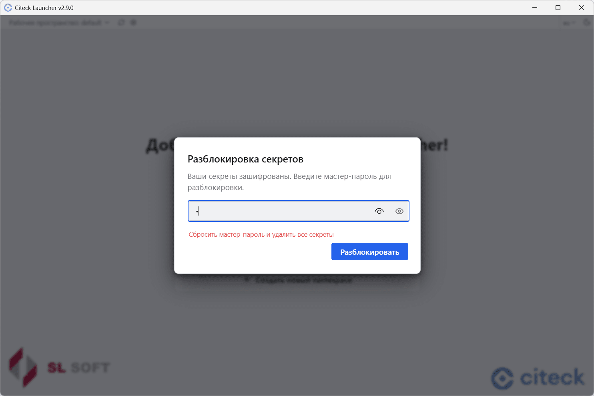
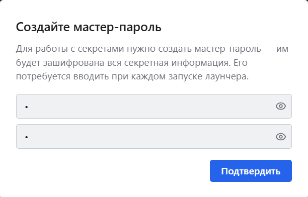
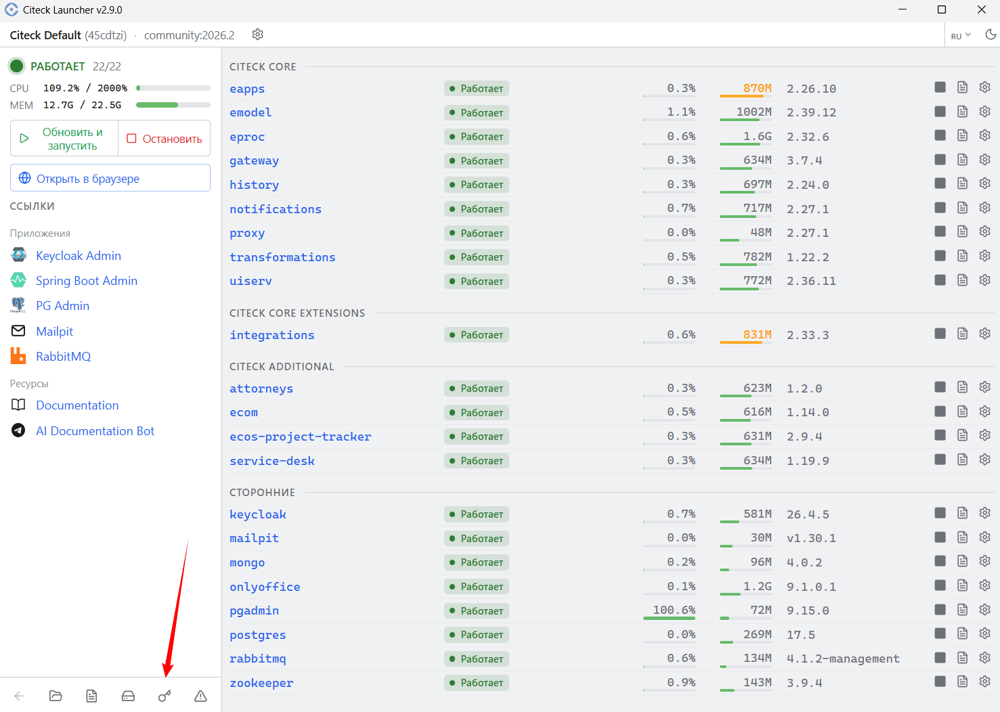
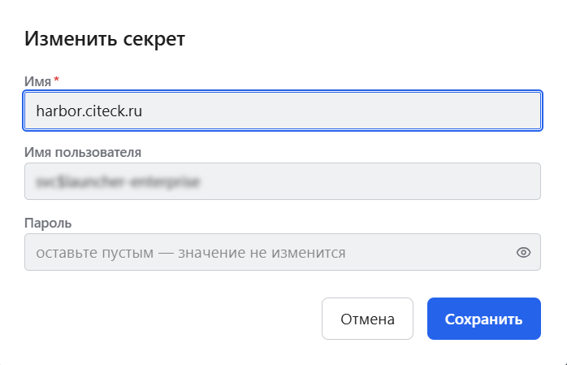
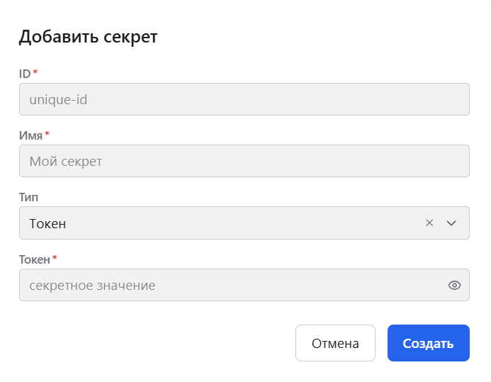

.. _launcher_secrets:

Работа с секретами и мастер-паролем
--------------------------------------------------------------------

**Мастер-пароль** шифрует все секреты, используемые в лончере. Его потребуется вводить один раз при каждом перезапуске лончера.

Сброс мастер-пароля
~~~~~~~~~~~~~~~~~~~
.. note::    

  Мастер-пароль не может быть восстановлен. Его можно только сбросить, что приведёт к удалению всех секретов.

Нажмите кнопку сброса и подтвердите действие:

.. list-table::
    :widths: 50 50
    :align: center

    * - | 

            .. image:: _static/secret_reset.png
                 :width: 350
                 :align: center

      - | 

             .. image:: _static/secret_confirm.png
                 :width: 350
                 :align: center

Затем задайте новый мастер-пароль:

Установка мастер-пароля
~~~~~~~~~~~~~~~~~~~~~~~~~~~~~~~~~~~~~~~~~~~~~~~

При установке, например, Enterprise версии для скачивания закрытых образов необходимо ввести учетные данные и задать мастер-пароль, который будет использоваться для шифрования секретов. Если мастер-пароль не установлен, лончер предложит его создать.

Введите и подтвердите мастер-пароль:

Просмотр, создание и удаление секретов
~~~~~~~~~~~~~~~~~~~~~~~~~~~~~~~~~~~~~~

Для перехода к управлению секретами нажмите:

Откроется список секретов с возможностью создания проверки, изменения и удаления каждого из них:

Форма редактирования секрета:

Удаление секрета необходимо подтвердить:

Форма создания нового секрета:

