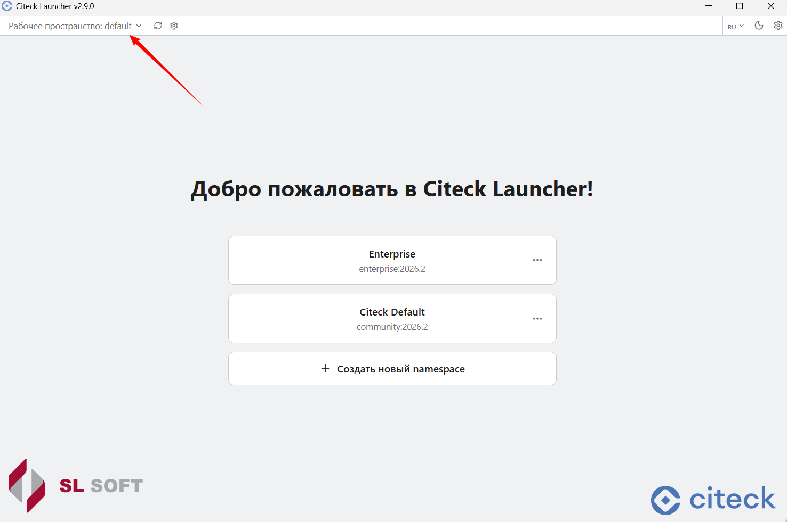
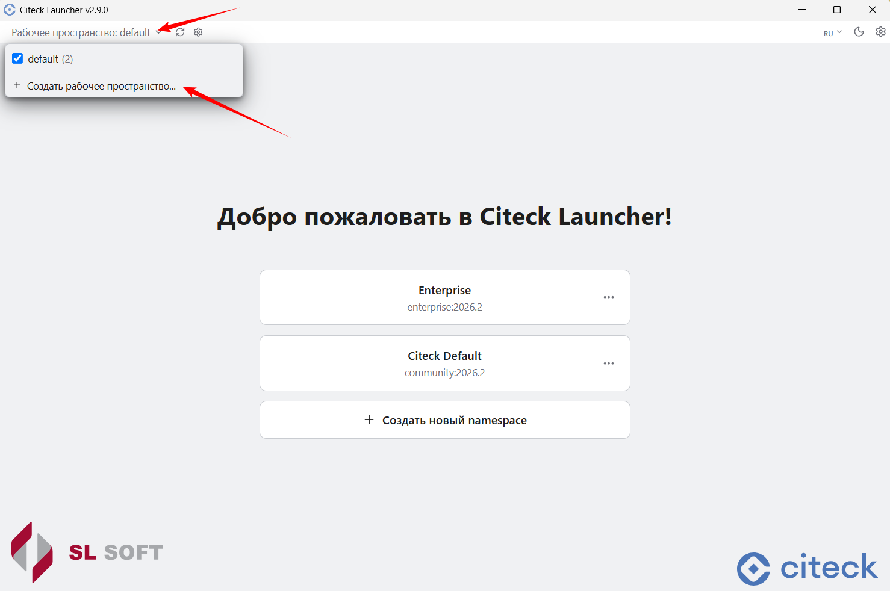
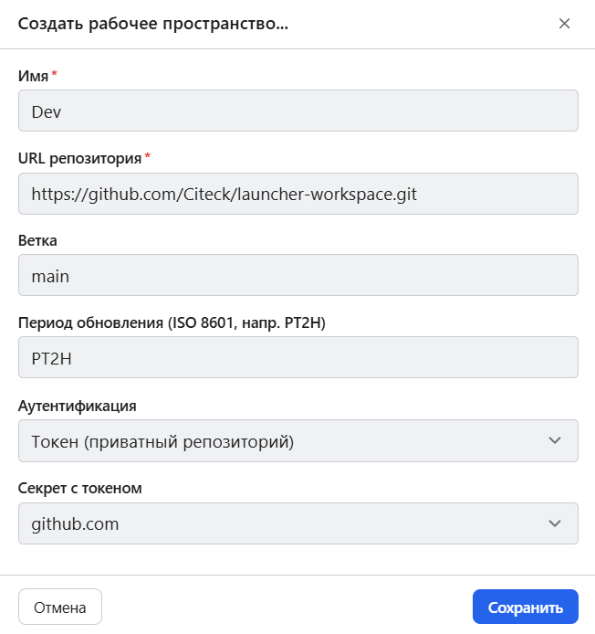
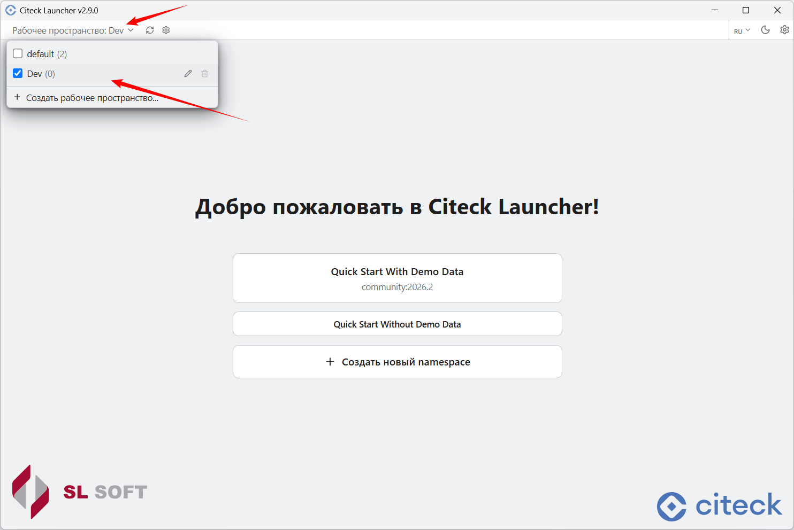
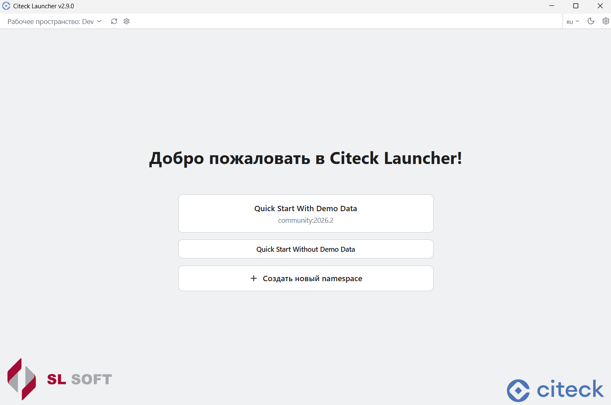

.. _launcher_workspace:

Рабочие пространства
------------------------------------------

В лончере доступно создание нескольких рабочих пространств. Например, одно пространство можно использовать для запуска релизных версий, второе — для внутренних сборок разработки.

Для перехода к списку пространств нажмите:

Создание нового
~~~~~~~~~~~~~~~~~~~~~~~~~~~~~~~~

Нажмите кнопку создания нового пространства:

Введите параметры:

.. list-table::
   :header-rows: 1
   :class: tight-table

   * - Параметр
     - Описание
   * - **Имя**
     - Имя пространства.
   * - **URL адрес**
     - URL адрес репозитория.
   * - **Ветка**
     - Ветка репозитория.
   * - **Период обновления**
     - В формате ISO 8601.
   * - **Тип аутентификации**
     - **Нет** (публичный репозиторий) или **Токен** (приватный репозиторий).

Нажмите **Сохранить** — рабочее пространство будет создано.

Для типа аутентификации **Токен** введите `персональный access-токен GitHub <https://docs.github.com/en/authentication/keeping-your-account-and-data-secure/creating-a-personal-access-token>`_.

.. note::

    Чтобы создать токен, перейдите в **GitHub → аватар (слева) → Settings → Developer settings → Personal access tokens**, создайте новый токен и скопируйте его значение.

Введите токен в соответствующее поле и подтвердите:

.. grid:: 2
    :gutter: 2

    .. grid-item::

        .. image:: _static/ws_4.png
            :width: 350
            :align: center

    .. grid-item::

        .. image:: _static/ws_4_1.png
            :width: 350
            :align: center

Выбор из созданных
~~~~~~~~~~~~~~~~~~~~~~~~~~~~~~~~~~~~~

Из списка пространство можно отредактировать или удалить. Внутри пространства доступен запуск уже настроенного namespace и создание нового:

