Кросплатформенный лончер для запуска Citeck
=============================================

.. _citeck_launcher:

Возможности:

 • Быстрый локальный запуск Citeck Community одной кнопкой с демонстрационными данными и без них
 • Разворачивание приватных комплектов в отдельных рабочих пространствах для разработки

.. contents::
    :depth: 3

Системные требования
---------------------

.. tabs::

   .. tab:: Windows   

     * Windows 11 64bit: Home, Pro, Enterprise или Education версии 21H2 или выше.
     * Windows 10 64bit: Home или Pro 21H1 (сборка 19043) или выше, Enterprise или Education 20H2 (сборка 19042) или выше
     * Включите функцию WSL 2 в Windows. Подробные инструкции см. `в документации Microsoft <https://docs.microsoft.com/en-us/windows/wsl/install-win10>`_.
     * Для успешного запуска WSL 2 в Windows 10 или Windows 11 необходимы следующие предварительные требования к оборудованию:

       * 64-битный процессор с трансляцией адресов второго уровня (`SLAT <https://en.wikipedia.org/wiki/Second_Level_Address_Translation>`_)
       * Не менее 16 ГБ оперативной памяти.
       * 80 Гб свободного дискового пространства.
       * Поддержка аппаратной виртуализации на уровне BIOS должна быть включена в настройках BIOS. Дополнительные сведения см. `в разделе Виртуализация <https://docs.docker.com/desktop/troubleshoot/topics/#virtualization>`_

     * Загрузить и установить `пакет обновления ядра Linux <https://docs.microsoft.com/windows/wsl/wsl2-kernel>`_

    `Официальное руководство по установке Docker на Windows <https://docs.docker.com/desktop/install/windows-install/>`_

   .. tab:: Linux   

     * Поддержка 64-битного ядра и процессора для виртуализации.
     * Поддержка виртуализации KVM. Следуйте `инструкциям поддержки виртуализации KVM <https://docs.docker.com/desktop/install/linux-install/#kvm-virtualization-support>`_ для проверки включены или нет модули ядра KVM и как предоставить доступ к устройству kvm.
     * QEMU должен быть версии 5.2 или новее. Рекомендуем обновиться до последней версии.
     * Подсистема инициализации и управления службами systemd.
     * Gnome или среда рабочего стола KDE.
     * Не менее 16 ГБ оперативной памяти.
     * 80 Гб свободного дискового пространства.
     * Включите настройку сопоставления идентификаторов в пространствах имен пользователей, см. `Общий доступ к файлам <https://docs.docker.com/desktop/install/linux-install/#file-sharing>`_

    `Официальное руководство по установке Docker на Linux <https://docs.docker.com/desktop/install/linux-install/>`_

    `Официальное руководство по установке Docker на Ubuntu <https://docs.docker.com/install/linux/docker-ce/ubuntu/>`_

   .. tab:: MacOS   

     * MacOS версии 10.15 или выше.
     * Не менее 16 ГБ оперативной памяти.
     * 80 Гб свободного дискового пространства.

    `Официальное руководстов по установке Docker на MacOS <https://docs.docker.com/desktop/install/mac-install/>`_

Установка и запуск проекта
---------------------------

Установите `Docker <https://docs.docker.com/get-docker/>`_ на Вашу ОС.

Скачайте (ссылка) для вашей операционной системы дистрибутив **citeck-launcher**

 - Windows ...
 - Debian, Ubuntu ...
 - Mac ...

и запустите.

.. note::

    При установке на Windows, если **SmartScreen** предотвратил запуск приложения, то нажмите **«Запустить в любом случае»**:

     .. image:: _static/launcher/01.png
         :width: 300
         :align: center

Для быстрого запуска **Citeck Community** с предзаполненными :ref:`демонстрационными данными<ecos_modules>` нажмите **Quick Start With Demo Data**:

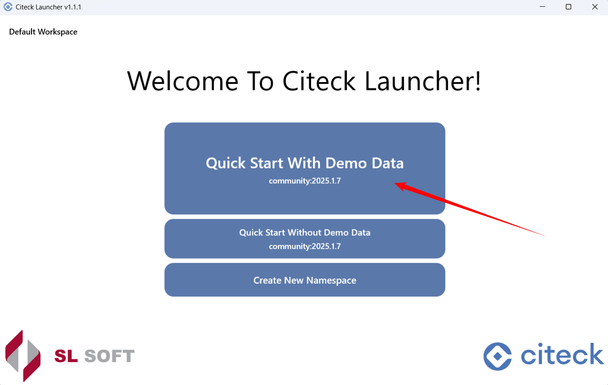

.. note::

    Для запуска без :ref:`демонстрационных данных<ecos_modules>` нажмите **Quick Start Without Demo Data**.

См. подробно о создании :ref:`нового пространства имен (namespace)<launcher_new_space>`

.. note::

    На странице загрузки можно посмотреть логи и выгрузить состояние системы на случай проблем:

     .. image:: _static/launcher/loading.png
         :width: 600
         :align: center

Дождитесь загрузки и проверки данных:

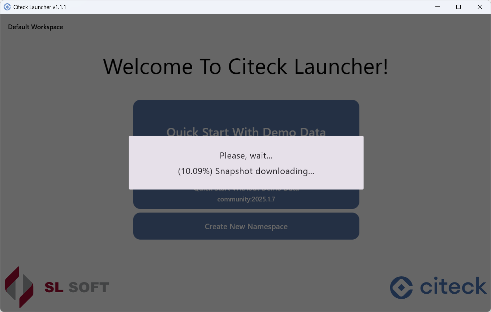

Нажмите **Update&Start**:

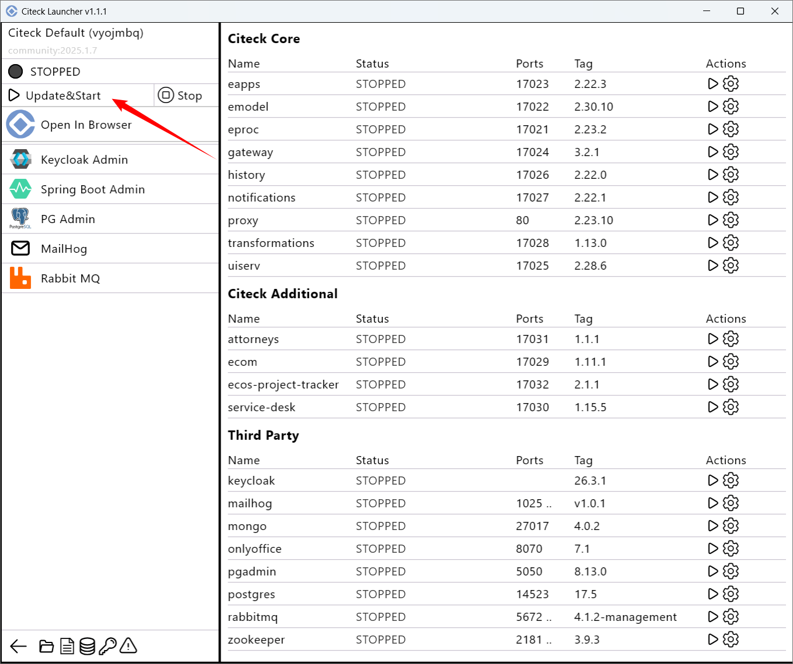

Начнется скачивание и разворачивание образов:

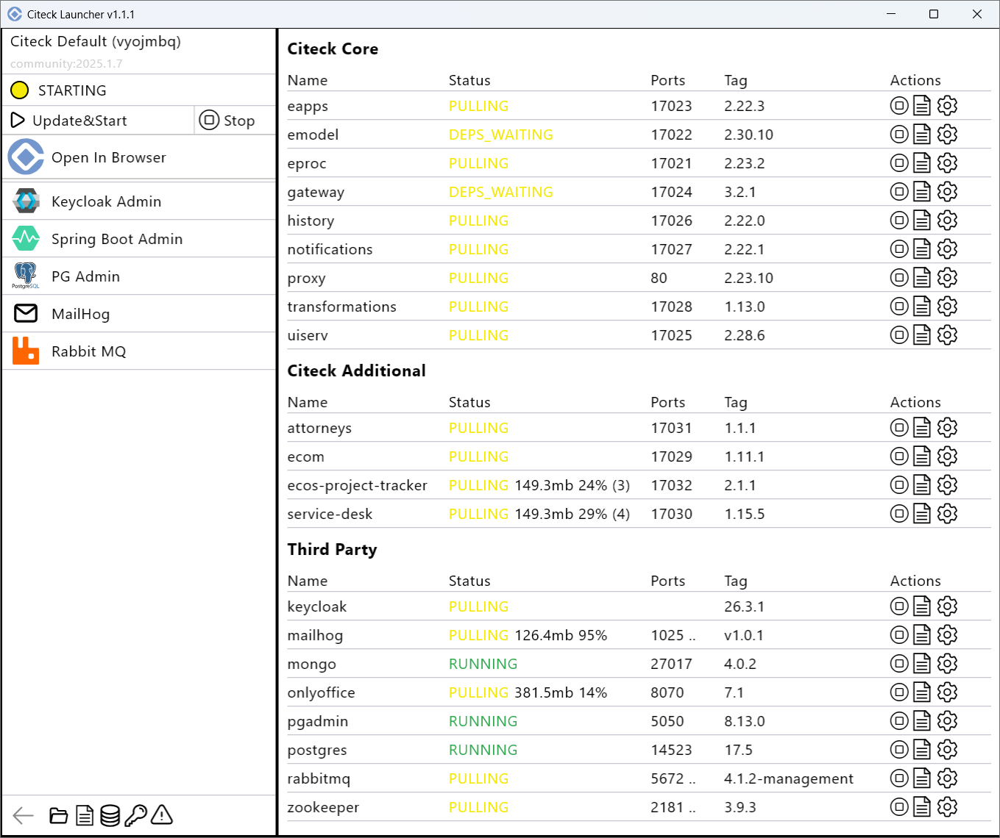

Дождитесь статуса **Running** всех микросервисов и приложений и нажмите **Open In Browser**:

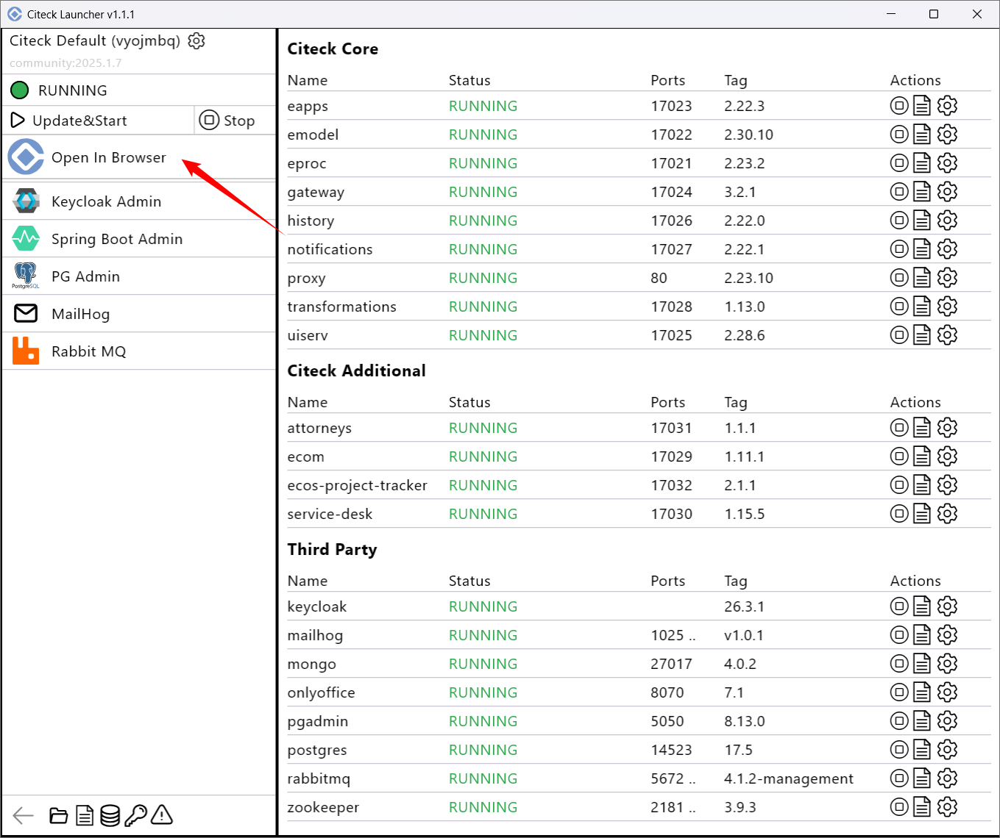

Войдите в систему, используя следующие учётные данные:

.. code-block::

    Username: admin
    Password: admin

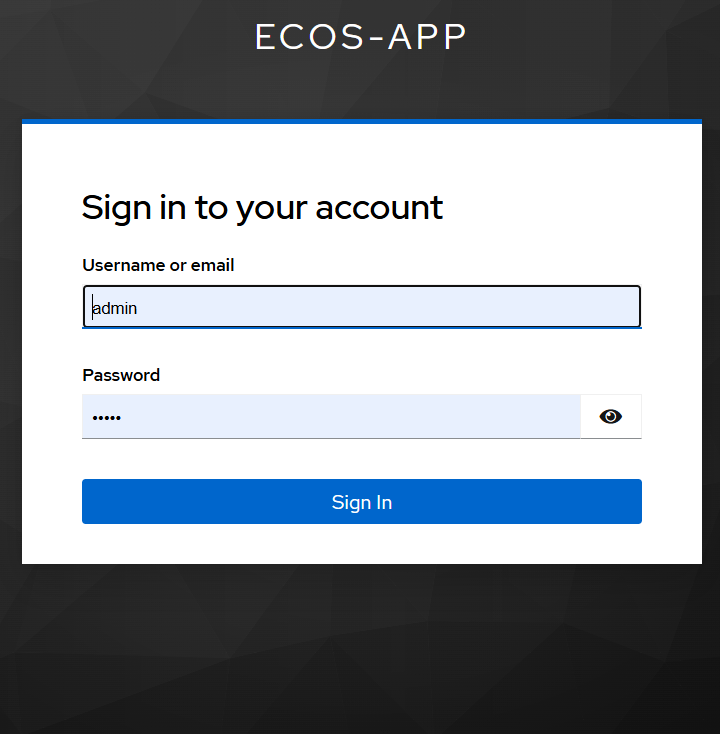

При первом развертывании keycloak попросит сменить пароль:

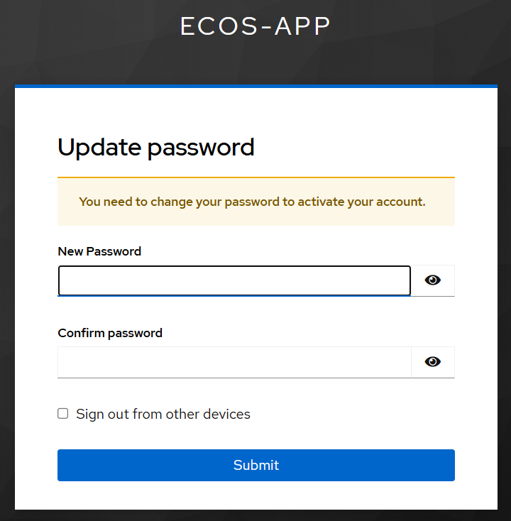

Далее станет доступна страница :ref:`персонального рабочего пространства<ws_personal>`:

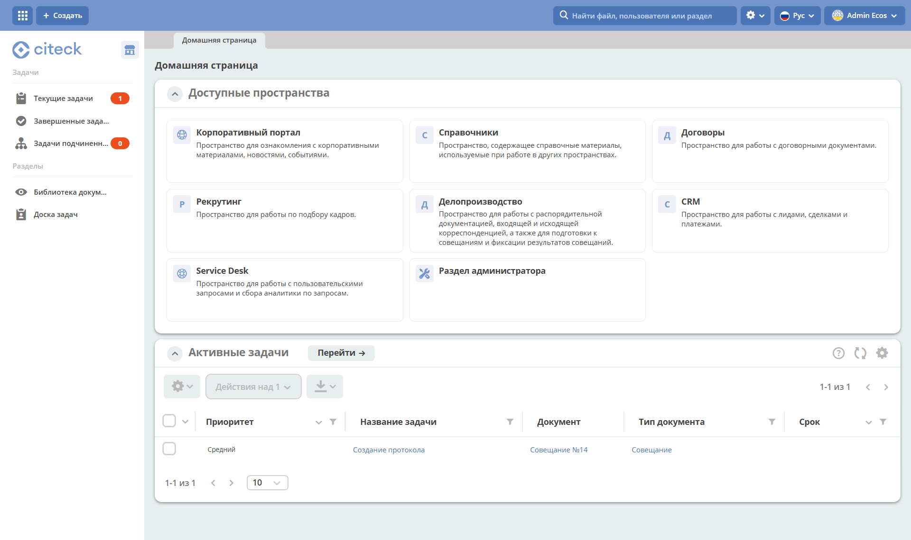

В левом верхнем углу доступна кнопка для выбора доступных рабочих пространств и создания нового:

.. image:: _static/launcher/page_03.png
    :width: 450
    :align: center

Подробно о: 

    * :ref:`рабочих пространствах<workspaces>`; 
    * :ref:`корпоративном портале<corp_portal>`;
    * :ref:`разделе администратора<admin>`.

.. note::

    При первом запуске в течение первых 5 минут после успешной установки и входа в систему может возникать ошибка:

     .. image:: _static/launcher/page_05.png
         :width: 300
         :align: center

    Развертывание и запуск Citeck продолжается, необходимо подождать.

Описание интерфейса
----------------------

При первом запуске доступны установка Citeck Community с :ref:`демонстрационными данными<ecos_modules>` **(a)**, без демо данных **(b)** создание иного пространства имен для разворачивания Citeck **(с)**:

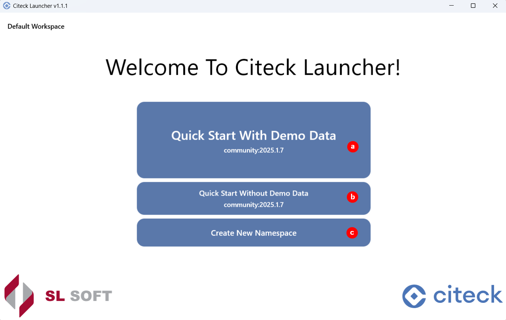

После успешного запуска будет отображаться список доступных namespace:

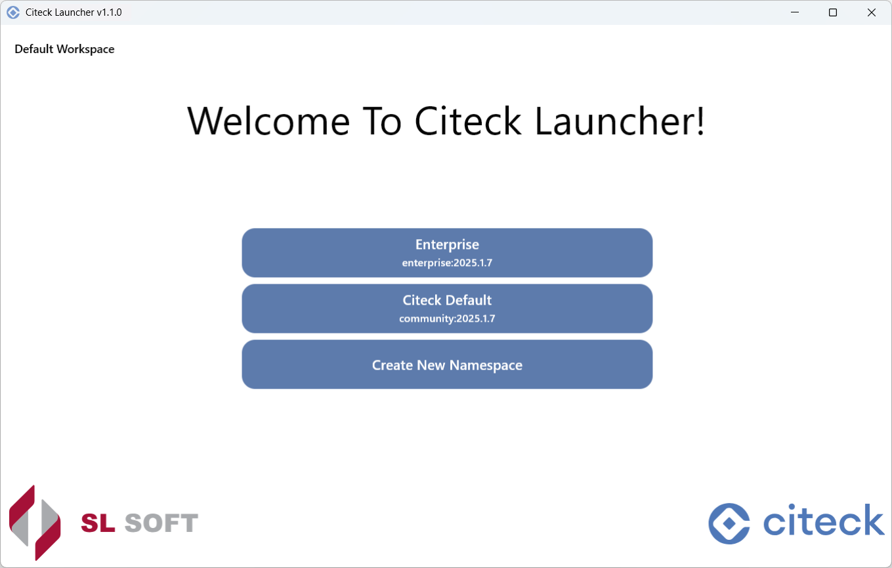

|

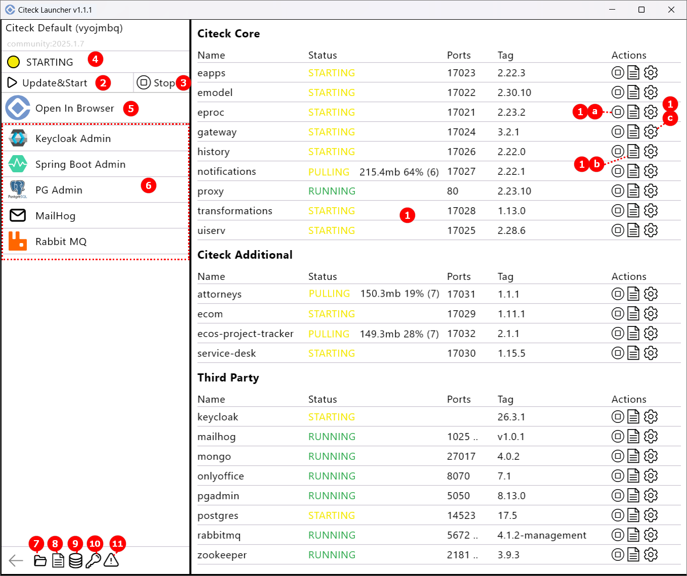

1. **Запускаемые микросервисы и приложения**: микросервисы ядра, приложения Citeck, сторонние, статус. Доступные действия:

    - **1a** – остановить/запустить
    - **1b** – лог микросервиса
    - **1c** – настройка микросервиса/приложения вручную:

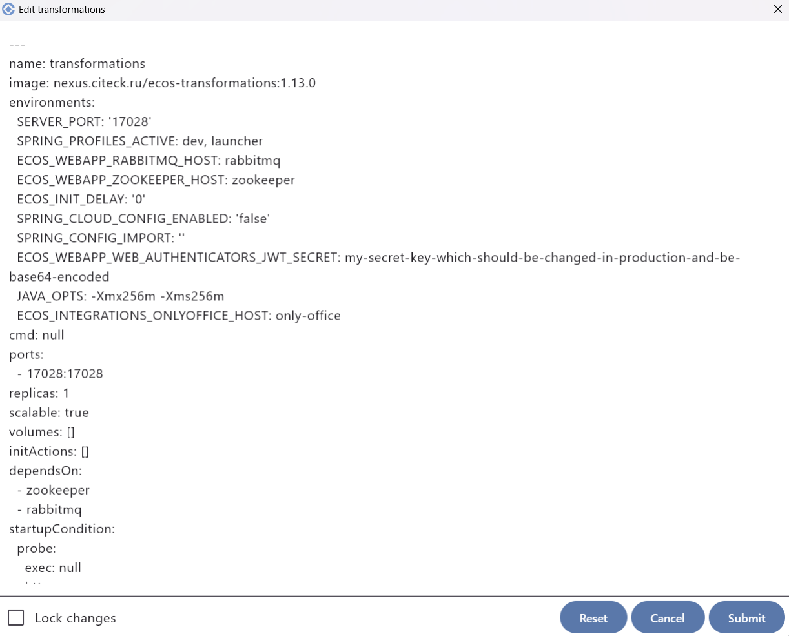

2. **Обновить/ запустить** все микросервисы и приложения. При клике правой кнопкой мыши доступно действие **Force Update And Start** для принудительного обновления данных из git репозиториев с конфигурацией рабочего пространства и bundle (китов):

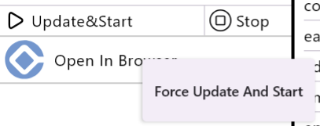

3. **Остановка** всех микросервисов и приложений.
4. Актуальный **статус** процесса разворачивания.
5. **Открыть Citeck в браузере** (только для статуса Running).
6. Доступ к **сопутствующим сервисам**. Открываются в браузере в отдельной вкладке.

    -	**Keycloak Admin** – интерфейс управления Keycloak, системой управления идентификацией и авторизацией.
    -	**Spring Boot Admin** – :ref:`интерфейс <spring_boot_admin>` для мониторинга и администрирования Spring Boot-приложений, предоставляет удобный интерфейс для просмотра состояния, метрик, логов и управления Spring Boot-приложениями.
    -	**PG Admin** - интерфейс для администрирования и управления базами данных PostgreSQL.
    -	**MailHog** – интерфейс инструмента для тестирования и отладки электронной почты во время разработки, предоставляет удобный веб-интерфейс для их просмотра, без реальной отправки на почтовые серверы.
    -	**RabbitMQ** – интерфейс брокер сообщений (message broker), который обеспечивает асинхронный обмен данными между компонентами распределённых систем.

7. Переход в **директорию лончера** (папка с логами, данными конфигурации, рабочими пространствами).
8. Открыть **лог** лончера.
9. **Список volumes**, которые используются. Их можно очистить:

    .. image:: _static/launcher/volumes.png
        :width: 400
        :align: center

10. **Работа с секретами**, используемыми в лончере. Сначала необходимо задать мастер-пароль: 

    .. image:: _static/launcher/secret_1.png
        :width: 400
        :align: center

 См. подробно о работе с :ref:`секретами<launcher_secrets>`

11.  **Экспорт информации о системе** (выгрузка данных о системе, информации о билде, экспорт thread dump).
12.  **Настройки пространства имен**. См. подробно о настройках :ref:`пространства имен (namespace)<launcher_new_space>`

    .. image:: _static/launcher/namespace_settings.png
        :width: 400
        :align: center

Создание нового пространства имен
----------------------------------

.. _launcher_new_space:

Для запуска другого комплекта поставки создайте новый namespace. Нажмите **Create New Namespace**.

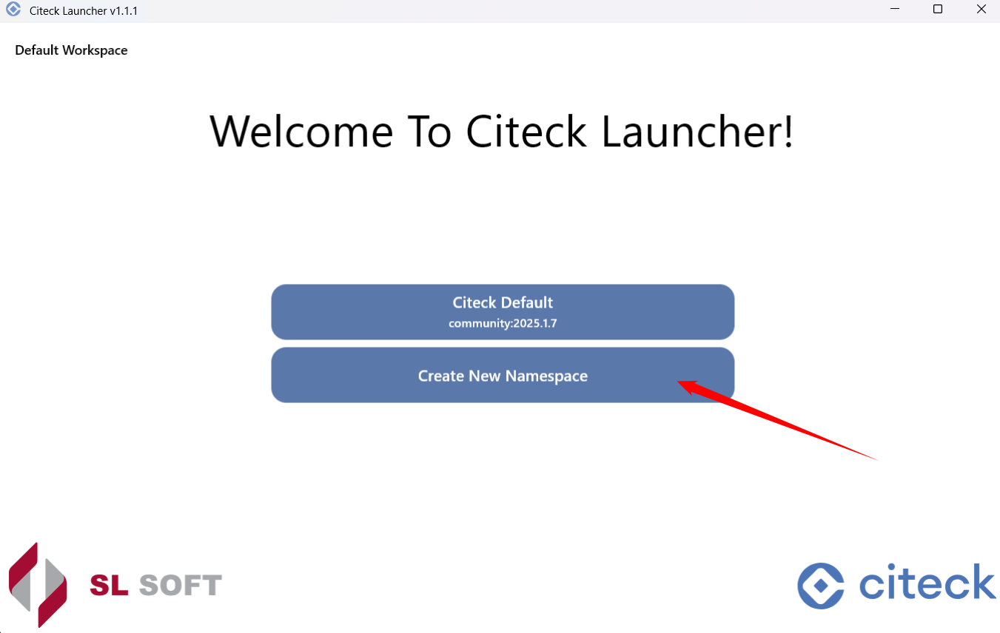

Укажите **имя**, выберите **вариант поставки**, **версию поставки**, **снэпшот данных**, **вид авторизации**:

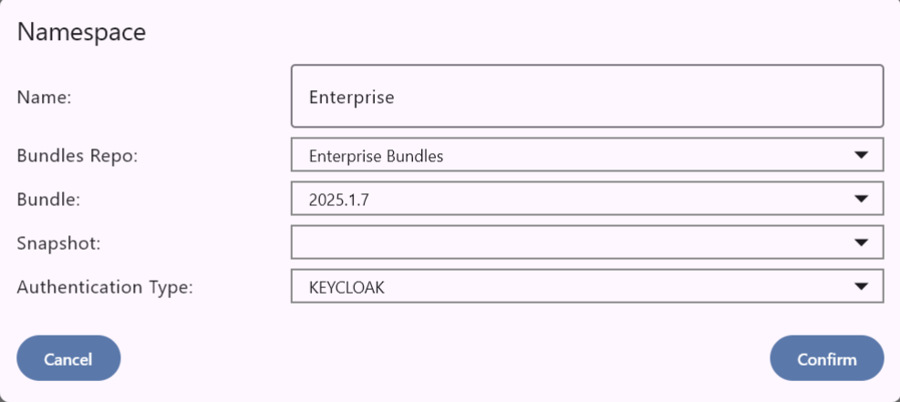

Нажмите **Confirm**. 

Если выбираете снэпшот данных, то дождитесь загрузки и проверки данных:

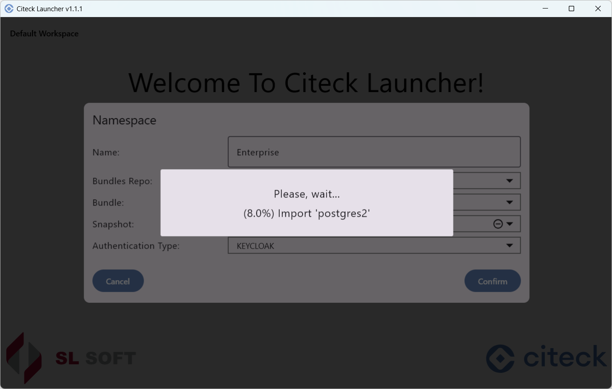

Для запуска нажмите **Update&Start**:

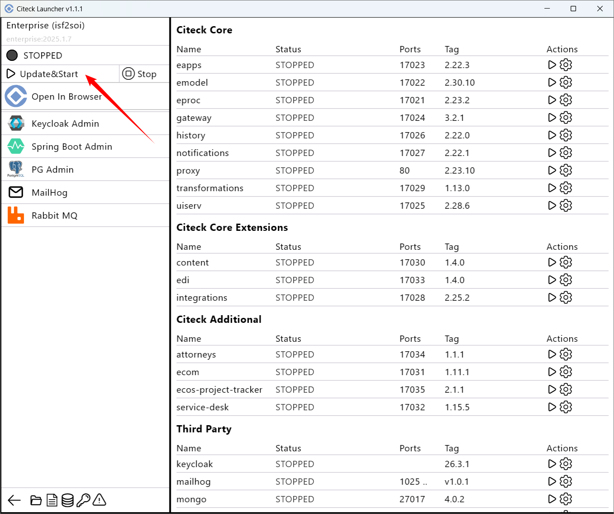

Введите мастер пароль или установите его, если не установили ранее:

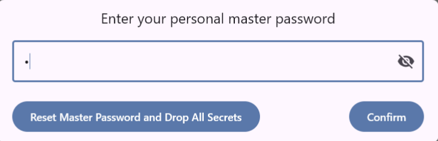

Введите пароль для скачивания закрытых образов:

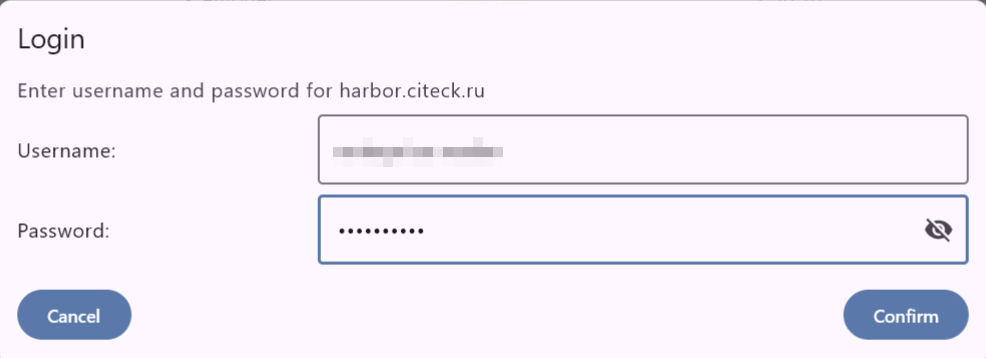

Далее процесс аналогичен запуску версии Community:

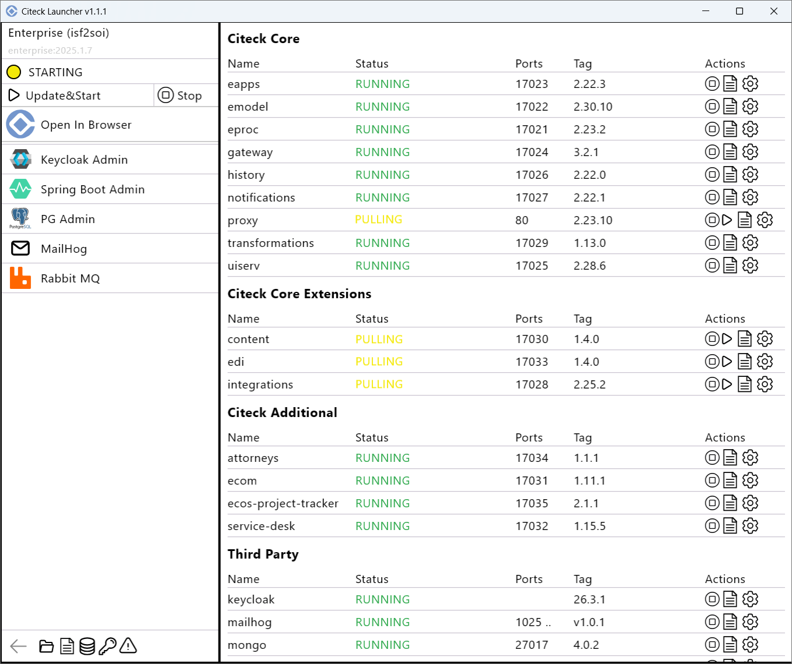

Работа с секретами и мастер паролем
-------------------------------------

.. _launcher_secrets:

Для работы с секретами, используемыми для запуска Citeck, кликните:

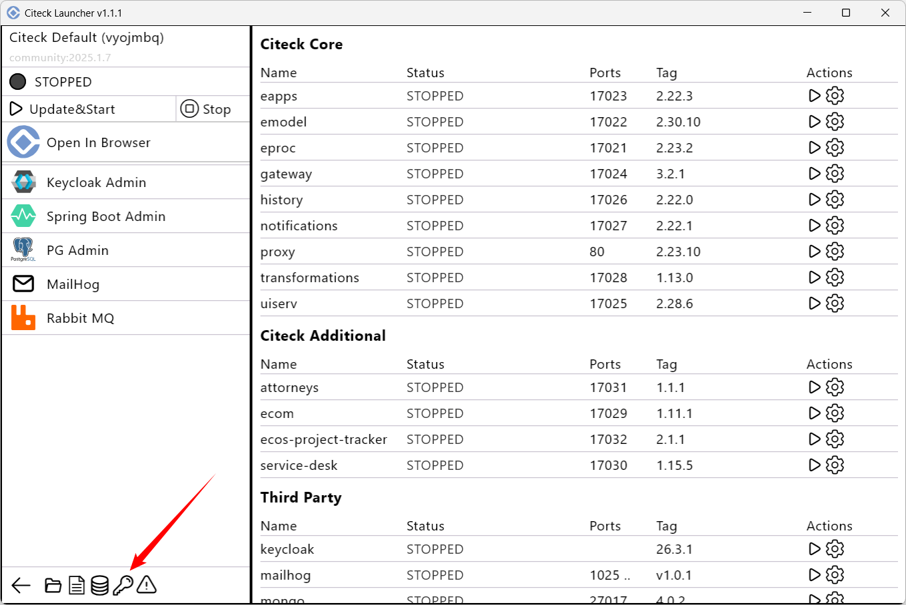

Установка мастер пароля
~~~~~~~~~~~~~~~~~~~~~~~~~

Введите и подтвердите мастер пароль:

Просмотр и удаление секретов
~~~~~~~~~~~~~~~~~~~~~~~~~~~~~

Для просмотра списка введите пароль:

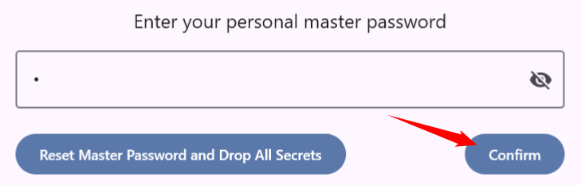

Становится доступен список секретов с возможностью удаления:

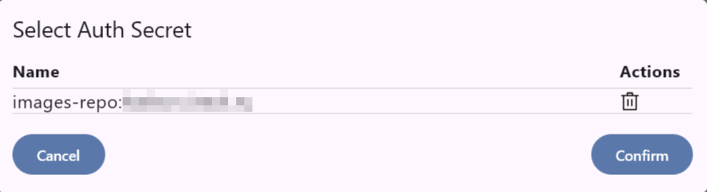

Сброс мастер-пароля
~~~~~~~~~~~~~~~~~~~~~~~

.. note::

    Все используемые секреты будут удалены.

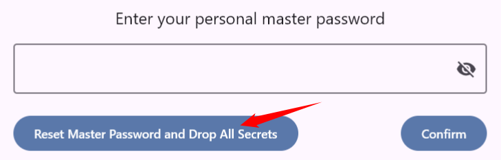

Подтвердите выбор:

И введите новый мастер пароль:

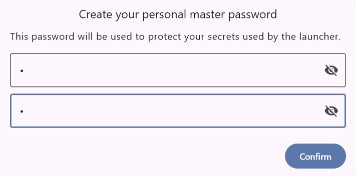

Рабочие пространства
---------------------

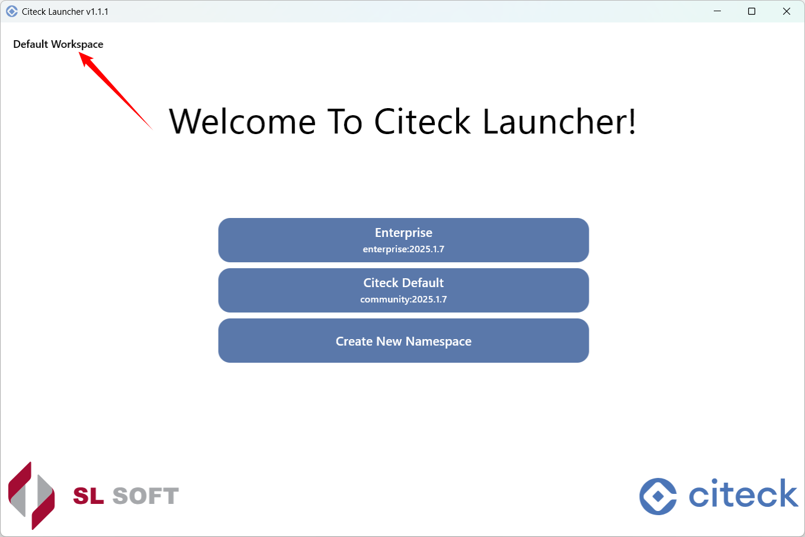

Создание нового
~~~~~~~~~~~~~~~~

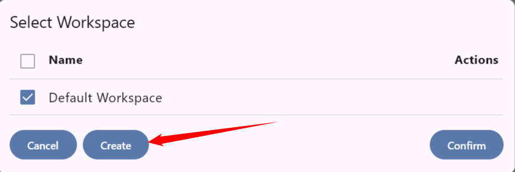

Введите **имя**, **адрес** и **ветку репозитория**, **период обновления** в формате ISO 8601, **тип авторизации**:

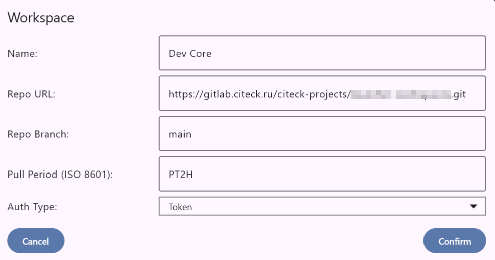

Нажмите **Confirm**.

Для типа авторизации **token** – введите `персональный access токен <https://docs.gitlab.com/user/profile/personal_access_tokens/>`_  в Gitlab и подтвердите:

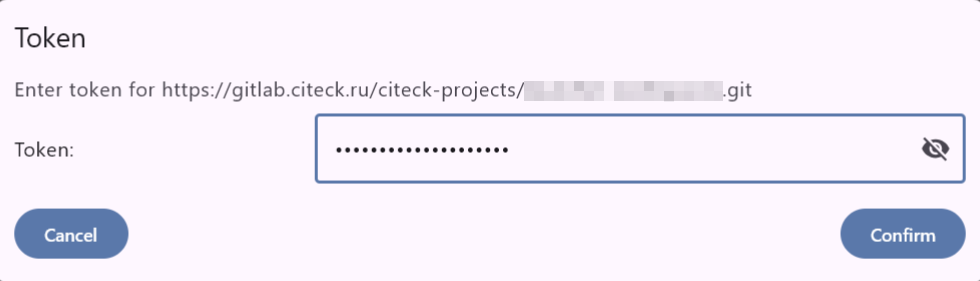

Нажмите **Confirm**. Рабочее пространство будет создано.

Выбор из созданных
~~~~~~~~~~~~~~~~~~~

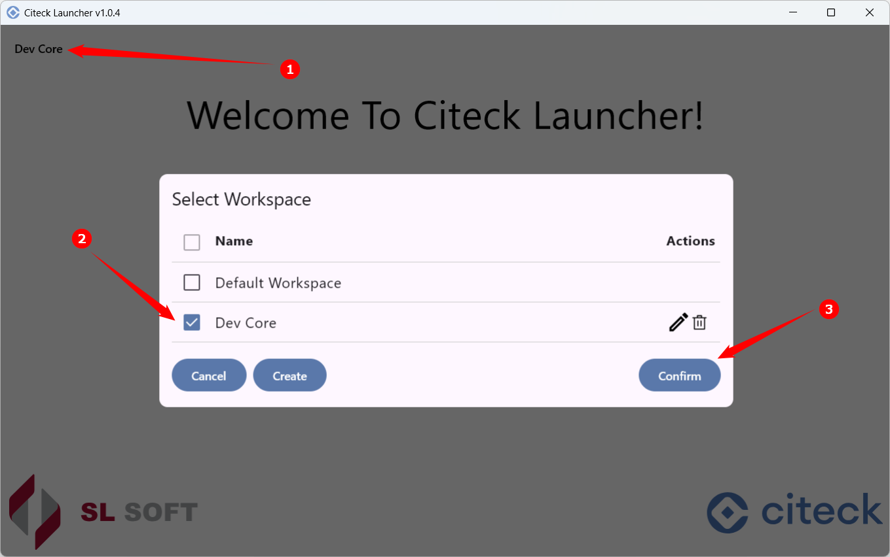

В списке пространство можно отредактировать, удалить. В пространстве будет доступен запуск настроенного namespace и создание нового:

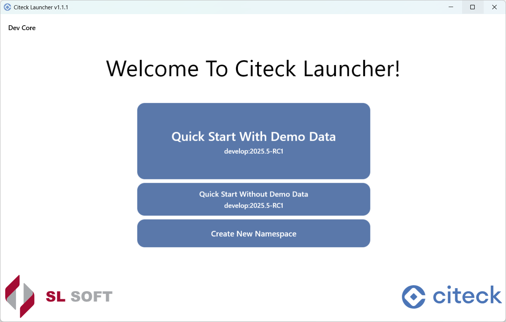