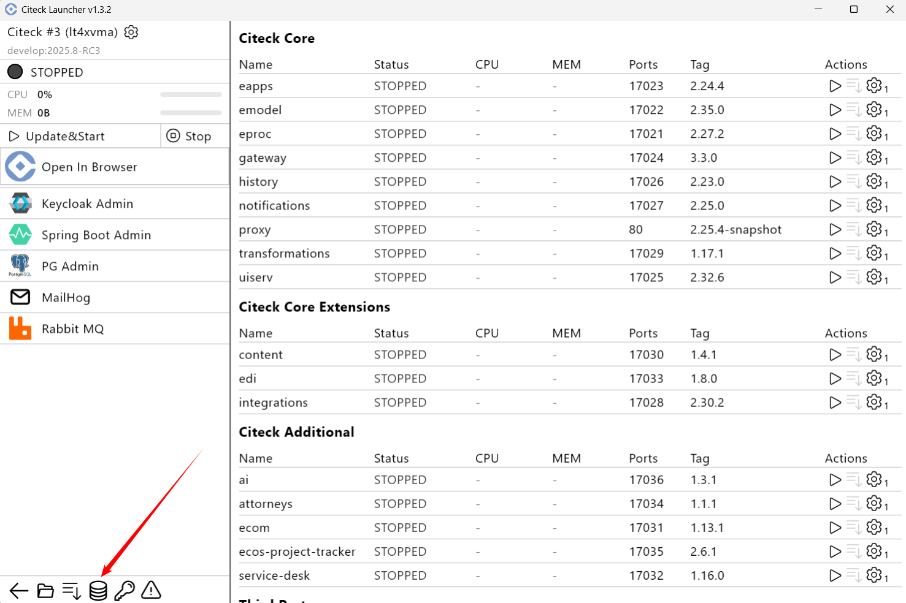
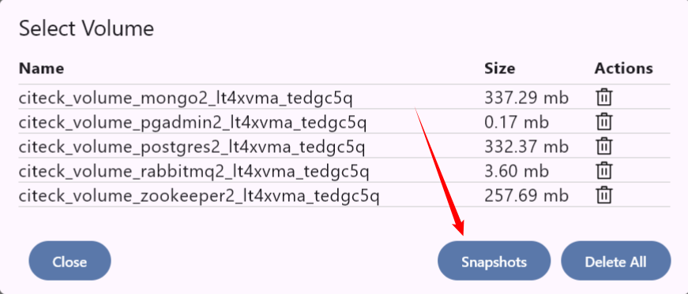
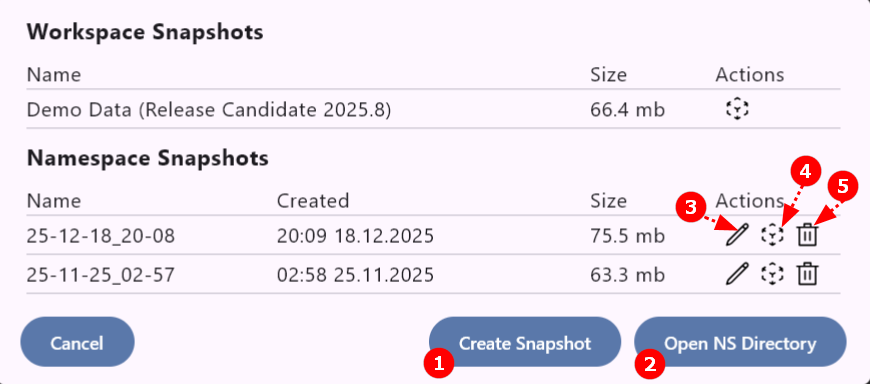
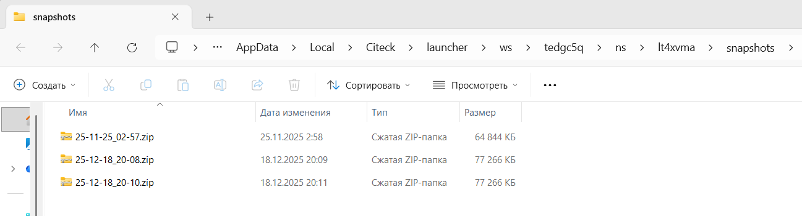
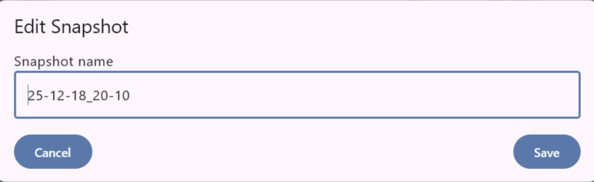

Работа со снапшотами
=========================

.. _launcher_dump:

.. note:: 

    Создание и разворачивание из снапшота возможно только при полной остановке.

**Снапшоты в Docker** представляют собой моментальные снимки состояния контейнера или его тома (volumes) на определённый момент времени. Они предоставляют возможность оперативного возврата к ранее зафиксированной точке, однако не являются полноценным средством резервного копирования для производственных сред, а служат преимущественно инструментом для отладки и тестирования. 

Снапшоты сохраняют изменения относительно базового образа посредством создания нового слоя и используются для фиксации состояния данных на томах или экспорта конфигурации контейнера.  

Перейдите в **список volumes**:

Далее нажмите **Snapshots**:

В списке представлены 2 типа снапшотов:

 - **Workspace Snapshots** - снапшоты, настроенные в конфигурации workspace, например демо данные.
 - **Namespace Snapshots** - локальные для namespace снапшоты, которыми можно управлять.

1. Создать **новый снапшот**:

.. list-table::
      :widths: 20 20
      :align: center

      * - | Укажите название:

            .. image:: _static/snapshot_04.png
                  :width: 400
                  :align: center

        - | 

            .. image:: _static/snapshot_05.png
                  :width: 400
                  :align: center

2. Перейти в **директорию с созданными снапшотами**:

3. **Переименовать** снапшот:

4. **Развернуть данные** из снапшота:

.. image:: _static/snapshot_07.png
    :width: 400
    :align: center

5. **Удалить** снапшот:

Развернуть снапшот на другом компьютере
-------------------------------------------

1. На своем рабочем месте: 
   
   - сделайте снапшот, 
   - перейдите в **директорию с созданными снапшотами** по соответствующей кнопке **(2)**, 
   - скопируте необходимый архив,
   - передайте архив.

2. На другом рабочем месте: 

   - создайте новый :ref:`namespace<launcher_new_space>`,
   - перейдите в **директорию с созданными снапшотами** по соответствующей кнопке **(2)**, 
   - добавьте полученный архив в папку;
   - перейдите в список снапшотов;
   - разверните данные из снапшота **(4)**.

