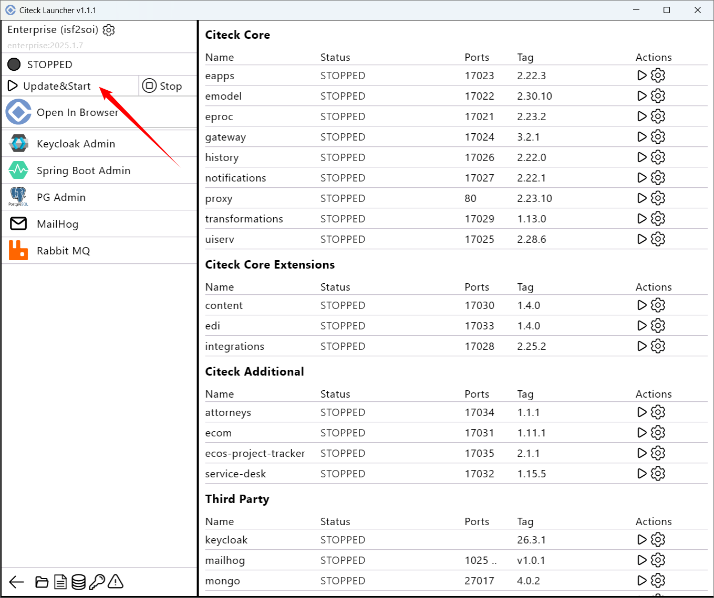

Создание нового пространства имен
----------------------------------

.. _launcher_new_space:

Для запуска другого комплекта поставки в рабочем пространстве создайте новый namespace. Нажмите **Create New Namespace**.

.. image:: _static/new_namespace.png
    :width: 600
    :align: center

Укажите **имя**, выберите **вариант поставки**, **версию поставки**, **снапшот данных**, **вид авторизации**:

Доступные варианты поставки: Develop (релиз кандидаты) и Release, и их версии:

.. image:: _static/bundles.png
    :width: 500
    :align: center

Нажмите **Confirm**. 

Если выбираете снапшот данных, то дождитесь загрузки и проверки данных:

.. image:: _static/new_namespace_1_1.png
    :width: 600
    :align: center

Для запуска нажмите **Update&Start**:

Введите мастер пароль или установите его, если не установили ранее:

Введите пароль для скачивания закрытых образов:

.. image:: _static/new_namespace_3.png
    :width: 400
    :align: center

Далее процесс аналогичен запуску версии Community:

.. image:: _static/new_namespace_4.png
    :width: 700
    :align: center
