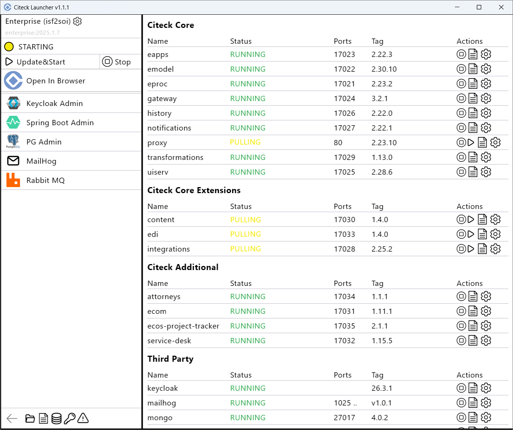

.. _launcher_new_space:

Создание нового пространства имён
-----------------------------------

Для запуска другого комплекта поставки создайте новый namespace — нажмите **Create New Namespace**:

Укажите параметры нового пространства имён:

- **Имя** namespace;
- **вариант поставки** — Develop (релиз-кандидаты) или Release;
- **версию поставки**;
- **снапшот данных** (при необходимости);
- **вид авторизации**.

.. image:: _static/new_namespace_1.png
    :width: 500
    :align: center

Доступные варианты поставки и их версии:

.. image:: _static/bundles.png
    :width: 500
    :align: center

Нажмите **Confirm**.

Если выбран снапшот данных, дождитесь его загрузки и проверки:

.. image:: _static/new_namespace_1_1.png
    :width: 600
    :align: center

Для запуска нажмите **Update & Start**:

.. image:: _static/new_namespace_2.png
    :width: 700
    :align: center

Введите мастер-пароль или установите его, если он ещё не задан:

.. image:: _static/new_namespace_2_1.png
    :width: 400
    :align: center

Введите пароль для скачивания закрытых образов:

.. image:: _static/new_namespace_3.png
    :width: 400
    :align: center

Далее процесс аналогичен :ref:`запуску Community <quick_start>`:

