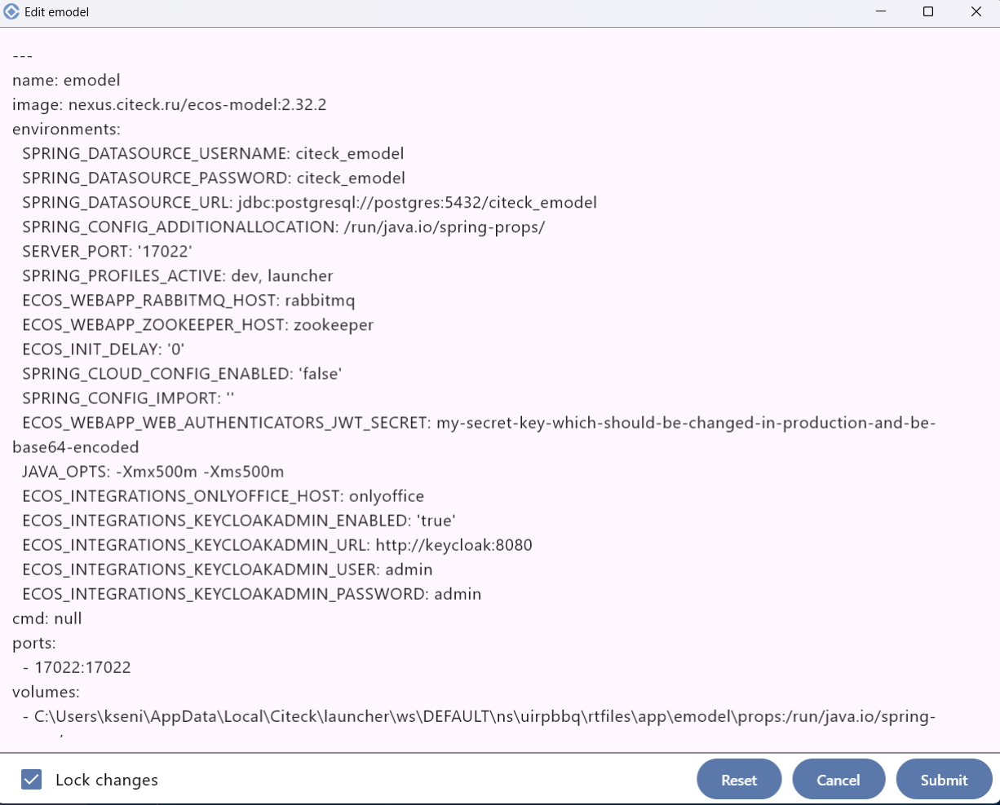

Описание интерфейса
----------------------

На странице загрузки логчера можно посмотреть логи и выгрузить состояние системы на случай проблем:

    .. image:: _static/loading.png
         :width: 600
         :align: center

При первом запуске доступны установка Citeck Community с :ref:`демонстрационными данными<ecos_modules>` **(a)**, без демо данных **(b)** создание иного пространства имен для разворачивания Citeck **(с)**:

.. image:: _static/namespaces.png
    :width: 600
    :align: center

После успешного запуска будет отображаться список доступных namespace:

.. image:: _static/namespaces_1.png
    :width: 600
    :align: center

|

.. image:: _static/overview.png
    :width: 600
    :align: center

1. **Запускаемые микросервисы и приложения**: микросервисы ядра, приложения Citeck, сторонние, статус. Доступные действия:

    - **1a** – остановить/запустить
    - **1b** – лог микросервиса
    - **1c** – настройка микросервиса/приложения вручную:

1. **Обновить/ запустить** все микросервисы и приложения. При клике правой кнопкой мыши доступно действие **Force Update And Start** для принудительного обновления данных из git репозиториев с конфигурацией рабочего пространства и bundle (китов):

.. image:: _static/force_update.png
    :width: 250
    :align: center

1. **Остановка** всех микросервисов и приложений.
2. Актуальный **статус** процесса разворачивания.
3. **Открыть Citeck в браузере** (только для статуса Running).
4. Доступ к **сопутствующим сервисам**. Открываются в браузере в отдельной вкладке.

    -	**Keycloak Admin** – интерфейс управления Keycloak, системой управления идентификацией и авторизацией. Если при настройке пространства имен выбран тип авторизации Keycloak.
    -	**Spring Boot Admin** – :ref:`интерфейс <spring_boot_admin>` для мониторинга и администрирования Spring Boot-приложений, предоставляет удобный интерфейс для просмотра состояния, метрик, логов и управления Spring Boot-приложениями.
    -	**PG Admin** - интерфейс для администрирования и управления базами данных PostgreSQL.
    -	**MailHog** – интерфейс инструмента для тестирования и отладки электронной почты во время разработки, предоставляет удобный веб-интерфейс для их просмотра, без реальной отправки на почтовые серверы.
    -	**RabbitMQ** – интерфейс брокер сообщений (message broker), который обеспечивает асинхронный обмен данными между компонентами распределённых систем.

5. Переход в **директорию лончера** (папка с логами, данными конфигурации, рабочими пространствами).
6. Открыть **лог** лончера.
7. **Список volumes**, которые используются. Их можно очистить:

    .. image:: _static/volumes.png
        :width: 400
        :align: center

8.  **Работа с секретами**, используемыми в лончере. Сначала необходимо задать мастер-пароль: 

    .. image:: _static/secret_1.png
        :width: 400
        :align: center

 См. подробно о работе с :ref:`секретами<launcher_secrets>`

1.   **Экспорт информации о системе** (выгрузка данных о системе, информации о билде, экспорт thread dump).
2.   **Настройки пространства имен**. См. подробно о настройках :ref:`пространства имен (namespace)<launcher_new_space>`

    .. image:: _static/namespace_settings.png
        :width: 400
        :align: center