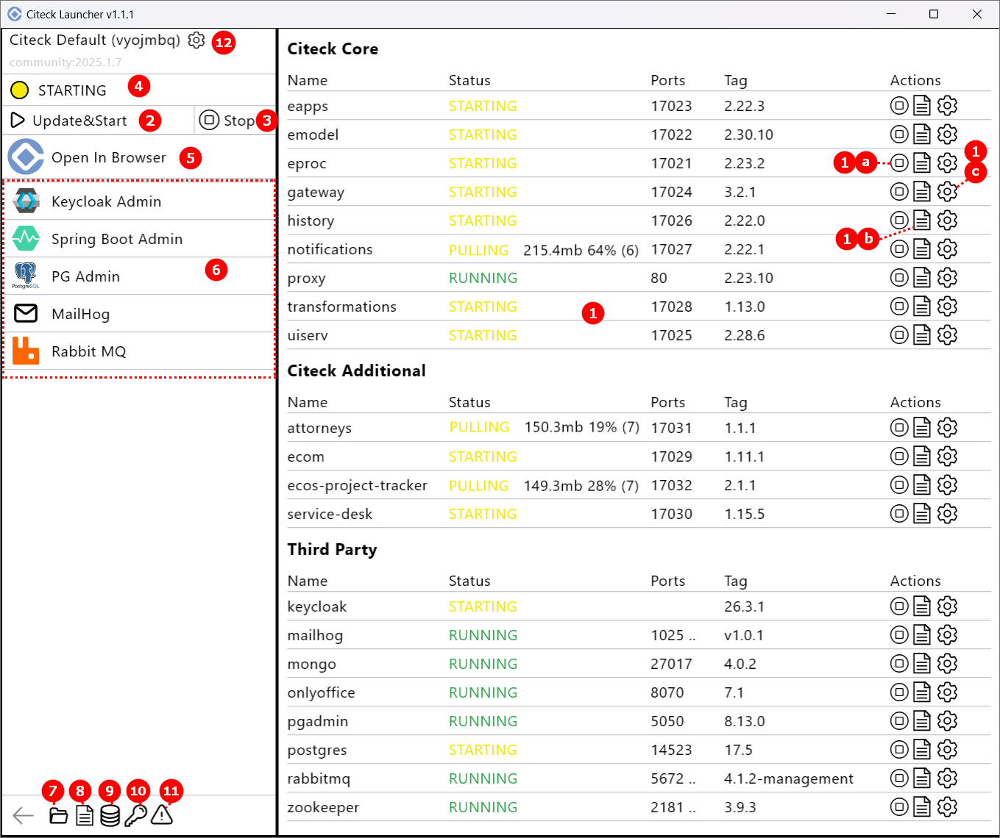

Описание интерфейса
----------------------

На странице загрузки лончера можно посмотреть логи и выгрузить состояние системы на случай проблем:

    .. image:: _static/loading.png
         :width: 600
         :align: center

При первом запуске доступны установка Citeck Community с :ref:`демонстрационными данными<ecos_modules>` **(a)**, без демо данных **(b)** создание иного :ref:`пространства имен (namespace)<launcher_new_space>` для разворачивания Citeck **(с)**:

.. image:: _static/namespaces.png
    :width: 600
    :align: center

После успешного запуска будет отображаться список доступных namespace:

.. image:: _static/namespaces_1.png
    :width: 600
    :align: center

Непосредственно из списка namespace можно отредактировать, удалить:

При выборе namespace доступна актуальная информация о микросервисах и приложениях в его составе, а так же действия:

|

1. **Запускаемые микросервисы и приложения**: микросервисы ядра, приложения Citeck, сторонние, статус, расходуемые ресурсы CPU, оперативной памяти. Доступные действия:

    - **1a** – остановить/запустить
    - **1b** – лог микросервиса
    - **1c** – настройка микросервиса/приложения вручную:

  **Левый клик** — редактировать конфигурацию Docker приложения:

  .. image:: _static/setting_left.png
    :width: 600
    :align: center

  **Правый клик** — редактировать файлы томов:

  .. image:: _static/setting_right.png
    :width: 600
    :align: center  

  **Синий маркер** означает, что у приложения есть ручная конфигурация, которая не управляется лончером. Чтобы сбросить ручные изменения, откройте редактор и нажмите **«Сброс»**.

2. **Обновить/ запустить** все микросервисы и приложения. При клике правой кнопкой мыши доступно действие **Force Update And Start** для принудительного обновления данных из git репозиториев с конфигурацией рабочего пространства и bundle (китов):

.. image:: _static/force_update.png
    :width: 250
    :align: center

3. **Остановка** всех микросервисов и приложений.
4. Актуальный **статус** процесса разворачивания.
5. Общие **потребляемые ресурсы CPU/RAM**.
6. **Открыть Citeck в браузере** (только для статуса Running).
7. Доступ к **сопутствующим сервисам**. Открываются в браузере в отдельной вкладке.

    -	**Keycloak Admin** – интерфейс управления Keycloak, системой управления идентификацией и авторизацией. Если при настройке пространства имен выбран тип авторизации Keycloak. **Логин/ пароль:** admin/ admin
    -	**Spring Boot Admin** – :ref:`интерфейс <spring_boot_admin>` для мониторинга и администрирования Spring Boot-приложений, предоставляет удобный интерфейс для просмотра состояния, метрик, логов и управления Spring Boot-приложениями.
    -	**PG Admin** - интерфейс для администрирования и управления базами данных PostgreSQL. **Логин/ пароль:** admin@admin.com/ admin **Пароль для БД:** postgres
    -	**MailHog** – интерфейс инструмента для тестирования и отладки электронной почты во время разработки, предоставляет удобный веб-интерфейс для их просмотра, без реальной отправки на почтовые серверы.
    -	**RabbitMQ** – интерфейс брокер сообщений (message broker), который обеспечивает асинхронный обмен данными между компонентами распределённых систем.  **Логин/ пароль:** admin/ admin

8. Документация по платформе Citeck:

    -	**Documentation** – переход на `ресурс <https://citeck-ecos.readthedocs.io/ru/latest/index.html>`_, содержащий документации по платформе.
    -	**AI Documentation Bot** – переход в `Telegram-бот <https://t.me/haski_citeck_bot>`_

9.  Переход в **директорию лончера** (папка с логами, данными конфигурации, рабочими пространствами).
10. Открыть **лог** лончера:

  .. image:: _static/log.png
    :width: 800
    :align: center  

 Данные лога можно отфильтровать по типу **(1)**, в нем доступен поиск **(2)**. Его можно скопировать, очистить, выгрузить **(3)**.

11.  **Список volumes**, которые используются. Их можно очистить, сделать :ref:`снапшот данных<launcher_dump>`:

    .. image:: _static/volumes.png
        :width: 400
        :align: center

12.   **Работа с секретами**, используемыми в лончере. Сначала необходимо задать мастер-пароль: 

    .. image:: _static/secret_1.png
        :width: 400
        :align: center

 См. подробно о работе с :ref:`секретами<launcher_secrets>`

13.   **Экспорт информации о системе** (выгрузка данных о системе, информации о билде, экспорт thread dump).

14.   **Настройки пространства имен**. См. подробно о настройках :ref:`пространства имен (namespace)<launcher_new_space>`

    .. image:: _static/namespace_settings.png
        :width: 400
        :align: center

Действия в трее
-----------------

.. image:: _static/tray_actions.png
    :width: 200
    :align: center

- Открыть
- **Экспорт** информации о системе
- Переход в **директорию лончера**
- Выйти