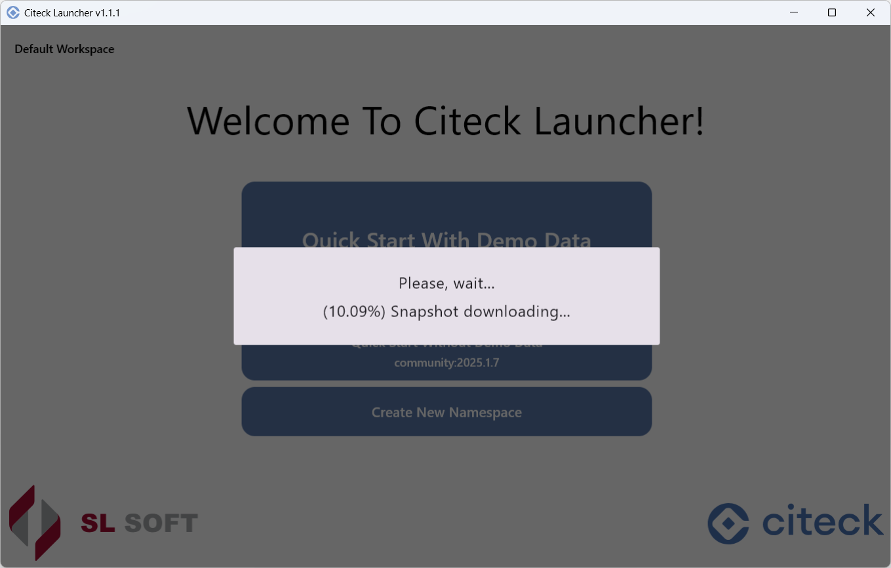
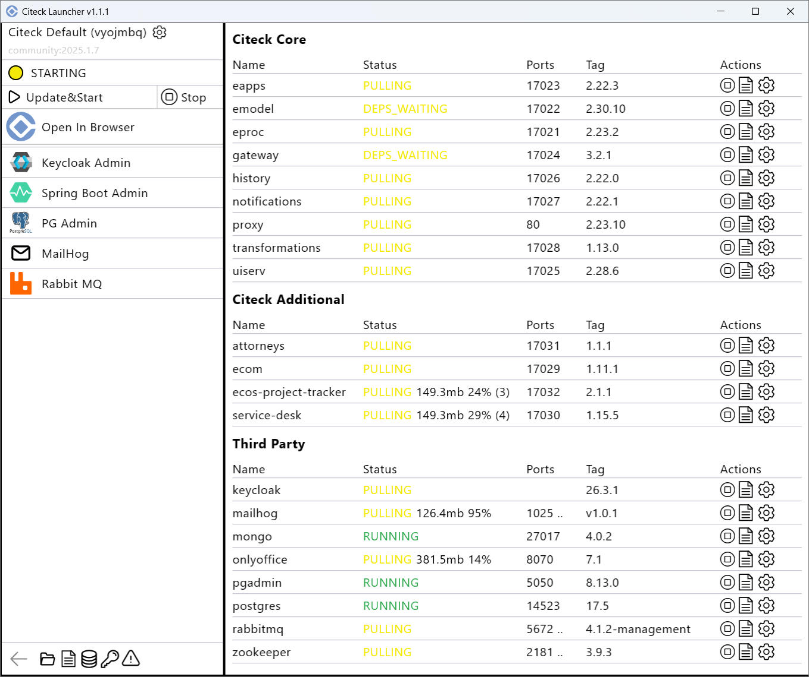
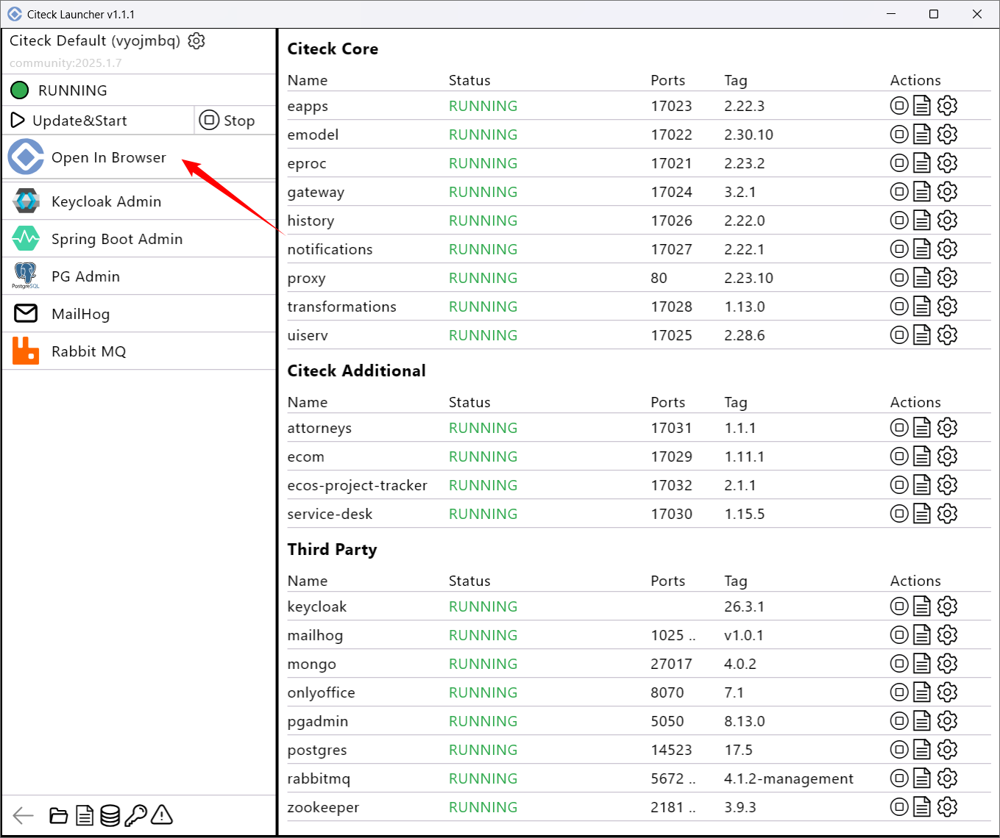

Быстрый запуск Citeck Community
---------------------------------

.. _quick_start:

1. Убедитесь, что установлены следующие необходимые компоненты и соблюдены требования к ОЗУ:

    - Установлен `Docker <https://docs.docker.com/get-docker/>`_
    - **16 ГБ** ОЗУ для корректного запуска Citeck

2. Запустите **Docker**.

.. note::

    По умолчанию Windows выделяет 50 % общей памяти для WSL 2. Для увеличкния объема памяти, воспользуйтесь `инструкцией <https://learn.microsoft.com/ru-ru/windows/wsl/wsl-config#configuration-settings-for-wslconfig>`_ 

1. Скачайте и установите актуальный дистрибутив **citeck-launcher** для вашей операционной системы со `страницы релизов <https://github.com/Citeck/citeck-launcher/releases>`_:

    - **.msi** для Windows
    - **.deb** для Linux-подобных ОС
    - **.dmg** для MacOS

.. note::

    При установке на Windows, если **SmartScreen** предотвратил запуск приложения, то нажмите **"Подробнее"** и далее **«Выполнить в любом случае»**:

     .. image:: _static/01.png
         :width: 300
         :align: center

3. Запустите **citeck-launcher**:

4. Для быстрого **запуска Citeck Community**:

    - с предзаполненными :ref:`демонстрационными данными<ecos_modules>` - нажмите **Quick Start With Demo Data**:

        .. image:: _static/fast_start.png
            :width: 600
            :align: center

    - без демонстрационных данных - нажмите **Quick Start Without Demo Data**.

 Дождитесь загрузки и проверки данных:

5. Скачивание и разворачивание образов начнется автоматически:

6. Дождитесь статуса **Running** всех микросервисов и приложений и нажмите **Open In Browser**:

7. 

.. list-table::
      :widths: 20 20
      :align: center

      * - | Войдите в систему, используя следующие учётные данные **admin/ admin**:
          |

            .. image:: _static/page_01.png
                  :width: 350
                  :align: center

        - | При первом развертывании без демонстрационных данных 
          | keycloak попросит сменить пароль:

            .. image:: _static/page_02.png
                  :width: 350
                  :align: center

8.  По адресу http://localhost/ откроется страница :ref:`персонального рабочего пространства<ws_personal>`:

.. image:: _static/page_04.png
    :width: 700
    :align: center

.. note::

    При первом запуске в течение первых 5 минут после успешной установки и входа в систему могут возникать ошибки, например:

     .. image:: _static/page_05.png
         :width: 300
         :align: center

    Развертывание и запуск Citeck продолжается, необходимо подождать.

В левом верхнем углу доступна кнопка для выбора доступных рабочих пространств и создания нового:

.. image:: _static/page_03.png
    :width: 450
    :align: center

Подробно о: 

    * :ref:`модулях и учетных записях<ecos_modules>`; 
    * :ref:`рабочих пространствах<workspaces>`; 
    * :ref:`корпоративном портале<corp_portal>`;
    * :ref:`разделе администратора<admin>`.

.. note:: 

    Для экономии ресурсов можно остановить микросервис **onlyoffice**, изменить аутентификацию с keycloak на **basic**.
