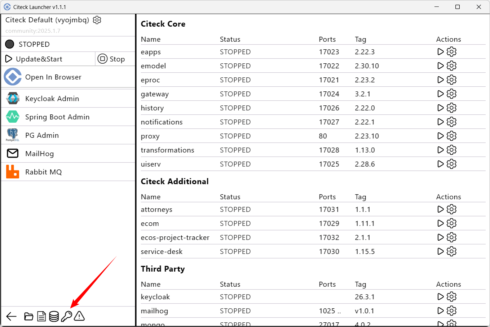

.. _launcher_secrets:

Работа с секретами и мастер-паролем
-------------------------------------

Мастер-пароль необходим, чтобы зашифровать все секреты, которые будут вводиться далее. 

.. note::

    Мастер-пароль нужно будет вводить 1 раз при каждом перезапуске лончера.

Для работы с секретами, используемыми для запуска Citeck, кликните:

Установка мастер-пароля
~~~~~~~~~~~~~~~~~~~~~~~~~

Введите и подтвердите мастер-пароль:

.. image:: _static/secret_1.png
    :width: 400
    :align: center

Просмотр и удаление секретов
~~~~~~~~~~~~~~~~~~~~~~~~~~~~~

Для просмотра списка секретов введите пароль:

.. image:: _static/secret_4.png
    :width: 400
    :align: center

Становится доступен список секретов с возможностью удаления:

Сброс мастер-пароля
~~~~~~~~~~~~~~~~~~~~~~~

.. note::

    Все используемые секреты будут удалены.

.. image:: _static/reset_secret_1.png
    :width: 400
    :align: center 

Подтвердите выбор:

И введите новый мастер-пароль:

.. image:: _static/reset_secret_3.png
    :width: 400
    :align: center 