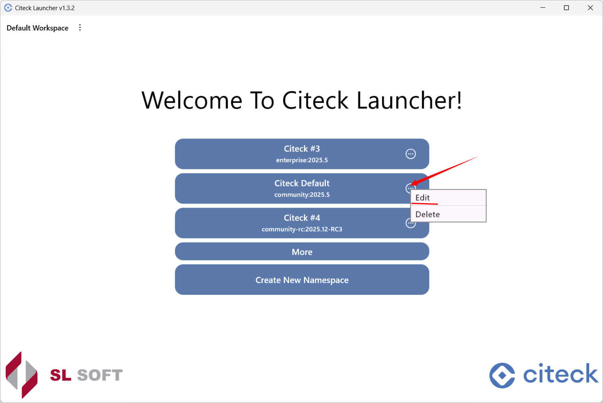
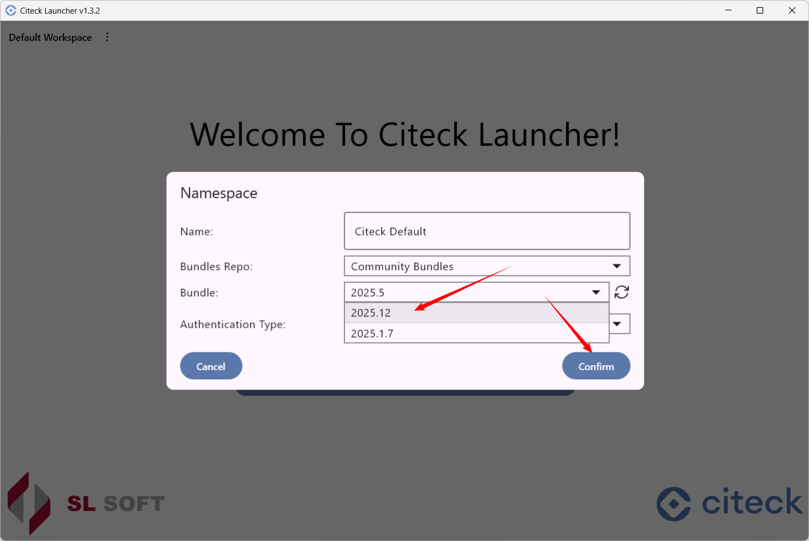
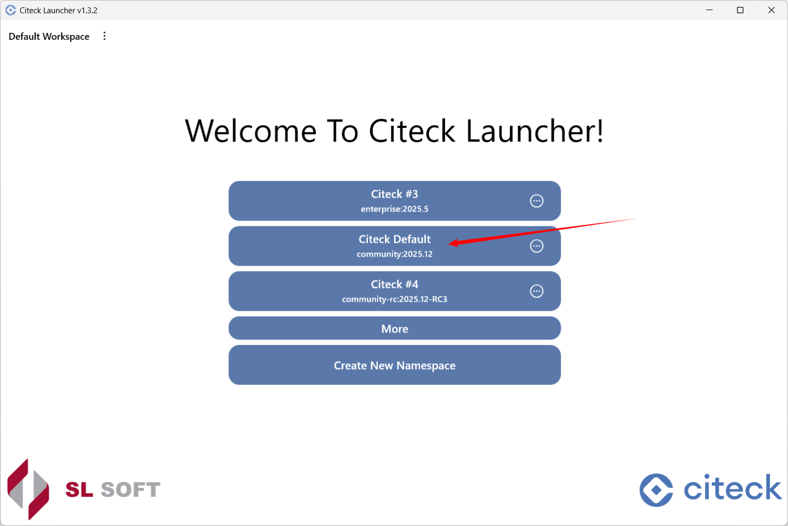
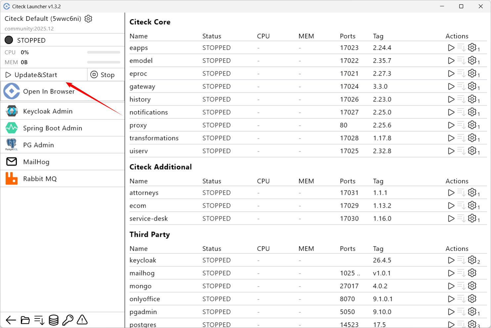

Обновление Citeck Community
-----------------------------

.. _launcher_update:

1. Создайте :ref:`снапшот данных<launcher_dump>`, чтобы при необходимости можно было восстановить их исходное состояние.

2. Перейдите в **режим редактирования** namespace:

3. Выберите **бандл** нового релиза и нажмите **Confirm**:

4. **Запустите**: 

5. Нажмите **Update&Start**: 

6. Начнется скачивание и разворачивание образов:

.. image:: _static/update_05.png
    :width: 600
    :align: center

7. Дождитесь статуса **Running** всех микросервисов и приложений и нажмите **Open In Browser**.

.. note::

    Данные в лончере без явного удаления не удаляются.