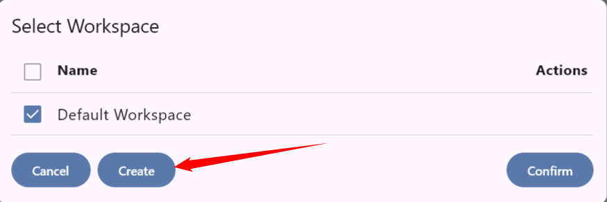
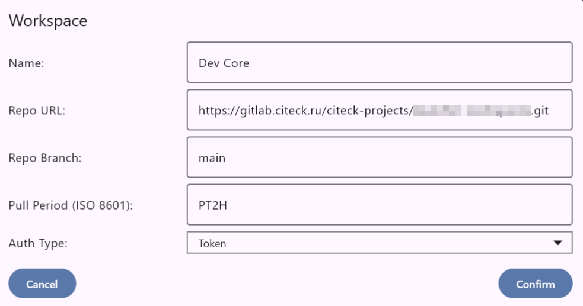
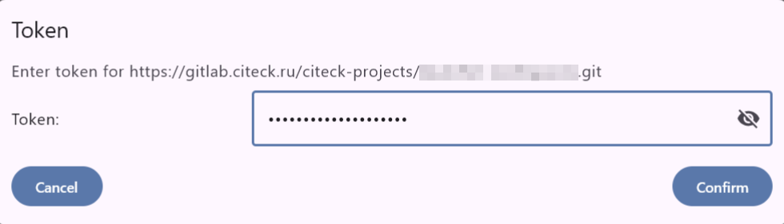
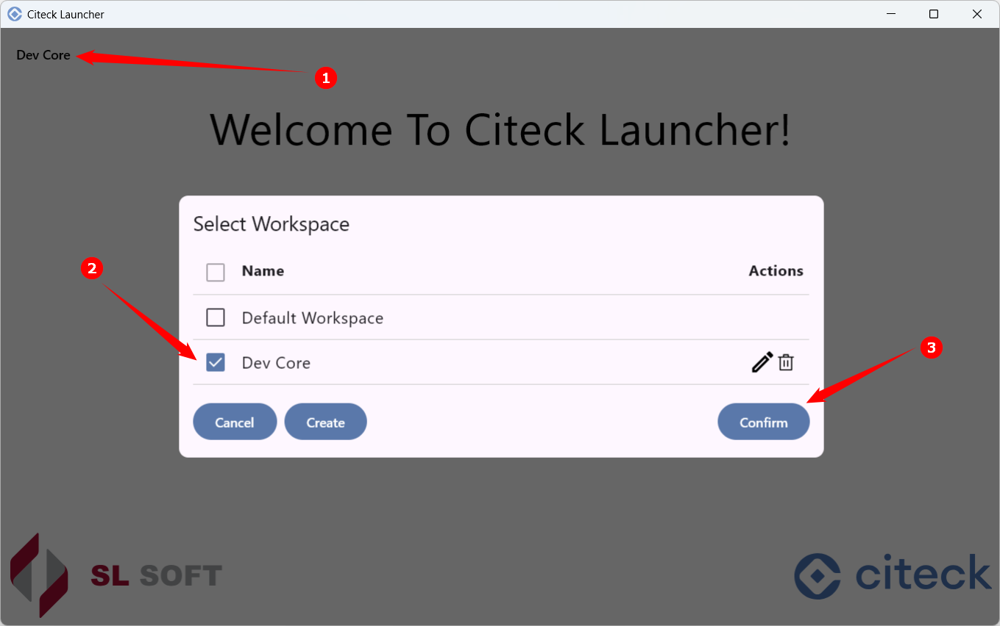
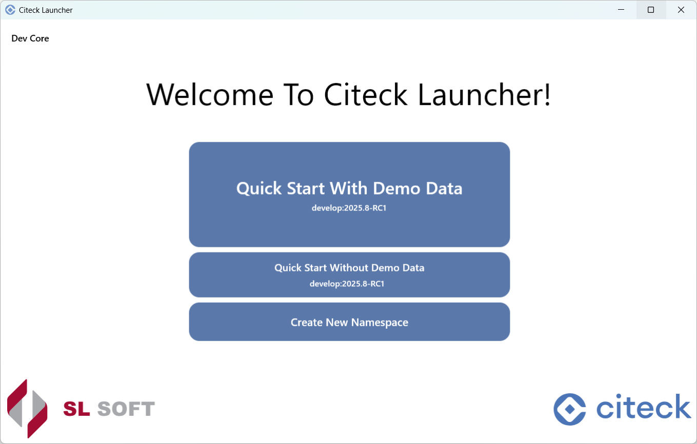

.. _launcher_workspace:

Рабочие пространства
------------------------------------------

В лончере доступно создание нескольких рабочих пространств. Например, одно пространство можно использовать для запуска релизных версий, второе — для внутренних сборок разработки.

Для перехода к списку пространств нажмите соответствующую кнопку:

.. image:: _static/ws_1.png
    :width: 600
    :align: center

Создание нового
~~~~~~~~~~~~~~~~~~~~~~~~~~~~~~~~

Нажмите кнопку создания нового пространства:

Введите параметры:

- **Имя** пространства;
- **адрес** и **ветку** репозитория;
- **период обновления** в формате ISO 8601;
- **тип авторизации** — None или Token.

Нажмите **Confirm**.

Для типа авторизации **Token** введите `персональный access-токен GitLab <https://docs.gitlab.com/user/profile/personal_access_tokens/>`_.

.. note::

    Чтобы создать токен, перейдите в **GitLab → аватар (слева) → Preferences → Access Tokens**, создайте новый токен и скопируйте его значение.

Введите токен в соответствующее поле и подтвердите:

Нажмите **Confirm** — рабочее пространство будет создано.

Выбор из созданных
~~~~~~~~~~~~~~~~~~~~~~~~~~~~~~~~~~~~~

Из списка пространство можно отредактировать или удалить. Внутри пространства доступен запуск уже настроенного namespace и создание нового:

