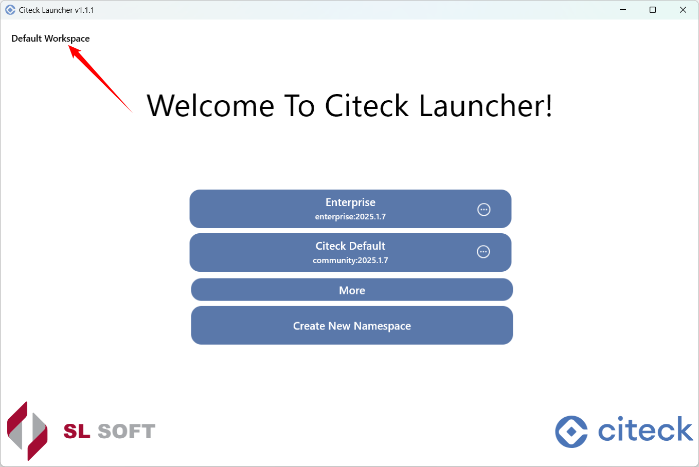

Рабочие пространства
---------------------

Создание нового
~~~~~~~~~~~~~~~~

.. image:: _static/ws_2.png
    :width: 500
    :align: center  

Введите **имя**, **адрес** и **ветку репозитория**, **период обновления** в формате ISO 8601, **тип авторизации**:

Нажмите **Confirm**.

Для типа авторизации **token** – введите `персональный access токен <https://docs.gitlab.com/user/profile/personal_access_tokens/>`_  в Gitlab и подтвердите:

.. image:: _static/ws_4.png
    :width: 500
    :align: center  

Нажмите **Confirm**. Рабочее пространство будет создано.

Выбор из созданных
~~~~~~~~~~~~~~~~~~~

.. image:: _static/ws_5_1.png
    :width: 600
    :align: center  

В списке пространство можно отредактировать, удалить. В пространстве будет доступен запуск настроенного namespace и создание нового:

