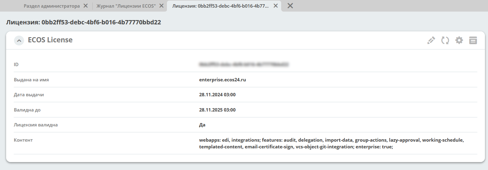

.. _license:

Лицензии Citeck
===============

**Лицензия** — правовой инструмент, определяющий условия использования и распространения программного обеспечения, защищённого авторским правом.

Citeck Community
-----------------

**Citeck Community** распространяется под свободной лицензией **LGPL**.

Citeck Enterprise
------------------

Для работы **Citeck Enterprise** требуется проприетарная лицензия.

Файл лицензии необходимо добавить в журнал **«Лицензии ECOS»** (Рабочее пространство **«Раздел администратора»** → **Управление системой**):

Чтобы просмотреть детали лицензии, нажмите на иконку **«Глаз»**:

