Результаты нагрузочного тестирования
======================================

.. _load_testing:

.. contents::
    :depth: 3

Нагрузочное тестирование 10 000 пользователей, 1 час
-------------------------------------------------------

Нагрузочное тестирование производилось с помощью **jmeter**. Релиз **Citeck 2024.5**. K8S.

**Ошибкой выполнения запроса** считается превышение времени ответа в 10 секунд или код, отличный от 200. Каждый тред использует отдельного пользователя в системе.

Изначально система имеет следующие данные:

    * 10 000 пользователей
    * 10 000 000 контрактов

Сценарий тестирования
~~~~~~~~~~~~~~~~~~~~~~~

Сценарий повторяет реальные запросы, которые возникают при работе пользователя.

Состав сценариев и распределение нагрузки:

    * логин в систему и просмотр главной страницы с загрузкой меню, дашборда, информации о пользователе (20%);
    * просмотр журнала контрактов (30%);
    * переход на страницу просмотра контракта с загрузкой всех виджетов: информация о контракте, действия, задачи, комментарии, связи, история версий и т.д. (30%);
    * просмотр журнала активных задач  (30%);
    * создание документов (20%);
    * старт процессов по документам (10%);
    * выполнение задач по процессу (50%).

Параметры нагрузки
~~~~~~~~~~~~~~~~~~~~~~~

.. list-table::
      :widths: 5 5
      :header-rows: 1
      :class: tight-table

      * - Название
        - Значение
      * - Количество пользователей
        - 10 000
      * - Initial delay, sec
        - 0
      * - Rump up, sec
        - 180
      * - Hold load, sec
        - 3 600
      * - Rump down, sec
        - 180

Ресурсы кластера и сервисов
~~~~~~~~~~~~~~~~~~~~~~~~~~~~~

5 * (16 CPU, 32 RAM) nodes - микросервисы Citeck (x2 gateway), postgresql.

Gateway
"""""""

Ресурсы пода:

.. code-block:: yaml

    resources:
        limits:
            memory: 12Gi
        requests:
            cpu: "8"
            memory: 12Gi

Кофигурация сервиса:

.. code-block:: 

    -Xmx10G -Xms10G
    
    ECOS_WEBAPP_DATA_SOURCES_MAIN_XA_AWARE_MAX_POOL_SIZE: 800
    ECOS_WEBAPP_DATA_SOURCES_MAIN_XA_AWARE_INITIAL_SiZE: 800
    SERVER_TOMCAT_MAX_THREADS: 6000
    ECOS_WEBAPP_WEB_CLIENT_MAXREQUESTS: 500
    ECOS_WEBAPP_WEB_CLIENT_MAXREQUESTSPERHOST: 500

Model
"""""""

Ресурсы пода:

.. code-block:: yaml

    resources:
      limits:
        memory: 13Gi
      requests:
        cpu: "14"
        memory: 13Gi

Кофигурация сервиса:

.. code-block:: 

    -Xmx10G -Xms10G
    
    ECOS_WEBAPP_DATA_SOURCES_MAIN_XA_AWARE_MAX_POOL_SIZE: 800
    ECOS_WEBAPP_DATA_SOURCES_MAIN_XA_AWARE_INITIAL_SiZE: 800
    SERVER_TOMCAT_MAX_THREADS: 6000
    ECOS_WEBAPP_WEB_CLIENT_MAXREQUESTS: 500
    ECOS_WEBAPP_WEB_CLIENT_MAXREQUESTSPERHOST: 500

Process
""""""""

Ресурсы пода:

.. code-block:: yaml

    resources:
      limits:
        memory: 6Gi
      requests:
        cpu: "6"
        memory: 6Gi

Кофигурация сервиса:

.. code-block::

    -Xmx4G -Xms4G
    
    ECOS_WEBAPP_DATA_SOURCES_EPROC_MAX_POOL_SIZE: 100
    ECOS_WEBAPP_DATA_SOURCES_EPROC_INITIAL_SIZE: 100
    ECOS_WEBAPP_DATA_SOURCES_CAMUNDA_MAX_POOL_SIZE: 800
    ECOS_WEBAPP_DATA_SOURCES_CAMUNDA_INITIAL_SIZE: 800
    
    ECOS_PROCESS_BPMN_ELEMENTS_MUTATION_PROCESSOR_CONSUMER_COUNT: 8
    ECOS_PROCESS_BPMN_KPI_MUTATION_PROCESSOR_CONSUMER_COUNT: 2
    ECOS_PROCESS_BPMN_ASYNC_START_PROCESS_CONSUMER_COUNT: 2
    
    SERVER_TOMCAT_MAX_THREADS: 1000
    ECOS_WEBAPP_WEB_CLIENT_MAXREQUESTS: 200
    ECOS_WEBAPP_WEB_CLIENT_MAXREQUESTSPERHOST: 200

UiServ
"""""""

Ресурсы пода:

.. code-block:: yaml

    resources:
      limits:
        memory: 6Gi
      requests:
        cpu: "7"
        memory: 6Gi

Кофигурация сервиса:

.. code-block:: 

    -Xmx3G -Xms3G
    
    ECOS_WEBAPP_DATA_SOURCES_MAIN_MAX_POOL_SIZE: 300
    ECOS_WEBAPP_DATA_SOURCES_MAIN_INITIAL_SIZE: 300
    SERVER_TOMCAT_MAX_THREADS: 2000

PostgresSQL
""""""""""""

Ресурсы пода:

.. code-block:: yaml

    resources:
      limits:
        memory: 30Gi
      requests:
        cpu: "15"
        memory: 30Gi

Кофигурация сервиса:

.. code-block:: 

    max_connections = 7000
    max_prepared_transactions = 7000
    shared_buffers = 8GB
    effective_cache_size = 15GB
    
    work_mem = 6MB
    
    max_worker_processes = 15
    max_parallel_maintenance_workers = 4
    max_parallel_workers_per_gather = 4
    max_parallel_workers = 15
    
    max_wal_size = 3GB
    min_wal_size = 80MB

Другие сервисы имели рекомендуемые параметры по умолчанию

Результаты
~~~~~~~~~~~~~~

В ходе нагрузки было сгенерировано **20 447 914 запросов**, из них **221 запрос (0.00 %)** завершился с ошибками или превысил лимит времени выполнения.

Достигнутые показатели
"""""""""""""""""""""""

В ходе нагрузки было сгенерировано 20 447 914 запросов, из них 221 запроса (0.00 %) завершилось с ошибками или превысило лимит времени выполнения.

    * Среднее время отклика - 21.88 мс
    * Медиана — 6 мс
    * 90% всех запросов обрабатывались менее чем за 18 мс
    * 95% всех запросов обрабатывались менее чем за 34 мс
    * 99% всех запросов обрабатывались менее чем за 73 мс

**Время ответа / Время**

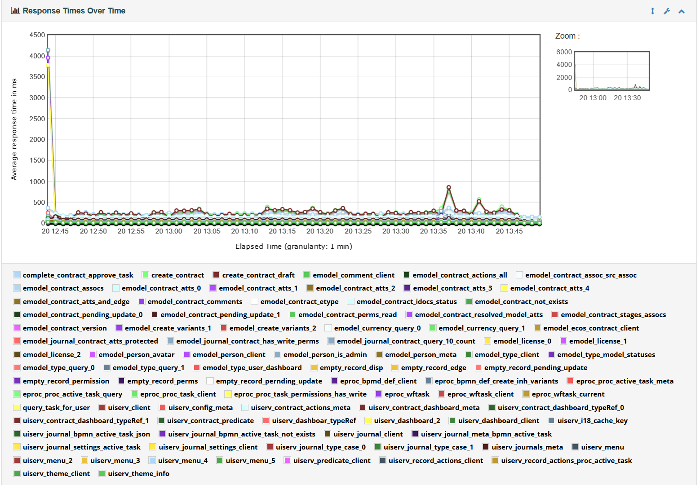

|

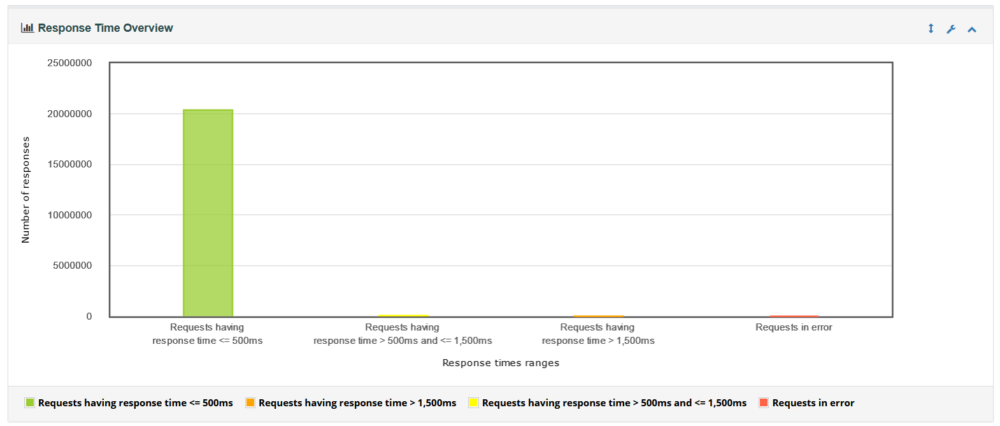

**Активные потоки / Время**

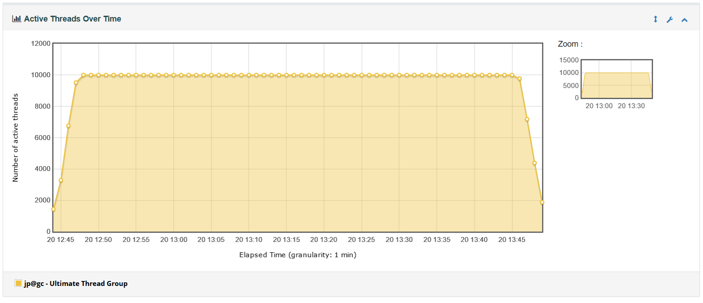

**Запросов в секунду**

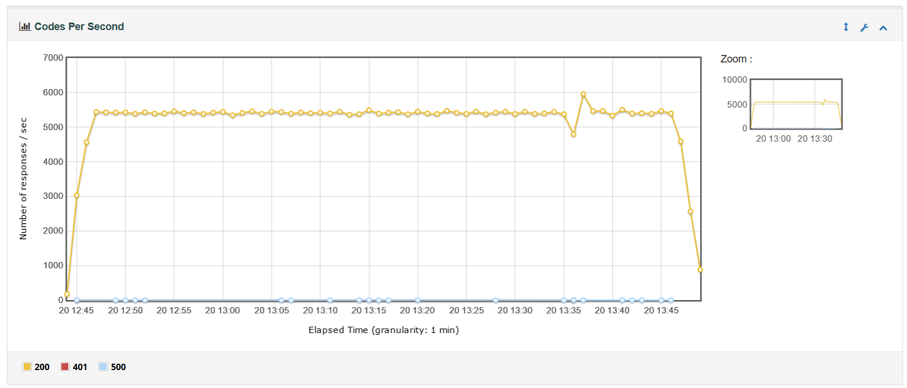

Самые высоконагруженные запросы:

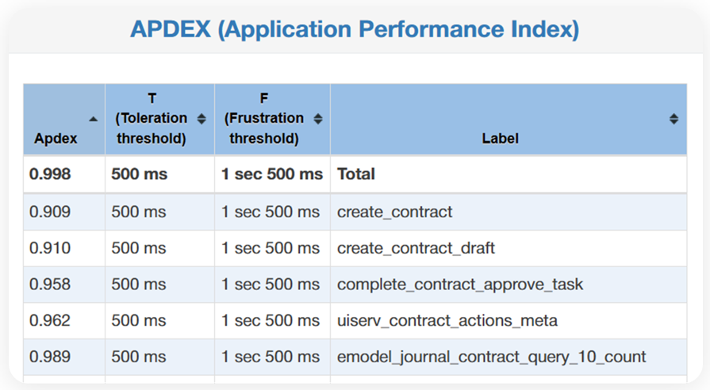
 
Нагрузка сервисов в пике

    1.	Model – 10 CPU (11.5 Gb RAM)
    2.	Postgresql – 9 CPU (27.2 Gb RAM)
    3.	UiServ – 7.5 CPU (4.3 Gb RAM)
    4.	Gateway – 6 CPU (9 Gb RAM) - per instance
    5.	Process – 3CPU (5 Gb RAM)

Графики CPU, RAM pods
"""""""""""""""""""""""

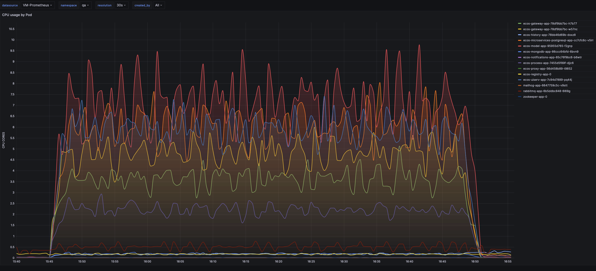

|

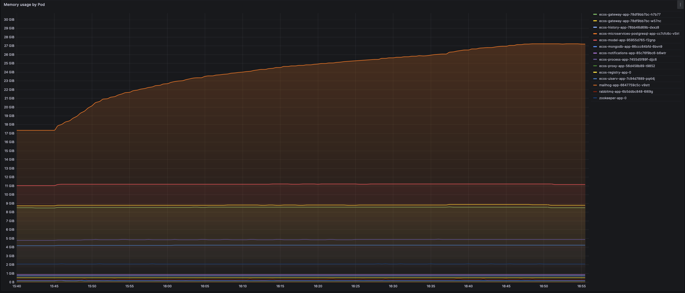

Нагрузочное тестирование с минимальными рекомендуемыми ресурсами, 1000 пользователей, 1 час
---------------------------------------------------------------------------------------------

Нагрузочное тестирование производилось с помощью **jmeter**. Релиз **Citeck 2024.5**. K8S.

**Ошибкой выполнения запроса** считается превышение времени ответа в 10 секунд или код, отличный от 200. Каждый тред использует отдельного пользователя в системе.

Изначально система имеет следующие данные:

    * 1 000 пользователей
    * 10 000 000 контрактов

Сценарий тестирования
~~~~~~~~~~~~~~~~~~~~~~~

Сценарий повторяет реальные запросы, которые возникают при работе пользователя.

Состав сценариев и распределение нагрузки:

    * логин в систему и просмотр главной страницы с загрузкой меню, дашборда, информации о пользователе (20%);
    * просмотр журнала контрактов (30%);
    * переход на страницу просмотра контракта с загрузкой всех виджетов: информация о контракте, действия, задачи, комментарии, связи, история версий и т.д. (30%);
    * просмотр журнала активных задач  (30%);
    * создание документов (20%);
    * старт процессов по документам (10%);
    * выполнение задач по процессу (50%).

Параметры нагрузки
~~~~~~~~~~~~~~~~~~~~~~~

.. list-table::
      :widths: 5 5
      :header-rows: 1
      :class: tight-table

      * - Название
        - Значение
      * - Количество пользователей
        - 1 000
      * - Initial delay, sec
        - 0
      * - Rump up, sec
        - 180
      * - Hold load, sec
        - 3 600
      * - Rump down, sec
        - 180

Ресурсы кластера и сервисов
~~~~~~~~~~~~~~~~~~~~~~~~~~~~~

16 CPU, 32 RAM node - микросервисы ecos, postgresql.

Gateway
""""""""

Ресурсы пода:

.. code-block:: yaml

    resources:
        limits:
            cpu: "2"
            memory: 1Gi
        requests:
            cpu: "2"
            memory: 1Gi

Кофигурация сервиса:

.. code-block:: 

    -Xmx256m -Xms256m

Model
""""""""

Ресурсы пода:

.. code-block:: yaml

        resources:
          limits:
            cpu: "2"
            memory: 1Gi
          requests:
            cpu: "2"
            memory: 1Gi

Кофигурация сервиса:

.. code-block:: 

    -Xmx256m -Xms256m

Process
""""""""
Ресурсы пода:

.. code-block:: yaml

        resources:
          limits:
            cpu: "1"
            memory: 4Gi
          requests:
            cpu: "1"
            memory: 4Gi

Кофигурация сервиса:

.. code-block:: 

    -Xmx2G -Xms2G

UiServ
""""""""
Ресурсы пода:

.. code-block:: yaml

        resources:
          limits:
            cpu: "1"
            memory: 1Gi
          requests:
            cpu: "1"
            memory: 1Gi

Кофигурация сервиса:

.. code-block:: 

    -Xmx256m -Xms256m

PostgresSQL
""""""""""""

Ресурсы пода:

.. code-block:: yaml

        resources:
          limits:
            cpu: "2"
            memory: 2Gi
          requests:
            cpu: "2"
            memory: 2Gi

Кофигурация сервиса:

.. code-block:: 

    max_connections = 7000
    max_prepared_transactions = 7000
    shared_buffers = 250M
    effective_cache_size = 1GB
    
    work_mem = 4MB
    
    max_worker_processes = 2
    max_parallel_maintenance_workers = 2
    max_parallel_workers_per_gather = 2
    max_parallel_workers = 2
    
    max_wal_size = 3GB
    min_wal_size = 80MB

Другие сервисы имели рекомендуемые параметры по умолчанию.

Результаты
~~~~~~~~~~~~~~

В ходе нагрузки было сгенерировано **20 447 914 запросов**, из них **221 запрос (0.00 %)** завершился с ошибками или превысил лимит времени выполнения.

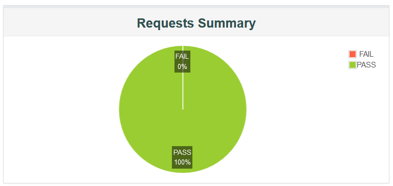

Достигнутые показатели
"""""""""""""""""""""""
В ходе нагрузки было сгенерировано 2 043 398 запросов, из них 1 запроса (0.00 %) завершилось с ошибками или превысило лимит времени выполнения.

    * Среднее время отклика - 6.88 мс
    * Медиана — 6 мс
    * 90% всех запросов обрабатывались менее чем за 16 мс
    * 95% всех запросов обрабатывались менее чем за 25 мс
    * 99% всех запросов обрабатывались менее чем за 47 мс

**Время ответа / Время**

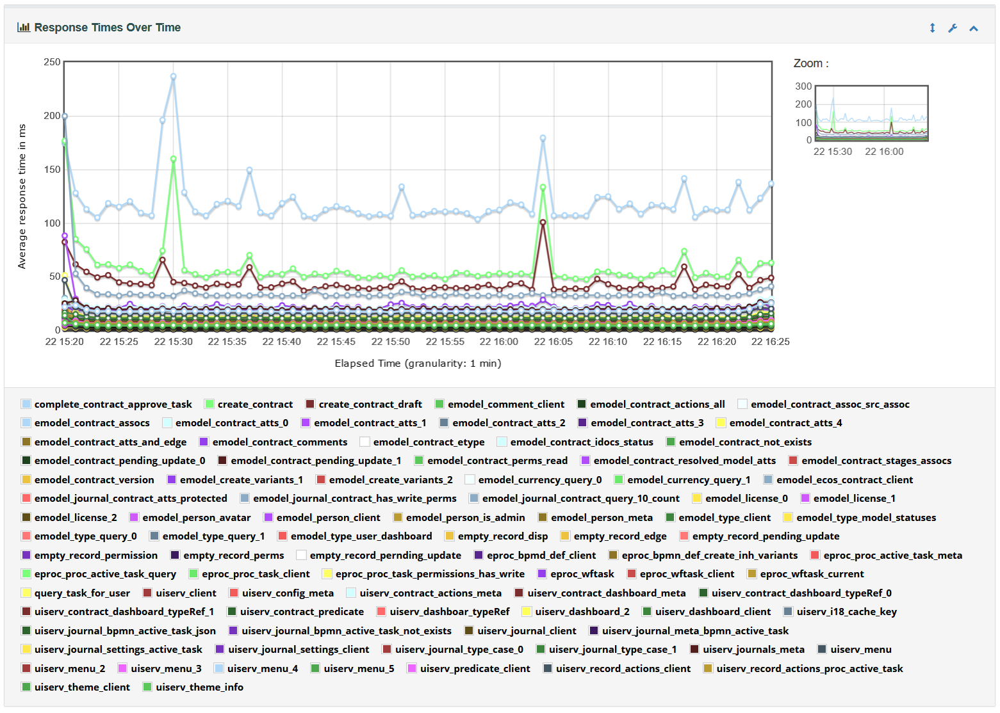

|

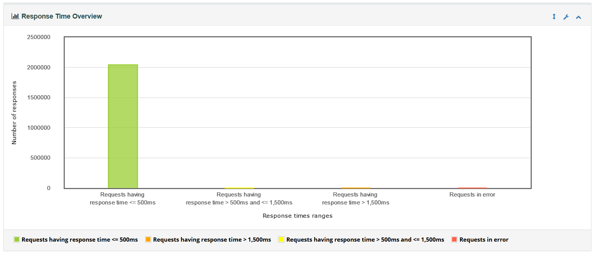

**Активные потоки / Время**

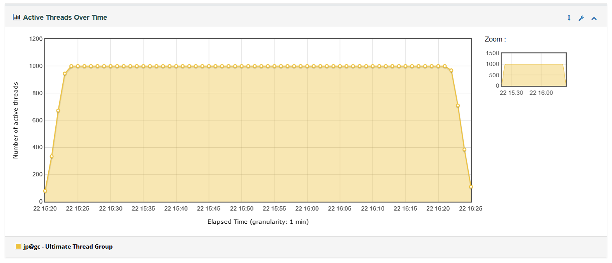

**Запросов в секунду**

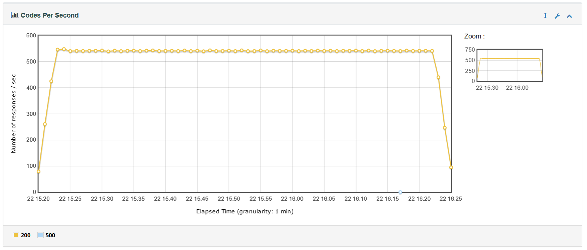

Самые высоконагруженные запросы:

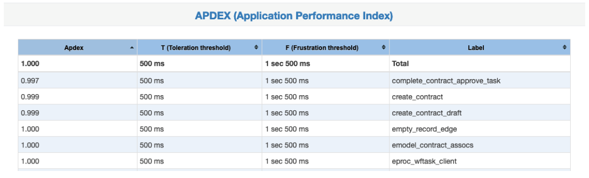
 
Нагрузка сервисов в пике:

    1.	Model – 1,5 CPU (700 Mb RAM)
    2.	Postgresql – 1 CPU (1.7 Gb RAM)
    3.	UiServ – 0.8 CPU (850 Mb RAM)
    4.	Gateway – 1,3 CPU (750 Mb RAM)
    5.	Process – 0,5 CPU (2.8 Gb RAM)
