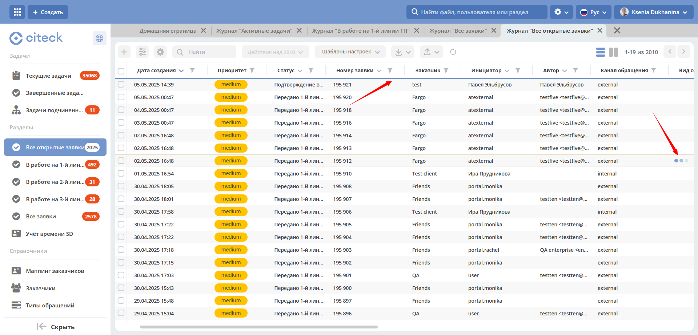

Производительность
===================

Вкладки внутри Citeck
---------------------

.. _ecos_tabs:

Чтобы скорость загрузки страницы не падала при увеличении количества вкладок:

1. Заголовки всех открытых вкладок сохраняются в LocalStorage браузера с текущей локализацией.

.. code-block::

 title: {ru: "Журнал "Договоры""}

2. При открытии страницы заголовок загружается только:  для активной вкладки, для вкладки без сохраненного имени в LocalStorage вкладки.

3. При смене локализации перезапрашиваются имена всех вкладок.

4. При первичном клике на вкладку, для которой имя было загружено из LocalStorage, запрашивается актуальное имя, при дальнейшем переключении на эту вкладку имя не запрашивается.

Загрузка и отображение данных
-------------------------------

.. _loading_data:

Ранее данные в журнале отображались только после того, как были получены данные из всех запросов, что заметно увеличивало время ожидания и ухудшало общее впечатление от работы системы. 

На данный момент проведена следующая оптимизация:

- данные в журнале отображаются, как только вернулись с бэкенда;
- работа с записями доступна после выполнения всех запросов;
- работа с журналом доступна во время всей загрузки журнала

Добавлены прогрессбар и спиннеры, который отображает состояние загрузки данных, что дает понять пользователю, что данные отрисованы, но загрузка еще продолжается и окончательный результат может быть изменен. 

