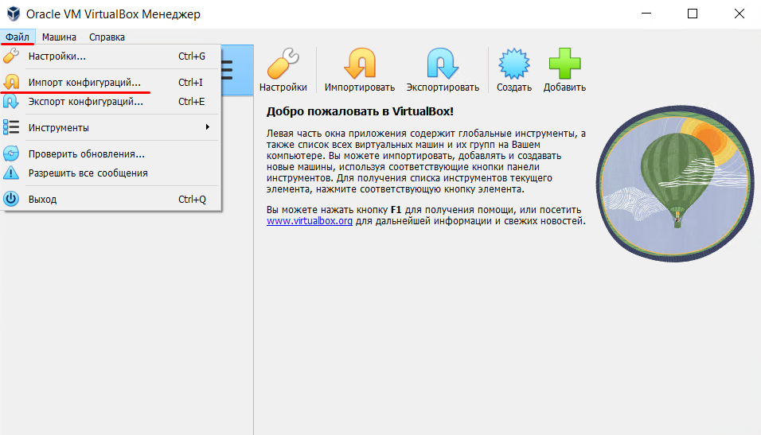
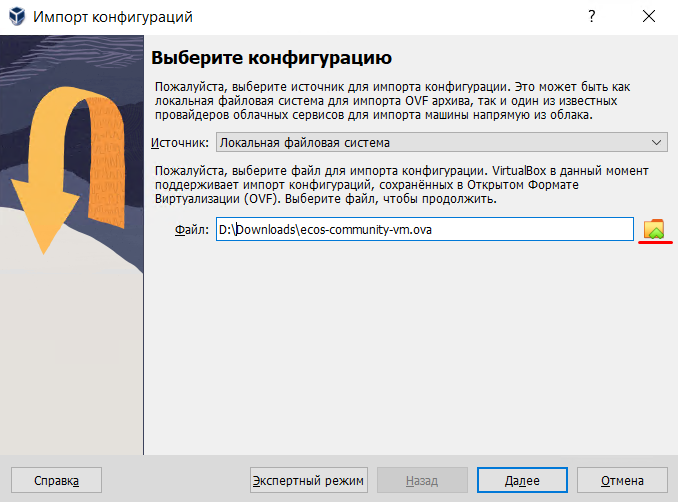
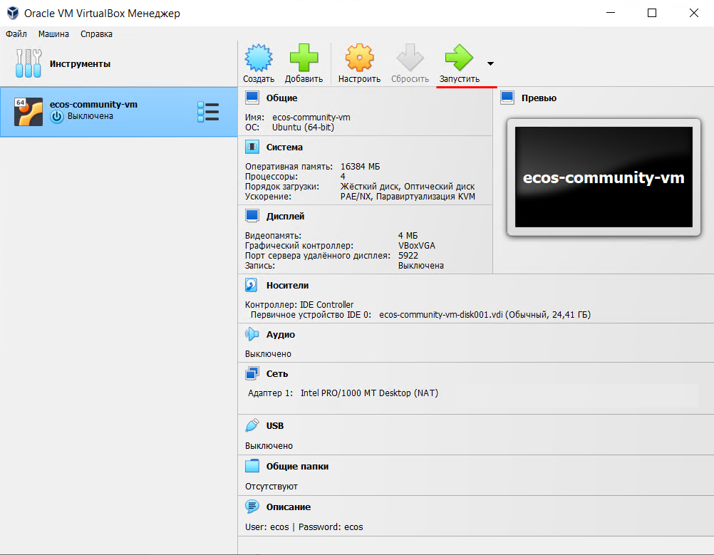
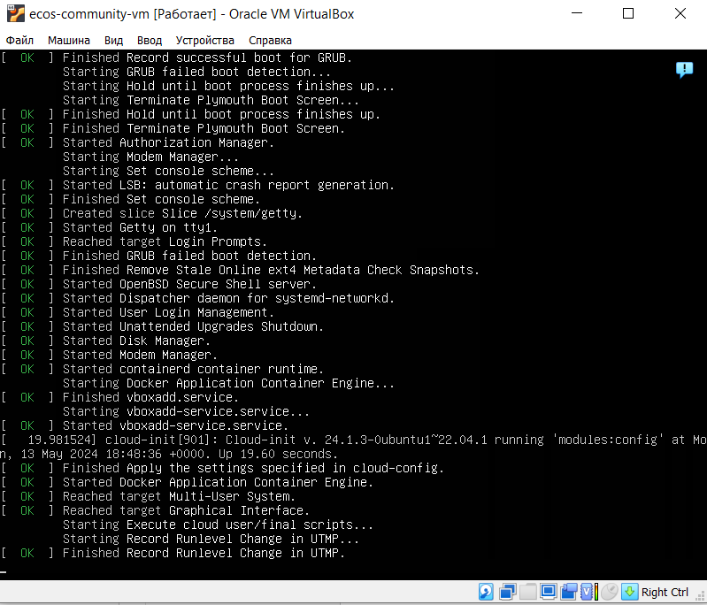
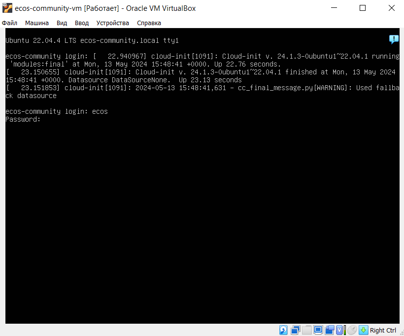
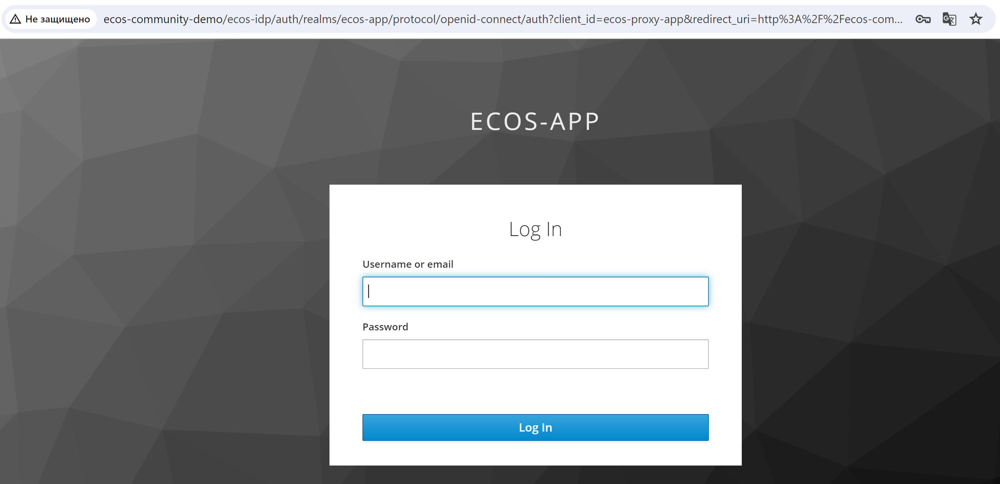
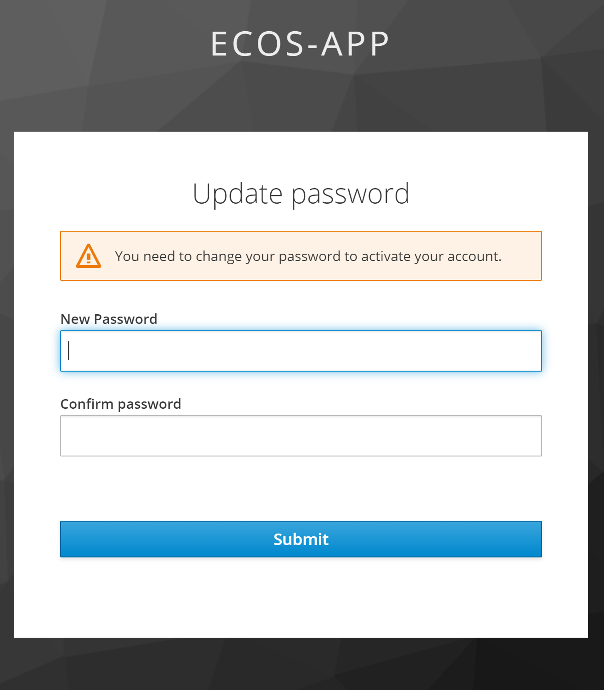
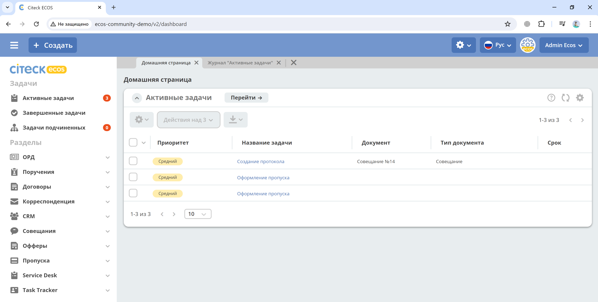

.. _virtualbox:

Развертывание виртуальной машины с Citeck ECOS в VirtualBOX 
==============================================================

.. contents::
    :depth: 3

.. important:: 

    Комплект поставляется с предзаполненными :ref:`демонстрационными данными<ecos_modules>`. 

Для начала установки понадобятся:

    -	процессор, поддерживающий виртуализацию: если опция отключена в BIOS, то система виртуализации сможет работать лишь с 32-разрядными машинами, для работы ECOS community demo необходима поддержка 64-х разрядных систем;
    -	установочный образ `ECOS community demo <https://storage.yandexcloud.net/ecos-community-vm/ecos-community-vm.ova>`_;
    -	установленная система виртуализации `Oracle VM VirtualBox 7.0.18 <https://www.virtualbox.org/wiki/Downloads>`_;
    -	в файле **hosts** прописать **127.0.0.1 ecos-community-demo**. Путь к папке, где лежит файл **hosts**, зависит от операционной системы, которая установлена на вашем компьютере:

            *  Windows— **c:/windows/system32/drivers/etc/hosts**
            *  Linux, Ubuntu, Unix, BSD — **/etc/hosts** 
            *  Mac OS — **/private/etc/hosts**

Как смонтировать образ
----------------------

**Шаг 1:** Запустите Oracle VM VirtualBox Менеджер. Перейдите в **Файл - Импорт конфигураций**:

**Шаг 2:** В открывшемся окне укажите путь, где будет храниться виртуальная машина. НЕ рекомендуется хранить машину на системном диске (disk C).

**Шаг 3:** Нажмите **«Далее»**, выберите параметры машины (доступ к звуку и т.д) и нажмите **«Готово»**.

.. note:: 

    ОЗУ по умолчанию указано 16 Гб. Можно уменьшить до 12 Гб.

.. list-table::
      :widths: 30 30
      :align: center

      * - |

            .. image:: _static/vm/03.png
                  :width: 600
                  :align: center

        - |

            .. image:: _static/vm/04.png
                  :width: 600
                  :align: center

Запуск виртуальной машины и сервисов
-------------------------------------

**Шаг 4:** Запустите VM: 

Загрузка машины может занять несколько минут.

После завершения процесса загрузки необходимо авторизоваться в консоли: 

.. code-block::

    login: ecos
    password: ecos

**Шаг 5:** Выполните команду запуска сервисов ecos-community:

.. code-block::

    ecos-community_start

Пример развертывания:

.. list-table::
      :widths: 30 30
      :align: center

      * - |

            .. image:: _static/vm/08.png
                  :width: 500
                  :align: center

        - |

            .. image:: _static/vm/09.png
                  :width: 500
                  :align: center

Подождите некоторое время (в зависимости от мощности системы) для того, чтобы система запустилась.

Авторизация в ECOS
-------------------

**Шаг 6:** Перейдите в браузере по адресу `http://ecos-community-demo <http://ecos-community-demo>`_ 

**Шаг 7:** Войдите в систему, используя следующие учётные данные:

.. code-block::

    Username: admin
    Password: admin

При первом развертывании keycloak попросит сменить пароль:

и далее станет доступна домашняя страница ECOS:

.. note:: 

    При первом запуске в течение первых 5 минут после успешной установки и входа в систему может возникать ошибка:

    .. image:: _static/vm/13.png
        :width: 600
        :align: center

    Развертывание и запуск ECOS продолжается, необходимо подождать.