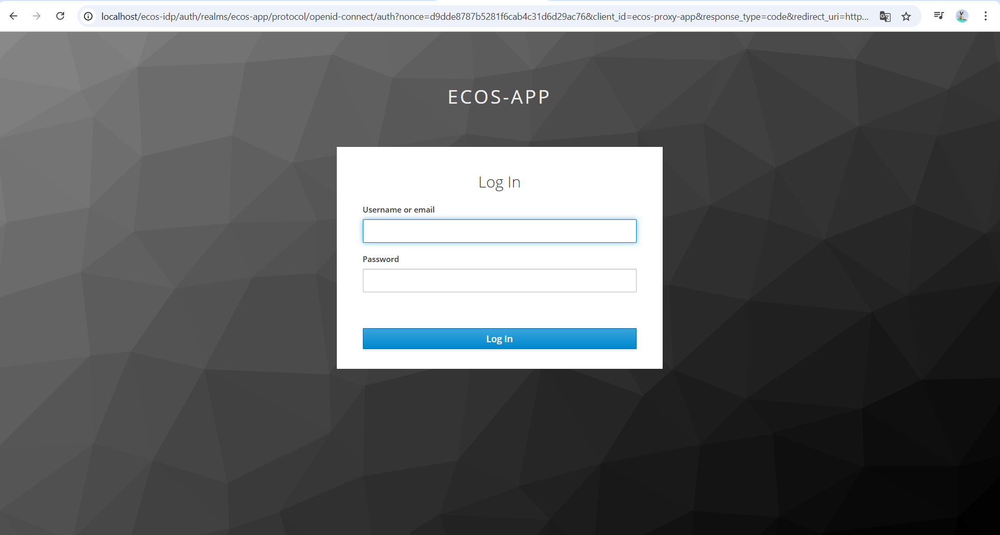
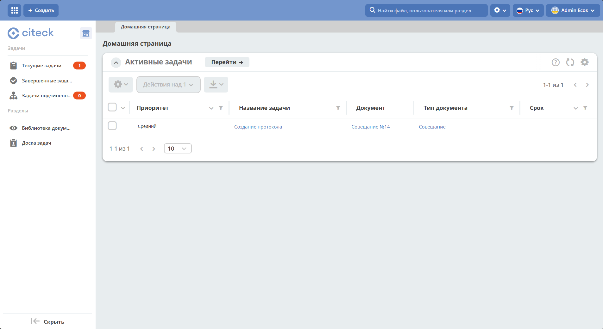

.. _virtualbox:

Развертывание виртуальной машины с Citeck в VirtualBOX 
=========================================================

.. contents::
    :depth: 3

.. important:: 

    Комплект поставляется с предзаполненными :ref:`демонстрационными данными<ecos_modules>`. 

Требования
------------

    -	процессор, поддерживающий виртуализацию: если опция отключена в BIOS, то система виртуализации сможет работать лишь с 32-разрядными машинами, для работы Citeck Community необходима поддержка 64-х разрядных систем;
    -   минимально 16 ГБ оперативной памяти;
    -	установочный образ `Citeck community <https://storage.yandexcloud.net/ecos-community-vm/ecos-community-vm.ova>`_;
    -	установленная система виртуализации `Virtualbox 7.x <https://www.virtualbox.org/wiki/Downloads>`_;

Как смонтировать образ
-----------------------

**Шаг 1:** Запустите Oracle VM VirtualBox Менеджер. Перейдите в **Файл - Импорт конфигураций**:

.. image:: _static/vm/01.png
    :width: 500
    :align: center

**Шаг 2:** 2.	В открывшемся окне укажите путь, к скачанному файлу виртуальной машины:

.. image:: _static/vm/02.png
    :width: 500
    :align: center

**Шаг 3:** Нажмите **«Далее»**, выберите параметры машины (доступ к звуку и т.д) и нажмите **«Готово»**.

.. note:: 

    ОЗУ по умолчанию указано 16 Гб. Можно уменьшить до 12 Гб.
    
    НЕ рекомендуется хранить машину на системном диске (disk C).

.. list-table::
      :widths: 30 30
      :align: center

      * - |

            .. image:: _static/vm/03.png
                  :width: 600
                  :align: center

        - |

            .. image:: _static/vm/04.png
                  :width: 600
                  :align: center

Запуск виртуальной машины и сервисов
-------------------------------------

**Шаг 4:** Запустите VM: 

.. image:: _static/vm/05.png
    :width: 500
    :align: center

Загрузка машины может занять несколько минут.

.. image:: _static/vm/06.png
    :width: 500
    :align: center

После завершения процесса загрузки необходимо авторизоваться в консоли: 

.. code-block::

    login: ecos
    password: ecos

.. image:: _static/vm/07.png
    :width: 500
    :align: center

**Шаг 5:** Выполните команду запуска сервисов:

.. code-block::

    ecos-community_start

Пример развертывания:

.. list-table::
      :widths: 30 30
      :align: center

      * - |

            .. image:: _static/vm/08.png
                  :width: 500
                  :align: center

        - |

            .. image:: _static/vm/09.png
                  :width: 500
                  :align: center

Подождите некоторое время (в зависимости от мощности системы) для того, чтобы система запустилась.

Авторизация в Citeck
----------------------

**Шаг 6:** Перейдите в браузере по адресу `http://localhost <http://localhost>`_ 

**Шаг 7:** Войдите в систему, используя следующие учётные данные:

.. code-block::

    Username: admin
    Password: admin

При первом развертывании keycloak попросит сменить пароль:

.. image:: _static/vm/11.png
    :width: 300
    :align: center

Далее станет доступна страница :ref:`персонального рабочего пространства<ws_personal>`:

В левом верхнем углу доступна кнопка для выбора доступных рабочих пространств и создания нового:

    .. image:: _static/vm/12_1.png
        :width: 450
        :align: center

Подробно о: 

    * :ref:`рабочих пространствах<workspaces>`; 
    * :ref:`корпоративном портале<corp_portal>`;
    * :ref:`разделе администратора<admin>`.

.. note:: 

    При первом запуске в течение первых 5 минут после успешной установки и входа в систему может возникать ошибка:

    .. image:: _static/vm/13.png
        :width: 300
        :align: center

    Развертывание и запуск Citeck продолжается, необходимо подождать.