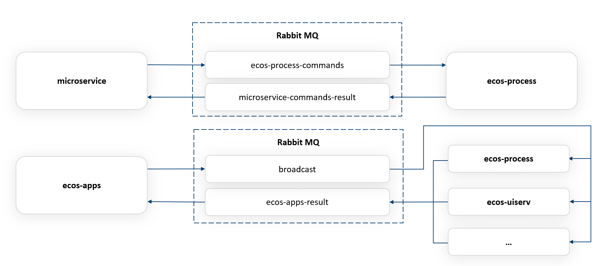
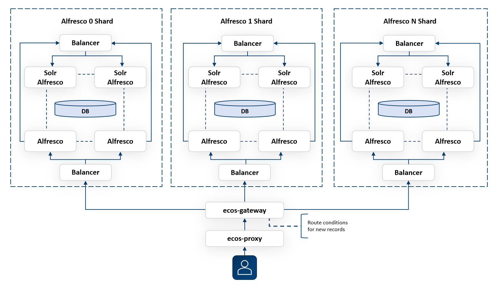

Базовая архитектура
====================

.. contents::
   :depth: 3

Система Citeck построена на основе микросервисной событийно-ориентированной архитектуры. В качестве основного способа взаимодействия микросервисов используется обмен сообщениями через очередь
сообщений (MQ).

Платформа поддерживает работу с различными источниками данных без необходимости копирования данных во внутренний репозиторий. Для работы с данными используется собственный язык запросов Records API. Перечень источников данных может быть легко расширен.

Компоненты системы:

* **DAO services** – сервисы работы с контентом и метаданными. В качестве источников данных могут использоваться Alfresco Content Service, Базы данных, 1С, SAP и другие;
* **Process services** – сервисы управления бизнес-процессами, поддерживаются нотации моделирования бизнес-процессов BPMN и CMMN;
* **Application services** – сервисы управления приложениями Citeck, их версионностью и деплойментом;
* **Data services** – сервисы работы с данными, в том числе валидации данных и их индексации;
* **Integration services** – интеграционные сервисы, включая ЮЗДО;
* **API gateway** – API шлюз, используется в том числе для запросов от пользовательского интерфейса (WEB и мобильного);
* **Business logic services** – сервисы бизнес-логики и конфигурации.

Интерфейс системы разработан на базе фреймворка **ReactJS** в виде статичных **JS библиотек**, которые раздаются через NGINX и работают под управлением веб-браузеров на пользовательских устройствах. 

Мобильный интерфейс разработан на базе фреймворка **React Native**, также поддерживается адаптивная верстка для мобильных браузеров. 

Запросы от пользовательских интерфейсов маршрутизируются через **NGINX** и **API шлюз**.

ПО Citeck развертывается с использование сервисов контейнеризации **Docker / Kubernetes**.

 .. image:: _static/base/Arch_1.png
       :width: 700
       :align: center

Микросервисы
--------------

 .. image:: _static/base/Arch_2.png
       :width: 700
       :align: center

|

 .. image:: _static/base/Arch_2_1.png
       :width: 500
       :align: center

.. list-table::
      :widths: 10 30
      :header-rows: 1
      :class: tight-table 
      
      * - Компонент
        - Описание
      * - **ecos-proxy**
        - Контейнер с nginx (openresty) и UI статикой (js + css).
      * - **ecos-registry**
        - Реестр приложений и сервер Spring Cloud конфигурации.
      * - **ecos-gateway**
        - Микросервис реализует API шлюз взаимодействия от клиента к серверу.
      * - **ecos-apps**
        - Микросервис приложений Citeck, отвечающий за доставку приложений Citeck к целевым сервисам.
      * - **ecos-notifications**
        - Микросервис отправки уведомлений (email, push-нотификации и др.).
      * - **ecos-model**
        - Микросервис моделей. Отвечает за информацию о типах, шаблонах нумерации и о матрицах прав.
      * - **ecos-history**
        - Микросервис для хранения истории. Подписан на события в системе и сохраняет информацию о них в БД.
      * - **ecos-process**
        - Микросервис для управления BPMN процессами.
      * - **ecos-eis**
        - Приложение Keycloak для аутентификации в системе.
      * - **alfresco**
        - Open-source ECM система, которая может использоваться для хранения контента и метаданных документов в системе (один из вариантов реализации).
      * - **solr**
        - Система индексации метаданных и контента документов.
      * - **ecos-uiserv**
        - Микросервис UI конфигураций. Отвечает за формы, журналы, UI действия, темы, дашборды, локализацию, иконки, конфигурацию меню.
      * - **ecos-integrations**
        - Микросервис для интеграции с внешними системами (SAP, 1C, Rabbit MQ и тд.).
      * - **ecos-transformations**
        - Микросервис для преобразования (трансформации) контента.
      * - **ecos-content**
        - Микросервис для обеспечения хранения файлов в системе в определенное файловое хранилище. 
      * - **zookeeper**
        - Распределенное key-value хранилище для координации приложений Citeck между собой.
      * - **Rabbit MQ**
        - Приложение для обмена сообщениями между микросервисами.

Хранение данных
-----------------

1. Основная используемая реляционная база данных – **PostgreSQL**.

2. Хранение метаданных поддерживается в любой системе через адаптер (record source). Существующие адаптеры: **PostgreSQL, Oracle DB, MS SQL, Mongo DB, Alfresco ECM, SAP HANA.**

3. Для хранения документов может быть использована БД **PostgreSQL, Alfresco ECM, S3** -совместимое хранилище или внешняя ECM система через адаптер (например, разработан адаптер к системе OpenText).

4. Помимо баз данных используется также прямая запись в файловую систему для приложений **Alfresco (Content Store), Zookeeper, Rabbit MQ и Solr**.

Зависимости компонентов
------------------------

 .. image:: _static/base/Arch_3.png
       :width: 700
       :align: center

1. Центральной частью системы Citeck является абстракция **<DATA SOURCE>**, в качестве которого может выступать любой источник данных в любом из микросервисов Citeck. 
   
   Для добавления новых источников достаточно реализовать определенный интерфейс и данные из этого источника могут быть свободно интегрированы со всей экосистемой Citeck (их можно отображать в журнале, редактировать и просматривать через формы, отправлять по ним уведомления, запускать по ним процессы и т. д.).

  Любой **<DATA SOURCE>** в общем случае может общаться со следующими сервисами:

   - **ecos-model** для автонумерации, делегирования полномочий и получения индивидуальных настроек прав;
   - **ecos-content** для работы с контентом; 
   - **zookeeper** для работы с реестрами артефактов.

   Общение с источниками данных построено на базе универсального :ref:`Records API<Records_API>`. Зависимости от **<DATA SOURCE>** по микросервисам:

   - **ecos-uiserv** загружает атрибуты для фильтрации UI действий по заданным в конфигурации условиям;
   - **ecos-notifications** загружает атрибуты для заполнения шаблона уведомления;
   - **ecos-history** загружает атрибуты для сохранения записи в истории;
   - **ecos-process** загружает и меняет атрибуты в ходе выполнения BPMN процессов.

2. Почти все микросервисы работают с **Rabbit MQ** (события и команды) и с **Zookeeper** (события, конфигурация Citeck, реестры типов, аспектов, настроек прав, 
шаблонов нумерации, распределенные блокировки, внешние миксины);

3. **UI** (мобильный и браузерный) зависят от **ecos-gateway** (шлюз для доступа в систему) и от **ecos-uiserv** (микросервис с UI конфигурациями);
   
4. **ecos-gateway** зависит от **ecos-model** для получения информации по пользователям и группах, в которых они состоят. Эта информация используется для формирования JWT-токена с последующей отправкой его в остальные микросервисы для аутентификации и авторизации;

5. **ecos-integrations** зависит от внешних систем, с которыми настроена интеграция.
   
6. **ecos-content** зависит от места хранения контента (Alfresco или S3).
   
7.  **Solr** зависит от источников данных для индексации контента и атрибутов.

Взаимодействие клиента с сервером
-----------------------------------

 .. image:: _static/base/Arch_4.png
       :width: 700
       :align: center

При первом поступлении запроса от клиента **nginx** видит, что пользователь не имеет токена и отправляет его на **Keycloak** для аутентификации через протокол **OpenID Connect**.

**Keycloak** может предложить окно ввода логина/пароля или сразу выдать пользователю токен, с помощью которого он сможет зайти в систему (SSO).
После успешной аутентификации пользователь перенаправляется на страницу, с которой его отправили в keycloak.

После того, как запрос прошел дальше, **ecos-gateway** смотрит на URL запроса и по нему решает, какой именно микросервис должен его обработать (например, запрос **/emodel/api/records/query** должен уйти в **ecos-model**). 

Для получения IP адреса и порта целевого микросервиса **ecos-gateway** обращается в **ecos-registry** за нужной информацией и, получив её, отправляет запрос дальше.

Records API
-------------

**Общее описание**

API, разработанное для организации простого и легко масштабируемого общения между потребителем информации и источником данных. Язык запросов :ref:`Records API<Records_API>` объединяет в себе удобство обычных REST запросов в классическом REST API и оптимизированный и типизированный подход GraphQL, когда сервер отдает только те данные, которые нужны клиенту с предсказуемой типизацией.

**Плюсы решения**

1. Единый API для доступа к данным в системе для всех потребителей (Браузер, Мобильное приложение, Система построения отчетов, Индексирование данных, Различные микросервисы, Интеграция и т.д.).

2. Поддержка загрузки данных из связанных сущностей. Например, если у нас договор ссылается на доверенность, то, имея идентификатор договора, мы можем получить любой атрибут связанной доверенности.

3. Оптимальность. Загружаются и вычисляются только те атрибуты, которые нужны потребителю.

4. Простота в разработке — разработчик источника данных (record source) описывает все атрибуты, которые могут запросить потребители вне зависимости от сложности их вычисления. Потребитель в запросе указывает только те атрибуты, в которых он заинтересован.

5. Простота поддержки — не требуется версионирование API, т.к. мы в любой момент можем добавлять новые атрибуты, не трогая старые.

6. Тип получаемых данных полностью описывается запросом. Из источника данных мы возвращаем атрибуты с любым типом, а Records API приводит их к нужному для потребителя.

7. Вычисляемые атрибуты. Возможность добавлять атрибуты, которые не хранятся в БД или любом другом хранилище, а вычисляются на основе существующих.

8. Поддержка объединения атрибутов из разных источников. Например, можно написать источник данных, который часть атрибутов будет брать из alfresco, а часть из внешней БД, объединяя их по идентификатору.

События
----------

 .. image:: _static/base/events_1.png
       :width: 700
       :align: center

**События** в Citeck позволяют менять атрибутивный состав, который нужен подписчику на событие, без модификации источника событий. При старте системы все подписчики регистрируют в Zookeeper список необходимых им событий по типам и атрибуты события, в которых они заинтересованы. 

Приложение, которое может отправлять события подобного типа, видит, что в системе есть подписчики на эти события, и, при их возникновении, подготовив необходимый список атрибутов, отправляет их в Rabbit MQ.

Атрибуты описываются в формате :ref:`Records API<Records_API>` и могут пользоваться всеми преимуществами данного API.

Система событий в Citeck гарантирует доставку как минимум одного сообщения вне зависимости от сбоев в системе.

 .. image:: _static/base/events_2.png
       :width: 700
       :align: center

Команды
--------

**Команда** — декларативное описание действия, которое нужно сделать на удаленном сервисе или локально.

Пример команды для завершения задачи в ecos-process:

.. code-block::

  {
      "id": "123e4567-e89b-12d3-a456-426655448474",
      "time": "2019-01-01T01:01:01.952Z",
      "target": "eproc",
      "actor": "system",
      "source": "alfresco:a8aae115-e2c5-418c-a261-61ed4ce94ba8",
      "type": "activity.complete",
      "config": {
          "activityId": "2143",
          "processId": "cmmn$c7a57bf4-43b8-4c78-a154-7551aac0152d",
          "attributes": {
              "outcome": "Done"
          }
      }
  }

Команды в Citeck в качестве транспорта используют очереди RabbitMQ. Использование команд возможно как в синхронном, так и в асинхронном режиме.

Целью команд могут быть:

1. Тип сервиса (ecos-process, ecos-uiserv, alfresco и др.). Команду исполняет один из инстансов данного сервиса.

2. Инстанс сервиса (у каждого типа сервиса может быть много инстансов).

3. Все типы сервисов (широковещательные команды). Сервис-источник команды отправляет широковещательную команду в RabbitMQ и её обрабатывают все сервисы, которые в данный момент активны.

Приложения
------------

:ref:`Приложения Citeck<applications>` позволяют выгружать из системы нужные артефакты в формате **zip** и деплоить их «на горячую» в другую систему.

:ref:`Артефакт<ecos_artifacts>` – единица расширения в Citeck. Артефактами являются формы, журналы, типы, матрицы прав, действия, описания процессов и многие другие сущности в системе.

Микросервис **ecos-apps** управляет артефактами, ведя их версионность и доставляя их до целевого микросервиса. Контент артефактов в системе неизменяемый и при любом изменении артефакта всегда создается новая версия, а старая сохраняется в списке версий.

 .. image:: _static/base/Apps_1.png
       :width: 700
       :align: center

**Доставка артефактов** при старте системы происходит в 3 этапа:

    1. Микросервис **ecos-apps**, увидив новый микросервис в сети, загружает из него список типов, в которых он заинтересован. 

    2. Получив типы, **ecos-apps** рассылает на все остальные микросервисы запрос на получение артефактов с данными типами.

    3. Получив нужные артефакты со всех микросервисов, **ecos-apps** проверяет, изменился ли их контент с прошлого деплоя. Если изменений нет, то алгоритм заканчивает свою работу. Если изменения есть, то происходит деплой новых данных в целевой микросервис.

**Пример артефакта. Журнал форм**

 .. image:: _static/base/Apps_2.png
       :width: 400
       :align: center

Описание архитектуры событийно-ориентированного сервиса и бизнес-процессов
-----------------------------------------------------------------------------

Предъявляемые требования:

- **Отказоустойчивость**. При выходе из строя любого узла системы работоспособность должна сохраняться.
- **Сохранность данных**. При полной или частичной потере данных на одном из узлов хранилища данные в системе не должны быть потеряны.
- **Горизонтальное масштабирование**. При росте количества процессов должна быть возможность горизонтального расширения за счет увеличения количества узлов в кластере, чтобы избежать деградации времени выполнения запросов с увеличением времени жизни системы.Старые процессы, которые уже давно завершились, не должны оказывать негативное влияние на активные.

ECOS Process
~~~~~~~~~~~~~

В качестве BPM-движка для бизнес-процессов в **ecos-process** интегрировано популярное open-source решение **Camunda**. 

В качестве редактора для создания и редактирования процессов мы разработали свой :ref:`low-code BPMN редактор<ecos-bpmn_platform>` на основе библиотеки bpmn-js, добавив туда тесную интеграцию с экосистемой ECOS (роли, формы, статусы и др). Для разработки стандартных процессов не требуется участие программистов.

 .. image:: _static/base/process_1.png
       :width: 500
       :align: center

Таймеры
~~~~~~~~~

Таймеры в ecos-process позволяют отложить выполнение любых действий во времени.

1. Любой микросервис в системе отправляет в ecos-process команду **«Создать таймер»**, указав время срабатывания таймера и команду, которая должна при этом выполниться.

2. Когда наступает время срабатывания таймера микросервис ecos-process отправляет зарегистрированную в п.1 **команду на целевой сервис**. Целью команды может быть любой микросервис или alfresco.

Примеры команд: «Отправить email», «Выполнить скрипт», «Завершить этап/задачу в процессе» и др.

Шардинг документов
-------------------

**Шардинг** — стратегия масштабирования приложений. В рамках шардинга информация делится на блоки и распределяется по разным серверам, которые и называются шардами.

Базовые принципы, которые позволяют реализовывать гибкую систему шардинга в Citeck:

   1. У каждого приложения в системе Citeck есть свой **уникальный идентификатор** (uiserv, integrations, emodel, notifications, alfresco и др.)

   2. У каждой сущности в системе в идентификаторе содержится **ID приложения**, из которого следует загружать данные:

    Здесь, emodel/person@admin

      - **emodel** — ID приложения, 
      - **person** — ID источника данных в пределах приложения,
      - **admin** — ID сущности в пределах источника данных.

   3. При поиске мы всегда указываем источник данных, в котором следует искать записи:

    .. image:: _static/base/sharding_1.png
          :width: 300
          :align: center

   4. Все запросы идут через Citeck Gateway, который отвечает за управление потоками данных.

Описание базовых операций при работе с шардами
~~~~~~~~~~~~~~~~~~~~~~~~~~~~~~~~~~~~~~~~~~~~~~~

**Создание записи**

1. Пользователь нажимает кнопку **«Создать»**, заполняет атрибуты документа и отправляет результат на сервер.

2. Данные с формы принимает **ecos-gateway** и на основе правил, которые настроил администратор, выбирает **id приложения**, которому нужно делегировать запрос создания.

3. После того, как целевой сервис успешно выполнил операцию, **ecos-gateway** возвращает клиенту **ID новой сущности**, в котором содержится **ID приложения**, которое было выбрано согласно правилам в п.2. Пример:

  alfresco2/nodes@workspace://SpacesStore/123e4567-e89b-12d3-a456-426655440000

**Поиск записей**

1. Получив запрос на поиск данных в системе, **ecos-gateway** на основе располагаемых данных отправляет N запросов на поиск по разным шардам.

2. Получив результаты запросов, **ecos-gateway** объединяет их результаты и отдает получившийся список клиенту.

Возможный вид списка сущностей, которые вернутся в результате поискового запроса:

.. code-block::

  alfresco1/nodes@workspace://SpacesStore/2650bee2-43e9-4768-8e99-e1f86cb56151
  alfresco1/nodes@workspace://SpacesStore/84e5ead8-f26f-48ed-ab7e-34f7d52db6e2
  ...
  alfresco2/nodes@workspace://SpacesStore/2ceb8a4f-583a-458e-a94e-e17ae003ca3c
  alfresco2/nodes@workspace://SpacesStore/cb31f7ae-c27f-42f5-8887-81f337663686
  ...

Кластеризация
--------------

**Кластеризация** — разворачивание нескольких инстансов приложения для обработки большой нагрузки и повышения отказоустойчивости системы. 

Особенности:

    1. Логически система работает одинаково вне зависимости от количества инстансов приложения.

    2. Инстансы приложения в кластере как правило работают с одними и теми же хранилищами данных (БД, файловая система).

    3. Кластеризация нужна для отказоустойчивости и распределения нагрузки по CPU, RAM и сети.

Кластеризация микросервисов в системе Citeck
~~~~~~~~~~~~~~~~~~~~~~~~~~~~~~~~~~~~~~~~~~~~~

 .. image:: _static/base/cluster_1.png
       :width: 400
       :align: center

1. Для разворачивания кластера микросервисов мы просто поднимаем несколько инстансов приложения.

2. При старте все приложения регистрируются в  **ecos-registry**, указывая при этом свой **IP, HOST** и **PORT**.

3. Балансировкой нагрузки занимается **ecos-gateway**. Когда приходит запрос от пользователя за некоторым ресурсом, **ecos-gateway** по информации в **ecos-registry** определяет список инстансов нужного приложения. После этого запрос уходит на один из инстансов по алгоритму **round-robin**.

4. **ecos-registry** регулярно проверяет приложения (**health-check**). Если приложение перестало отвечать, то запросы на него отправляться не будут. 
