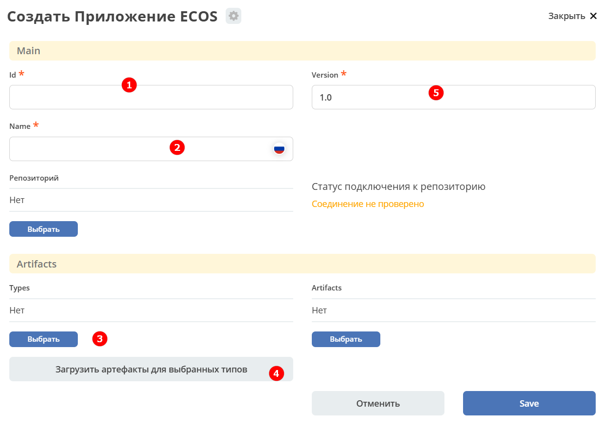
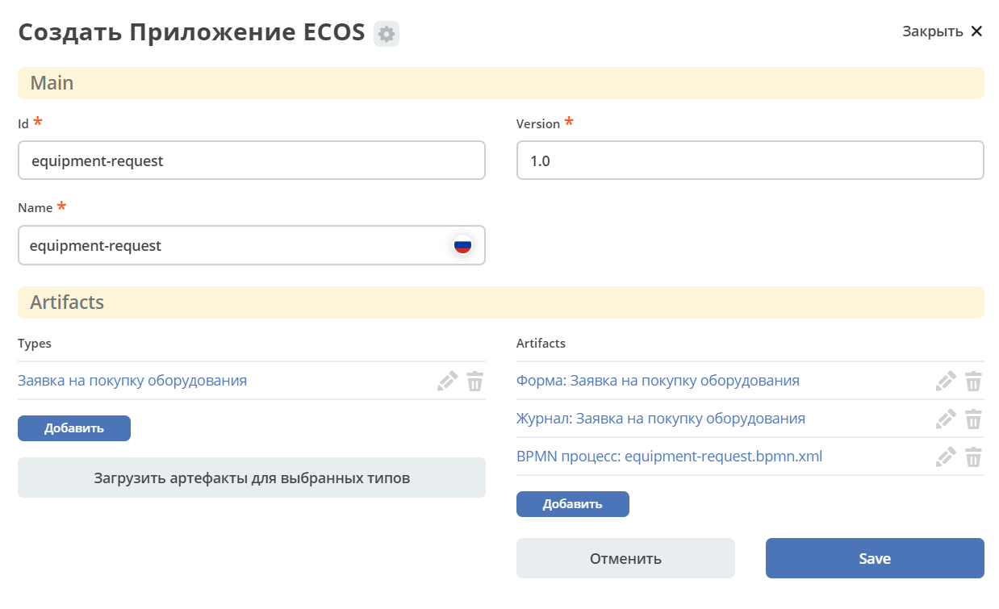

.. _app_example:

Упаковка приложения
======================

Созданные артефакты можно упаковать в виде приложения, чтобы, например, поместить в систему контроля версий или перенести на другой стенд.

**Приложение** представляет собой zip-архив, который содержит в себе артефакты (типы данных, формы, журналы, бизнес-процесс).

Для создания приложения перейдите в рабочее пространство администратора, в разделе **Управление системой** выберите пункт **Приложения ECOS**:

.. image:: _static/app/App_1.png
   :width: 700
   :align: center

Нажмите **+ - Создать приложение**:

.. image:: _static/app/App_2.png
   :width: 500
   :align: center

|

Укажите **Id (1), Имя (2)**, выберите все созданные **типы данных** :ref:`для процесса "Заявка на закупку оборудования"<sample_request>`.

Для автоматической загрузки артефактов нажмите **«Загрузить артефакты для выбранных типов» (4)**.

Полученный список артефактов можно дополнить, нажав **«Добавить»**.

Нажмите **Сохранить**.

Для скачивания архива с приложением нажмите кнопку скачивания напротив нужного приложения:

Для загрузки приложения на другом стенде нажмите **Загрузить**:

.. image:: _static/app/App_6.png
   :width: 500
   :align: center

Подробнее см. :ref:`Citeck Приложения<applications>` и :ref:`Быстрая разработка<fast_develop>`
