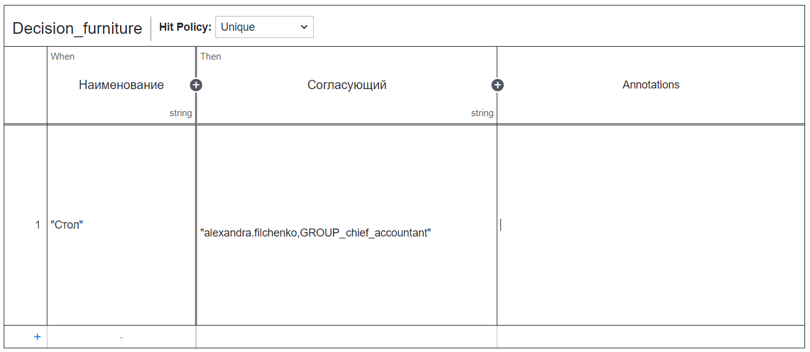
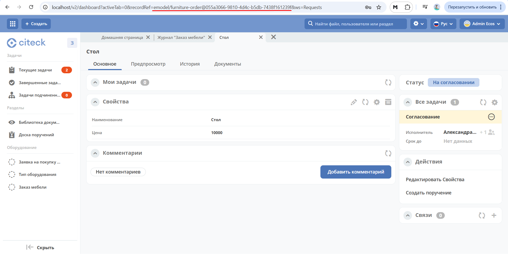

Пример использования динамической роли DMN в бизнеc-процессе
=================================================================

.. _dynamic_role_dmn:

.. contents::
		   :depth: 3

.. note:: 

  В статье указаны произвольные пользователи и группы.

  Добавьте пользователей, как описано в статье :ref:`Создание пользователей для ecos-community-demo<demo_user>`

  Добавьте группы, как описано в :ref:`Создание группы<new_group>`

Создадим простой бизнес-процесс для проверки назначения динамической роли с использованием таблицы DMN при согласовании закупки мебели.

В зависимости от условий закупки прописанных в таблице DMN, роль согласующего будет вычисляться автоматически.

Для этого:

        1.	Создаем таблицу принятия решения (DMN)
        2.	Создаем Тип данных, указываем в нем динамическую роль DMN
        3.	Создаем простой бизнес-процесс
        4.	Создаем Заказ мебели и проверяем назначенного в бизнес-процессе согласующего

Таблица DMN
-------------

Для таблицы требуется определить критерии, по которым будет приниматься решение. 

Основные критерии - наименование мебели и согласующий.

Для создания таблицы принятия решений перейдите левом меню в пункт **«Моделирование – Методы принятия решения»**:

 .. image:: _static/dmn_dynamic_role/01.png
       :width: 600
       :align: center

Далее создайте DMN модель:

 .. image:: _static/dmn_dynamic_role/02.png
       :width: 600
       :align: center

|

 .. image:: _static/dmn_dynamic_role/03.png
       :width: 500
       :align: center

Заполните поля:

.. list-table:: 
      :widths: 10 20 30
      :align: center
      :class: tight-table 

      * - **1**
        - Идентификатор
        - approve-furniture
      * - **2**
        - Имя
        - Согласование заявки мебель

Нажмите **«Сохранить»**.

Для перехода к редактору разверните раздел **«По умолчанию»**, наведите курсор на созданную модель и нажмите:

 .. image:: _static/dmn_dynamic_role/04.png
       :width: 600
       :align: center

Откроется решение:

 .. image:: _static/dmn_dynamic_role/05.png
       :width: 600
       :align: center

В правой части в модели необходимо определить входные данные для вычисления роли на основе DMN.

По **ключу модели** будут доступны вычисленные данные в контексте DMN.  

 .. image:: _static/dmn_dynamic_role/06.png
       :width: 300
       :align: center

Зададим сопоставление ключ и значение:

.. list-table:: 
      :widths: 5 5 10
      :align: center
      :class: tight-table 

      * - **Ключ**
        - name
        - входной элемент для решения, который далее необходимо указать в **expression**. 
      * - **Значение**
        - name
        - атрибут типа данных. То самое условие, по которому будет вычисляться роль.

.. note:: 

    Ключ-значений (условий) может быть несколько, а для каждого условия будет вычисляться необходимая роль.

Для ввода данных в таблицу кликните:

 .. image:: _static/dmn_dynamic_role/07.png
       :width: 200
       :align: center

|

 .. image:: _static/dmn_dynamic_role/08.png
       :width: 500
       :align: center

Двойным кликом по наименованию решения **(1)** перейдите в режим редактирования и назовите решение **Decision_furniture**.

**Hit policy (2)** -  :ref:`политика выбора<dmn_hit_policy>` Определим ее как **Unique** (по умолчанию).

**(3)** – входные элементы, **(4)** – выходные элементы.

Совокупность входных элементов и выходного формируют решение.

Входные элементы 
~~~~~~~~~~~~~~~~~

Для установки наименования входного элемента, дважды кликните поле под **When** и введите **«Наименование»**:

 .. image:: _static/dmn_dynamic_role/09.png
       :width: 500
       :align: center

В свойствах укажите:

.. list-table:: 
      :widths: 10 20 30
      :header-rows: 1
      :align: center
      :class: tight-table 

      * - Поле
        - Значение
        - Пояснение
      * - Expression
        - name
        - Ключ из модели
      * - Type
        - string
        - Соответствует типу атрибута name из типа данных

Выходной элемент
~~~~~~~~~~~~~~~~~

Наименование выходного элемента, дважды кликните поле под **Then** и введите **«Согласующий»**:

 .. image:: _static/dmn_dynamic_role/10.png
       :width: 500
       :align: center

В свойствах укажите:

.. list-table:: 
      :widths: 10 20 30
      :header-rows: 1
      :align: center
      :class: tight-table 

      * - Поле
        - Значение
        - Пояснение
      * - Type
        - string
        - Чтобы решение DMN вернуло String с именами реципиентов.

Правила
~~~~~~~~~

Выберем 3 наименования мебели. Укажем для каждого наименования соответствующего согласующего.

.. note:: 

  Системное имя пользователя можно получить в Оргструктуре, открыв профиль пользователя:

    .. image:: _static/dmn_dynamic_role/org_1.png
       :width: 600
       :align: center

  Группы:

    .. image:: _static/dmn_dynamic_role/org_2.png
       :width: 500
       :align: center  

    |

    .. image:: _static/dmn_dynamic_role/org_3.png
       :width: 500
       :align: center

Добавьте первое правило, указывающее, что для наименования **«Стол»** — согласующий с системным именем **«elvira.danilenko»** и группа **«GROUP_company_chief_accountant»**.

.. note:: 

    Если указывать группу, то перед именем группы необходимо добавить ``GROUP_``

    **Наименование** и **Согласующий** типа **string**, поэтому элементы обязательно указывать в **кавычках**.

    Несколько значений добавляется через запятую без пробелов в одних кавычках.

Нажмите кнопку 88 внизу таблицы или просто нажмите в любом месте последней строки.

Добавьте второе правило, указывающее, что для наименования **«Шкаф»** — согласующий с логином **«elvira.danilenko»**.

 .. image:: _static/dmn_dynamic_role/12.png
       :width: 500
       :align: center

Финальная таблица:

.. list-table:: 
      :widths: 20 30
      :header-rows: 1
      :align: center
      :class: tight-table 

      * - Наименование
        - Согласующий

      * - |

          .. code-block::

            "Стол"

        - |

          .. code-block::

            "alexandra.filchenko,GROUP_company_chief_accountant"

      * - |

          .. code-block::

            "Шкаф"

        - |

          .. code-block::

            "elvira.danilenko"

      * - |

          .. code-block::

            "Стул"

        - |

          .. code-block::

            "alexandra.filchenko"

Решение DMN должно вернуть **String** с именами реципиентов.

Теперь таблицу принятия решения можно сохранить и опубликовать, нажав:

 .. image:: _static/dmn_dynamic_role/13.png
       :width: 600
       :align: center

Тип данных
-------------

Создаем тип данных. Аналогично как в разделе :ref:`Процесс запроса на закупку оборудования<sample_request>`

Сразу приведем примеры заполненных вкладок:

Вкладка «Основные»
~~~~~~~~~~~~~~~~~~~

 .. image:: _static/dmn_dynamic_role/14.png
       :width: 600
       :align: center

.. list-table:: 
      :widths: 10 20 30
      :align: center
      :class: tight-table 

      * - **1**
        - id
        - furniture-order
      * - **2**
        - Имя
        - Заказ мебели
      * - **3**
        - Родитель
        - Кейс
      * - **4**
        - Форма
        - Оставить по умолчанию (система автоматически сгенерирует форму по тем атрибутам, которые мы укажем далее, но автоматически сгенерированные формы нельзя редактировать)
      * - **5**
        - Журнал
        - Оставить по умолчанию (система автоматически сгенерирует журнал по тем атрибутам, которые мы укажем далее, но автоматически сгенерированные журналы нельзя редактировать)

Вкладка «Атрибуты»
~~~~~~~~~~~~~~~~~~~

 .. image:: _static/dmn_dynamic_role/15.png
       :width: 600
       :align: center

.. list-table:: 
      :widths: 10 20 30
      :header-rows: 1
      :align: center
      :class: tight-table 

      * - Id (1)
        - Имя (2)
        - Тип (3)
      * - name
        - Наименование
        - Text
      * - price
        - Цена
        - Number

Вкладка «Роли»
~~~~~~~~~~~~~~~

 .. image:: _static/dmn_dynamic_role/16.png
       :width: 600
       :align: center

.. list-table:: 
      :widths: 20 30
      :header-rows: 1
      :align: center
      :class: tight-table 

      * - Id (1)
        - Имя (2)
      * - approver
        - Согласующий

Назначим согласующему динамическую роль.  В форме выберите тип **DMN**, решение – **Decision_furniture**:

 .. image:: _static/dmn_dynamic_role/17.png
       :width: 400
       :align: center

Нажмите **Подтвердить**.

Вкладка «Статусы»
~~~~~~~~~~~~~~~~~~

 .. image:: _static/dmn_dynamic_role/18.png
       :width: 600
       :align: center

.. list-table:: 
      :widths: 10 20
      :header-rows: 1
      :align: center
      :class: tight-table 

      * - Id (1)
        - Имя (2)
      * - to_approve
        - На согласовании
      * - approve
        - Согласован
      * - reject
        - Отказано

Бизнес-процесс
---------------

Поскольку из прошлых примеров вы знаете, как создать процесс пошагово, какие элементы могут в нем быть, отобразим процесс и поэлементно его опишем. 

Подробно о :ref:`создании бизнес-процесса <bp_sample>`

Данные для создания процесса:

 .. image:: _static/dmn_dynamic_role/19.png
       :width: 500
       :align: center

.. list-table:: 
      :widths: 10 20 30
      :align: center
      :class: tight-table 

      * - **1**
        - Идентификатор
        - furniture-order-bpmn
      * - **2**
        - Имя
        - Заказ мебели
      * - **3**
        - Тип данных
        - Заказ мебели
      * - **4**
        - Включен
        - True. Отметка об активности процесса.
      * - **5**
        - Автоматический старт процесса. 
        - True, чтобы старт процесса осуществлялся автоматически. Подробно о :ref:`запуске процесса<new_bp_start>`

Рассмотрим поэлементно:

1. Установить статус
~~~~~~~~~~~~~~~~~~~~~~~~~

 .. image:: _static/dmn_dynamic_role/21.png
       :width: 200
       :align: center

.. list-table:: 
      :widths: 10 20 30
      :align: center
      :class: tight-table 

      * - **1**
        - **Имя**
        - На согласовании
      * - **2**
        - **Статус**
        - На согласовании

2. Пользовательская задача
~~~~~~~~~~~~~~~~~~~~~~~~~~~~~~

 .. image:: _static/dmn_dynamic_role/22.png
       :width: 300
       :align: center

.. list-table:: 
      :widths: 10 20 30
      :align: center
      :class: tight-table 

      * - **1**
        - **Имя**
        - Согласование
      * - **2**
        - **Реципиенты**
        - Согласующий
      * - **3**
        - **Приоритет**
        - Средний
      * - **5**
        - **Результаты задачи**
        - Средний

           * **approve** - согласовать
           * **reject** - отказать

3. Шлюз
~~~~~~~~

Простой эксклюзивный шлюз.

4. Установить статус
~~~~~~~~~~~~~~~~~~~~~~~~

 .. image:: _static/dmn_dynamic_role/24.png
       :width: 200
       :align: center

.. list-table:: 
      :widths: 10 20 30
      :align: center
      :class: tight-table 

      * - **1**
        - **Имя**
        - Согласован
      * - **2**
        - **Статус**
        - Согласован

5. Установить статус
~~~~~~~~~~~~~~~~~~~~~~~~

 .. image:: _static/dmn_dynamic_role/25.png
       :width: 200
       :align: center

.. list-table:: 
      :widths: 10 20 30
      :align: center
      :class: tight-table 

      * - **1**
        - **Имя**
        - Отказ
      * - **2**
        - **Статус**
        - Отказано

Поток А
~~~~~~~~~~~

 .. image:: _static/dmn_dynamic_role/26.png
       :width: 200
       :align: center

.. list-table:: 
      :widths: 10 20 30
      :align: center
      :class: tight-table 

      * - **1**
        - **Имя**
        - Согласован
      * - **2**
        - **Тип условия**
        - Исходящий
      * - **3**
        - **Исходящий**
        - Согласование – согласовать

Поток В
~~~~~~~~~~~

 .. image:: _static/dmn_dynamic_role/27.png
       :width: 200
       :align: center

.. list-table:: 
      :widths: 10 20 30
      :align: center
      :class: tight-table 

      * - **1**
        - **Имя**
        - Отказ
      * - **2**
        - **Тип условия**
        - Исходящий
      * - **3**
        - **Исходящий**
        - Согласование – отказать

6, 7 Конечное событие
~~~~~~~~~~~~~~~~~~~~~~

Конечное событие (заканчивающее бизнес-процесс).

Добавить журнал в меню
-----------------------

Добавьте в меню журнал **type$furniture-order**.

Подробно о :ref:`добавлении журнала<journal_to_menu>`

Проверка процесса
---------------------

Перейдите в журнал, создайте новый элемент, заполните карточку, нажмите **«Сохранить»**:

 .. image:: _static/dmn_dynamic_role/28.png
       :width: 500
       :align: center

Статус изменится на **«На согласовании»**. Исполнитель – Александра Фильченко (аккаунт **alexandra.filchenko**) и Главный бухгалтер (группа **company_chief_accountant**)

 .. image:: _static/dmn_dynamic_role/29.png
       :width: 600
       :align: center

Проверка прав через консоль браузера
---------------------------------------

Назначенную роль можно проверить через консоль браузера командой:
``await Citeck.Records.get('emodel/type-id@local-id').load('_roles.assigneesOf.approver[]?str', true)``

где 

  ``approver`` - id роли из типа данных

  ``emodel/type-id@local-id`` – можно взять из строки браузера:

Система выдаст кому назначена данная задача согласования.

.. image:: _static/dmn_dynamic_role/30.png
       :width: 500
       :align: center

