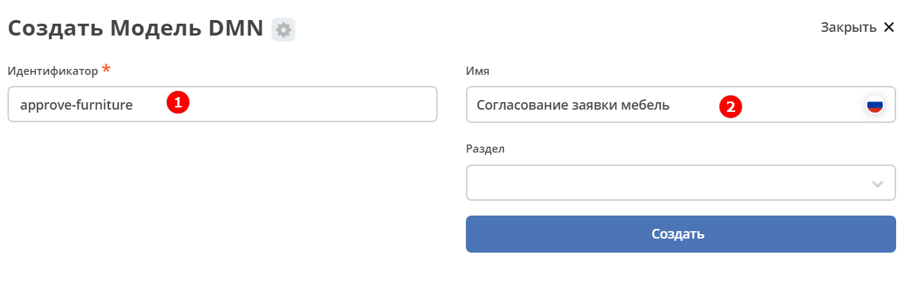
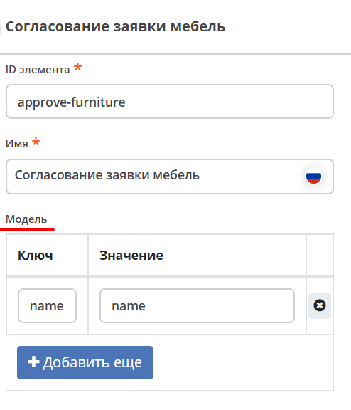
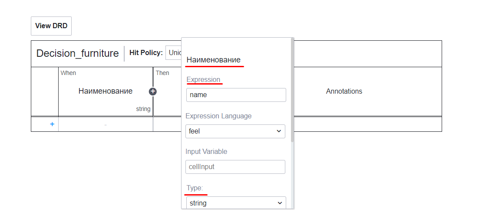
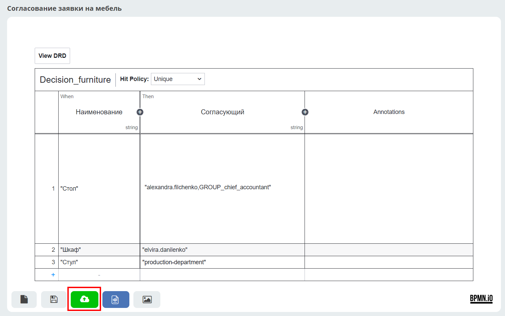
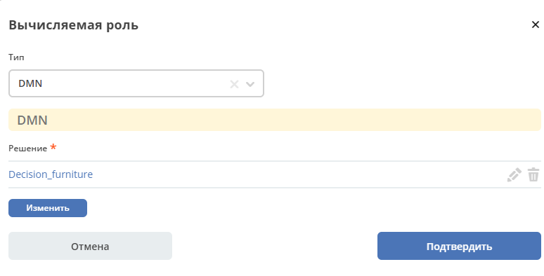
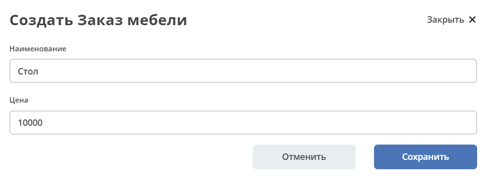
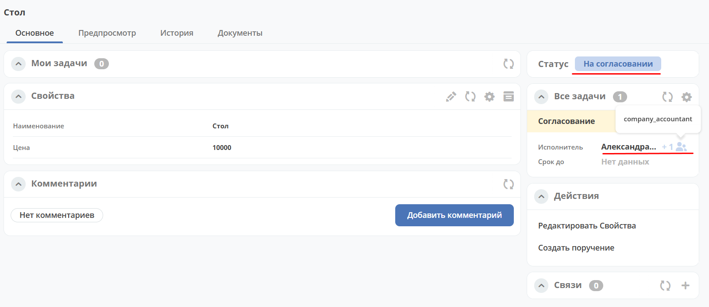

.. _dynamic_role_dmn:

Пример использования динамической роли DMN в бизнес-процессе
=================================================================

.. contents::
   :depth: 3

.. note::

   Данная статья является продолжением работы с бизнес-процессом :ref:`Заявка на закупку оборудования<sample_request>`.

   Если вы продолжаете по статье :ref:`Процесс заявки на закупку оборудования. Добавление справочника. Журнал и форма не по умолчанию<sample_request_complicated>`, удалите **Script task «Сохранение комментария»**.

   Используйте пользователей из набора демо-данных или добавьте их, как описано в статье :ref:`Создание пользователей для Citeck Community<demo_user>`.

   Используйте группы из набора демо-данных или добавьте их, как описано в :ref:`Создание группы<new_group>`.

В данном примере мы добавим динамическую роль с :ref:`использованием таблицы DMN<ecos-dmn>` при согласовании закупки оборудования. В зависимости от условий, прописанных в таблице DMN, роль согласующего будет вычисляться автоматически.

Для этого необходимо:

1. Создать таблицу принятия решений (DMN).
2. Добавить в тип данных динамическую роль DMN для согласующего.

Таблица DMN
------------

.. note::

   Для создания модели в локальном рабочем пространстве перейдите в раздел **Администрирование → Модели DMN** и нажмите **+ — Создать DMN модель**.

Для таблицы необходимо определить критерии, по которым будет приниматься решение. Основные критерии — наименование оборудования и согласующий.

Перейдите в рабочее пространство администратора. В разделе **Управление процессами** выберите пункт **Модели DMN**:

.. image:: _static/dmn_dynamic_role/01.png
   :width: 700
   :align: center

Нажмите **«+ — Создать DMN модель»**:

.. image:: _static/dmn_dynamic_role/02.png
   :width: 400
   :align: center

|

Заполните поля:

.. list-table::
   :widths: 10 20 30
   :align: center
   :class: tight-table

   * - **1**
     - Идентификатор
     - approve-equipment
   * - **2**
     - Имя
     - Согласование заявки на оборудование

Нажмите **«Сохранить»**.

Для перехода к редактору разверните раздел **«По умолчанию»**, наведите курсор на созданную модель и нажмите кнопку редактирования:

Откроется редактор решения:

В правой части модели необходимо определить входные данные для вычисления роли на основе DMN. По **ключу модели** будут доступны вычисленные данные в контексте DMN.

Задайте сопоставление ключа и значения:

.. list-table::
   :widths: 10 15 40
   :align: center
   :class: tight-table

   * - **Ключ**
     - name
     - Входной элемент для решения. Указывается далее в поле **Expression**.
   * - **Значение**
     - name
     - Атрибут типа данных — условие, по которому вычисляется роль.

.. note::

   Ключ-значений (условий) может быть несколько. Для каждого условия будет вычисляться соответствующая роль.

Для ввода данных в таблицу нажмите кнопку редактирования:

.. image:: _static/dmn_dynamic_role/07.png
   :width: 200
   :align: center

|

Двойным кликом по наименованию решения **(1)** перейдите в режим редактирования и задайте имя **Decision_furniture**.

**Hit policy (2)** — :ref:`политика выбора<dmn_hit_policy>`. Установите значение **Unique** (по умолчанию).

**(3)** — входные элементы, **(4)** — выходные элементы. Совокупность входных и выходного элементов формирует решение.

Входные элементы
~~~~~~~~~~~~~~~~~

Дважды кликните поле под **When** и введите наименование входного элемента — **«Наименование»**:

В свойствах укажите:

.. list-table::
   :widths: 15 20 40
   :header-rows: 1
   :align: center
   :class: tight-table

   * - Поле
     - Значение
     - Пояснение
   * - Expression
     - name
     - Ключ из модели
   * - Type
     - string
     - Соответствует типу атрибута ``name`` из типа данных

Выходной элемент
~~~~~~~~~~~~~~~~~

Дважды кликните поле под **Then** и введите наименование выходного элемента — **«Согласующий»**:

В свойствах укажите:

.. list-table::
   :widths: 15 20 40
   :header-rows: 1
   :align: center
   :class: tight-table

   * - Поле
     - Значение
     - Пояснение
   * - Type
     - string
     - Решение DMN вернёт строку (String) с именами реципиентов

Правила
~~~~~~~~

.. _rules_groupnames_dmn:

Добавьте три правила, сопоставляющие наименование оборудования с соответствующим согласующим.

.. note::

   Системное имя пользователя можно найти в Оргструктуре, открыв профиль пользователя:

   .. image:: _static/dmn_dynamic_role/org_1.png
      :width: 700
      :align: center

   Группы:

   .. image:: _static/dmn_dynamic_role/org_2.png
      :width: 400
      :align: center

   |

   .. image:: _static/dmn_dynamic_role/org_3.png
      :width: 500
      :align: center

.. note::

   - Если указывается группа, перед её именем необходимо добавить префикс ``GROUP_``.
   - Значения типа **string** (поля **Наименование** и **Согласующий**) обязательно заключаются в **кавычки**.
   - Несколько значений указываются через запятую без пробелов внутри одних кавычек.

Добавьте первое правило: для наименования **«Ноутбук»** — согласующий **«alexandra.filchenko»** и группа **«GROUP_company_chief_accountant»**:

.. image:: _static/dmn_dynamic_role/11.png
   :width: 600
   :align: center

Нажмите кнопку **+** внизу таблицы для добавления следующего правила.

Добавьте второе правило: для наименования **«Компьютер»** — согласующий **«elvira.danilenko»**:

Итоговая таблица правил:

.. list-table::
   :widths: 20 30
   :header-rows: 1
   :align: center
   :class: tight-table

   * - Наименование
     - Согласующий
   * - |

       .. code-block::

         "Ноутбук"

     - |

       .. code-block::

         "alexandra.filchenko,GROUP_company_accountant"

   * - |

       .. code-block::

         "Компьютер"

     - |

       .. code-block::

         "elvira.danilenko"

   * - |

       .. code-block::

         "Сервер"

     - |

       .. code-block::

         "GROUP_production_director"

Сохраните и опубликуйте таблицу принятия решений:

Тип данных
-----------

Во вкладке **«Роли»** созданного ранее типа данных назначьте согласующему динамическую роль:

В форме выберите тип **DMN** и решение — **Decision_furniture**:

Нажмите **«Подтвердить»**.

Проверка процесса
------------------

Перейдите в журнал, создайте новую заявку, заполните карточку и нажмите **«Сохранить»**:

На статусе **«На согласовании»** исполнителями назначены Александра Фильченко (аккаунт **alexandra.filchenko**) и Главный бухгалтер (группа **company_accountant**):

Проверка прав через консоль браузера
--------------------------------------

Назначенную роль можно проверить через консоль браузера командой:

.. code-block:: javascript

   await Records.get('emodel/type-id@local-id').load('_roles.assigneesOf.approver[]?str', true)

где:

- ``approver`` — id роли из типа данных;
- ``emodel/type-id@local-id`` — идентификатор записи из строки браузера:

.. image:: _static/dmn_dynamic_role/31.png
   :width: 700
   :align: center

Система выдаст список пользователей, которым назначена задача согласования:

.. image:: _static/dmn_dynamic_role/30.png
   :width: 600
   :align: center
