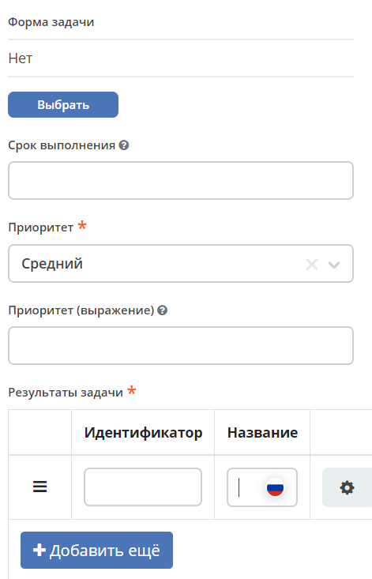

Процесс заявки на закупку оборудования
=======================================

.. _sample_request:

.. contents::
		:depth: 3

.. note::
  
  Порядок действий описан для пользователей, состоящих в группе **Администраторы ECOS** (ECOS_ADMINISTRATORS).

  Также менеджер рабочего пространства может создать тип данных и бизнес-процесс для использования внутри рабочего пространства. :ref:`См. подробно<ws_artifacts>`

Данная статья знакомит пользователей с основами Citeck на примере создания бизнес-процесса **«Заявка на закупку оборудования»**.

**Заявка на оборудование** – заявка, которая необходима для закупки оборудования для операционной деятельности сотрудников. Например, для подключения монитора к компьютеру сотруднику необходим специальный кабель, которого на данный момент нет в наличии. 

Обычно сотрудник обращается к своему руководителю с просьбой, чтобы для него (сотрудника) необходимое оборудование было приобретено, после успешного согласования с руководителем и в соответствии с внутренними правилами и распорядками происходит закупка. Согласующий также может отказать в покупке.

Далее мы пошагово реализуем описанный сценарий с использованием инструментов Citeck.

Для закупки оборудования нам потребуется следующая информация: 

    -	**Инициатор** – сотрудник, которому необходимо оборудование; 
    -	**Согласующий** – сотрудник, ответственный за согласование приобретаемого оборудования;
    -	**Название** – наименование приобретаемого оборудования; 
    -	**Стоимость** – стоимость оборудования.

До запуска самого бизнес-процесса необходимо создать ряд :ref:`артефактов<ecos_artifacts>` в следующем порядке:

    - :ref:`тип данных<data_types_main>`;
    - :ref:`журнал<journals>`;
    - :ref:`форма<forms>`;
    - :ref:`процесс<ecos_bpmn>`.

Тип данных
----------

.. _data_type_sample:

**Тип данных** - основной источник метаданных работы с объектом.

Для создания типа данных перейдите в рабочее пространство администратора:

  .. image:: _static/equipment_request/adm_ws.png
       :width: 800
       :align: center

в разделе **Модель** перейдите в пункт **Типы данных**:

  .. image:: _static/equipment_request/type_new_1.png
       :width: 800
       :align: center

нажмите **+ - Создать новый тип**:

  .. image:: _static/equipment_request/type_new_2.png
       :width: 600
       :align: center

Основное
~~~~~~~~

На вкладке расположены основные данные по типу данных (объекту):

.. list-table:: 
      :widths: 10 20 30
      :align: center
      :class: tight-table 

      * - **1**
        - id
        - equipment-request
      * - **2**
        - Имя
        - Заявка на покупку оборудования
      * - **3**
        - Родитель
        - Кейс
      * - **4**
        - Форма
        - Оставить по умолчанию (система автоматически сгенерирует форму по тем атрибутам, которые мы укажем далее, но автоматически сгенерированные формы нельзя редактировать)
      * - **5**
        - Журнал
        - Оставить по умолчанию (система автоматически сгенерирует журнал по тем атрибутам, которые мы укажем далее, но автоматически сгенерированные журналы нельзя редактировать)

Конечная настройка вкладки:

  .. image:: _static/equipment_request/tab_1.png
       :width: 600
       :align: center

Атрибуты
~~~~~~~~

.. _sample_request_attributes:

На вкладке находится информация о свойствах, которые будут использованы для взаимодействия с объектом.

Для создания заявки нам потребуется следующая информация: 
    -	что необходимо купить, 
    -	сколько стоит, 
    -	кто запрашивает 
    -	кто согласует закупку.

И, соответственно, нам потребуются следующие атрибуты (свойства объекта):

.. list-table:: 
      :widths: 10 20 30
      :header-rows: 1
      :align: center
      :class: tight-table 

      * - Id (1)
        - Имя (2)
        - Тип (3)
      * - name
        - Название оборудования
        - Text
      * - price
        - Стоимость
        - Number
      * - requester
        - Инициатор
        - Person
      * - approver
        - Согласующий
        - Person

Конечная настройка вкладки:

  .. image:: _static/equipment_request/tab_2.png
       :width: 600
       :align: center

Роли
~~~~

На вкладке описываются роли, которые участвуют в работе с объектом, в нашем случае, участвуют в работе с заявкой.  

Смотря на атрибуты, несложно догадаться, что нам потребуется на первом этапе две роли: **Инициатор** и **Согласующий**. 

.. note::

  **Атрибут** выбирается из указанных ранее атрибутов. По клику на поле выпадает список указанных атрибутов на вкладке «Атрибуты».

.. list-table:: 
      :widths: 10 20 30
      :header-rows: 1
      :align: center
      :class: tight-table 

      * - Id (1)
        - Имя (2)
        - Атрибут (3) 
      * - requestor
        - Инициатор
        - Инициатор
      * - approver
        - Согласующий
        - Согласующий

Конечная настройка вкладки:

  .. image:: _static/equipment_request/tab_3.png
       :width: 600
       :align: center

Статусы
~~~~~~~

На вкладке описываются статусы, по которым будет перемещаться объект (наша заявка) по бизнес-процессу. 

Рассмотрим самый простой и успешный вариант процесса. 

Инициатор создаёт заявку (статус **«Заявка создана»**), затем отправляет её на согласование (статус **«На согласовании»**), после чего согласующий одобряет заявку (статус **«Согласовано»**).

.. list-table:: 
      :widths: 10 20
      :header-rows: 1
      :align: center
      :class: tight-table 

      * - Id (1)
        - Имя (2)
      * - request-created
        - Заявка создана
      * - approving
        - На согласовании
      * - approved
        - Согласовано
      * - rejected
        - Отказано

Конечная настройка вкладки:

  .. image:: _static/equipment_request/tab_4.png
       :width: 600
       :align: center

Для сохранения нажмите **«Сохранить»**. На этом создание базового варианта типа данных для заявки закончено. 

Промежуточный итог
~~~~~~~~~~~~~~~~~~~~~

-	указали базовую информацию о типе данных: id, название типа данных, 
- форму и журнал система сгенерировала автоматически на основании введенных данных;
-	описали свойства заявки, с которыми дальше будем взаимодействовать;
-	добавили роли, которые будут участвовать в работе с заявкой;
-	обозначили статусы, по которым будет перемещаться заявка.

Журнал и форма
----------------

.. _journal_to_menu:

Перейдите в :ref:`созданное рабочее пространство<demo_ws>`: 

  .. image:: _static/equipment_request/ws.png
       :width: 800
       :align: center

Для просмотра журнала необходимо его добавить в левое меню:

1.	Перейдите в настройку меню, нажав на шестеренку справа сверху, далее выберите **«Настроить меню»**:

  .. image:: _static/equipment_request/menu_1.png
       :width: 700
       :align: center

2.	Перейдите во вкладку **«Настройки выбранной конфигурации»**, нажмите **«+ Добавить»**, выберите **«Раздел»**:

  .. image:: _static/equipment_request/menu_2.png
       :width: 600
       :align: center

3.	В поле **«Название»** введите название раздела. Например, «Оборудование». Нажмите **«Сохранить»**.

  .. image:: _static/equipment_request/menu_3.png
       :width: 400
       :align: center

4.	Наведите курсор на добавленный раздел, нажмите **«+ Добавить»**, выберите **«Журнал»**:

  .. image:: _static/equipment_request/menu_4.png
       :width: 600
       :align: center

Выберите журнал **«type$equipment-request»** и нажмите **ОК**:

  .. image:: _static/equipment_request/menu_5.png
       :width: 600
       :align: center

5.	Нажмите **«Применить»**.

  .. image:: _static/equipment_request/menu_6.png
       :width: 600
       :align: center

В левом меню появился новый журнал **«Заявка на покупку оборудования»**:

  .. image:: _static/equipment_request/menu_7.png
       :width: 200
       :align: center

При выборе которого откроется новая вкладка с автоматически сгенерированным журналом. В журнале указаны колонки, которые относятся непосредственно к атрибутам, которые были указаны ранее в типе данных:

  .. image:: _static/equipment_request/journal_1.png
       :width: 600
       :align: center

Автоматически сгенерированная форма доступна по кнопке **+**:

  .. image:: _static/equipment_request/journal_form_1.png
       :width: 500
       :align: center

Создать заявку в журнале пока невозможно, так как для объекта еще не задано описание процесса, по которому будет проходить его жизненный цикл.

Бизнес-процесс
----------------

.. _bp_sample:

Для создания процесса перейдите в рабочее пространство администратора.

В разделе **Управление процессами** перейдите в пункт **Модели BPMN**:

  .. image:: _static/equipment_request/bp_new.png
       :width: 700
       :align: center

Для создания процесса нажмите **«+ - Создать BPMN модель»**:

  .. image:: _static/equipment_request/bp_new_1.png
       :width: 600
       :align: center

В открывшемся модальном окне заполните поля:

.. list-table:: 
      :widths: 10 20 30
      :align: center
      :class: tight-table 

      * - **1**
        - Идентификатор
        - equipment-request
      * - **2**
        - Имя
        - Заявка на покупку оборудования
      * - **3**
        - Тип данных
        - equipment-request
      * - **4**
        - Включен
        - True. Отметка об активности процесса.
      * - **5**
        - Автоматический старт процесса
        - Выставить чекбокс. Чтобы старт процесса осуществлялся автоматически. Подробно о :ref:`запуске процесса<new_bp_start>`
      * - **6**
        - Автоматическое удаление процесса
        - При удалении объекта указанного типа, процесс будет удален автоматически. По умолчанию включено.

Конечная настройка бизнес-процесса:

  .. image:: _static/equipment_request/bp_new_2.png
       :width: 600
       :align: center

.. note::

  Обязательно выставите чекбоксы **Включен (4)** и **Автоматический старт процесса (5)**

Нажмите **«Создать»**.

Далее необходимо описать схему процесса в :ref:`редакторе бизнес-процессов<editor_bpmn>`.

Для перехода к редактору разверните раздел **«По умолчанию»**, наведите курсор на созданный процесс и нажмите:

  .. image:: _static/equipment_request/bp_new_3.png
       :width: 700
       :align: center

Откроется **конструктор бизнес-процесса**:

  .. image:: _static/equipment_request/modeller.png
       :width: 700
       :align: center

Процесс прохождения заявки опишем следующим образом:

**Создать заявку -> Отправить на согласование -> Согласовать/Отклонить заявку**

1.	Автоматически на схему добавляется элемент, который отвечает за начало процесса (:ref:`Start event <bpmn_events>`). 

**Start event** слушает систему и ждёт, когда в систему постучится запрос на создание нового объекта с нужным нам типом данных.

Выделите **Start Event** - рядом с элементом расположено контекстное меню, с помощью которого в процесс можно добавлять новые элементы, связи между элементами, или редактировать текущий элемент. 

  .. image:: _static/equipment_request/start_event.png
       :width: 200
       :align: center

2.	Теперь необходимо добавить новый элемент, но какой? 

Сразу после создания заявки, она должна получить статус **«Заявка создана»** - нажмите на элемент :ref:`Set status<set_status>` в контекстном меню: 

  .. image:: _static/equipment_request/set_status.png
       :width: 200
       :align: center

Справа от области для схемы появляются настройки добавленного элемента, где необходимо указать **имя (1)** и **cтатус (2)**, который будет присвоен объекту на данном этапе.

  - Имя -  **Статус «Заявка создана»**,
  - Статус - **Заявка создана**.

  .. image:: _static/equipment_request/set_status_prop.png
       :width: 300
       :align: center

3.	Когда заявка создана, необходимо проверить всё содержимое заявки, а после проверки отправить на согласование. 

Для этого необходимо создать задачу для пользователя - в контекстном меню нажмите на элемент **«Task»**:

  .. image:: _static/equipment_request/User_task_1.png
       :width: 300
       :align: center

Но данный элемент не подходит, и необходимо изменить его тип с «Task» на :ref:`User task<user_task>`. Для этого нажмите на гаечный ключ и выберите вариант **«User task»**:

  .. image:: _static/equipment_request/User_task_2.png
       :width: 400
       :align: center

Далее необходимо правильно настроить задачу для пользователя, укажите в форме:

  -	Имя - **На согласование**, 
  -	Реципиент - **Инициатор**
  
  .. image:: _static/equipment_request/User_task_prop.png
       :width: 300
       :align: center

.. note::

  **Форму к задаче** можно не создавать, и, соответственно, не выбирать.

  Простая форма к задаче может быть создана автоматически - будут отображены только кнопки, настроенные в **Результате задачи**. 

**Приоритет** по умолчанию заполнен как **Средний**.

Далее заполните список **«Результаты задачи»** следующими значениями:

  -	Идентификатор – **ToApprove**
  -	Название – **На согласование**

    .. image:: _static/equipment_request/form_to_approve_5.png
       :width: 400
       :align: center

4.	Задача создана и после отправки на согласование необходимо изменить статус задачи на **«На согласовании»**. Для этого повторяем действия первой смены статуса (пункт 2):

  -	Нажмите в контекстном меню на иконку **Set Status**

  .. image:: _static/equipment_request/set_status_2.png
       :width: 400
       :align: center  

  -	Имя - **Статус «На согласовании»**. 
  -	Статус - **На согласовании**.

  .. image:: _static/equipment_request/set_status_2_prop.png
       :width: 400
       :align: center

5.	Далее необходимо создать аналогичную задачу только уже для согласующего:

  -	Добавьте при помощи контекстного меню элемент **Task**

  .. image:: _static/equipment_request/User_task_3.png
       :width: 500
       :align: center

  -	Измените тип элемента с **Task** на **User Task**:

  .. image:: _static/equipment_request/User_task_4.png
       :width: 600
       :align: center

  -	Имя - **На согласовании согласующим**, 
  -	Реципиенты - **Согласующий**. 

  .. image:: _static/equipment_request/User_task_2_prop.png
       :width: 300
       :align: center

  -	**Приоритет** по умолчанию заполнен как **Средний**.
  - Заполните список **«Результаты задачи»** следующими значениями:

    -	Идентификатор – **Approve**, Название – **Согласовать**
    - Идентификатор – **Reject**, Название – **Отказать**

      .. image:: _static/equipment_request/request_approve_5.png
        :width: 400
        :align: center

.. _approve_form_bpmn:

.. note::

  **Форму к задаче** можно не создавать вручную, и тогда она будет создана системой, на ней будут отображаться вердикты задачи, заполненные в поле **Результат задачи**.
    
  Мы создадим пользовательскую форму для ознакомления с конструктором форм.

**Формы для задач** обычно состоят из комментариев и кнопок, которые обозначают результат выполнения задачи.

В данном случае не нужен комментарий, на текущем этапе достаточно кнопок, отвечающих за исход задачи **«На согласовании»**. 

Для этого следует выполнить следующие действия:

  -	На панели настроек элемента **User Task** под полем **«Форма»** нажмите кнопку **«Выбрать»**:

  .. image:: _static/equipment_request/form_common_1.png
       :width: 400
       :align: center

 -	В верхней части нажмите **«Создать»**, выберите вариант **«Создать форму»**:

   .. image:: _static/equipment_request/form_common_2.png
       :width: 600
       :align: center

  -	Заполните поля следующими данными:

    -	Идентификатор формы - **«equipment-request-approve-form»**
    -	Название формы – **«Форма согласования заявки на покупку оборудования»**

  -	Нажмите кнопку **«Редактировать форму»**:

   .. image:: _static/equipment_request/request_approve_1.png
       :width: 600
       :align: center

  -	Удалите текстовый элемент с именем **«Название»**, и кнопки:

   .. image:: _static/equipment_request/form_outcome_1.png
       :width: 600
       :align: center

  -	Перейдите в **«Расширенные»** перетащите элемент **Task Outcome** на форму:

   .. image:: _static/equipment_request/form_outcome_2.png
       :width: 600
       :align: center

  - В поле **«Имя свойства»** введите **outcome** и нажмите кнопку **«Сохранить»**:

   .. image:: _static/equipment_request/form_outcome_3.png
       :width: 600
       :align: center

  Элемент **Task Outcome** автоматически сформирует кнопки вердиктов, исходя из настроек **Результатов задачи**.

  -	Нажмите кнопку **«Сохранить»**:

    .. image:: _static/equipment_request/form_outcome_4.png
       :width: 600
       :align: center
 
 -	Выберите созданную форму.

6. После согласования Согласующим задача должна завершиться, но исходов у процесса два — покупка согласована или в покупке отказано, поэтому следующим элементом поставим разветвитель — :ref:`Gateway <gateways>`

 **Gateway** отвечает за разветвление маршрутов и за слияние потоков. Для его добавления необходимо нажать на соответствующую иконку в контекстном меню или на панели слева (но в этом случае придётся самостоятельно проставлять связи их направления):

    .. image:: _static/equipment_request/gateway_1.png
       :width: 600
       :align: center

|

    .. image:: _static/equipment_request/gateway_2.png
       :width: 600
       :align: center

7. После **Gateway** необходимо поставить 2 элемента смены статуса на **«Согласовано»/ «Отказано»**. Для этого повторяем действия первой смены статуса (пункт 2):

  -	У элемента **Gateway** нажмите в контекстном меню на иконку **Set Status**:

  .. image:: _static/equipment_request/set_status_3.png
       :width: 600
       :align: center

  -	Имя - **Статус «Согласовано»**. 
  -	Статус - **Согласовано**.

  .. image:: _static/equipment_request/set_status_3_prop.png
       :width: 300
       :align: center

  -	У элемента **Gateway** нажмите в контекстном меню на иконку **Set Status**
  - Имя -  **Статус «Отказано»**. 
  -	Статус - **Отказано**.

  .. image:: _static/equipment_request/set_status_4_prop.png
       :width: 300
       :align: center

8.	Так как из Gateway, потенциально, может быть несколько потоков, то система умеет определять по какому потоку необходимо идти при помощи вариантов исхода (исходы настраиваются при помощи кнопок на форме и стрелок, выходящих из элемента Gateway). 

 Для настройки выберите «стрелку» (отдельный элемент **Sequence Flow**, который отвечает не только за визуализацию направления). 

 Для потока **«Согласовано»**:

  .. image:: _static/equipment_request/Sequence_Flow_1.png
       :width: 600
       :align: center

  -	Укажите имя **Согласовано**. 
  -	В поле **«Тип условия»** выберите вариант **Исходящий**.
  -	В появившемся поле **«Исходящий»** выбрать вариант **На согласовании согласующим - Согласовать**. Варианты автоматически генерируются из двух частей: первая – название задачи (поле Имя), вторая – название результатов задач.

  .. image:: _static/equipment_request/Sequence_Flow_2.png
       :width: 300
       :align: center

Для потока **«Отказано»**:

  .. image:: _static/equipment_request/Sequence_Flow_3.png
       :width: 600
       :align: center

  -	Укажите имя **Отказан**. 
  -	В поле **«Тип условия»** выберите вариант **Исходящий**.
  -	В появившемся поле **«Исходящий»** выбрать вариант **На согласовании согласующим - Отказать**. 

  .. image:: _static/equipment_request/Sequence_Flow_4.png
       :width: 300
       :align: center

9.	Дальше необходимо добавить элемент, который будет означать, что процесс закончен. Для этого в контекстном меню элементов **«Статус «Согласовано»** и **«Статус «Отказано»** необходимо нажать на иконку :ref:`End event<bpmn_events>` элемента.

  .. image:: _static/equipment_request/end_event_1.png
       :width: 600
       :align: center

  Также для второго выхода gateway добавим **End Event**.

  Теперь процесс можно сохранить и опубликовать, нажав:

  .. image:: _static/equipment_request/publish.png
       :width: 700
       :align: center

  Принятие решений по заявке можно упростить - создать таблицу принятия решений и встроить ее в процесс. См. :ref:`подробно<sample_request_dmn>`

Запуск процесса
-----------------

После того, как создан Тип данных, Журнал, Форма и Бизнес-процесс, можно проверить, как процесс работает. Создайте новых пользователей, как написано в :ref:`инструкции<demo_user>` или воспользуйтесь уже созданными в комплекте поставки.

Зайдите под Исполнителем. В левом меню выберите **«Заявка на покупку оборудования»**. Откроется журнал, где нет записей. Для создания нового объекта (заявки на покупку оборудования) нажмите на **«+»**:

  .. image:: _static/equipment_request/new_request_1.png
       :width: 700
       :align: center

Заполните поля соответствующими данными. Например:

-	Название оборудование – **HDMI кабель**
-	Стоимость - **500**
-	Инициатор – **выберите сотрудника из оргструктуры**
-	Согласующий – **выберите сотрудника из оргструктуры**

И нажмите **«Сохранить»**.

  .. image:: _static/equipment_request/new_request_2.png
       :width: 500
       :align: center

Заявка перейдёт в статус **«Заявка создана»** и откроется её карточка.

В виджете **«Мои задачи»** нажмите кнопку **«На согласование».** 

  .. image:: _static/equipment_request/new_request_3.png
       :width: 700
       :align: center

После выполнения задачи заявка перейдёт в статус **«На согласовании»**, и на Согласующего будет назначена задача - **Согласование**. 

Зайдите под **Согласующим** - откройте персональное рабочее пространство и далее в левом меню перейдите в **Текущие задачи**, откройте задачу, нажав:

  .. image:: _static/equipment_request/new_request_4.png
       :width: 800
       :align: center

Для согласования в виджете **«Мои задачи»** нажмите кнопку **«Согласовать»**:

  .. image:: _static/equipment_request/new_request_5.png
       :width: 700
       :align: center

После выполнения задачи заявка перейдёт в статус **«Согласовано»**.

Поздравляю, первая заявка прошла полный процесс, который был только что создан Вами.
