.. _sample_request:

Процесс заявки на закупку оборудования
=======================================

.. contents::
   :depth: 3

.. note::

   Порядок действий описан для пользователей, состоящих в группе **Администраторы ECOS** (ECOS_ADMINISTRATORS).

   Также менеджер рабочего пространства может создать тип данных и бизнес-процесс для использования внутри рабочего пространства. :ref:`См. подробно<ws_artifacts>`

Данная статья знакомит пользователей с основами Citeck на примере создания бизнес-процесса **«Заявка на закупку оборудования»**.

**Заявка на оборудование** — заявка, необходимая для закупки оборудования для операционной деятельности сотрудников. Например, для подключения монитора к компьютеру сотруднику нужен специальный кабель, которого на данный момент нет в наличии.

Обычно сотрудник обращается к руководителю с просьбой приобрести необходимое оборудование. После успешного согласования и в соответствии с внутренними регламентами происходит закупка. Согласующий также может отказать в покупке.

Далее мы пошагово реализуем описанный сценарий с использованием инструментов Citeck.

Для закупки оборудования потребуется следующая информация:

- **Инициатор** — сотрудник, которому необходимо оборудование;
- **Согласующий** — сотрудник, ответственный за согласование приобретаемого оборудования;
- **Название** — наименование приобретаемого оборудования;
- **Стоимость** — стоимость оборудования.

До запуска бизнес-процесса необходимо создать ряд :ref:`артефактов<ecos_artifacts>` в следующем порядке:

- :ref:`тип данных<data_types_main>`;
- :ref:`журнал<journals>`;
- :ref:`форма<forms>`;
- :ref:`процесс<ecos_bpmn>`.

.. _data_type_sample:

Тип данных
----------

**Тип данных** — основной источник метаданных работы с объектом.

Для создания типа данных перейдите в рабочее пространство администратора:

.. image:: _static/equipment_request/adm_ws.png
   :width: 800
   :align: center

В разделе **Модель** перейдите в пункт **Типы данных**:

.. image:: _static/equipment_request/type_new_1.png
   :width: 800
   :align: center

Нажмите **+ — Создать новый тип**:

.. image:: _static/equipment_request/type_new_2.png
   :width: 600
   :align: center

Основное
~~~~~~~~

На вкладке расположены основные данные по типу данных (объекту):

.. list-table::
   :widths: 5 20 75
   :align: center
   :class: tight-table

   * - **1**
     - id
     - equipment-request
   * - **2**
     - Имя
     - Заявка на покупку оборудования
   * - **3**
     - Родитель
     - Кейс
   * - **4**
     - Форма
     - Оставить по умолчанию (система автоматически сгенерирует форму по указанным далее атрибутам; автоматически сгенерированные формы нельзя редактировать)
   * - **5**
     - Журнал
     - Оставить по умолчанию (система автоматически сгенерирует журнал по указанным далее атрибутам; автоматически сгенерированные журналы нельзя редактировать)

Конечная настройка вкладки:

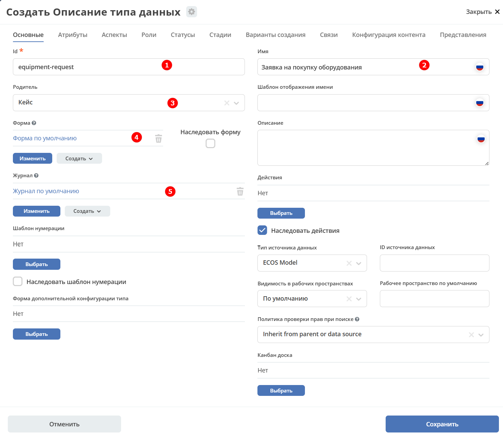

.. _sample_request_attributes:

Атрибуты
~~~~~~~~

На вкладке находится информация о свойствах, которые будут использованы для взаимодействия с объектом.

Для создания заявки потребуются сведения о том:

- что необходимо купить;
- сколько стоит;
- кто запрашивает;
- кто согласует закупку.

Соответственно, потребуются следующие атрибуты (свойства объекта):

.. list-table::
   :widths: 20 40 40
   :header-rows: 1
   :align: center
   :class: tight-table

   * - Id (1)
     - Имя (2)
     - Тип (3)
   * - name
     - Название оборудования
     - Text
   * - price
     - Стоимость
     - Number
   * - requester
     - Инициатор
     - Person
   * - approver
     - Согласующий
     - Person

Конечная настройка вкладки:

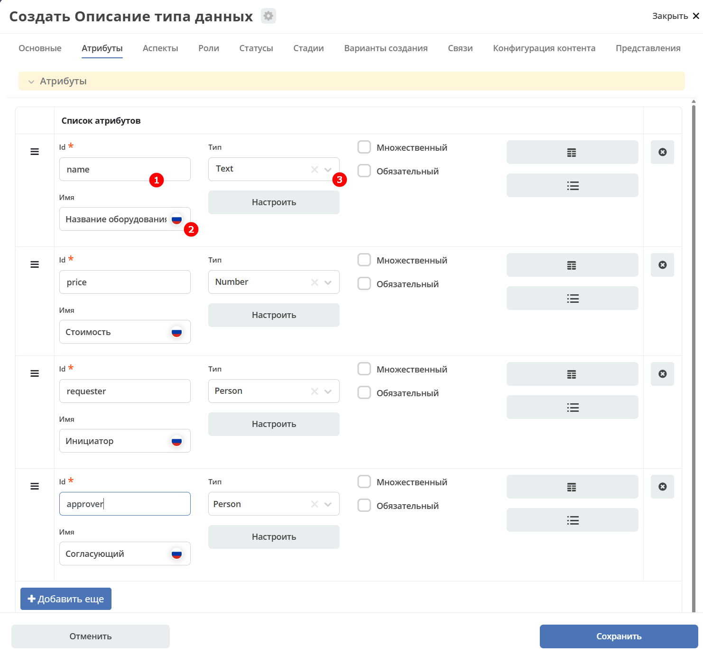

Роли
~~~~

На вкладке описываются роли, участвующие в работе с объектом — в данном случае, в работе с заявкой.

Глядя на атрибуты, несложно догадаться, что на первом этапе потребуются две роли: **Инициатор** и **Согласующий**.

.. note::

   **Атрибут** выбирается из ранее указанных атрибутов. По клику на поле выпадает список атрибутов, заданных на вкладке «Атрибуты».

.. list-table::
   :widths: 20 40 40
   :header-rows: 1
   :align: center
   :class: tight-table

   * - Id (1)
     - Имя (2)
     - Атрибут (3)
   * - requestor
     - Инициатор
     - Инициатор
   * - approver
     - Согласующий
     - Согласующий

Конечная настройка вкладки:

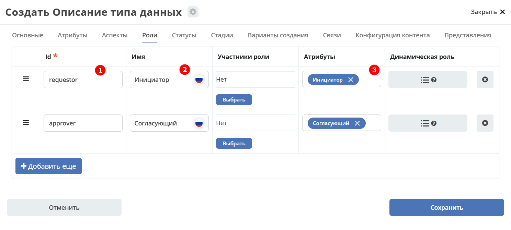

Статусы
~~~~~~~

На вкладке описываются статусы, по которым объект (заявка) будет перемещаться в бизнес-процессе.

Рассмотрим самый простой и успешный вариант процесса.

Инициатор создаёт заявку (статус **«Заявка создана»**), затем отправляет её на согласование (статус **«На согласовании»**), после чего согласующий одобряет заявку (статус **«Согласовано»**).

.. list-table::
   :widths: 40 60
   :header-rows: 1
   :align: center
   :class: tight-table

   * - Id (1)
     - Имя (2)
   * - request-created
     - Заявка создана
   * - approving
     - На согласовании
   * - approved
     - Согласовано
   * - rejected
     - Отказано

Конечная настройка вкладки:

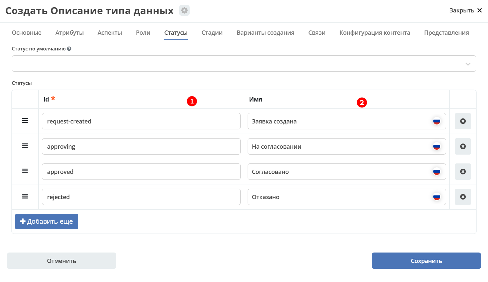

Для сохранения нажмите **«Сохранить»**. На этом создание базового варианта типа данных для заявки завершено.

Промежуточный итог
~~~~~~~~~~~~~~~~~~

- Указана базовая информация о типе данных: id и название;
- форма и журнал сгенерированы системой автоматически на основании введённых данных;
- описаны свойства заявки, с которыми будет осуществляться дальнейшее взаимодействие;
- добавлены роли, участвующие в работе с заявкой;
- обозначены статусы, по которым будет перемещаться заявка.

.. _journal_to_menu:

Журнал и форма
--------------

Перейдите в :ref:`созданное рабочее пространство<demo_ws>`:

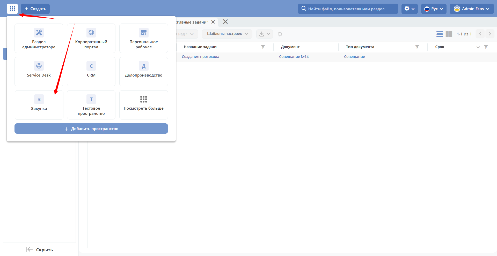

Для просмотра журнала необходимо добавить его в левое меню:

1. Перейдите в настройку меню, нажав на шестерёнку в правом верхнем углу, и выберите **«Настроить меню»**:

   .. image:: _static/equipment_request/menu_1.png
      :width: 700
      :align: center

2. Перейдите на вкладку **«Настройки выбранной конфигурации»**, нажмите **«+ Добавить»** и выберите **«Раздел»**:

   .. image:: _static/equipment_request/menu_2.png
      :width: 600
      :align: center

3. В поле **«Название»** введите название раздела, например «Оборудование», и нажмите **«Сохранить»**:

   .. image:: _static/equipment_request/menu_3.png
      :width: 400
      :align: center

4. Наведите курсор на добавленный раздел, нажмите **«+ Добавить»** и выберите **«Журнал»**:

   .. image:: _static/equipment_request/menu_4.png
      :width: 600
      :align: center

   Выберите журнал **«type$equipment-request»** и нажмите **ОК**:

   .. image:: _static/equipment_request/menu_5.png
      :width: 600
      :align: center

5. Нажмите **«Применить»**:

   .. image:: _static/equipment_request/menu_6.png
      :width: 600
      :align: center

В левом меню появится новый журнал **«Заявка на покупку оборудования»**:

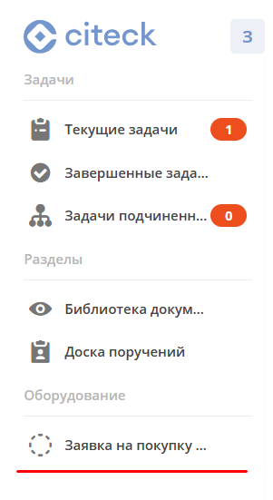

При выборе журнала откроется вкладка с автоматически сгенерированным журналом. В нём отображаются колонки, соответствующие атрибутам, указанным ранее в типе данных:

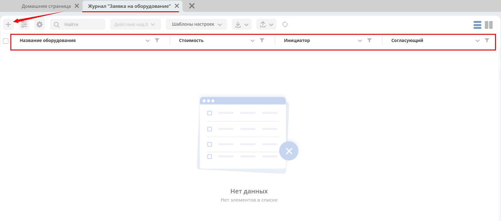

Автоматически сгенерированная форма доступна по кнопке **+**:

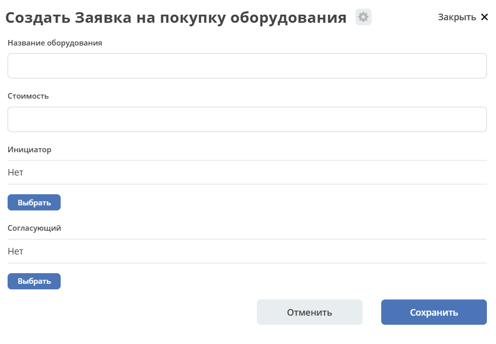

Создать заявку в журнале пока невозможно, так как для объекта ещё не задан бизнес-процесс, описывающий его жизненный цикл.

.. _bp_sample:

Бизнес-процесс
--------------

Для создания процесса перейдите в рабочее пространство администратора.

В разделе **Управление процессами** перейдите в пункт **Модели BPMN**:

Нажмите **«+ — Создать BPMN модель»**:

В открывшемся модальном окне заполните поля:

.. list-table::
   :widths: 5 35 60
   :align: center
   :class: tight-table

   * - **1**
     - Идентификатор
     - equipment-request
   * - **2**
     - Имя
     - Заявка на покупку оборудования
   * - **3**
     - Тип данных
     - equipment-request
   * - **4**
     - Включён
     - True — отметка об активности процесса
   * - **5**
     - Автоматический старт процесса
     - Выставить чекбокс, чтобы процесс запускался автоматически. Подробно о :ref:`запуске процесса<new_bp_start>`
   * - **6**
     - Автоматическое удаление процесса
     - При удалении объекта указанного типа процесс будет удалён автоматически. По умолчанию включено.

Конечная настройка бизнес-процесса:

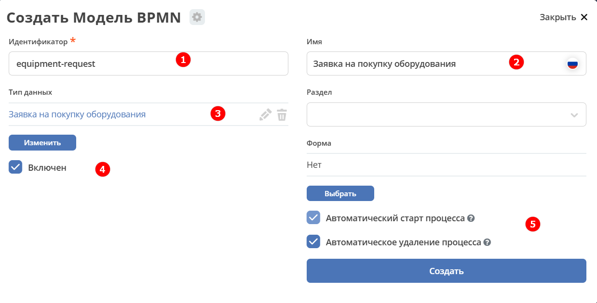

.. note::

   Обязательно установите чекбоксы **Включён (4)** и **Автоматический старт процесса (5)**.

Нажмите **«Создать»**.

Далее необходимо описать схему процесса в :ref:`редакторе бизнес-процессов<editor_bpmn>`.

Для перехода к редактору разверните раздел **«По умолчанию»**, наведите курсор на созданный процесс и нажмите:

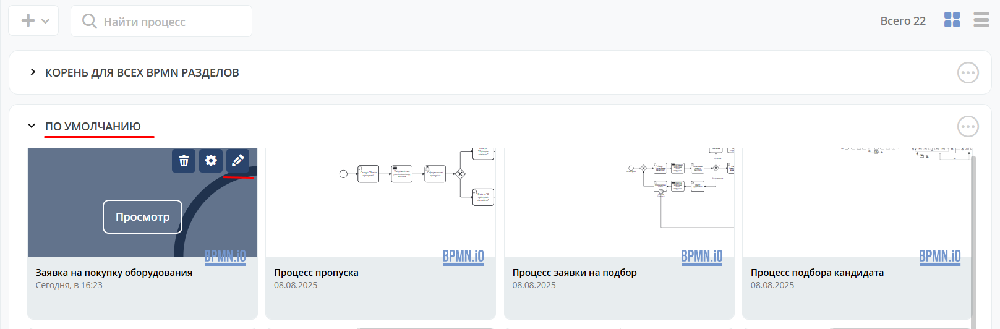

Откроется **конструктор бизнес-процесса**:

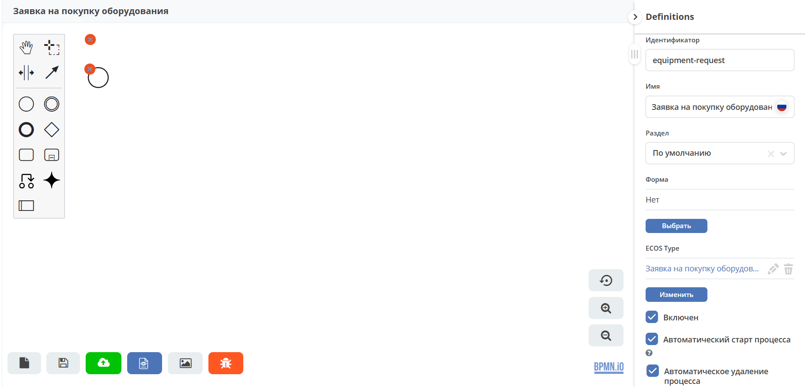

Процесс прохождения заявки опишем следующим образом:

**Создать заявку → Отправить на согласование → Согласовать / Отклонить заявку**

1. Автоматически на схему добавляется элемент, отвечающий за начало процесса (:ref:`Start event<bpmn_events>`).

   **Start event** слушает систему и ожидает запроса на создание нового объекта с нужным типом данных.

   Выделите **Start Event** — рядом с элементом расположено контекстное меню, с помощью которого в процесс можно добавлять новые элементы, связи между ними или редактировать текущий элемент.

   .. image:: _static/equipment_request/start_event.png
      :width: 200
      :align: center

2. Сразу после создания заявка должна получить статус **«Заявка создана»** — нажмите на элемент :ref:`Set status<set_status>` в контекстном меню:

   .. image:: _static/equipment_request/set_status.png
      :width: 200
      :align: center

   Справа от области схемы появятся настройки добавленного элемента. Укажите **имя (1)** и **статус (2)**, который будет присвоен объекту на данном этапе:

   - Имя — **Статус «Заявка создана»**;
   - Статус — **Заявка создана**.

   .. image:: _static/equipment_request/set_status_prop.png
      :width: 300
      :align: center

3. Когда заявка создана, необходимо проверить её содержимое, а затем отправить на согласование. Для этого создайте задачу для пользователя — нажмите на элемент **«Task»** в контекстном меню:

   .. image:: _static/equipment_request/User_task_1.png
      :width: 300
      :align: center

   Элемент необходимо изменить с «Task» на :ref:`User task<user_task>`. Нажмите на значок гаечного ключа и выберите **«User task»**:

   .. image:: _static/equipment_request/User_task_2.png
      :width: 400
      :align: center

   Настройте задачу для пользователя:

   - Имя — **На согласование**;
   - Реципиент — **Инициатор**.

   .. image:: _static/equipment_request/User_task_prop.png
      :width: 300
      :align: center

   .. note::

      **Форму к задаче** можно не создавать вручную — система автоматически сформирует простую форму с кнопками, настроенными в **Результате задачи**.

   .. image:: _static/equipment_request/form_common.png
      :width: 300
      :align: center

   **Приоритет** по умолчанию установлен как **Средний**.

   Заполните список **«Результаты задачи»** следующими значениями:

   - Идентификатор — **ToApprove**;
   - Название — **На согласование**.

   .. image:: _static/equipment_request/form_to_approve_5.png
      :width: 400
      :align: center

4. После отправки на согласование необходимо изменить статус заявки на **«На согласовании»**. Повторите действия пункта 2:

   - Нажмите в контекстном меню на иконку **Set Status**:

   .. image:: _static/equipment_request/set_status_2.png
      :width: 400
      :align: center

   - Имя — **Статус «На согласовании»**;
   - Статус — **На согласовании**.

   .. image:: _static/equipment_request/set_status_2_prop.png
      :width: 400
      :align: center

5. Создайте аналогичную задачу, на этот раз для согласующего:

   - Добавьте через контекстное меню элемент **Task**:

   .. image:: _static/equipment_request/User_task_3.png
      :width: 500
      :align: center

   - Измените тип элемента с **Task** на **User Task**:

   .. image:: _static/equipment_request/User_task_4.png
      :width: 600
      :align: center

   - Имя — **На согласовании согласующим**;
   - Реципиент — **Согласующий**.

   .. image:: _static/equipment_request/User_task_2_prop.png
      :width: 300
      :align: center

   **Приоритет** по умолчанию установлен как **Средний**.

   Заполните список **«Результаты задачи»**:

   - Идентификатор — **Approve**, Название — **Согласовать**;
   - Идентификатор — **Reject**, Название — **Отказать**.

   .. image:: _static/equipment_request/request_approve_5.png
      :width: 400
      :align: center

.. _approve_form_bpmn:

.. note::

   **Форму к задаче** можно не создавать вручную — система сформирует её автоматически, отображая вердикты из поля **Результат задачи**.

   Ниже мы создадим пользовательскую форму для ознакомления с конструктором форм.

**Формы для задач** обычно состоят из комментариев и кнопок, обозначающих результат выполнения задачи.

В данном случае комментарий не нужен — достаточно кнопок, отвечающих за исход задачи **«На согласовании»**.

Для создания формы выполните следующие действия:

- На панели настроек элемента **User Task** под полем **«Форма»** нажмите **«Выбрать»**:

  .. image:: _static/equipment_request/form_common_1.png
     :width: 400
     :align: center

- В верхней части нажмите **«Создать»** и выберите **«Создать форму»**:

  .. image:: _static/equipment_request/form_common_2.png
     :width: 600
     :align: center

- Заполните поля:

  - Идентификатор формы — **«equipment-request-approve-form»**;
  - Название формы — **«Форма согласования заявки на покупку оборудования»**.

- Нажмите **«Редактировать форму»**:

  .. image:: _static/equipment_request/request_approve_1.png
     :width: 600
     :align: center

- Удалите текстовый элемент **«Название»** и кнопки:

  .. image:: _static/equipment_request/form_outcome_1.png
     :width: 600
     :align: center

- Перейдите в **«Расширенные»** и перетащите элемент **Task Outcome** на форму:

  .. image:: _static/equipment_request/form_outcome_2.png
     :width: 600
     :align: center

- В поле **«Имя свойства»** введите **outcome** и нажмите **«Сохранить»**:

  .. image:: _static/equipment_request/form_outcome_3.png
     :width: 600
     :align: center

  Элемент **Task Outcome** автоматически сформирует кнопки вердиктов на основании настроек **Результатов задачи**.

- Нажмите **«Сохранить»**:

  .. image:: _static/equipment_request/form_outcome_4.png
     :width: 600
     :align: center

- Выберите созданную форму.

6. После завершения задачи согласующим процесс должен разветвиться, так как возможны два исхода — закупка согласована или отклонена. Добавьте элемент :ref:`Gateway<gateways>`.

   **Gateway** управляет разветвлением и слиянием потоков. Для его добавления нажмите на соответствующую иконку в контекстном меню или на панели слева:

   .. image:: _static/equipment_request/gateway_1.png
      :width: 600
      :align: center

   |

   .. image:: _static/equipment_request/gateway_2.png
      :width: 600
      :align: center

7. После **Gateway** добавьте два элемента смены статуса — **«Согласовано»** и **«Отказано»**. Повторите действия пункта 2:

   - У элемента **Gateway** нажмите в контекстном меню на иконку **Set Status**:

   .. image:: _static/equipment_request/set_status_3.png
      :width: 600
      :align: center

   - Имя — **Статус «Согласовано»**;
   - Статус — **Согласовано**.

   .. image:: _static/equipment_request/set_status_3_prop.png
      :width: 300
      :align: center

   - У элемента **Gateway** снова нажмите на иконку **Set Status**:
   - Имя — **Статус «Отказано»**;
   - Статус — **Отказано**.

   .. image:: _static/equipment_request/set_status_4_prop.png
      :width: 300
      :align: center

8. Система определяет, по какому потоку идти, с помощью вариантов исхода. Исходы настраиваются через кнопки на форме и стрелки, выходящие из Gateway.

   Для настройки выберите стрелку (элемент **Sequence Flow**, отвечающий за направление потока).

   Для потока **«Согласовано»**:

   .. image:: _static/equipment_request/Sequence_Flow_1.png
      :width: 600
      :align: center

   - Укажите имя **Согласовано**;
   - В поле **«Тип условия»** выберите **Исходящий**;
   - В поле **«Исходящий»** выберите **На согласовании согласующим — Согласовать** (варианты генерируются автоматически из названия задачи и названий результатов).

   .. image:: _static/equipment_request/Sequence_Flow_2.png
      :width: 300
      :align: center

   Для потока **«Отказано»**:

   .. image:: _static/equipment_request/Sequence_Flow_3.png
      :width: 600
      :align: center

   - Укажите имя **Отказан**;
   - В поле **«Тип условия»** выберите **Исходящий**;
   - В поле **«Исходящий»** выберите **На согласовании согласующим — Отказать**.

   .. image:: _static/equipment_request/Sequence_Flow_4.png
      :width: 300
      :align: center

9. Добавьте элемент завершения процесса. В контекстном меню элементов **«Статус «Согласовано»** и **«Статус «Отказано»** нажмите на иконку :ref:`End event<bpmn_events>`:

   .. image:: _static/equipment_request/end_event_1.png
      :width: 600
      :align: center

   Добавьте **End Event** для второго выхода Gateway.

   Теперь процесс можно сохранить и опубликовать:

   .. image:: _static/equipment_request/publish.png
      :width: 700
      :align: center

   Принятие решений по заявке можно упростить, создав таблицу принятия решений и встроив её в процесс. См. :ref:`подробно<sample_request_dmn>`

Запуск процесса
---------------

После создания типа данных, журнала, формы и бизнес-процесса можно проверить работу процесса. Создайте новых пользователей согласно :ref:`инструкции<demo_user>` или воспользуйтесь уже созданными в комплекте поставки.

Зайдите под **Инициатором**. В левом меню выберите **«Заявка на покупку оборудования»** — откроется пустой журнал. Для создания новой заявки нажмите **«+»**:

Заполните поля. Например:

- Название оборудования — **HDMI кабель**;
- Стоимость — **500**;
- Инициатор — **выберите сотрудника из оргструктуры**;
- Согласующий — **выберите сотрудника из оргструктуры**.

Нажмите **«Сохранить»**:

Заявка перейдёт в статус **«Заявка создана»** и откроется её карточка.

В виджете **«Мои задачи»** нажмите кнопку **«На согласование»**:

После выполнения задачи заявка перейдёт в статус **«На согласовании»**, а на Согласующего будет назначена задача.

Зайдите под **Согласующим** — откройте персональное рабочее пространство, в левом меню перейдите в **Текущие задачи** и откройте задачу:

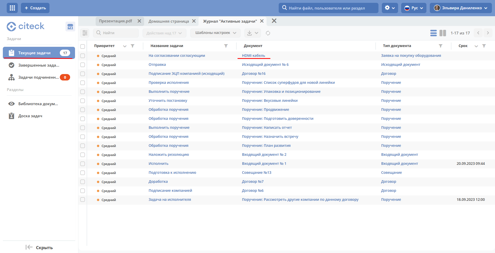

В виджете **«Мои задачи»** нажмите кнопку **«Согласовать»**:

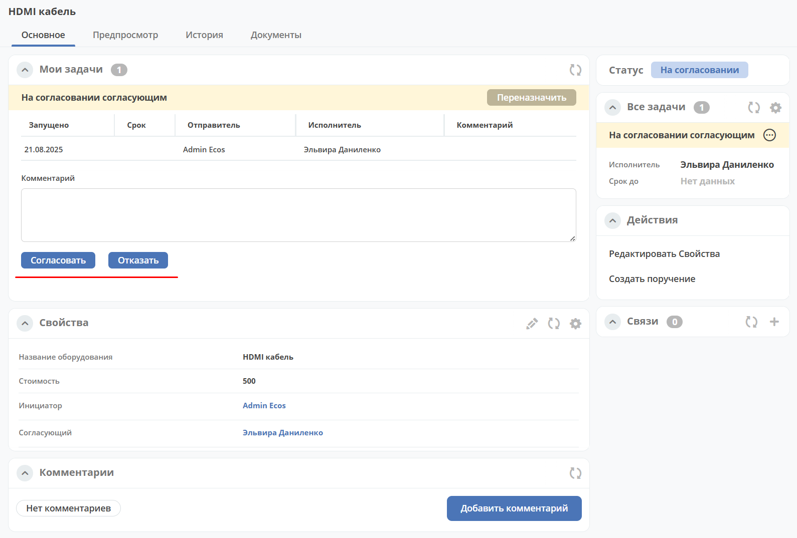

После выполнения задачи заявка перейдёт в статус **«Согласовано»**.

Поздравляем — первая заявка прошла полный цикл созданного вами бизнес-процесса!
