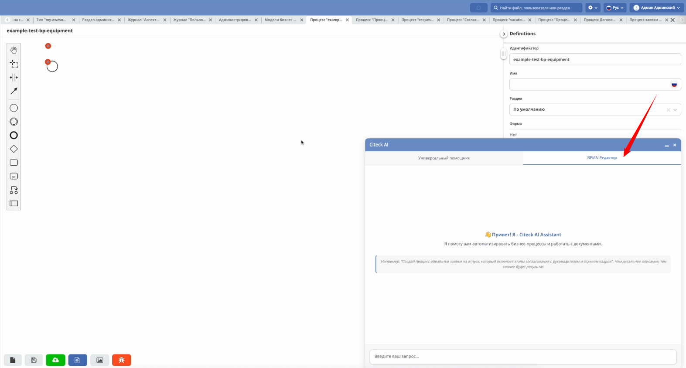

Создание процесса с помощью интеллектуального помощника
=========================================================

.. _sample_request_ai:

.. contents::
	:depth: 3

.. note:: 

 Доступно только в enterprise версии.

Создадим обучающий процесс :ref:`заявки на закупку оборудования<sample_request>` не вручную, а с помощью :ref:`AI ассистента<AI_assistant>`.

Попробуем создать минимальный набор для работы — сгенерировать тип данных и бизнес-процесс.

Создание типа данных
---------------------

Перейдите в ассистента:

.. image:: _static/equipment_request_ai/AI_01.png
    :width: 800
    :align: center 

Сначала создайте тип данных по заранее подготовленному запросу. В запросе указано, что это за заявка, перечислены ее атрибуты, роли и статусы: 

.. code-block:: text 

    Создай тип данных по описанию ниже.
    Заявка на оборудование – заявка, которая необходима для закупки оборудования для операционной деятельности сотрудников. 
    Например, для подключения монитора к компьютеру сотруднику необходим специальный кабель, которого на данный момент нет в наличии.
    Обычно сотрудник обращается к своему руководителю с просьбой, чтобы для него (сотрудника) необходимое оборудование было приобретено, после успешного согласования с руководителем и в соответствии с внутренними правилами и распорядками происходит закупка. 
    Согласующий также может отказать в покупке.
    
    Атрибуты:
    1. name, Название оборудования, Text
    2. price, Стоимость, Number
    3. requester, Инициатор, Person
    4. approver, Согласующий, Person
    
    Роли:
    5. requestor, Инициатор, из атрибута Инициатор
    6. approver, Согласующий, из атрибута Согласующий
    
    Статусы:
    7. request-created, Заявка создана
    8. approving, На согласовании
    9. approved, Согласовано
    10. rejected, Отказано

.. image:: _static/equipment_request_ai/AI_02.png
    :width: 600
    :align: center 

Ассистент обрабатывает запрос и возвращает следующий тип данных:

Все нужные атрибуты, роли и статусы заданы. Далее подтвердите разворачивание типа данных в системе:

.. image:: _static/equipment_request_ai/AI_04.png
    :width: 600
    :align: center 

Далее по ссылке можно перейти в созданный тип данных и проверить его:

Вкладка **«Основные»**:

Родитель – Кейс,  форма и журнал созданы по умолчанию. 

.. image:: _static/equipment_request_ai/AI_06.png
    :width: 700
    :align: center 
 
Вкладка **«Атрибуты»**:

.. image:: _static/equipment_request_ai/AI_07.png
    :width: 700
    :align: center 
 
Вкладка **«Роли»**:

.. image:: _static/equipment_request_ai/AI_08.png
    :width: 700
    :align: center 

Вкладка **«Статусы»**:

.. image:: _static/equipment_request_ai/AI_09.png
    :width: 700
    :align: center 
 
Тип данных готов. Можно переходить к бизнес-процессу.

Создание бизнес-процесса
--------------------------

Сгенерируем бизнес-процесс по созданному типу данных.

Перейдите в рабочее пространство **«Раздел администратора»** в раздел **«Модели BPMN»**: 

.. image:: _static/equipment_request_ai/AI_10.png
    :width: 800
    :align: center 

Создайте модель, выберите для нее созданный ранее тип данных:

.. image:: _static/equipment_request_ai/AI_11.png
    :width: 600
    :align: center 

И нажмите **«Создать»**:

Перейдите в редактор процесса:

.. image:: _static/equipment_request_ai/AI_13.png
    :width: 700
    :align: center 

В ассистенте перейдите во вкладку **«BPMN Редактор»**:

Для создания бизнес-процесса используйте следующий запрос:

.. code-block:: text

    Создай бизнес-процесс на основе типа данных Заявки на оборудование.
    Описание процесса:
    1. Заявка создана -> Задача на инициатора - "На согласование"
    2. После отправки на согласование, назначается задача на Согласующего - "На согласовании согласующим", у задачи 2 выхода - Согласовать и Отказать
    Добавь соответствующие статусы и уведомления.

.. note::

    Дополнительно попросим добавить к процессу уведомления.

Процесс сгенерирован:

Рассмотрим настройки некоторых элементов:

.. list-table::
      :widths: 20 20
      :align: center

      * - |

            .. image:: _static/equipment_request_ai/elements/1-1.png
                  :width: 100
                  :align: center

        - |

            .. image:: _static/equipment_request_ai/elements/1-2.png
                  :width: 300
                  :align: center

      * - |

            .. image:: _static/equipment_request_ai/elements/2-1.png
                  :width: 100
                  :align: center

        - |

            .. image:: _static/equipment_request_ai/elements/2-2.png
                  :width: 300
                  :align: center

      * - |

            .. image:: _static/equipment_request_ai/elements/3-1.png
                  :width: 100
                  :align: center

        - |

            .. image:: _static/equipment_request_ai/elements/3-2.png
                  :width: 300
                  :align: center

      * - |

            .. image:: _static/equipment_request_ai/elements/4-1.png
                  :width: 100
                  :align: center

        - |

            .. image:: _static/equipment_request_ai/elements/4-2.png
                  :width: 300
                  :align: center

Процесс получился похожим на описание:

**Включите** процесс **(1)** и разрешите **автоматически старт процесса (2)**, далее **опубликуйте процесс (3)**:

Запуск и проверка процесса
----------------------------

Проверим работу процесса.

Перейдите в **персональное рабочее пространство** и добавьте в меню журнал:

|

.. image:: _static/equipment_request_ai/AI_20.png
    :width: 500
    :align: center 

Перейдите в журнал и создайте заявку. Для запуска ее по процессу нажмите **«Сохранить»**:

.. image:: _static/equipment_request_ai/AI_21.png
    :width: 700
    :align: center 

Первая задача **«На согласование»**. Завершите ее - нажмите **«Отправить на согласование»**:

Вторая задача **«На согласовании согласующим»**. Завершите ее – укажите комментарий и нажмите **«Отказать»**:

.. image:: _static/equipment_request_ai/AI_23.png
    :width: 700
    :align: center 

Заявка перешла в статус **«Отказано»**: 

