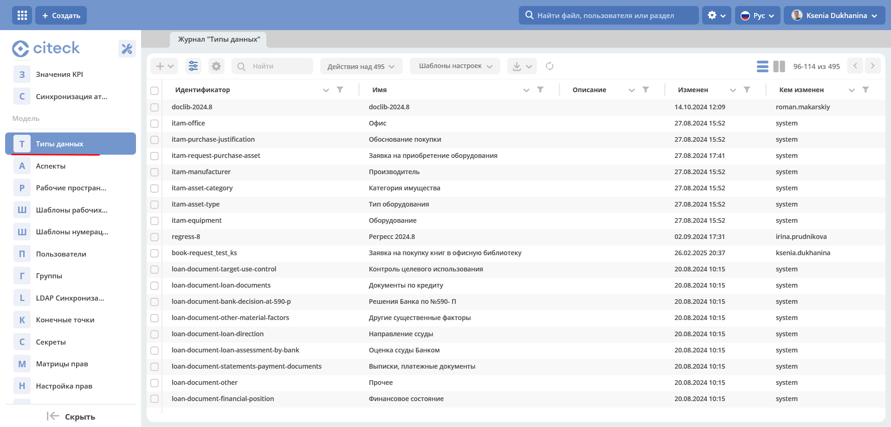
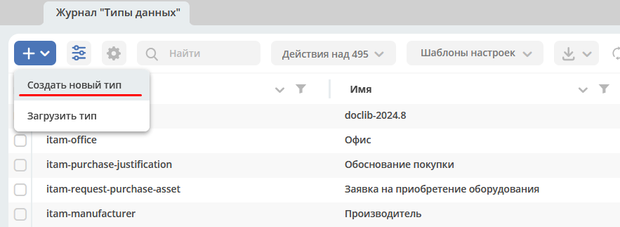
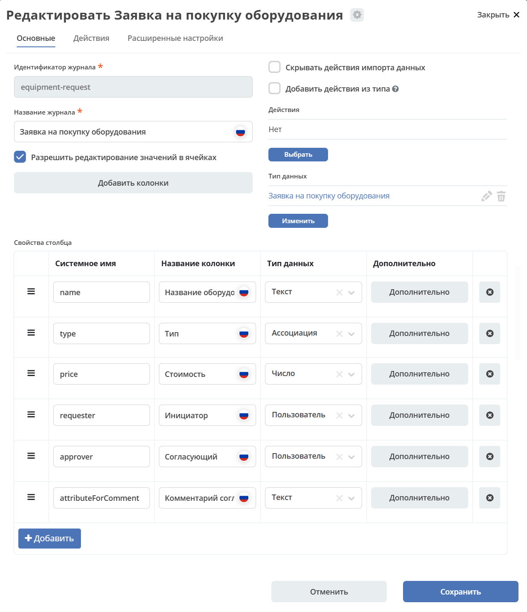
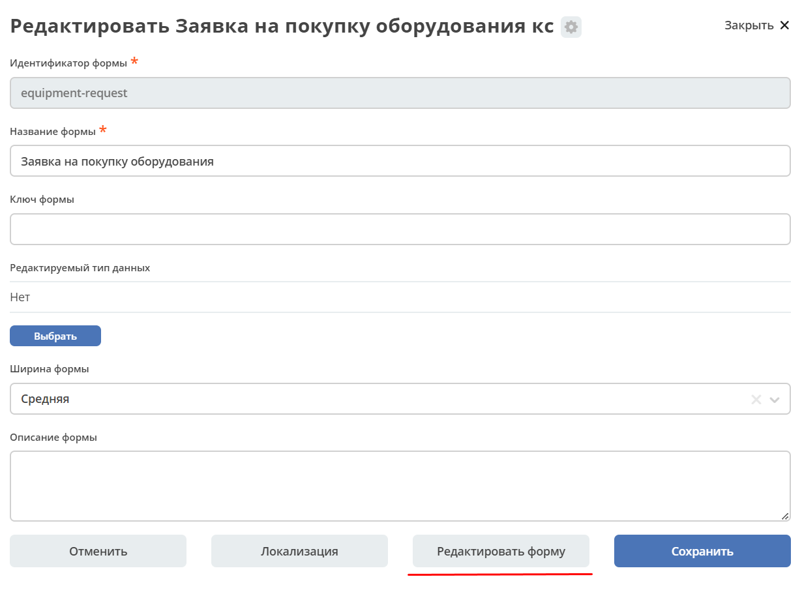
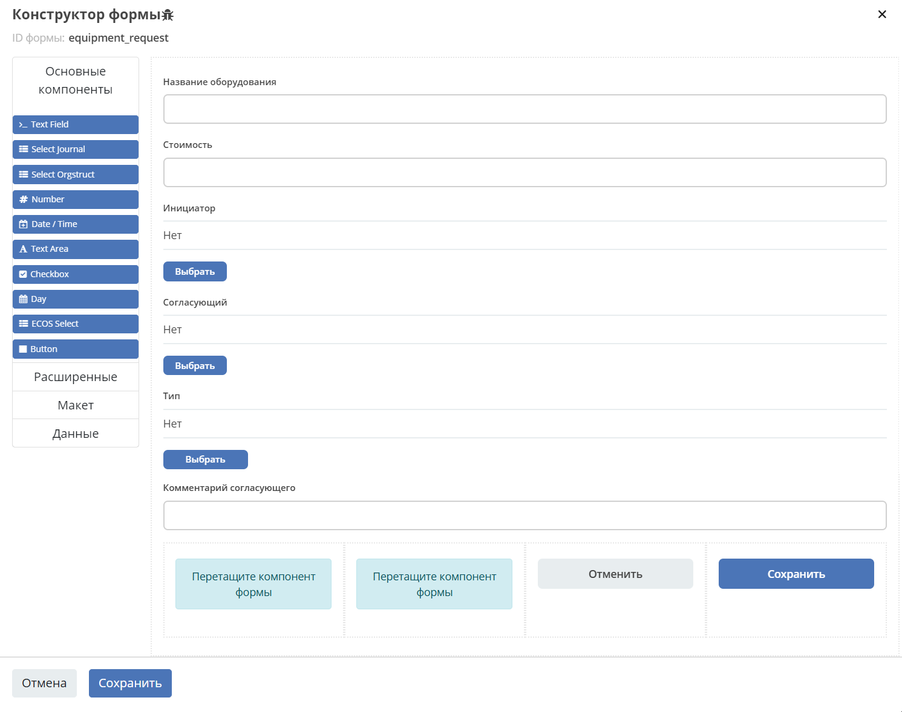
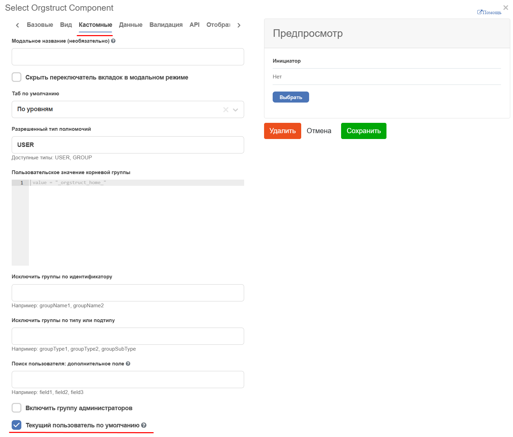
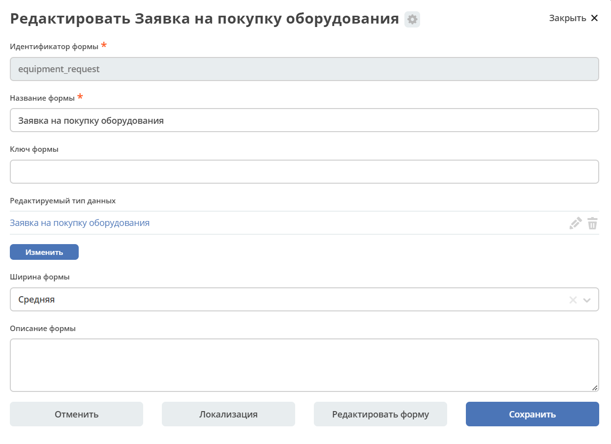
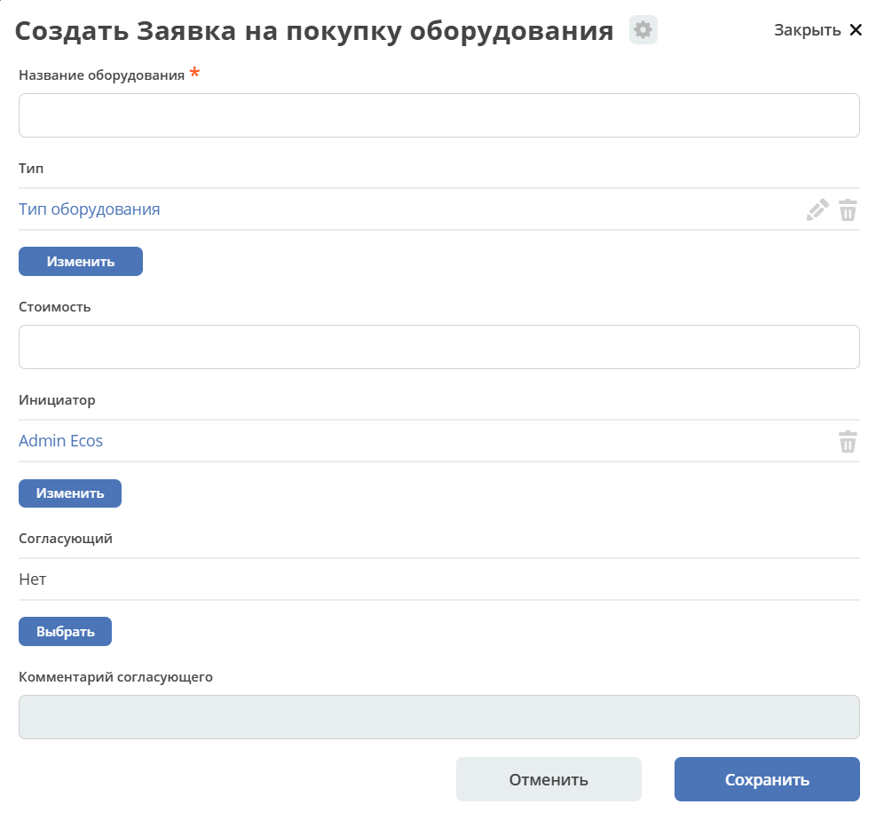

Процесс запроса на закупку оборудования. Добавление справочника. Журнал и форма не по умолчанию.
==================================================================================================

.. contents::
	:depth: 3

.. note::

    Данная статья является продолжением работы с созданным ранее бизнес-процессом :ref:`Запрос на закупку оборудования<sample_request>` 

Справочник «Тип оборудования»
-------------------------------

Добавим справочник **«Тип оборудования»**, который мы будем использовать в запросе на закупку оборудования.

**Справочник (datalist)** - тип для хранения набора данных, который будет использоваться в качестве статических данных для документов, не участвующие непосредственно в бизнес-процессах. 

Для создания типа данных перейдите в журнал **«Типы данных» (Раздел администратора - Модель - Типы данных)**:

нажмите **+ - Создать новый тип**:

Основное
~~~~~~~~~~

На вкладке расположены основные данные по типу данных (объекту):

.. list-table:: 
      :widths: 10 20 30
      :align: center
      :class: tight-table 

      * - **1**
        - id
        - equipment-type
      * - **2**
        - Имя
        - Тип оборудования
      * - **3**
        - Родитель
        - Справочник
      * - **4**
        - Форма
        - Оставить по умолчанию (система автоматически сгенерирует форму по тем атрибутам, которые мы укажем далее, но автоматически сгенерированные формы нельзя редактировать)
      * - **5**
        - Журнал
        - Оставить по умолчанию (система автоматически сгенерирует журнал по тем атрибутам, которые мы укажем далее, но автоматически сгенерированные журналы нельзя редактировать)

Конечная настройка вкладки:

.. image:: _static/equipment_request_complicated/03.png
       :width: 700
       :align: center

Атрибуты
~~~~~~~~~~

Заполните следующие атрибуты (свойства объекта):

.. list-table:: 
      :widths: 10 20 30
      :header-rows: 1
      :align: center
      :class: tight-table 

      * - Id (1)
        - Имя (2)
        - Тип (3)
      * - type
        - Наименование
        - Text

.. image:: _static/equipment_request_complicated/04.png
       :width: 700
       :align: center

Для сохранения нажмите **«Сохранить»**.

Добавьте журнал **type$equipment-type** в меню, аналогично, как описано в :ref:`статье<journal_to_menu>` и заполните его данными:

.. image:: _static/equipment_request_complicated/04_1.png
       :width: 700
       :align: center

Тип данных
-----------

Добавление дополнительного атрибута
~~~~~~~~~~~~~~~~~~~~~~~~~~~~~~~~~~~~

Далее в существующий тип данных необходимо добавить атрибут **«Тип оборудования»**. Найдите тип данных **«Заявка на покупку оборудования»**, перейдите в режим редактирования:

.. image:: _static/equipment_request_complicated/05.png
       :width: 700
       :align: center

На вкладке **«Атрибуты»** нажмите **«+Добавить еще»** и заполните строку следующими данными:

.. image:: _static/equipment_request_complicated/06.png
       :width: 700
       :align: center

.. list-table:: 
      :widths: 10 20 30
      :header-rows: 1
      :align: center
      :class: tight-table 

      * - Id (1)
        - Имя (2)
        - Тип (3)
      * - type
        - Тип
        - Association

Нажмите **«Настроить»**:

Нажмите **«Выбрать»** и из списка типов данных выберите **«Тип оборудования»**:

.. list-table::
      :widths: 20 20
      :align: center

      * - |

            .. image:: _static/equipment_request_complicated/08.png
                  :width: 600
                  :align: center

        - |

            .. image:: _static/equipment_request_complicated/09.png
                  :width: 500
                  :align: center

Переместите добавленную строку под строку **Название оборудования**:

.. image:: _static/equipment_request_complicated/10.png
       :width: 600
       :align: center

Шаблон нумерации
~~~~~~~~~~~~~~~~~~~

Номер можно присваивать автоматически. И номер можно отражать в шаблоне отображения имени. Для этого необходимо задать и настроить :ref:`Шаблон нумерации<number_template>`

Перейдите во вкладку **«Основные»**:

В поле **«Шаблон нумерации»** нажмите **«Выбрать»**. Далее нажмите **«Создать - Создать новый шаблон»**:

.. image:: _static/equipment_request_complicated/12.png
       :width: 600
       :align: center

Заполните открывшуюся форму:

.. image:: _static/equipment_request_complicated/13.png
       :width: 500
       :align: center

.. list-table:: 
      :widths: 20 20 30
      :header-rows: 1
      :align: center
      :class: tight-table 

      * - Номер маркера (1)
        - Название поля (2)
        - Значение (3)
      * - 1
        - 2
        - 3
      * - id
        - Name
        - Counter key
      * - equipment-request-number-template
        - Equipment Request Number Template
        - equipment-request-counter

И выберите созданный шаблон:

В поле **«Шаблон отображения имени»** укажите **Заявка_${_docNum}**:

.. image:: _static/equipment_request_complicated/15.png
       :width: 600
       :align: center

Журнал и форма не по умолчанию
---------------------------------

Для типа данных были созданы автоматически генерируемая форма и журнал, но отредактировать их нельзя.

Добавление полей в журнал
~~~~~~~~~~~~~~~~~~~~~~~~~~~

Перейдите в тип данных и чтобы скопировать журнал, нажмите:

.. image:: _static/equipment_request_complicated/17.png
       :width: 600
       :align: center

Откроется форма с названием по умолчанию: 

Переименуйте в **equipment-request** и нажмите **«Подтвердить»**:

.. image:: _static/equipment_request_complicated/18_1.png
       :width: 500
       :align: center
 
После сохранения происходит создание нового журнала и в типе данных автосгенерированный журнал изменяется на созданный. 

Для его редактирования нажмите:

.. image:: _static/equipment_request_complicated/19.png
       :width: 600
       :align: center

Отроется журнал, в который можно внести изменения:

Далее добавим в журнал системные поля (ссылка) аналогично, как добавляли выше **Тип оборудования**:

       - **_created**- дата и время создания объекта. Тип данных выбрать **«Дата»**
       - **_disp** - отображаемое имя (т.к выше мы задали **Шаблон отображения имени**, то в поле будет отражаться **Заявка_ {Номер}**)
       - **_status** – статус объекта
  
Нажмите **«+Добавить»** и заполните строки следующими данными:

.. image:: _static/equipment_request_complicated/21.png
       :width: 600
       :align: center

**Сохраните.**

.. note::

 Добавьте журнал **equipment-request** в меню, аналогично, как :ref:`описано <journal_to_menu>` 

 Автосгенериванный **type$equipment-request** журнал удалите из меню.

Откройте журнал **«Заявка на закупку оборудования»**. В него добавлены новые столбцы.

.. image:: _static/equipment_request_complicated/21_1.png
       :width: 600
       :align: center

Изменение полей формы
~~~~~~~~~~~~~~~~~~~~~~~~~~~

Перейдите в тип данных и чтобы скопировать форму, нажмите:

.. image:: _static/equipment_request_complicated/22.png
       :width: 600
       :align: center

Откроется форма с названием по умолчанию: 

.. image:: _static/equipment_request_complicated/23.png
       :width: 500
       :align: center

Переименуйте в **equipment-request** и нажмите **«Подтвердить»**:

После сохранения происходит создание новой формы и в типе данных автосгенерированная форма изменяется на созданную. Для ее редактирования нажмите:

Отроется форма, в которую можно внести изменения. 

Для перехода к редактированию компонентов нажмите **«Редактировать форму»**.

1.	Перетаскиванием перенесем поле **«Тип»** выше под поле **«Название оборудования»**.

.. image:: _static/equipment_request_complicated/25_1.png
       :width: 600
       :align: center

2.	Сделаем поле **«Название оборудования»** обязательным. Для перехода к редактированию компонента нажмите:

.. image:: _static/equipment_request_complicated/26.png
       :width: 600
       :align: center

Далее открывается форма редактирования свойств компонента. В правой части для удобства доступен предпросмотр настроенного компонента.

.. image:: _static/equipment_request_complicated/27.png
       :width: 600
       :align: center

На вкладке **«Базовые»** выставите чекбокс **«Обязательное» (1)** и сохраните **(2)**.

3.	В поле **«Тип оборудования»** укажем тип по умолчанию. На вкладке **«Данные»**:

.. image:: _static/equipment_request_complicated/28.png
       :width: 600
       :align: center

выберите значение по умолчанию:

.. image:: _static/equipment_request_complicated/30.png
       :width: 600
       :align: center

**Сохраните.**

4.	В поле **«Инициатор»** настроим так, чтобы создающий заявку пользователь указывался автоматически. На вкладке **«Кастомные»** выставите чекбокс **«Текущий пользователь по умолчанию»** и сохраните.

**Сохраните.**

Отредактированная форма:

Нажмите **«Сохранить»**.

Нажмите **«Сохранить»**.

Перейдите в журнал **«Заявка на закупку оборудования»** и нажмите **+**. Поля формы изменены:

