.. _sample_request_complicated:

Расширение процесса: справочник, журнал и форма
================================================

.. contents::
   :depth: 3

.. note::

   Данная статья является продолжением работы с созданным ранее бизнес-процессом :ref:`Заявка на закупку оборудования<sample_request>`.

Справочник «Тип оборудования»
-------------------------------

.. note::

   Для создания типа данных в локальном рабочем пространстве в разделе **Администрирование** перейдите в пункт **Типы данных**.

Добавим справочник **«Тип оборудования»**, который будет использоваться в заявке на закупку оборудования.

**Справочник (datalist)** — тип для хранения набора данных, используемый в качестве статических данных для документов, не участвующих непосредственно в бизнес-процессах.

Для создания типа данных перейдите в рабочее пространство администратора. В разделе **Модель** перейдите в журнал **«Типы данных»**:

|

|

Нажмите **+ — Создать новый тип**:

Основное
~~~~~~~~~~

На вкладке расположены основные данные по типу данных (объекту):

.. list-table::
   :widths: 5 25 70
   :align: center
   :class: tight-table

   * - **1**
     - id
     - equipment-type
   * - **2**
     - Имя
     - Тип оборудования
   * - **3**
     - Родитель
     - Справочник
   * - **4**
     - Шаблон отображения имени
     - ${type}
   * - **5**
     - Форма
     - Оставить по умолчанию (система автоматически сгенерирует форму по указанным атрибутам, но автоматически сгенерированные формы нельзя редактировать)
   * - **6**
     - Журнал
     - Оставить по умолчанию (система автоматически сгенерирует журнал по указанным атрибутам, но автоматически сгенерированные журналы нельзя редактировать)

Конечная настройка вкладки:

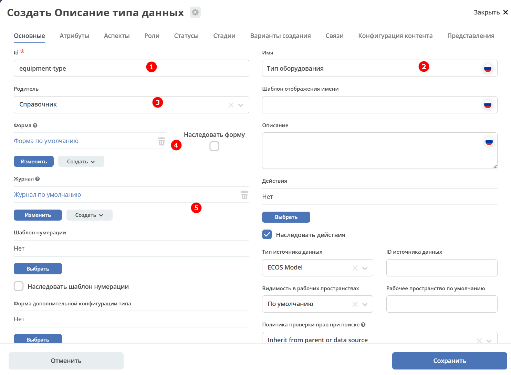

Атрибуты
~~~~~~~~~~

Заполните следующие атрибуты (свойства объекта):

.. list-table::
   :widths: 20 40 40
   :header-rows: 1
   :align: center
   :class: tight-table

   * - Id (1)
     - Имя (2)
     - Тип (3)
   * - type
     - Наименование
     - Text

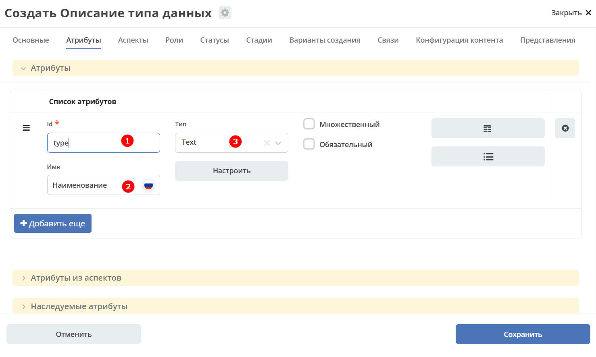

|

Нажмите **«Сохранить»**.

Добавьте журнал **type$equipment-type** в меню аналогично, как описано в :ref:`статье<journal_to_menu>`, и заполните его данными:

Тип данных
-----------

Добавление дополнительного атрибута
~~~~~~~~~~~~~~~~~~~~~~~~~~~~~~~~~~~~

Далее в существующий тип данных необходимо добавить атрибут **«Тип оборудования»**. Найдите тип данных **«Заявка на покупку оборудования»** и перейдите в режим редактирования:

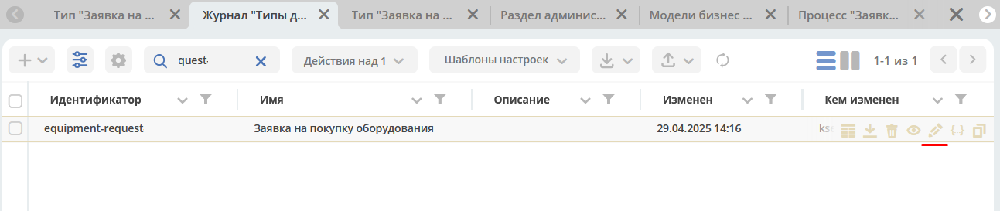

|

На вкладке **«Атрибуты»** нажмите **«+ Добавить еще»** и заполните строку следующими данными:

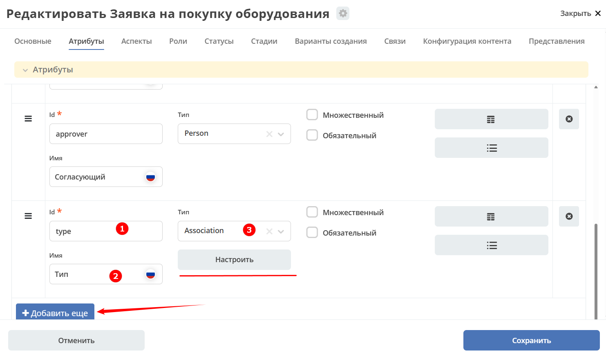

.. list-table::
   :widths: 20 40 40
   :header-rows: 1
   :align: center
   :class: tight-table

   * - Id (1)
     - Имя (2)
     - Тип (3)
   * - type
     - Тип
     - Association

Нажмите **«Настроить»**:

.. image:: _static/equipment_request_complicated/07.png
   :width: 500
   :align: center

|

Нажмите **«Выбрать»** и из списка типов данных выберите **«Тип оборудования»**:

.. list-table::
   :widths: 50 50
   :align: center

   * - |

         .. image:: _static/equipment_request_complicated/08.png
            :width: 600
            :align: center

     - |

         .. image:: _static/equipment_request_complicated/09.png
            :width: 500
            :align: center

Переместите добавленную строку под строку **«Название оборудования»**:

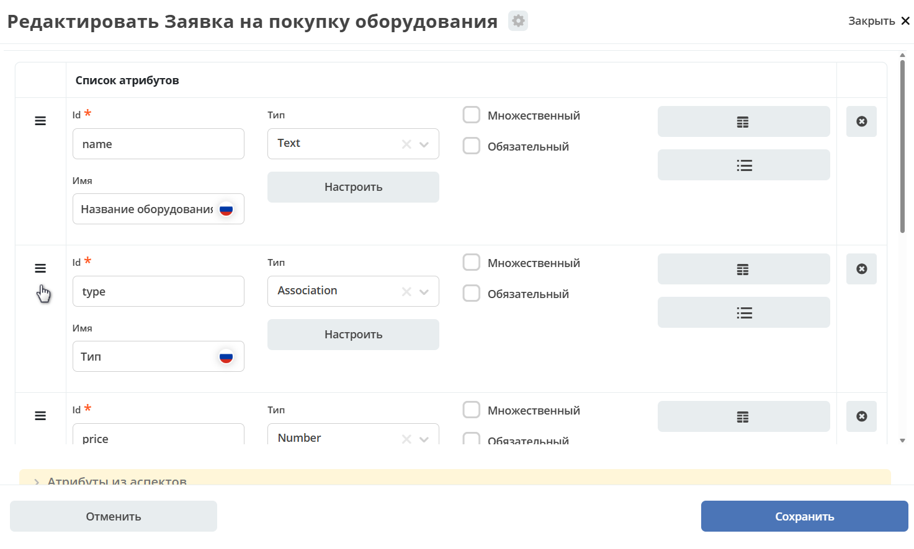

|

Также добавьте атрибут **«Комментарий согласующего»** — позже он будет добавлен и на форму согласования:

.. list-table::
   :widths: 20 40 40
   :header-rows: 1
   :align: center
   :class: tight-table

   * - Id (1)
     - Имя (2)
     - Тип (3)
   * - attributeForComment
     - Комментарий согласующего
     - Text

.. _sample_number_template:

Шаблон нумерации
~~~~~~~~~~~~~~~~~

.. note::

   Для создания шаблона нумерации в локальном рабочем пространстве в разделе **Администрирование** перейдите в пункт **Шаблоны нумерации**.

Номер можно присваивать автоматически и отражать в шаблоне отображения имени. Для этого необходимо настроить :ref:`Шаблон нумерации<number_template>`.

Перейдите на вкладку **«Основные»**:

.. image:: _static/equipment_request_complicated/11.png
   :width: 600
   :align: center

|

В поле **«Шаблон нумерации»** нажмите **«Выбрать»**, затем **«Создать — Создать новый шаблон»**:

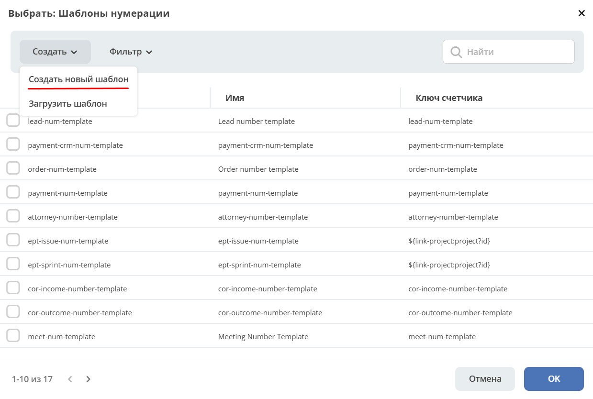

|

Заполните открывшуюся форму:

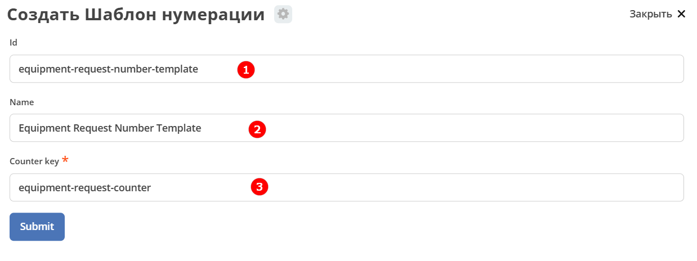

.. list-table::
   :widths: 10 30 60
   :header-rows: 1
   :align: center
   :class: tight-table

   * - №
     - Поле
     - Значение
   * - **1**
     - id
     - equipment-request-number-template
   * - **2**
     - Name
     - Equipment Request Number Template
   * - **3**
     - Counter key
     - equipment-request-counter

Выберите созданный шаблон:

.. image:: _static/equipment_request_complicated/14.png
   :width: 600
   :align: center

|

В поле **«Шаблон отображения имени»** укажите **Заявка_${_docNum}**:

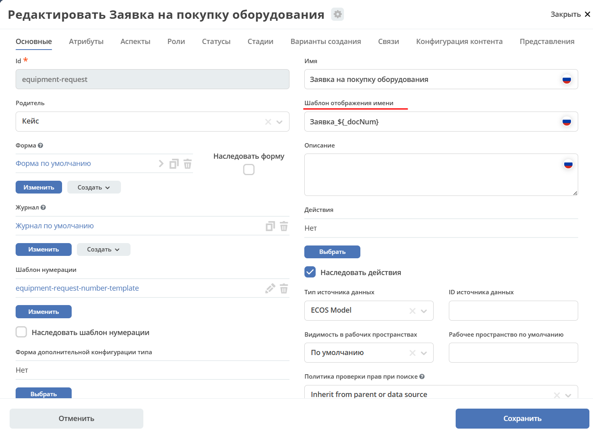

Журнал и форма не по умолчанию
---------------------------------

Для типа данных были созданы автоматически генерируемые форма и журнал, однако отредактировать их нельзя.

.. image:: _static/equipment_request_complicated/16.png
   :width: 600
   :align: center

Добавление полей в журнал
~~~~~~~~~~~~~~~~~~~~~~~~~~~

Перейдите в тип данных и скопируйте журнал, нажав соответствующую кнопку:

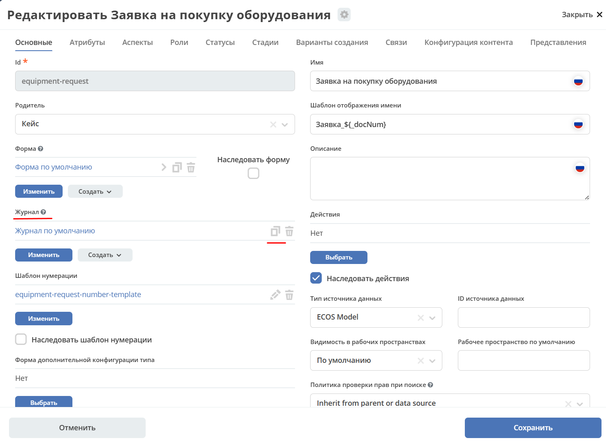

|

Откроется форма с названием по умолчанию:

.. image:: _static/equipment_request_complicated/18.png
   :width: 500
   :align: center

|

Переименуйте в **equipment-request** и нажмите **«Подтвердить»**:

.. image:: _static/equipment_request_complicated/18_1.png
   :width: 500
   :align: center

|

После сохранения создаётся новый журнал, и автосгенерированный журнал в типе данных заменяется на созданный.

Для его редактирования нажмите соответствующую кнопку:

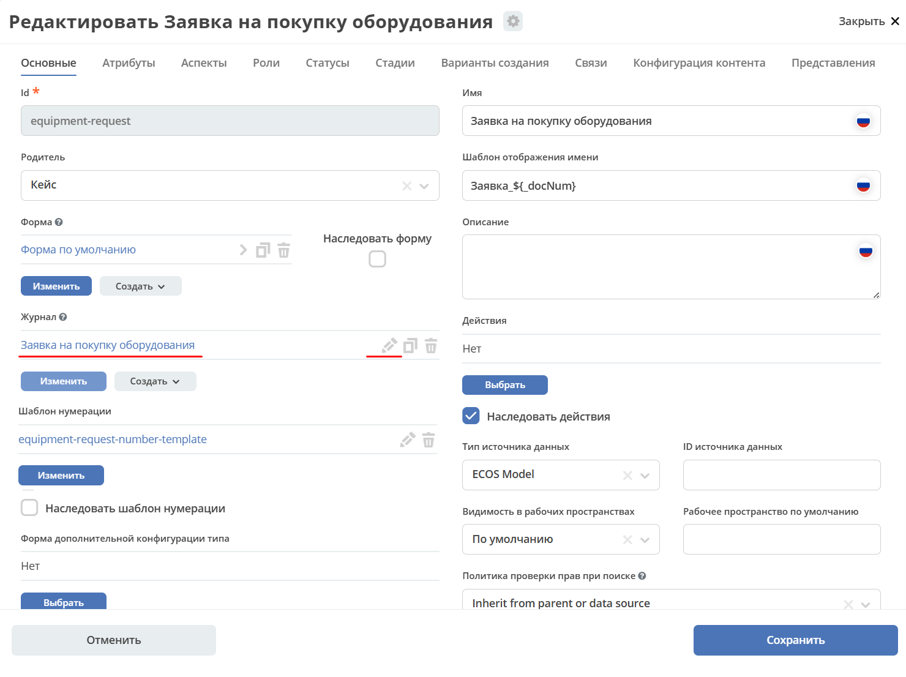

|

Откроется журнал, в который можно внести изменения:

.. image:: _static/equipment_request_complicated/20.png
   :width: 600
   :align: center

|

Добавьте в журнал следующие системные поля аналогично тому, как добавлялся **«Тип оборудования»**:

- **_created** — дата и время создания объекта (тип данных: **«Дата»**);
- **_disp** — отображаемое имя (т.к. задан **«Шаблон отображения имени»**, в поле будет отражаться **Заявка_{Номер}**);
- **_status** — статус объекта.

Нажмите **«+ Добавить»** и заполните строки следующими данными:

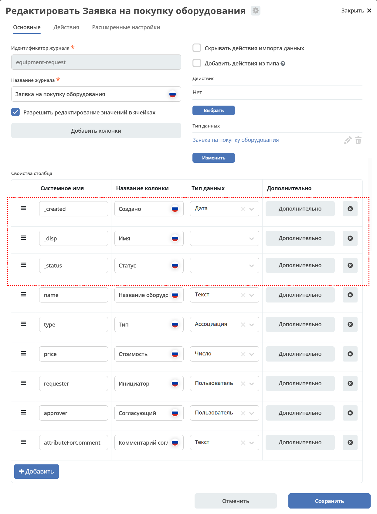

|

Нажмите **«Сохранить»**.

.. note::

   - Добавьте журнал **equipment-request** в меню аналогично, как :ref:`описано<journal_to_menu>`.
   - Автосгенерированный журнал **type$equipment-request** удалите из меню.

Откройте журнал **«Заявка на закупку оборудования»** — в него добавлены новые столбцы:

Изменение полей формы
~~~~~~~~~~~~~~~~~~~~~~

Перейдите в тип данных и скопируйте форму, нажав соответствующую кнопку:

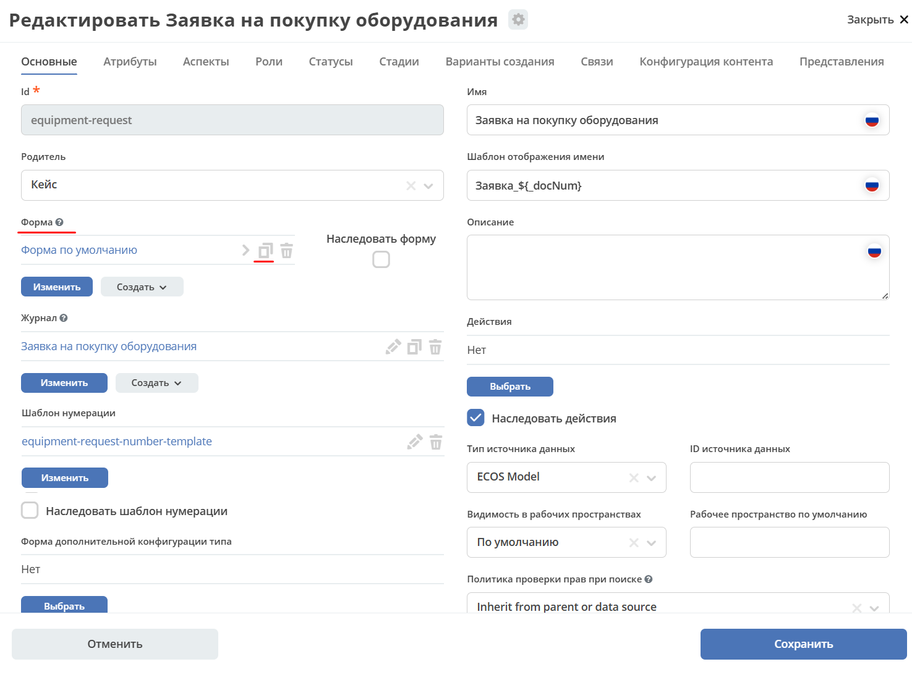

|

Откроется форма с названием по умолчанию:

.. image:: _static/equipment_request_complicated/23.png
   :width: 500
   :align: center

|

Переименуйте в **equipment-request** и нажмите **«Подтвердить»**:

.. image:: _static/equipment_request_complicated/23_1.png
   :width: 500
   :align: center

|

После сохранения создаётся новая форма, и автосгенерированная форма в типе данных заменяется на созданную. Для её редактирования нажмите соответствующую кнопку:

.. image:: _static/equipment_request_complicated/24.png
   :width: 600
   :align: center

|

Откроется форма, в которую можно внести изменения:

.. image:: _static/equipment_request_complicated/24_1.png
   :width: 600
   :align: center

|

Для перехода к редактированию элементов нажмите **«Редактировать форму»**:

.. image:: _static/equipment_request_complicated/25.png
   :width: 600
   :align: center

|

Внесите следующие изменения:

**1. Порядок полей.** Перетащите поле **«Тип»** под поле **«Название оборудования»**:

|

**2. Обязательное поле.** Сделайте поле **«Название оборудования»** обязательным для заполнения. Перейдите к редактированию элемента:

|

Откроется форма редактирования свойств элемента с предпросмотром в правой части:

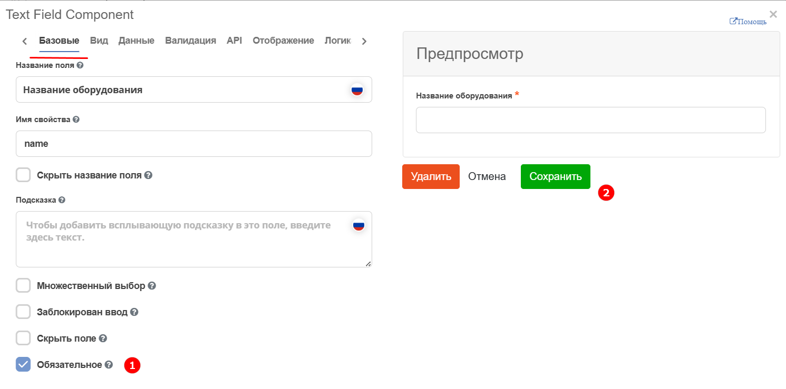

|

На вкладке **«Базовые»** установите чекбокс **«Обязательное» (1)** и сохраните **(2)**.

**3. Значение по умолчанию.** В поле **«Тип»** укажите значение по умолчанию. На вкладке **«Данные»**:

.. image:: _static/equipment_request_complicated/28.png
   :width: 600
   :align: center

|

Выберите значение по умолчанию:

.. image:: _static/equipment_request_complicated/29.png
   :width: 500
   :align: center

|

.. image:: _static/equipment_request_complicated/30.png
   :width: 600
   :align: center

|

Нажмите **«Сохранить»**.

**4. Текущий пользователь.** В поле **«Инициатор»** настройте автоматическое указание создающего заявку пользователя. На вкладке **«Кастомные»** установите чекбокс **«Текущий пользователь по умолчанию»** и сохраните:

.. image:: _static/equipment_request_complicated/31.png
   :width: 600
   :align: center

|

**5. Запрет ввода.** Поле **«Комментарий согласующего»** заполняется при согласовании — при создании заявки запретите ввод данных в него:

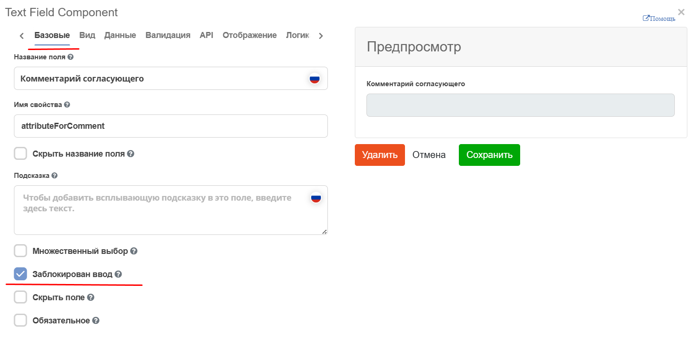

|

Нажмите **«Сохранить»**.

Отредактированная форма:

.. image:: _static/equipment_request_complicated/32.png
   :width: 600
   :align: center

|

.. image:: _static/equipment_request_complicated/33.png
   :width: 600
   :align: center

|

Нажмите **«Сохранить»**.

Перейдите в журнал **«Заявка на закупку оборудования»** и нажмите **+** — поля формы изменены:

.. image:: _static/equipment_request_complicated/34.png
   :width: 500
   :align: center

Добавление сохранения комментария согласующего
-----------------------------------------------

В тип данных и на форму был добавлен атрибут **«Комментарий согласующего»**. Теперь необходимо:

- **(1)** добавить атрибут в **форму задачи «На согласовании согласующим»**;
- **(2)** добавить элемент **Script task** в бизнес-процесс.

Добавление атрибута на форму (1)
~~~~~~~~~~~~~~~~~~~~~~~~~~~~~~~~~

- Перейдите в элемент **пользовательская задача «На согласовании согласующим»** и далее в режим редактирования формы:

  .. image:: _static/equipment_request_complicated/comment_to_form_01.png
     :width: 700
     :align: center

- Нажмите **«Редактировать форму»**:

  .. image:: _static/equipment_request_complicated/comment_to_form_02.png
     :width: 600
     :align: center

- Выберите элемент **Text area** (поскольку комментарий может содержать много символов):

  .. image:: _static/equipment_request_complicated/comment_to_form_03.png
     :width: 600
     :align: center

- Укажите:

  - **Название поля** — Комментарий согласующего
  - **Имя свойства** — comment

  и нажмите **«Сохранить»**:

  .. image:: _static/equipment_request_complicated/comment_to_form_04.png
     :width: 600
     :align: center

- Сохраните форму:

  .. image:: _static/equipment_request_complicated/comment_to_form_05.png
     :width: 600
     :align: center

Добавление скрипта в процесс (2)
~~~~~~~~~~~~~~~~~~~~~~~~~~~~~~~~~~

Между элементами **пользовательская задача «На согласовании согласующим»** и **Gateway** необходимо добавить :ref:`скриптовую задачу<script_task>`.

- Используя произвольное выделение **(1)**, выберите и переместите элементы левее:

  .. image:: _static/equipment_request_complicated/comment_to_bp_01.png
     :width: 600
     :align: center

- В меню выберите элемент **«Task»** и перетащите его за пользовательскую задачу **«На согласовании согласующим»**:

  .. image:: _static/equipment_request_complicated/comment_to_bp_02.png
     :width: 600
     :align: center

- Измените его тип на **Script task**:

  .. image:: _static/equipment_request_complicated/comment_to_bp_03.png
     :width: 300
     :align: center

- Укажите в форме:

  - **Имя** — Сохранение комментария
  - **Скрипт**:

  .. code-block::

     document.att('attributeForComment', comment);
     document.save();

  .. image:: _static/equipment_request_complicated/comment_to_bp_04.png
     :width: 300
     :align: center

Сохраните и опубликуйте процесс:

|

Для проверки процесса создайте заявку и отправьте её на согласование — ей будет присвоен номер вида **Заявка_N**.

Если согласующий вносит комментарий в задачу:

|

— он сохранится в карточке заявки:

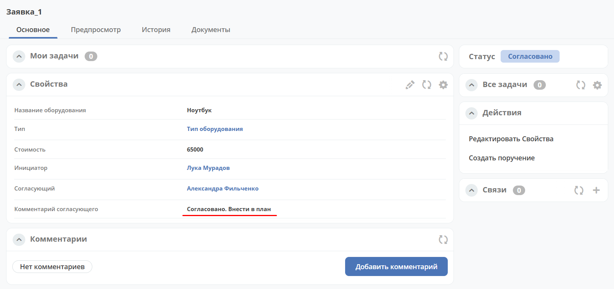
