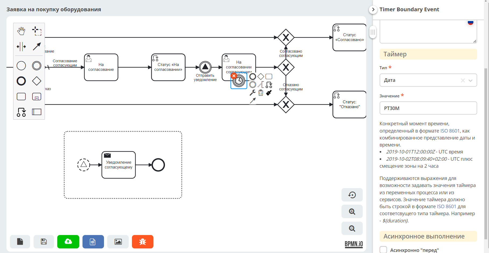
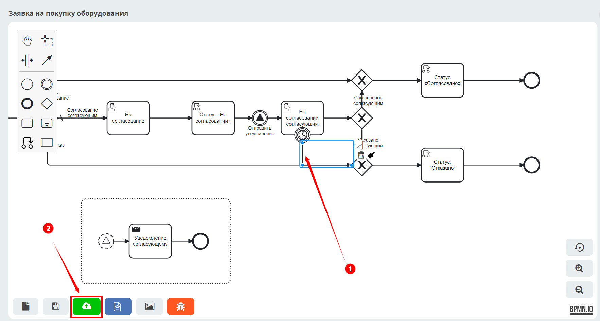
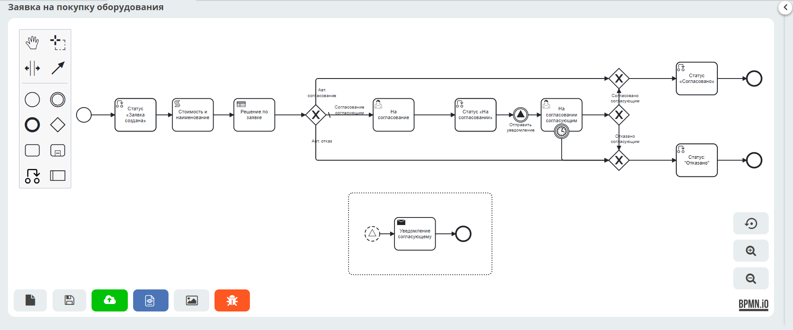

Процесс запроса на закупку оборудования. Добавление событий BPMN
=================================================================

.. contents::
	:depth: 3

.. note::

    Данная статья является продолжением работы с созданным ранее бизнес-процессом :ref:`Запрос на закупку оборудования<sample_request_dmn>` 

Добавим в созданный бизнес-процесс :ref:`события<bpmn_events>`:

    1. :ref:`Сигнал<ecos_bpmn_events>`, который запустит отдельный процесс отправки уведомления согласующему после получения заявкой статуса «На согласовании». 
    2. :ref:`Таймер»<ecos_bpmn_timer>`. Если согласующий не согласовал заявку в течение 30 минут, то она автоматически перейдет в статус «Отказано».

Сигнал
--------

Между компонентами **Статус «На согласовании»** и **Пользовательская задача «На согласовании согласующим»** необходимо добавить промежуточное событие :ref:`«Сигнал»<ecos_bpmn_events>`

Далее выбрать его тип **Signal Intermediate Throw event**:

Укажите свойства события:

    •	Имя - **Отправить уведомление**
    •	Имя сигнала - **sendEmail**,
    •	Фильтр события по документу – **Текущий документ**

И далее добавьте :ref:`событийный подпроцесс «Сигнал»<event_subprocess>` - подпроцесс, запускаемый событием. Для создания событийного подпроцесса создайте сначала стандартный подпроцесс. И далее выберите **Event Sub Process**:

.. image:: _static/equipment_request_events/event_04.png
       :width: 600
       :align: center

В подпроцессе измените **Start event** на **Signal Start event (non-interrupting)**:

.. image:: _static/equipment_request_events/event_05.png
       :width: 600
       :align: center

Со следующими свойствами:

    •	Чекбокс **Ручная настройка**
    •	Имя сигнала – **sendEmail** 
    •	Фильтр события по документу – **Текущий документ**

.. image:: _static/equipment_request_events/event_06.png
       :width: 600
       :align: center

К начальному событию добавьте компонент :ref:`Уведомление<notification>`:

.. image:: _static/equipment_request_events/event_07.png
       :width: 600
       :align: center

со следующими свойствами:

    •	Имя – **Уведомление согласующему**
    •	Заголовок – **Согласуйте заявку**
    •	Тело сообщения – **Согласуйте заявку на покупку оборудования**
    •	Кому – **Согласующий**

.. image:: _static/equipment_request_events/event_08.png
       :width: 600
       :align: center

Добавьте **End Event** компонент **(1)**:

**Опубликуйте** бизнес-процесс **(2)**.

Для проверки создайте заявку, чтобы процесс пошел по ветке с согласованием сотрудником. Для этого укажите любое другое название оборудования, не указанное в таблице, или укажите:

    •	Название оборудование – **Ноутбук**
    •	Стоимость - **65000**
    •	Инициатор – **текущий пользователь**
    •	Согласующий – **любой пользователь, у которого в профиле указан электронный адрес.**

Для проверки созданного уведомления перейдите в журнал **«Уведомления» (Раздел администратора – Конфигурация уведомлений - Уведомления)**.

Нажмите:

.. image:: _static/equipment_request_events/notification_01.png
       :width: 600
       :align: center

Откроется форма уведомления. В данных уведомления указано всё то, что мы настраивали в компоненте **Send task**:

Таймер
--------

К компоненту **Пользовательская задача «На согласовании согласующим»** необходимо добавить промежуточное событие :ref:`«Таймер»<ecos_bpmn_timer>`:

Далее перенесите событие на компонент **Пользовательская задача «На согласовании согласующим»**:

Выберите **Timer Boundary Event**:

.. image:: _static/equipment_request_events/timer_03.png
       :width: 600
       :align: center

Укажите свойства события:

       • Тип – **Дата**
       • Значение – **PT30M** В формате ISO 8601 **PT30M - 30 минут**. Подробно о :ref:`формате<time_format>`

Поток от таймера отведите к **gateway (1)**:

**Опубликуйте** бизнес-процесс **(2)**.

Для проверки создайте заявку, чтобы процесс пошел по ветке с согласованием сотрудником. Для этого укажите любое другое название оборудования, не указанное в таблице, или укажите:

    •	Название оборудование – **Ноутбук**
    •	Стоимость - **65000**
    •	Инициатор – **текущий пользователь**
    •	Согласующий – **любой пользователь, у которого в профиле указан электронный адрес.**

Когда процесс дойдет до согласования согласующим, не выносите решение по задаче – через 30 минут заявка будет автоматически переведена в статус **«Отказано»**.

Весь процесс финально:

