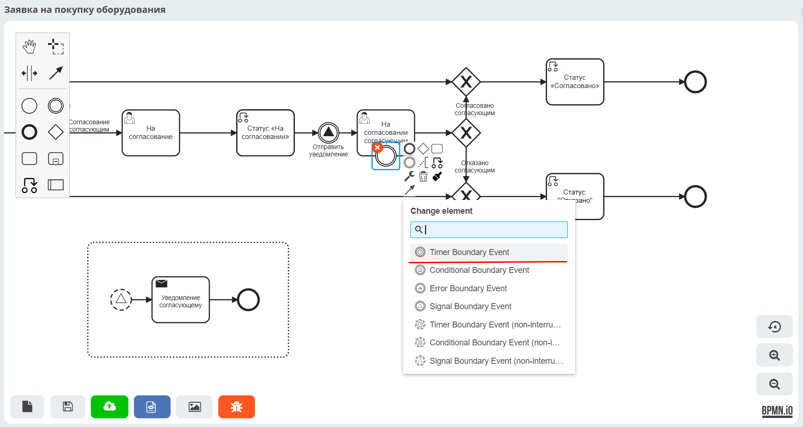

.. _sample_request_events:

Процесс заявки на закупку оборудования. Добавление событий BPMN
=================================================================

.. contents::
   :depth: 3

.. note::

   Данная статья является продолжением работы с бизнес-процессом, созданным в разделе :ref:`Заявка на закупку оборудования. Включение DMN в процесс<sample_request_dmn>`.

В этой части мы расширим бизнес-процесс, добавив два типа :ref:`событий BPMN<bpmn_events>`:

1. :ref:`Сигнал<ecos_bpmn_events>` — запускает событийный подпроцесс отправки уведомления согласующему в момент, когда заявка получает статус «На согласовании».
2. :ref:`Таймер<ecos_bpmn_timer>` — если согласующий не принял решение по заявке в течение заданного времени, она автоматически переходит в статус «Отказано».

Итоговая схема процесса:

.. image:: _static/equipment_request_events/01.png
   :width: 600
   :align: center

Сигнал
------

Между компонентами **Статус «На согласовании»** и **Пользовательская задача «На согласовании согласующим»** добавьте промежуточное событие :ref:`«Сигнал»<ecos_bpmn_events>`:

.. image:: _static/equipment_request_events/event_01.png
   :width: 600
   :align: center

Выберите тип события **Signal Intermediate Throw Event**:

.. image:: _static/equipment_request_events/event_02.png
   :width: 600
   :align: center

Укажите свойства события:

- **Имя** — **Отправить уведомление**
- **Имя сигнала** — **sendEmail**
- **Фильтр события по документу** — **Текущий документ**

.. image:: _static/equipment_request_events/event_03.png
   :width: 600
   :align: center

Добавьте :ref:`событийный подпроцесс «Сигнал»<event_subprocess>` — подпроцесс, запускаемый по событию. Для этого сначала создайте стандартный подпроцесс, затем измените его тип на **Event Sub Process**:

.. image:: _static/equipment_request_events/event_04.png
   :width: 600
   :align: center

Внутри подпроцесса замените **Start Event** на **Signal Start Event (non-interrupting)**:

Укажите свойства начального события:

- **Ручная настройка** — включить (чекбокс)
- **Имя сигнала** — **sendEmail**
- **Фильтр события по документу** — **Текущий документ**

К начальному событию добавьте компонент :ref:`Уведомление<notification>`:

Укажите свойства уведомления:

- **Имя** — **Уведомление согласующему**
- **Заголовок** — **Согласуйте заявку**
- **Тело сообщения** — **Согласуйте заявку на покупку оборудования**
- **Кому** — **Согласующий**

Добавьте компонент **End Event (1)** и **опубликуйте** бизнес-процесс **(2)**:

.. image:: _static/equipment_request_events/event_09.png
   :width: 600
   :align: center

Проверка сигнала
^^^^^^^^^^^^^^^^

Создайте заявку так, чтобы процесс прошёл по ветке с согласованием сотрудником. Укажите оборудование, не входящее в таблицу DMN, или используйте следующие данные:

- **Название оборудования** — **Ноутбук**
- **Стоимость** — **65000**
- **Инициатор** — текущий пользователь
- **Согласующий** — любой пользователь с указанным e-mail в профиле

Если Citeck установлен с помощью :ref:`кроссплатформенного лончера<citeck_launcher>`, перейдите в **Mailhog** для просмотра тестовых писем:

**Mailhog** — инструмент для тестирования e-mail-рассылок, позволяющий просматривать письма без реальной отправки на почтовые серверы:

Откройте письмо и убедитесь, что уведомление доставлено:

Также проверить уведомление можно в рабочем пространстве администратора: в разделе **Конфигурация уведомлений** откройте пункт **Уведомления**.

.. note::

   Если процесс создан в локальном рабочем пространстве, перейдите напрямую в раздел **Уведомления** текущего рабочего пространства.

Выберите нужное уведомление из списка:

.. image:: _static/equipment_request_events/notification_01.png
   :width: 700
   :align: center

Откроется форма уведомления. В ней отображаются все настройки, заданные в компоненте **Send Task**:

.. image:: _static/equipment_request_events/notification_02.png
   :width: 600
   :align: center

Таймер
------

К компоненту **Пользовательская задача «На согласовании согласующим»** добавьте граничное событие :ref:`«Таймер»<ecos_bpmn_timer>`:

.. image:: _static/equipment_request_events/timer_01.png
   :width: 600
   :align: center

Перенесите событие непосредственно на компонент **Пользовательская задача «На согласовании согласующим»**:

.. image:: _static/equipment_request_events/timer_02.png
   :width: 600
   :align: center

Выберите тип события **Timer Boundary Event**:

Укажите свойства события:

- **Тип** — **Продолжительность**
- **Значение** — **PT1M** в формате `ISO 8601 <https://en.wikipedia.org/wiki/ISO_8601>`_ (``PT1M`` — 1 минута; подробнее о :ref:`форматах времени<time_format>`)

.. image:: _static/equipment_request_events/timer_04.png
   :width: 600
   :align: center

Направьте поток от таймера к **Gateway (1)** и **опубликуйте** бизнес-процесс **(2)**:

.. image:: _static/equipment_request_events/timer_05.png
   :width: 600
   :align: center

Проверка таймера
^^^^^^^^^^^^^^^^

Создайте заявку так, чтобы процесс прошёл по ветке с согласованием сотрудником. Укажите оборудование, не входящее в таблицу DMN, или используйте следующие данные:

- **Название оборудования** — **Ноутбук**
- **Стоимость** — **65000**
- **Инициатор** — текущий пользователь
- **Согласующий** — любой пользователь с указанным e-mail в профиле

Когда процесс дойдёт до шага согласования, не принимайте решение по задаче — через 1 минуту заявка автоматически перейдёт в статус **«Отказано»**.

Итоговая схема процесса
-----------------------

.. image:: _static/equipment_request_events/02.png
   :width: 600
   :align: center
