.. _sample_request_dmn:

Процесс заявки на закупку оборудования. Включение DMN в процесс
================================================================

.. contents::
   :depth: 3

.. note::

   Данная статья является продолжением :ref:`Заявки на закупку оборудования<sample_request>`.

   Если вы следуете статье :ref:`Процесс заявки на закупку оборудования. Добавление справочника. Журнал и форма не по умолчанию<sample_request_complicated>`, удалите **Script task «Сохранение комментария»** перед началом.

   Для работы в локальном рабочем пространстве перейдите в **Администрирование → Модели DMN** и нажмите **+ — Создать DMN модель**.

Закупку оборудования всегда согласовывают: если заявка не соответствует установленным критериям — её отклоняют. Часть таких решений можно автоматизировать с помощью :ref:`таблицы принятия решений<dmn_decision>` (DMN).

DMN обрабатывает входящие данные процесса и на их основе принимает конечные или промежуточные бизнес-решения.

Создание таблицы принятия решений
----------------------------------

Для таблицы необходимо определить критерии принятия решения. Основные критерии — наименование оборудования и его стоимость.

Перейдите в **рабочее пространство администратора**. В разделе **Управление процессами** выберите **Модели DMN**:

.. image:: _static/equipment_request_p2/01.png
   :width: 700
   :align: center

Нажмите **«+ — Создать DMN модель»**:

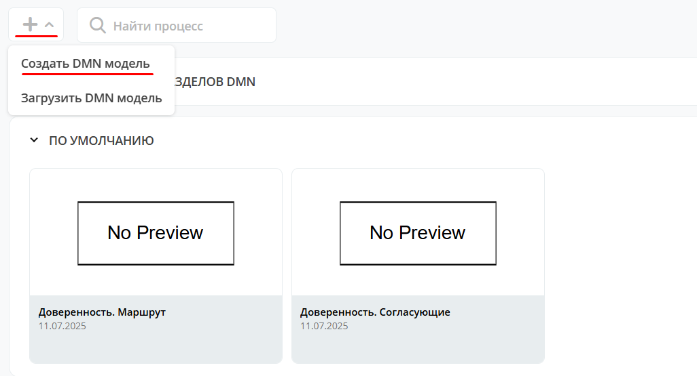

Заполните поля:

.. list-table::
   :widths: 10 20 30
   :align: center
   :class: tight-table

   * - **1**
     - Идентификатор
     - equipment-decision
   * - **2**
     - Имя
     - Решение по заявке на покупку оборудования

Нажмите **«Сохранить»**.

Для перехода в редактор разверните раздел **«По умолчанию»**, наведите курсор на созданную модель и нажмите:

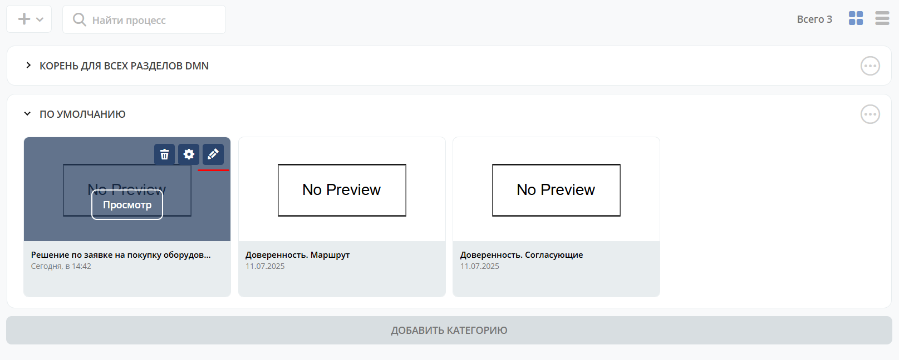

Откроется **решение**:

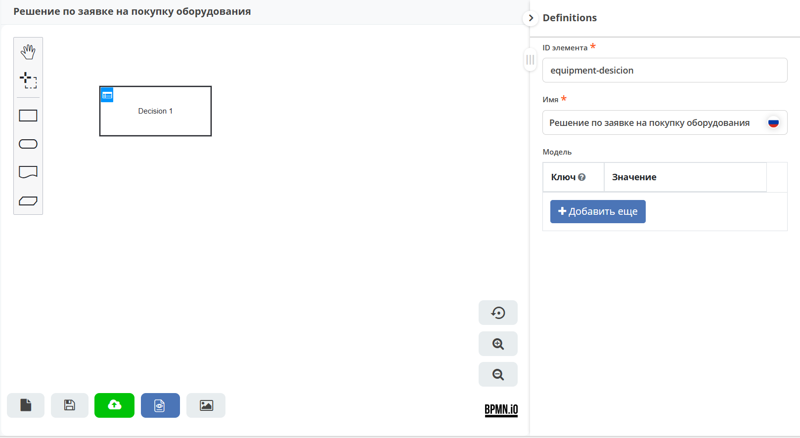

.. _request_dmn_decision:

Для ввода данных в таблицу кликните:

|

Двойным кликом по наименованию решения **(1)** перейдите в режим редактирования и введите **Комп техника**.

**Hit policy (2)** — :ref:`политика выбора<dmn_hit_policy>`. Оставьте значение **Unique** (по умолчанию).

**(3)** — входные элементы, **(4)** — выходные элементы. Совокупность входных и выходного элементов формирует решение.

.. note::

   Переменные входных и выходных элементов, указанные ниже, потребуются при настройке **Business rule task** в целевом бизнес-процессе.

Входные элементы
~~~~~~~~~~~~~~~~

Дважды кликните поле под **When** и введите **Наименование**:

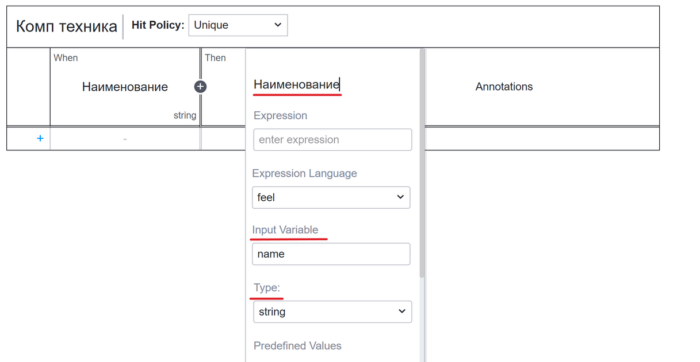

В свойствах укажите:

.. list-table::
   :widths: 10 20 30
   :header-rows: 1
   :align: center
   :class: tight-table

   * - Поле
     - Значение
     - Пояснение
   * - Input Variable
     - name
     - Соответствует атрибуту ``name`` из :ref:`типа данных<sample_request_attributes>`. Передаётся как переменная в бизнес-процесс.
   * - Type
     - string
     - Типу ``string`` соответствует ``text`` в :ref:`типе данных<sample_request_attributes>`.

Нажмите **+** для добавления второго входного элемента:

Дважды кликните поле под **When** и введите **Стоимость**:

.. image:: _static/equipment_request_p2/10.png
   :width: 600
   :align: center

В свойствах укажите:

.. list-table::
   :widths: 10 20 30
   :header-rows: 1
   :align: center
   :class: tight-table

   * - Поле
     - Значение
     - Пояснение
   * - Input Variable
     - price
     - Соответствует атрибуту ``price`` из :ref:`типа данных<sample_request_attributes>`. Передаётся как переменная в бизнес-процесс.
   * - Type
     - integer
     - Типу ``integer`` соответствует ``number`` в :ref:`типе данных<sample_request_attributes>`.

Выходной элемент
~~~~~~~~~~~~~~~~

Дважды кликните поле под **Then** и введите **Решение**:

В свойствах укажите:

.. list-table::
   :widths: 10 20 30
   :header-rows: 1
   :align: center
   :class: tight-table

   * - Поле
     - Значение
     - Пояснение
   * - Output Name
     - decision
     - Передаётся в бизнес-процесс как переменная результата.
   * - Type
     - string
     -

.. _sample_request_dmn_rules:

Правила
~~~~~~~

Автоматическое согласование, отказ или назначение согласующего зависит от наименования оборудования и его стоимости.

Для примера возьмём 3 товара: **Монитор**, **Мышь**, **Ноутбук**. Для каждого зададим диапазон стоимости и соответствующее решение:

.. list-table::
   :widths: 15 35
   :align: center
   :class: tight-table

   * - ``"Approve"``
     - Согласовано автоматически
   * - ``"Reject"``
     - Отказано автоматически
   * - ``"Assign approver"``
     - Назначение согласующего

В зависимости от решения процесс пойдёт по соответствующему потоку управления.

Добавьте первое правило: для **Монитора** стоимостью **15 000 и менее** — решение **Approve**.

.. note::

   Поля **Наименование** и **Решение** имеют тип ``string``, поэтому значения необходимо указывать в **кавычках**.

Нажмите **«+»** внизу таблицы или кликните в любом месте последней строки, чтобы добавить следующее правило.

Добавьте второе правило: для **Монитора** стоимостью **больше 15 000** — решение **Reject**.

Итоговая таблица правил:

.. list-table::
   :widths: 20 20 20
   :header-rows: 1
   :align: center
   :class: tight-table

   * - Наименование
     - Цена
     - Решение
   * - ``"Монитор"``
     - ``<=15000``
     - ``"Approve"``
   * - ``"Монитор"``
     - ``>15000``
     - ``"Reject"``
   * - ``"Мышь"``
     - ``<=1500``
     - ``"Approve"``
   * - ``"Мышь"``
     - ``>1500``
     - ``"Reject"``
   * - ``"Ноутбук"``
     - ``<=60000``
     - ``"Approve"``
   * - ``"Ноутбук"``
     - ``>250000``
     - ``"Reject"``
   * - ``"Ноутбук"``
     - ``[60000..249999]``
     - ``"Assign approver"``

Сохраните и опубликуйте таблицу принятия решений:

Добавление модели принятия решения в бизнес-процесс
-----------------------------------------------------

Добавим модель в существующий бизнес-процесс. Для этого необходимо:

- Настроить **переменные процесса (1)** — чтобы модель и бизнес-процесс могли взаимодействовать.
- Добавить элемент **Business rule task (2)** — для встраивания модели в процесс.
- Настроить **шлюз и потоки управления (3) и (4)** — для маршрутизации по нужным ветвям.

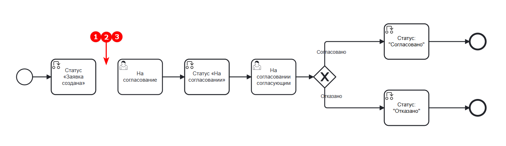

Добавление переменных в процесс (1)
~~~~~~~~~~~~~~~~~~~~~~~~~~~~~~~~~~~~~

Между элементами **Статус «Заявка создана»** и **пользовательская задача «На согласование»** добавьте :ref:`скриптовую задачу<script_task>`.

Используя произвольное выделение **(1)**, выберите и переместите элементы левее:

В меню выберите элемент **«Task»** и перетащите его после **статуса «Заявка создана»**:

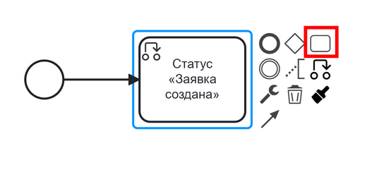

Измените тип элемента на **Script task**:

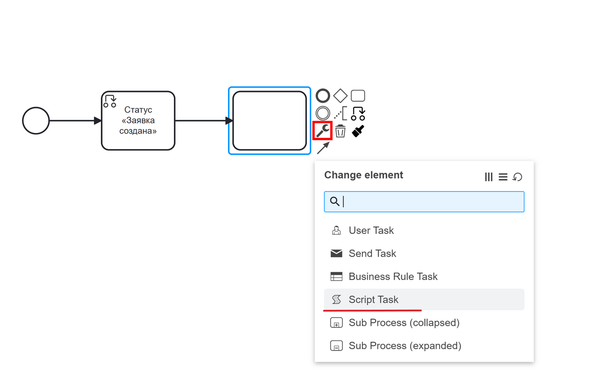

Чтобы данные входных элементов решения стали доступны в бизнес-процессе, их необходимо передать в виде переменных.

Заполните форму:

- **Имя** — ``Стоимость и наименование``
- **Скрипт**:

  .. code-block::

     execution.setVariable('price', document.load("price?num"));
     execution.setVariable('name', document.load("name"));

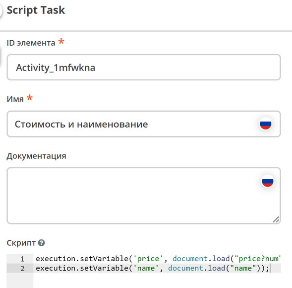

Добавление элемента Business rule task (2)
~~~~~~~~~~~~~~~~~~~~~~~~~~~~~~~~~~~~~~~~~~~~

Добавьте :ref:`Business rule task<business_rule_task>` следующим элементом после скриптовой задачи.

Используя произвольное выделение **(1)**, выберите и переместите элементы левее. В меню выберите **«Task»** и перетащите его за созданную скриптовую задачу.

Измените тип элемента на **Business Rule Task**:

Заполните форму:

- **Имя** — ``Решение по заявке``
- **Решение** — выберите из журнала созданное ранее решение
- **Связь** — ``Актуальное`` (всегда последняя версия решения)
- **Переменная результата** — ``decision`` (задана при создании выходного элемента)
- **Сопоставление результатов решения** — ``Один объект (TypedValue)`` (так как на выходе одно значение)

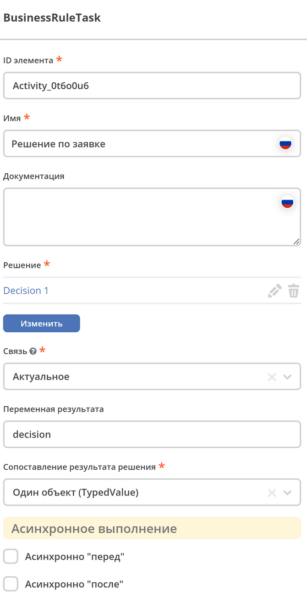

Обновление шлюзов и потоков управления (3) и (4)
~~~~~~~~~~~~~~~~~~~~~~~~~~~~~~~~~~~~~~~~~~~~~~~~~~

После элемента **Решение по заявке** добавьте **шлюз** с тремя выходами в соответствии с :ref:`правилами<sample_request_dmn_rules>`, а также два дополнительных шлюза к первоначально созданному в базовом процессе:

.. image:: _static/equipment_request_p2/23_0.png
   :width: 600
   :align: center

Соедините элементы:

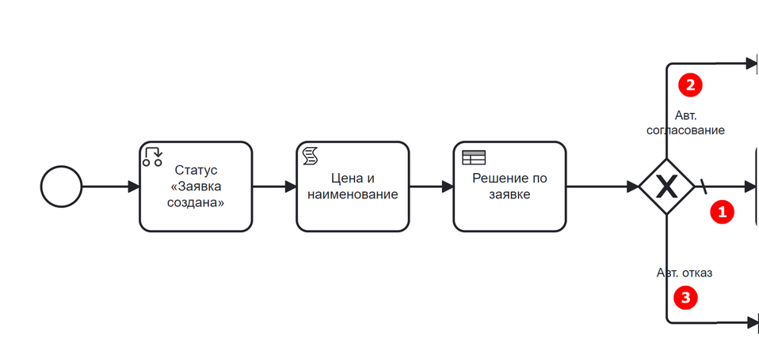

где:

- **1** — **«Assign approver»** (согласование назначенным сотрудником)
- **2** — **«Approve»** (автоматическое согласование)
- **3** — **«Reject»** (автоматический отказ)

.. list-table::
   :widths: 20 50
   :align: center
   :class: tight-table

   * - **1 — Согласование сотрудником**
     - | Поток **(1)** является потоком по умолчанию. Для его настройки:

         .. image:: _static/equipment_request_p2/24.png
            :width: 400
            :align: center

       | После потока по умолчанию следуют элементы базового процесса:

         .. image:: _static/equipment_request_p2/25.png
            :width: 400
            :align: center

   * - **2 — Авт. согласование**
     - | Поток автоматического согласования:

         - **Имя** — ``Авт. согласование``
         - **Скрипт**:

           .. code-block::

              decision === 'Approve';

         .. image:: _static/equipment_request_p2/26.png
            :width: 300
            :align: center

   * - **3 — Авт. отказ**
     - | Поток автоматического отказа:

         - **Имя** — ``Авт. отказ``
         - **Скрипт**:

           .. code-block::

              decision === 'Reject';

         .. image:: _static/equipment_request_p2/27.png
            :width: 300
            :align: center

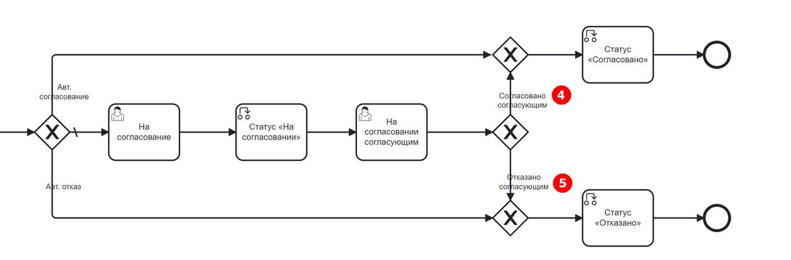

Потоки **(4)** и **(5)** были настроены в базовом процессе:

.. list-table::
   :widths: 20 50
   :align: center
   :class: tight-table

   * - **4 — Согласовано согласующим**
     - |

         - **Имя** — ``Согласовано согласующим``
         - **Тип условия** — ``Исходящий``
         - **Исходящий** — ``На согласовании согласующим — Согласовать``

         .. image:: _static/equipment_request_p2/29.png
            :width: 300
            :align: center

   * - **5 — Отказано согласующим**
     - |

         - **Имя** — ``Отказано согласующим``
         - **Тип условия** — ``Исходящий``
         - **Исходящий** — ``На согласовании согласующим — Отказать``

         .. image:: _static/equipment_request_p2/30.png
            :width: 300
            :align: center

Сохраните и опубликуйте процесс:

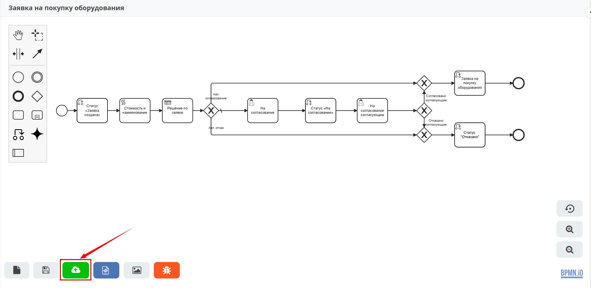

Проверка процесса
-----------------

Проверим работу таблицы принятия решений.

.. note::

   Чтобы решение принималось автоматически, название оборудования в форме заявки должно точно совпадать (включая регистр) с наименованием в таблице принятия решений. Будьте внимательны при использовании символов Unicode.

Автоматическое согласование
~~~~~~~~~~~~~~~~~~~~~~~~~~~~~

Создайте заявку в журнале:

- **Название оборудования** — ``Мышь``
- **Стоимость** — ``500``
- **Инициатор** — текущий пользователь
- **Согласующий** — текущий пользователь или другой из оргструктуры

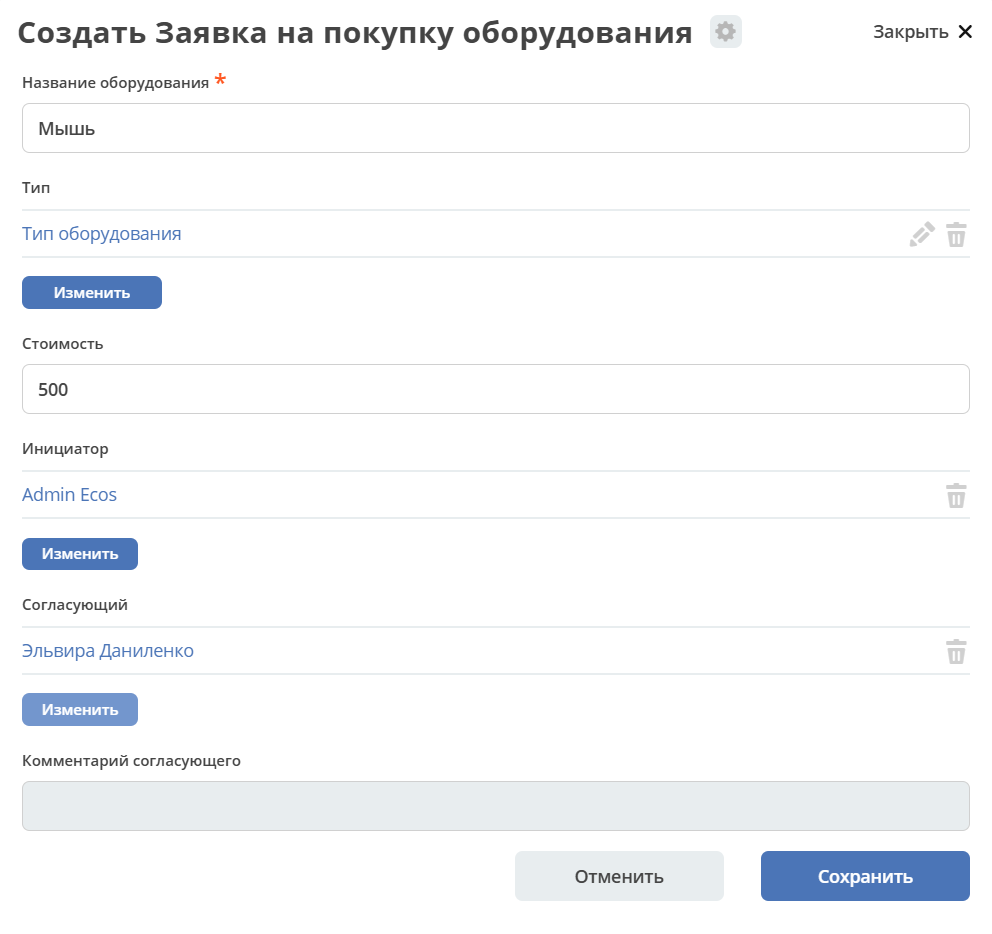

Нажмите **«Сохранить»**. Статус заявки автоматически изменится на **«Согласовано»**:

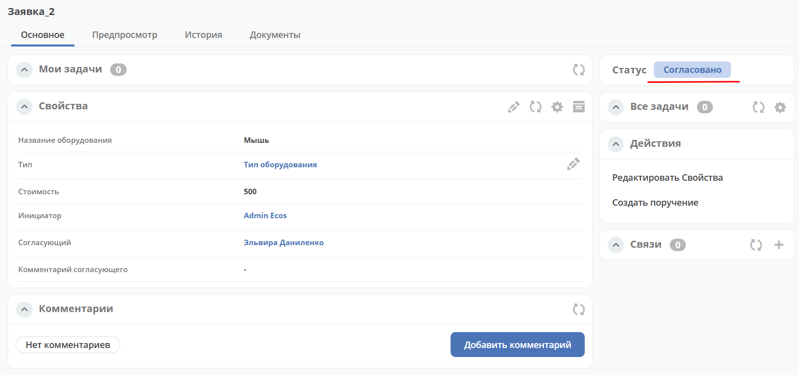

Автоматический отказ
~~~~~~~~~~~~~~~~~~~~~

Создайте заявку в журнале:

- **Название оборудования** — ``Монитор``
- **Стоимость** — ``250001``
- **Инициатор** — текущий пользователь
- **Согласующий** — текущий пользователь или другой из оргструктуры

Нажмите **«Сохранить»**. Статус заявки автоматически изменится на **«Отказано»**:

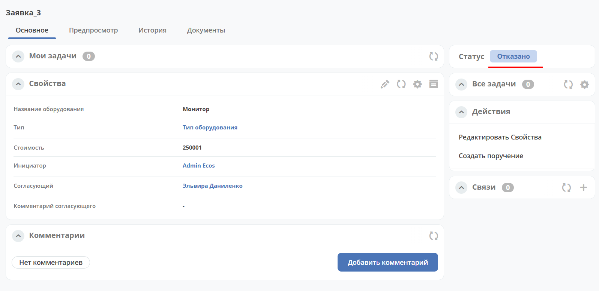

Согласование сотрудником (поток по умолчанию)
~~~~~~~~~~~~~~~~~~~~~~~~~~~~~~~~~~~~~~~~~~~~~~

Если указать наименование, отсутствующее в таблице, или указать:

- **Название оборудования** — ``Ноутбук``
- **Стоимость** — ``65000``
- **Инициатор** — текущий пользователь
- **Согласующий** — текущий пользователь или другой из оргструктуры

процесс выполнится стандартным образом, как в :ref:`базовой Заявке на закупку оборудования<sample_request>`:

