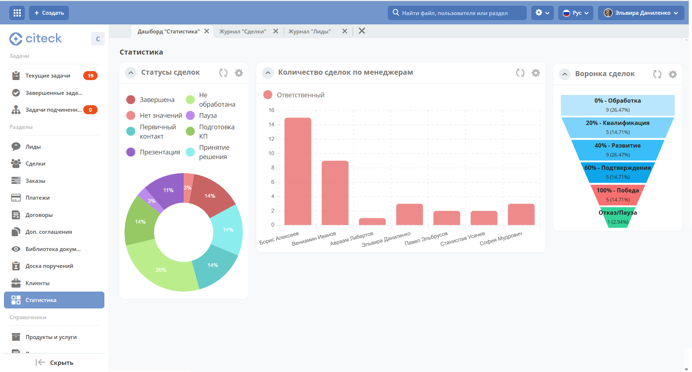
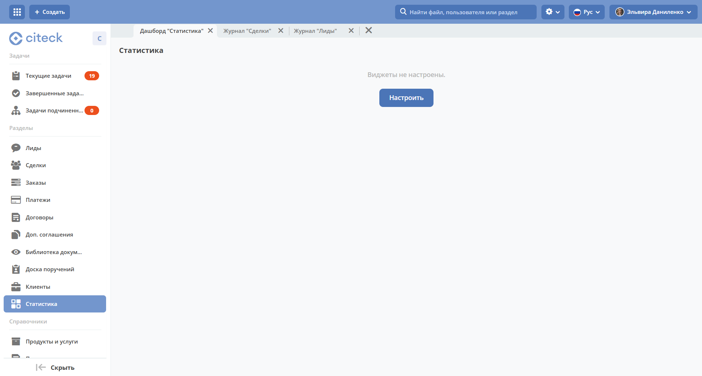
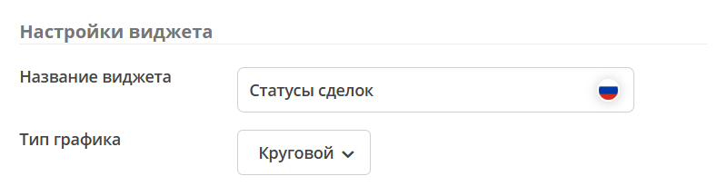
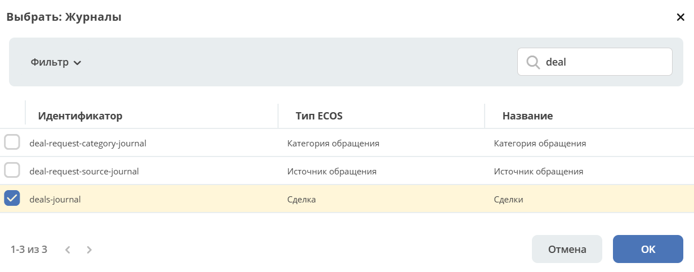
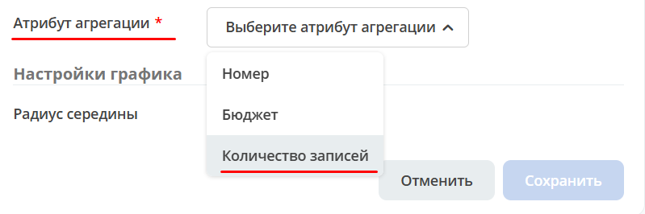
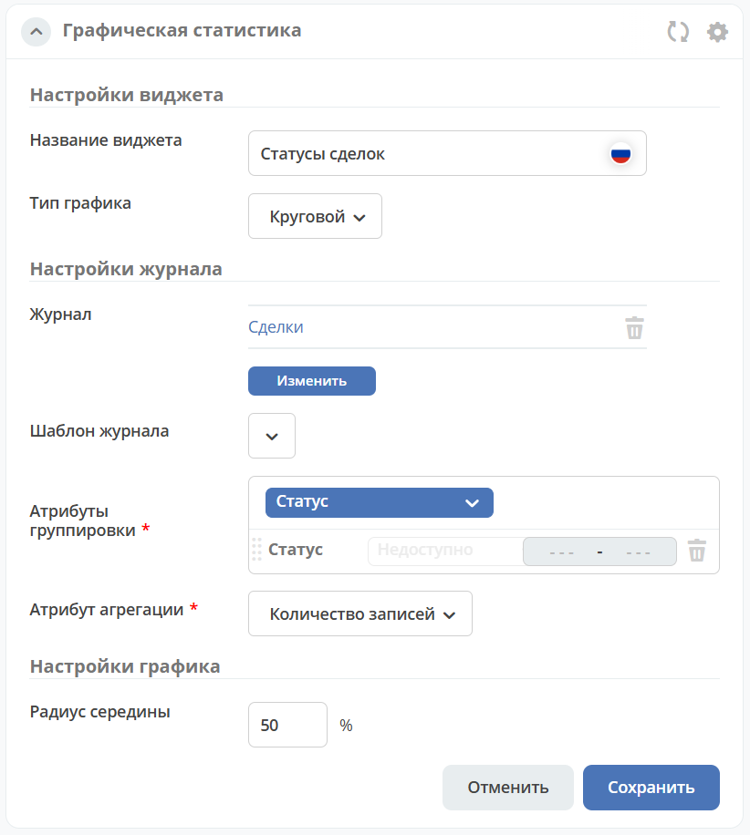
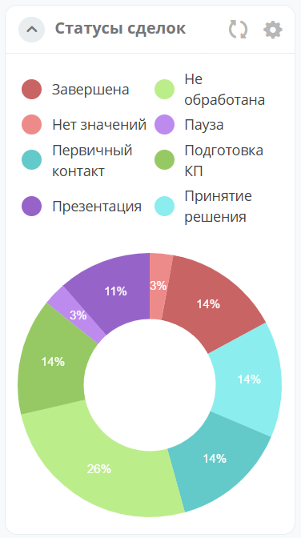

.. _sample_dashboard:

Пример создания дашборда и настройки виджета «Графическая статистика»
=======================================================================

.. contents::
   :depth: 3

Общее описание виджета
-----------------------

Виджет :ref:`Графическая статистика<widget_graphic_statistics>` позволяет наглядно представлять и анализировать данные, повышая эффективность принятия решений и улучшая понимание текущего состояния бизнес-процессов.

Виджет поддерживает следующие типы графиков:

- линейные;
- столбчатые;
- круговые;
- воронки.

Пользователи могут выбирать источник данных для графика, включая атрибуты и колонки, связанные с кейсами и справочниками платформы ECOS. Графики конфигурируемые — можно настраивать оси, масштабирование и другие параметры отображения.

Добавление дашборда
--------------------

.. note::

   Функционал доступен для пользователя с ролью менеджера рабочего пространства.

:ref:`Виджеты<widgets>` добавляются на отдельный :ref:`дашборд<dashboard>`. Для этого перейдите в настройки :ref:`меню<menu>`:

.. image:: _static/g_stat/02.png
   :width: 500
   :align: center

Добавьте в раздел **Дашборд**:

Укажите **название**, выберите иконку и сохраните:

Нажмите **«Применить»** для сохранения настроек:

Перейдите в созданный дашборд через меню и нажмите **«Настроить»**:

Настройка дашборда
-------------------

1. Укажите количество и содержимое вкладок **(1)**.
2. Выберите расположение и количество колонок для каждой вкладки **(2)**.
3. Заполните колонки виджетами — перетащите **«Графическая статистика»** в нужную колонку **(3)**.

Нажмите **«Применить»** — откроется дашборд, в котором можно настроить каждый виджет:

Настройка виджета «Графическая статистика»
-------------------------------------------

Для перехода к настройкам нажмите кнопку редактирования виджета:

В качестве примера настроим круговой график, отображающий процентное соотношение статусов заявок.

.. image:: _static/g_stat/12.png
   :width: 500
   :align: center

Шаг 1. Название и тип графика
~~~~~~~~~~~~~~~~~~~~~~~~~~~~~~

Укажите **название** виджета **(1)** и выберите тип **«Круговой»** **(2)**:

Шаг 2. Источник данных
~~~~~~~~~~~~~~~~~~~~~~~

Выберите **журнал** **(3)**, по данным которого будет построен график:

.. note::

   В выбранном журнале должны быть заранее настроены колонки для группировки. Это действие доступно администратору. Подробнее см. :ref:`описание виджета<widget_graphic_statistics>`.

Шаг 3. Группировка и агрегация
~~~~~~~~~~~~~~~~~~~~~~~~~~~~~~~~

После выбора журнала станут доступны настройки **группировки** и **агрегации**:

**Группировка** — операция объединения данных в группы по общему атрибуту.

Выберите **атрибут для группировки**:

.. note::

   В списке отображаются только атрибуты, для которых в настройках разрешена группировка.

**Агрегация** — атрибут, по которому возвращаются сводные данные.

Выберите **атрибут для агрегации** из списка:

Шаг 4. Дополнительные параметры
~~~~~~~~~~~~~~~~~~~~~~~~~~~~~~~~~

Основные настройки завершены. При необходимости измените **радиус** центрального круга (в процентах от радиуса основного) или оставьте значение по умолчанию — **50 %**:

Нажмите **«Сохранить»**:

.. seealso::

   Подробнее о других типах графиков и расширенных настройках см. :ref:`Виджет «Графическая статистика»<widget_graphic_statistics>`.
