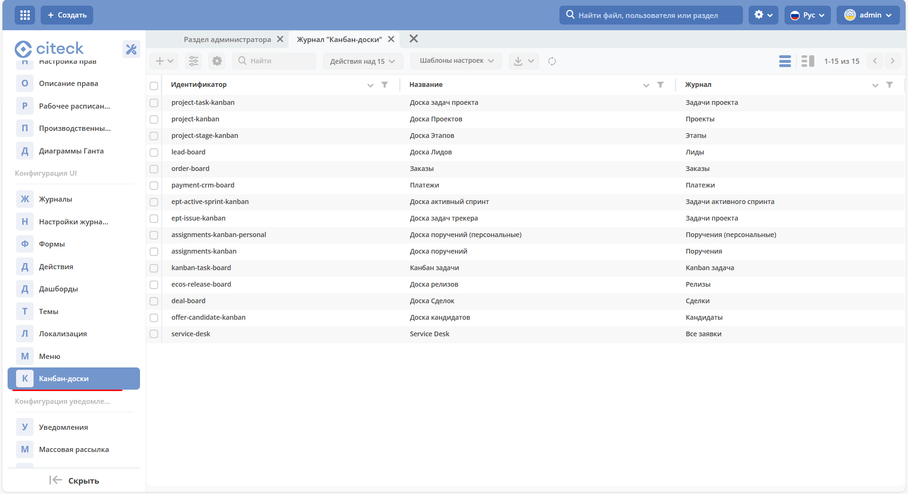
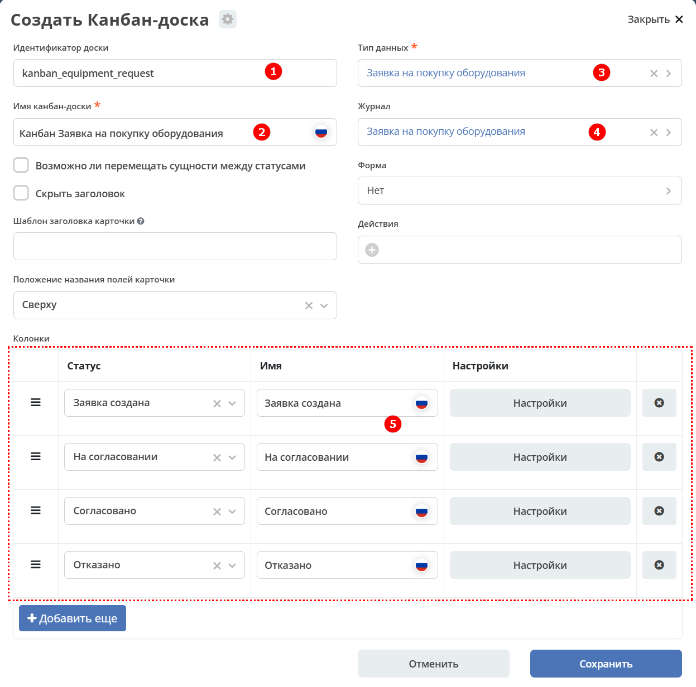
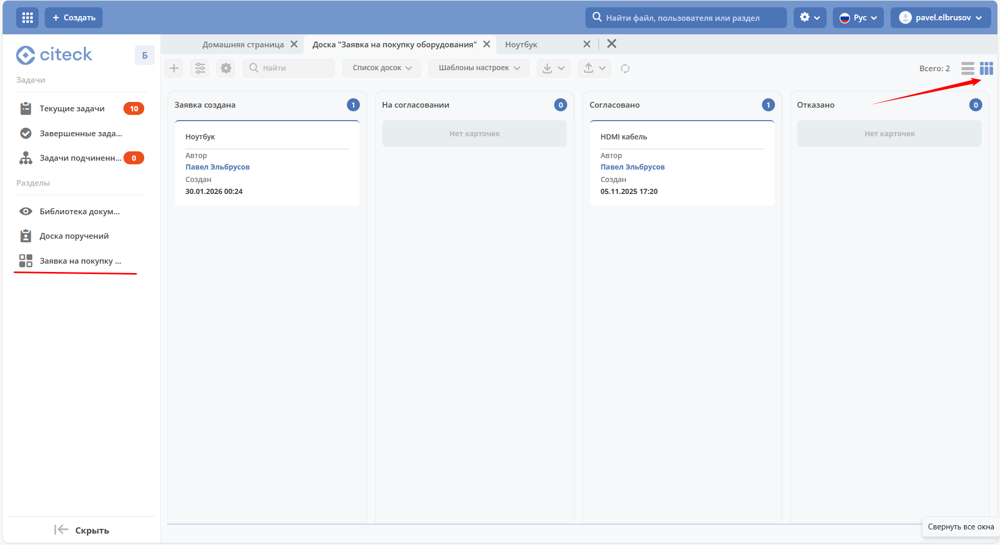

.. _sample_kanban_board:

Пример добавления канбан-доски
================================

.. note::

    Данная статья является продолжением работы с созданным ранее бизнес-процессом :ref:`Заявка на закупку оборудования<sample_request>`.

    Для создания канбан-доски в локальном рабочем пространстве в разделе **Администрирование** перейдите в пункт **Канбан-доски**.

Визуализируем работу с заявками на разных статусах с помощью :ref:`канбан-доски<kanban_board>`.

Для добавления канбан-доски к представлению данных перейдите в рабочее пространство администратора в раздел **Конфигурация UI** → **Канбан-доски**.

Нажмите **«+ - Создать конфигурацию канбан-доски»** и заполните поля:

.. list-table::
   :widths: 10 20 30
   :align: center
   :class: tight-table

   * - **1**
     - Идентификатор доски
     - kanban_equipment_request
   * - **2**
     - Имя канбан-доски
     - Канбан Заявка на покупку оборудования
   * - **3**
     - Тип данных
     - созданный ранее тип «Заявка на покупку оборудования»
   * - **4**
     - Журнал
     - созданный ранее журнал «Заявка на покупку оборудования»
   * - **5**
     - Колонки
     - статусы, доступные для выбора из типа данных

Конечная настройка:

Перейдите в журнал **«Заявка на покупку оборудования»** и выберите представление канбан-доски:

Карточки будут распределены по статусам.
