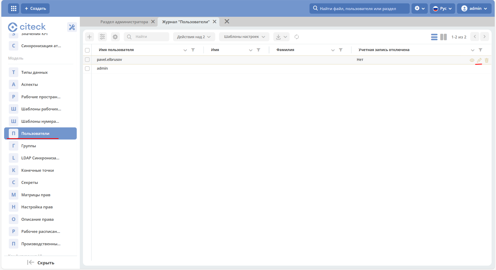
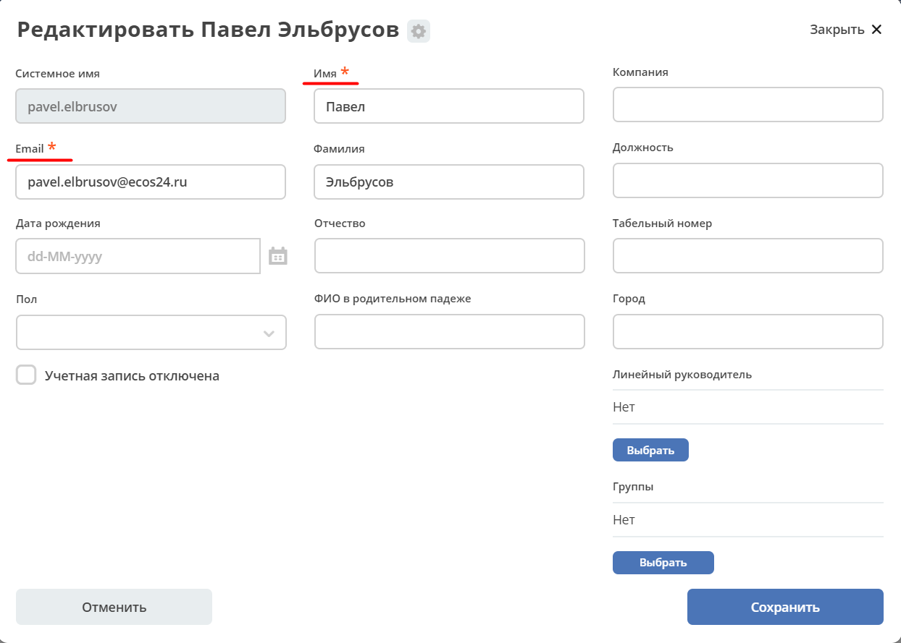
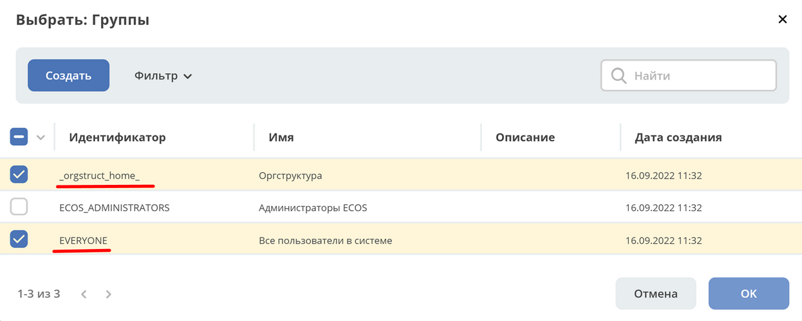

.. _demo_user:

Создание пользователей для Citeck Community
============================================

.. note::

   Citeck поддерживает интеграцию с **LDAP** для централизованного управления пользователями.
   Также пользователей можно создавать вручную через **Keycloak** — этот способ описан ниже.

Создание пользователя в Keycloak
----------------------------------

Откройте консоль администратора Keycloak по адресу `http://localhost/ecos-idp/auth <http://localhost/ecos-idp/auth>`_.

.. image:: _static/new_user/User_1.png
   :width: 600
   :align: center

|

Перейдите в **Administration Console** и войдите с учётными данными по умолчанию: **admin / VeryStrongPassword**.

|

.. image:: _static/new_user/User_3.png
   :width: 650
   :align: center

|

В боковом меню перейдите в раздел **Users**. Кнопка **View all users** отображает список всех существующих пользователей.

|

Для добавления нового пользователя нажмите **Add user**:

|

Заполните как минимум поле **Username** и нажмите **Save**.

Задание пароля
~~~~~~~~~~~~~~~

Перейдите на вкладку **Credentials**, введите пароль и подтвердите его.

|

.. note::

   Если пароль должен быть временным (пользователю потребуется сменить его при первом входе), установите переключатель **Temporary** в положение **ON**.

Нажмите **Set Password** и подтвердите действие:

|

.. important::

   После создания пользователь должен **выполнить первый вход в Citeck** под своими учётными данными.
   При этом в систему передаётся только **Username** (системное имя) — остальные данные необходимо заполнить отдельно.

Заполнение данных пользователя в Citeck
-----------------------------------------

В :ref:`разделе администратора<admin>` перейдите в **Пользователи** и откройте созданного пользователя в режиме редактирования:

|

Заполните обязательные поля — **Имя** и **Электронная почта** — а также остальные поля при необходимости:

|

.. tip::

   Чтобы задачи пользователя были доступны руководителю для контроля, заполните поле **Линейный руководитель**.

Добавление в группы
~~~~~~~~~~~~~~~~~~~~~

Нажмите **Выбрать** в блоке групп и добавьте пользователя в группы **EVERYONE** и **_orgstruct_home_**:

|

|

Нажмите **Сохранить**. Пользователю будут выданы права в соответствии с выбранными группами.
