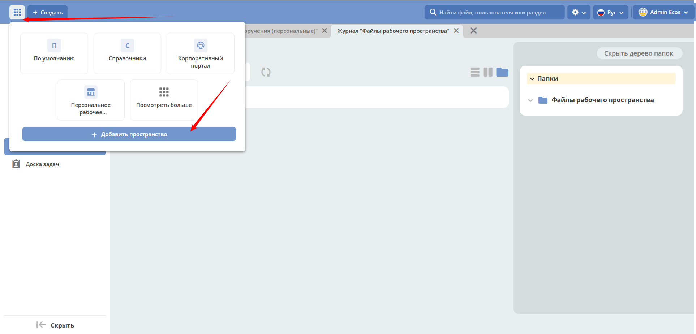
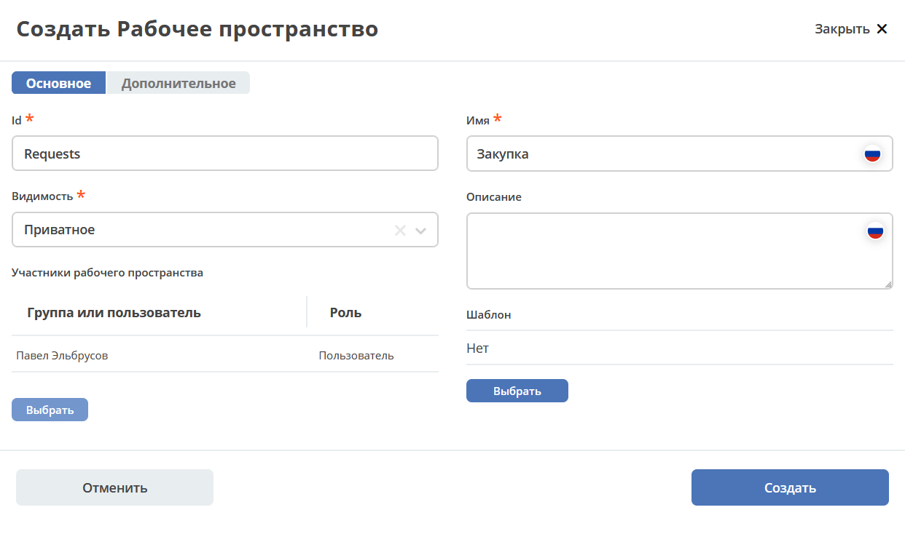
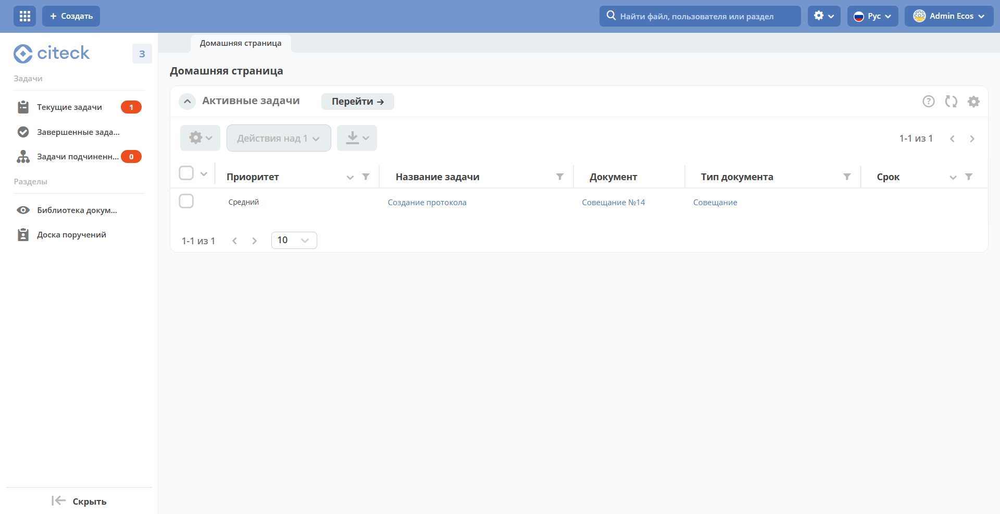

.. _demo_ws:

Создание нового рабочего пространства
=====================================

:ref:`Рабочее пространство<workspaces>` позволяет организовать совместную работу пользователей в рамках одного контекста:

- **менеджер** может создавать :ref:`артефакты<ws_artifacts>` и знакомиться с возможностями платформы;
- **администратор Citeck** может добавлять в меню пространства :ref:`созданные бизнес-процессы<sample_request>` для совместной работы команды.

Создание пространства
----------------------

Нажмите **«Создать пространство»**:

|

Заполните основные поля формы:

.. list-table::
   :widths: 20 60
   :header-rows: 1
   :align: center
   :class: tight-table

   * - Поле
     - Описание
   * - **ID**
     - Уникальный идентификатор пространства
   * - **Имя**
     - Отображаемое название пространства
   * - **Видимость**
     - ``Публичное`` — любой пользователь может присоединиться;
       ``Приватное`` — доступ только для выбранных участников

Добавление участников
~~~~~~~~~~~~~~~~~~~~~~~

В блоке **Участники рабочего пространства** выберите пользователей из оргструктуры и назначьте каждому роль:

- **Пользователь** — доступ к работе внутри пространства.
- **Менеджер** — дополнительная возможность управления пространством и создания артефактов.

|

.. note::

   Пользователь, создающий пространство, автоматически получает роль **Менеджер** и фиксируется как его создатель.

|

Нажмите **Создать**.

Результат
----------

Созданное пространство доступно всем выбранным участникам и по структуре аналогично персональному:

|

Участники пространства могут:

- добавлять и редактировать файлы;
- ставить поручения.

Пользователь с ролью **Менеджер** дополнительно может создавать :ref:`артефакты<ws_artifacts>`, список которых доступен в разделе **Администрирование** рабочего пространства.
