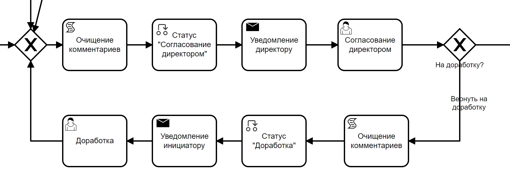
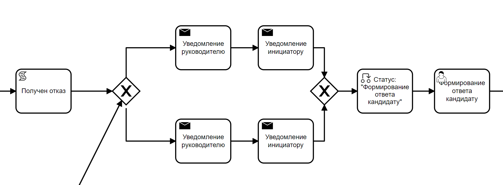
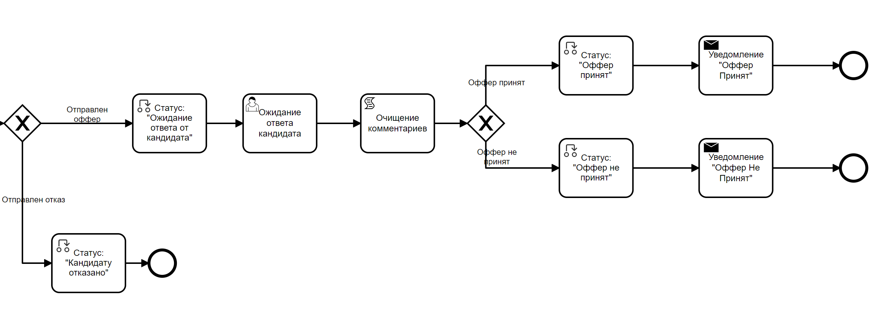

Описание процесса создания приложения ECOS
===========================================

.. contents::
		:depth: 4

Создание приложения включает в себя создание и настройку отдельных артефактов, таких как типы данных, журналы, формы, процессы и т.д.

Вы можете создать приложение самостоятельно, или загрузить по ссылке: https://gitlab.citeck.ru/ecos-community/ecos-offers 

В разделе приводятся рекомендации и пояснения по разработке приложения с нуля.

:ref:`Артефакты<ecos_artifacts>` взаимосвязаны между собой, поэтому рекомендуется придерживаться следующего порядка их создания:

    - :ref:`тип данных<data_types_main>`

    - :ref:`журнал<journals>`

    - :ref:`форма для типа<forms>` (если требуется);

    - :ref:`дашборд<dashboard>` (если требуется);

    - схема процесса;

    - формы задач процесса.

При создании собственных моделей рекомендуется предварительно составить схему взаимосвязей между создаваемыми типами, а далее производить процедуру внесения их в систему в порядке от более простых и независимых типов (справочников) к типам, включающим в себя уже ранее созданные. В таком случае не будет сведена к минимуму необходимость прерывания настройки одного типа для настройки другого. 

Последующие разделы будут содержать процесс пошагового создания приложения в соответствии с приведенными выше рекомендациями -  сначала будут созданы справочные типы:

    - Города,

    - Офисы,

    - Тип должности

    - Грейды,

    - Социальный пакет,

    - Должностные обязанности,

    - Кандидаты

далее основной тип-кейс – Офферы (тип данных, для которого будет реализована основная бизнес-логика приложения).

Структура создания каждого отдельного компонента будет обязательно начинаться с подготовки типа, а затем в зависимости от бизнес-требований дополняться созданием журналов, форм и так далее.

Типы данных
------------

Справочники
~~~~~~~~~~~~

Создание справочника Города
""""""""""""""""""""""""""""

**Тип Города** не зависит от других типов. Содержит информацию о городах.

Является справочником (о различиях справочников и кейсов :ref:`здесь<data_types_types>`)

Для создания справочника необходимо заполнить форму создания типа в соответствии со следующими таблицами (о том как перейти к форме создания типа можно узнать :ref:`здесь<data_types_admin>`

Номер маркера в таблице соответствует номеру поля, отмеченного на рисунке приведенном здесь.

Таблица заполнения для вкладки **Основные**

.. csv-table::
   :header: "Номер маркера", "Название поля", "Значение"
   :widths: 5, 10, 20
   :align: center
   :class: tight-table 

        1,id,cities-type
        2,Имя,Город
        3,Шаблон отображения имени,Шаблон отображения имени
        5,Родитель,Элемент справочника

Атрибуты, не указанные в таблице, не являются необходимыми при создании данного типа (поля могут быть оставлены пустыми или с неизменными значениями по умолчанию)

Ниже приведено изображение конечной настройки типа (для визуальной сверки):

 .. image:: _static/offer/type_1.png
       :width: 600
       :align: center

Таблица заполнения для вкладки **Атрибуты**:

.. csv-table::
   :header: "id (1)", "Имя (2)", "Тип (3)"
   :widths: 15, 10, 30
   :align: center
   :class: tight-table 

        cityCode,Код,Text
        cityName,Название,Text

Атрибуты, не указанные в таблицах, не являются необходимыми при создании данного типа (поля могут быть оставлены пустыми или с неизменными значениями по умолчанию)

Ниже приведено изображение конечной настройки типа (для визуальной сверки):

 .. image:: _static/offer/type_2.png
       :width: 600
       :align: center

Создание справочника Офисы
""""""""""""""""""""""""""""

**Тип Офисы** не зависит от других типов. Содержит информацию об офисах. Является справочником. 

Таблица заполнения для вкладки **Основные**

.. csv-table::
   :header: "Номер маркера", "Название поля", "Значение"
   :widths: 5, 10, 20
   :align: center
   :class: tight-table    

        1,id,hr-offices-type
        2,Имя,Офисы
        5,Родитель,Элемент справочника

Атрибуты, не указанные в таблице, не являются необходимыми при создании данного типа (поля могут быть оставлены пустыми или с неизменными значениями по умолчанию).

Ниже приведено изображение конечной настройки типа (для визуальной сверки):

 .. image:: _static/offer/type_3.png
       :width: 600
       :align: center

Таблица заполнения для вкладки **Атрибуты**:

.. csv-table::
   :header: "id (1)", "Имя (2)", "Тип (3)"
   :widths: 15, 10, 30
   :align: center
   :class: tight-table 

        officesCode,Код,Text
        officesCity,Город,Text
        officesAddress,Адрес,Text

Ниже приведено изображение конечной настройки типа (для визуальной сверки):

 .. image:: _static/offer/type_4.png
       :width: 600
       :align: center

Создание справочника Тип должности
""""""""""""""""""""""""""""""""""""

**Тип должности** не зависит от других типов. Содержит информацию о должностях.

Является справочником 

Таблица заполнения для вкладки **Основные**:

.. csv-table::
   :header: "Номер маркера", "Название поля", "Значение"
   :widths: 5, 10, 20
   :align: center
   :class: tight-table 

        1,id,orgstruct-simple-role-type
        2,Имя,Тип должности
        5,Родитель,Элемент справочника

Атрибуты, не указанные в таблице, не являются необходимыми при создании данного типа (поля могут быть оставлены пустыми или с неизменными значениями по умолчанию)

Ниже приведено изображение конечной настройки типа (для визуальной сверки):

  .. image:: _static/offer/type_5.png
       :width: 600
       :align: center

Таблица заполнения для вкладки **Атрибуты**:

.. csv-table::
   :header: "id (1)", "Имя (2)", "Тип (3)"
   :widths: 15, 10, 30
   :align: center
   :class: tight-table 

        name,Имя,Text
        title,Должность,Text
        rolesManager,Руководящая роль,Boolean

Ниже приведено изображение конечной настройки типа (для визуальной сверки):

  .. image:: _static/offer/type_6.png
       :width: 600
       :align: center

Создание справочника Грейды
""""""""""""""""""""""""""""""""""""

**Тип Грейды** зависит от ранее созданного типа Типы должности (обратить внимание на задание ассоциативного атрибута - подробнее о типах здесь). Содержит информацию о грейдах.

Является справочником. 

Таблица заполнения для вкладки **Основные**:

.. csv-table::
   :header: "Номер маркера", "Название поля", "Значение"
   :widths: 5, 10, 20
   :align: center
   :class: tight-table 

   1,id,hr-grades-type
   2,Имя,Грейды
   5,Родитель,Элемент справочника

Атрибуты, не указанные в таблице, не являются необходимыми при создании данного типа (поля могут быть оставлены пустыми или с неизменными значениями по умолчанию)

Ниже приведено изображение конечной настройки типа (для визуальной сверки):

  .. image:: _static/offer/type_7.png
       :width: 600
       :align: center

Таблица заполнения для вкладки **Атрибуты**:

.. csv-table::
   :header: "id (1)", "Имя (2)", "Тип (3)"
   :widths: 15, 10, 30
   :align: center
   :class: tight-table 

    gradesSimpleRoleTypeAssoc,Должность,Association По кнопке **«Настроить»** выбрать тип **«Тип должности»**
    gradesNumber,Номер,Text
    gradesRequirements,Требования к сотруднику,Text
    gradesResponsibilities,Обязанности,Text
    gradesSalary,Вилка оклада,Text
    gradesPrize,Премия,Text

Ниже приведено изображение конечной настройки типа (для визуальной сверки):

  .. image:: _static/offer/type_8.png
       :width: 600
       :align: center

Создание справочника Социальный пакет
""""""""""""""""""""""""""""""""""""""

**Тип Социальный пакет** не зависит от других типов. Содержит информацию о социальном пакете. Является справочником. 

Таблица заполнения для вкладки **Основные**

.. csv-table::
   :header: "Номер маркера", "Название поля", "Значение"
   :widths: 5, 10, 20
   :align: center
   :class: tight-table 

   1,id,offer-social-package-type
   2,Имя,Социальный пакет
   5,Родитель,Элемент справочника

Атрибуты, не указанные в таблице, не являются необходимыми при создании данного типа (поля могут быть оставлены пустыми или с неизменными значениями по умолчанию).

Ниже приведено изображение конечной настройки типа (для визуальной сверки):

  .. image:: _static/offer/type_9.png
       :width: 600
       :align: center

Таблица заполнения для вкладки **Атрибуты**:

.. csv-table::
   :header: "id (1)", "Имя (2)", "Тип (3)"
   :widths: 15, 10, 30
   :align: center
   :class: tight-table 

    socialPackage,Соц.пакет,Text

Ниже приведено изображение конечной настройки типа (для визуальной сверки):

  .. image:: _static/offer/type_10.png
       :width: 600
       :align: center

Создание справочника Должностные обязанности
""""""""""""""""""""""""""""""""""""""""""""""

**Тип Должностные обязанности** не зависит от других типов. Содержит информацию о должностных обязанностях..

Является справочником. 

Таблица заполнения для вкладки **Основные**

.. csv-table::
   :header: "Номер маркера", "Название поля", "Значение"
   :widths: 5, 10, 20
   :align: center
   :class: tight-table 

        1,id,offer-responsibilities-type
        2,Имя,Должностные обязанности
        5,Родитель,Элемент справочника

Атрибуты, не указанные в таблице, не являются необходимыми при создании данного типа (поля могут быть оставлены пустыми или с неизменными значениями по умолчанию)

Ниже приведено изображение конечной настройки типа (для визуальной сверки):

  .. image:: _static/offer/type_11.png
       :width: 600
       :align: center

Таблица заполнения для вкладки **Атрибуты**:

.. csv-table::
   :header: "id (1)", "Имя (2)", "Тип (3)"
   :widths: 15, 10, 30
   :align: center
   :class: tight-table 

        responsibilitiesSimpleRoleTypeAssoc,Должность,Association
        responsibilitiesSubordination,Подчинение,Text

Ниже приведено изображение конечной настройки типа (для визуальной сверки):

  .. image:: _static/offer/type_12.png
       :width: 600
       :align: center

Создание справочника Кандидаты
""""""""""""""""""""""""""""""""

**Тип Кандидаты** зависит от ранее созданного типа Города (обратить внимание на задание ассоциативного атрибута - подробнее о типах здесь). Содержит информацию о кандидатах, рассматриваемых для выдачи оффера.

Является справочником.  

Таблица заполнения для вкладки **Основные**

.. csv-table::
   :header: "Номер маркера", "Название поля", "Значение"
   :widths: 5, 10, 20
   :align: center
   :class: tight-table 

        1,id,hr-candidates-type
        2,Имя,Кандидаты
        5,Родитель,Элемент справочника

Атрибуты, не указанные в таблице, не являются необходимыми при создании данного типа (поля могут быть оставлены пустыми или с неизменными значениями по умолчанию).

Ниже приведено изображение конечной настройки типа (для визуальной сверки):

  .. image:: _static/offer/type_13.png
       :width: 600
       :align: center

Таблица заполнения для вкладки **Атрибуты**:

.. csv-table::
   :header: "id (1)", "Имя (2)", "Тип (3)"
   :widths: 15, 10, 30
   :align: center
   :class: tight-table 

        candidatesCode,Код,Text
        candidatesLastName,Фамилия,Text
        candidatesFirstName,Имя,Text
        candidatesMiddleName,Отчество,Text
        candidatesBirthDate,День рождения,Date
        candidatesGender,Пол,Text
        candidatesCityAssoc,Город,Association По кнопке «Настроить» выбрать тип «Город»

Ниже приведено изображение конечной настройки типа (для визуальной сверки):

  .. image:: _static/offer/type_14.png
       :width: 600
       :align: center

Кейс
~~~~~

Создание типа данных Согласование оффера
"""""""""""""""""""""""""""""""""""""""""""

**Тип Офферы** является типом-кейс и зависит от ранее созданных справочников (о различиях справочников и кейсов :ref:`здесь<data_types_types>`)

Таблица заполнения для вкладки **Основные**

.. csv-table::
   :header: "Номер маркера", "Название поля", "Значение"
   :widths: 5, 10, 20
   :align: center
   :class: tight-table 

     1,id,hr-offer-type
     2,Имя,Согласование оффера
     3,Шаблон отображения имени,Оффер №${registrationNumber|fmt("000000")}
     4,Описание,Согласование оффера
     5,Родитель,Кейс
     11,Чекбокс «Наследовать действия», Действия: uiserv/action@delete-offer; uiserv/action@edit

Атрибуты, не указанные в таблице, не являются необходимыми при создании данного типа (поля могут быть оставлены пустыми или с неизменными значениями по умолчанию)

Ниже приведено изображение конечной настройки типа (для визуальной сверки):

  .. image:: _static/offer/type_15.png
       :width: 600
       :align: center

Таблица заполнения для вкладки **Атрибуты**:

.. csv-table::
   :header: "id (1)", "Имя (2)", "Тип (3)"
   :widths: 15, 10, 30
   :align: center
   :class: tight-table 

          registrationNumber,Регистрационный номер,Text
          offerIssueDate,Дата создания,Date
          regNumberCounter,Счетчик регномера,Text
          initiator,Инициатор,Person
          offerCandidate,Кандиат,Person
          offerPosition,Должность,Association По кнопке «Настроить»:
          offerSubdivision,Подразделение,Authority?
          offerGrade,Грейд,Association По кнопке «Настроить» выбрать тип «Грейды»:
          offerOffice,Офис,Association По кнопке «Настроить» выбрать тип «Офисы»:
          offerComment,Комментарий,Text
          offerChief,Руководитель,Association?
          offerAdditionalChief,Доп. согласующий,Association?
          offerFeedback,Фидбэк по собеседованиям,Text
          offerSalaryAndPrize,Зарплатная вилка и премия,Text
          offerSubordination,Подчинение,Association?
          offerSalary,Оклад,Number
          offerPrize,Премия,Text
          offerSchedule,График работы,Text
          content,Содержимое,Content
          offerDateWork,Дата выхода на работу,Date
          offerTaskComment,Комментарий к задаче,Text
          offerApproveStage,Номер этапа согласования,Number
          offerTaskComment,Комментарий по офферу,Text

Ниже приведено изображение конечной настройки типа (для визуальной сверки):

  .. image:: _static/offer/type_16.png
       :width: 600
       :align: center

.. _roles_offer:

Таблица заполнения для вкладки **Роли**:

.. csv-table::
   :header: "id (1)", "Название логики (2)", "Участники роли(3)", "Атрибуты(4)"
   :widths: 15, 10, 30, 30
   :align: center
   :class: tight-table 

          offer-initiator-role,Инициатор,???,Инициатор
          offer-chief-role,Руководитель,???,Руководитель
          offer-additional-chief-role,Доп. согласующий,???,
          offer-director-role,Директор, Нет наименования?,
          offer-technologist-role,Технолог, Нет наименования?,

Ниже приведено изображение конечной настройки типа (для визуальной сверки):

  .. image:: _static/offer/type_17.png
       :width: 600
       :align: center

Таблица заполнения для вкладки **Статусы**:

.. csv-table::
   :header: "id (1)", "Название логики (2)"
   :widths: 15, 10
   :align: center
   :class: tight-table 

          draft,Черновик
          hr-offer-approve,Согласование руководителем
          hr-offer-director-approve,Согласование директором
          hr-offer-additionaly-approve,Согласование доп. согласующим
          hr-offer-rework,Доработка
          hr-offer-feedback,Формирование ответа кандидату
          hr-offer-feedback-from-candidate,Ожидание ответа от кандидата
          hr-offer-reject,Кандидату отказано
          hr-offer-accept-offer,Оффер принят
          hr-offer-reject-offer,Оффер не принят

Ниже приведено изображение конечной настройки типа (для визуальной сверки):

  .. image:: _static/offer/type_17.png
       :width: 600
       :align: center

Журналы
--------

Для каждого созданного типа данных необходимо создать журнал. Подробно :ref:`о создании журналов<new_journal>`

Создание журнала Города
~~~~~~~~~~~~~~~~~~~~~~~~

Таблица заполнения для вкладки **Основные**:

.. csv-table::
   :header: "Номер маркера", "Название поля", "Значение"
   :widths: 15, 10, 10
   :align: center
   :class: tight-table 

     1,Идентификатор журнала,scan-cities
     2,Название журнала,Города
     3,Действия,Удалить Редактировать
     4,Тип данных,Город

.. csv-table::
   :header: "Id (5)", "Имя (6)", "Тип (3)"
   :widths: 15, 10, 10
   :align: center
   :class: tight-table 

     cityCode,Код,
     cityName,Название,

Ниже приведено изображение конечной настройки (для визуальной сверки):

  .. image:: _static/offer/journal_1.png
       :width: 600
       :align: center

Создание журнала Офисы
~~~~~~~~~~~~~~~~~~~~~~~~

Таблица заполнения для вкладки **Основные**:

.. csv-table::
   :header: "Номер маркера", "Название поля", "Значение"
   :widths: 15, 10, 10
   :align: center
   :class: tight-table 

     1,Идентификатор журнала,offer-offices-journal
     2,Название журнала,Офисы
     3,Действия,Удалить Редактировать
     4,Тип данных,Офисы

.. csv-table::
   :header: "Id (5)", "Имя (6)", "Тип (3)"
   :widths: 15, 10, 10
   :align: center
   :class: tight-table 

     officesCode,Код,
     officesCity,Город,
     officesAddress,Адрес,

Ниже приведено изображение конечной настройки (для визуальной сверки):

  .. image:: _static/offer/journal_2.png
       :width: 600
       :align: center

Создание журнала Тип должности
~~~~~~~~~~~~~~~~~~~~~~~~~~~~~~~~

Таблица заполнения для вкладки **Основные**:

.. csv-table::
   :header: "Номер маркера", "Название поля", "Значение"
   :widths: 15, 10, 10
   :align: center
   :class: tight-table 

     1,Идентификатор журнала,orgstruct-simple-role-journal
     2,Название журнала,Тип должности
     3,Действия,Удалить Редактировать
     4,Тип данных,Тип должности

.. csv-table::
   :header: "Id (5)", "Имя (6)", "Тип (3)"
   :widths: 15, 10, 10
   :align: center
   :class: tight-table 

     name,Имя,Текст
     title,Должность,Текст
     rolesManager,Руководящая роль,Булево

Ниже приведено изображение конечной настройки (для визуальной сверки):

  .. image:: _static/offer/journal_3.png
       :width: 600
       :align: center

Создание журнала Грейды
~~~~~~~~~~~~~~~~~~~~~~~~~

Таблица заполнения для вкладки **Основные**:

.. csv-table::
   :header: "Номер маркера", "Название поля", "Значение"
   :widths: 15, 10, 10
   :align: center
   :class: tight-table 

     1,Идентификатор журнала,offer-grades-journal
     2,Название журнала,Грейды
     3,Действия,Удалить Редактировать
     4,Тип данных,Грейды

.. csv-table::
   :header: "Id (5)", "Имя (6)", "Тип (3)"
   :widths: 15, 10, 10
   :align: center
   :class: tight-table 

     gradesSimpleRoleTypeAssoc,Должность,
     gradesNumber,Номер,
     gradesRequirements,Требования к сотруднику,
     gradesResponsibilities,Обязанности,
     gradesSalary,Вилка окладов,
     gradesPrize,Премия,

Ниже приведено изображение конечной настройки (для визуальной сверки):

  .. image:: _static/offer/journal_4.png
       :width: 600
       :align: center

Создание журнала Социальный пакет
~~~~~~~~~~~~~~~~~~~~~~~~~~~~~~~~~~~

Таблица заполнения для вкладки **Основные**:

.. csv-table::
   :header: "Номер маркера", "Название поля", "Значение"
   :widths: 15, 10, 10
   :align: center
   :class: tight-table 

     1,Идентификатор журнала,offer-social-package-journal
     2,Название журнала,Социальный пакет
     3,Действия,Удалить Редактировать
     4,Тип данных,Социальный пакет

Ниже приведено изображение конечной настройки (для визуальной сверки):

  .. image:: _static/offer/journal_5.png
       :width: 600
       :align: center

Создание журнала Должностные обязанности
~~~~~~~~~~~~~~~~~~~~~~~~~~~~~~~~~~~~~~~~~~

Таблица заполнения для вкладки **Основные**:

.. csv-table::
   :header: "Номер маркера", "Название поля", "Значение"
   :widths: 15, 10, 10
   :align: center
   :class: tight-table 

     1,Идентификатор журнала,offer-responsibilities-journal
     2,Название журнала,Должностные обязанности
     3,Действия,Удалить Редактировать
     4,Тип данных,Должностные обязанности

.. csv-table::
   :header: "Id (5)", "Имя (6)", "Тип (3)"
   :widths: 15, 10, 10
   :align: center
   :class: tight-table 

     responsibilitiesSimpleRoleTypeAssoc,Должность,
     responsibilitiesSubordination,Подчинение,

Ниже приведено изображение конечной настройки (для визуальной сверки):

  .. image:: _static/offer/journal_6.png
       :width: 600
       :align: center

Создание журнала Кандидаты
~~~~~~~~~~~~~~~~~~~~~~~~~~~~

Таблица заполнения для вкладки **Основные**:

.. csv-table::
   :header: "Номер маркера", "Название поля", "Значение"
   :widths: 15, 10, 10
   :align: center
   :class: tight-table 

     1,Идентификатор журнала,offer-candidates-journal
     2,Название журнала,Кандидаты
     3,Действия,Удалить Редактировать
     4,Тип данных,Кандидаты

.. csv-table::
   :header: "Id (5)", "Имя (6)", "Тип (3)"
   :widths: 15, 10, 10
   :align: center
   :class: tight-table 

     candidatesCode,Код,
     candidatesLastName,Фамилия,
     candidatesFirstName,Имя,
     candidatesMiddleName,Отчество,
     candidatesBirthDate,Дата рождения,Дата
     candidatesGender,Пол,
     candidatesCityAssoc,Город,Ассоциация

Ниже приведено изображение конечной настройки (для визуальной сверки):

  .. image:: _static/offer/journal_7.png
       :width: 600
       :align: center

Создание журнала Согласование оффера
~~~~~~~~~~~~~~~~~~~~~~~~~~~~~~~~~~~~~

Таблица заполнения для вкладки **Основные**:

.. csv-table::
   :header: "Номер маркера", "Название поля", "Значение"
   :widths: 15, 10, 10
   :align: center
   :class: tight-table 

     1,Идентификатор журнала,offer-journal
     2,Название журнала,Согласование оффера
     3,Действия,Удалить Редактировать
     4,Тип данных,Согласование оффера

.. csv-table::
   :header: "Id (5)", "Имя (6)", "Тип (3)"
   :widths: 15, 10, 10
   :align: center
   :class: tight-table 

     _created,Дата создания,Дата
     registrationNumber,Регистрационный номер,Текст
     offerCandidate,Кандидат,Ассоциация?
     offerPosition,Должность,Ассоциация?
     offerSubdivision,Подразделение,Ассоциация?
     offerGrade,Грейд,Ассоциация?
     initiator,Инициатор,Группа или человек?

Ниже приведено изображение конечной настройки (для визуальной сверки):

  .. image:: _static/offer/journal_8_1.png
       :width: 600
       :align: center

  .. image:: _static/offer/journal_8_2.png
       :width: 600
       :align: center

Формы
-------

Для созданных типов данных далее создаем формы в редакторе форм. Подробно о:

     - :ref:`формах<forms>`, 
     - :ref:`редакторе форм<form_builder>`, 
     - :ref:`компонентах формы<form_components>`,
     - :ref:`примерах компонент<form_examples>` 

Основные формы
~~~~~~~~~~~~~~~~~

Создание формы Город
""""""""""""""""""""""""

.. csv-table::
   :header: "Номер маркера", "Название поля", "Значение"
   :widths: 15, 10, 10
   :align: center
   :class: tight-table 

     1,Идентификатор формы,cities-form
     2,Название формы,Город
     3,Ключ формы,cities-form
     4,Редактируемый тип данных,Город

Ниже приведено изображение конечной настройки (для визуальной сверки):

  .. image:: _static/offer/form_1.png
       :width: 600
       :align: center

Пример формы:

  .. image:: _static/offer/form_2.png
       :width: 600
       :align: center

Компоненты формы:

.. csv-table::
   :header: "Название поля", "Имя свойства", "Наименование компонента"
   :widths: 15, 10, 10
   :align: center
   :class: tight-table 

     ,Заголовок,:ref:`Panel Component Component<Panel>`
     ,Колонки формы,:ref:`Table Component Component<Table>`
     cityCode,cityCode,:ref:`Text Field Component<Text_Field>`
     cityCode,cityCode,Text Field Component

Создание формы Офисы
""""""""""""""""""""""""

.. csv-table::
   :header: "Номер маркера", "Название поля", "Значение"
   :widths: 15, 10, 10
   :align: center
   :class: tight-table 

     1,Идентификатор формы,offer-offices-form
     2,Название формы,Офисы
     3,Ключ формы,offer-offices-form
     4,Редактируемый тип данных,Офисы

Ниже приведено изображение конечной настройки (для визуальной сверки):

  .. image:: _static/offer/form_3.png
       :width: 600
       :align: center

Пример формы:

  .. image:: _static/offer/form_4.png
       :width: 600
       :align: center

Компоненты формы:

.. csv-table::
   :header: "Название поля", "Имя свойства", "Наименование компонента"
   :widths: 15, 10, 10
   :align: center
   :class: tight-table 

     ,Колонки формы,:ref:`Columns Component Component<Columns_>`
     Код,officesCode,Text Field Component
     Город,officesCity,Text Field Component
     Адрес,officesAddress,Text Field Component

Создание формы Тип должности
""""""""""""""""""""""""""""""

.. csv-table::
   :header: "Номер маркера", "Название поля", "Значение"
   :widths: 15, 10, 10
   :align: center
   :class: tight-table 

     1,Идентификатор формы,orgstruct-simple-role-form
     2,Название формы,Тип должности
     3,Ключ формы,orgstruct-simple-role-form
     4,Редактируемый тип данных,Тип должности

Ниже приведено изображение конечной настройки (для визуальной сверки):

  .. image:: _static/offer/form_5.png
       :width: 600
       :align: center

Пример формы:

  .. image:: _static/offer/form_6.png
       :width: 600
       :align: center

Компоненты формы:

.. csv-table::
   :header: "Название поля", "Имя свойства", "Наименование компонента"
   :widths: 15, 10, 10
   :align: center
   :class: tight-table 

     ,Колонки формы,Columns Component
     Имя,name,Text Field Component
     Заголовок,title,Text Field Component
     title,roleIsManager,:ref:`Checkbox Component<Checkbox>`

Создание формы Грейды
"""""""""""""""""""""""

.. csv-table::
   :header: "Номер маркера", "Название поля", "Значение"
   :widths: 15, 10, 10
   :align: center
   :class: tight-table 

     1,Идентификатор формы,hr-grades-form
     2,Название формы,Grades Form
     3,Ключ формы,hr-grades-form
     4,Редактируемый тип данных,Грейды

Ниже приведено изображение конечной настройки (для визуальной сверки):

  .. image:: _static/offer/form_7.png
       :width: 600
       :align: center

Пример формы:

  .. image:: _static/offer/form_8.png
       :width: 600
       :align: center

Компоненты формы:

.. csv-table::
   :header: "Название поля", "Имя свойства", "Наименование компонента"
   :widths: 15, 10, 10
   :align: center
   :class: tight-table 

     ,Колонки формы,Columns Component
     Должность,gradesSimpleRoleTypeAssoc,:ref:`Select Journal Component<Select_Journal_>`
     Номер,gradesNumber,Text Field Component
     Требования к сотруднику,gradesRequirements,Text Field Component
     Обязанности,gradesResponsibilities,Text Field Component
     Вилка оклада,gradesSalary,Text Field Component
     Премия,gradesPrize,Text Field Component

Создание формы Социальный пакет
"""""""""""""""""""""""""""""""""

.. csv-table::
   :header: "Номер маркера", "Название поля", "Значение"
   :widths: 15, 10, 10
   :align: center
   :class: tight-table 

     1,Идентификатор формы,offer-social-package-form
     2,Название формы,Социальный пакет
     3,Ключ формы,offer-social-package-form
     4,Редактируемый тип данных,Социальный пакет

Ниже приведено изображение конечной настройки (для визуальной сверки):

  .. image:: _static/offer/form_9.png
       :width: 600
       :align: center

Пример формы:

  .. image:: _static/offer/form_10.png
       :width: 600
       :align: center

Компоненты формы:

.. csv-table::
   :header: "Название поля", "Имя свойства", "Наименование компонента"
   :widths: 15, 10, 10
   :align: center
   :class: tight-table 

     ,Колонки формы,Columns Component
     Название,socialPackage,Text Field Component

Создание формы Должностные обязанности
"""""""""""""""""""""""""""""""""""""""

.. csv-table::
   :header: "Номер маркера", "Название поля", "Значение"
   :widths: 15, 10, 10
   :align: center
   :class: tight-table 

     1,Идентификатор формы,offer-responsibilities-form
     2,Название формы,Responsibilities Form
     3,Ключ формы,offer-responsibilities-form
     4,Редактируемый тип данных,Должностные обязанности

Ниже приведено изображение конечной настройки (для визуальной сверки):

  .. image:: _static/offer/form_11.png
       :width: 600
       :align: center

Пример формы:

  .. image:: _static/offer/form_12.png
       :width: 600
       :align: center

Компоненты формы:

.. csv-table::
   :header: "Название поля", "Имя свойства", "Наименование компонента"
   :widths: 15, 10, 10
   :align: center
   :class: tight-table 

     ,Колонки формы,Columns Component
     Должность,gradesSimpleRoleTypeAssoc,Select Journal Component
     Подчинение,responsibilitiesSubordination,Text Field Component

Создание формы Кандидаты
""""""""""""""""""""""""""

.. csv-table::
   :header: "Номер маркера", "Название поля", "Значение"
   :widths: 15, 10, 10
   :align: center
   :class: tight-table 

     1,Идентификатор формы,offer-candidates-form
     2,Название формы,Candidates Form
     3,Ключ формы,offer-candidates-form
     4,Редактируемый тип данных,Кандидаты

Ниже приведено изображение конечной настройки (для визуальной сверки):

  .. image:: _static/offer/form_13.png
       :width: 600
       :align: center

Пример формы:

  .. image:: _static/offer/form_14.png
       :width: 600
       :align: center

Компоненты формы:

.. list-table::
      :widths: 5 10 20
      :header-rows: 1
      :align: center
      :class: tight-table 
      
      * - Название поля
        - Имя свойства
        - Наименование компонента
      * - |
        - Колонки формы
        - Columns Component
      * - Код
        - candidatesCode
        - Text Field Component
      * - Фамилия
        - candidatesLastName
        - Text Field Component
      * - Имя
        - candidatesFirstName
        - Text Field Component
      * - Отчество
        - candidatesMiddleName
        - Text Field Component
      * - Дата рождения
        - candidatesBirthDate
        - :ref:`Date / Time Component<Date_Time>`
      * - Пол
        - candidatesGender
        - :ref:`ECOS Select Component<Ecos_Select_>` 

               .. image:: _static/offer/form_17.png
                    :width: 300
                    :align: center
      * - Город
        - candidatesCityAssoc
        - Select Journal Component

Кнопки для форм, созданных выше:

.. list-table::
      :widths: 10 50
      :align: center
      :class: tight-table 

      * - Отменить
        - |

               .. image:: _static/offer/form_18.png
                    :width: 400
                    :align: center

      * - Сохранить
        - |

               .. image:: _static/offer/form_19.png
                    :width: 400
                    :align: center

Создание формы Согласование оффера
""""""""""""""""""""""""""""""""""""

.. csv-table::
   :header: "Номер маркера", "Название поля", "Значение"
   :widths: 15, 10, 10
   :align: center
   :class: tight-table 

     1,Идентификатор формы,offer-form
     2,Название формы,Offer Form
     3,Ключ формы,offer-form
     4,Редактируемый тип данных,Согласование оффера

Ниже приведено изображение конечной настройки (для визуальной сверки):

  .. image:: _static/offer/form_15.png
       :width: 600
       :align: center

Пример формы:

  .. image:: _static/offer/form_16.png
       :width: 600
       :align: center

Компоненты формы:

.. csv-table::
   :header: "Название поля", "Имя свойства", "Наименование компонента"
   :widths: 15, 10, 10
   :align: center
   :class: tight-table 

     ,Колонки формы,Panel Component
     Регистрационный номер,registrationNumber,Text Field Component
     Присвоить номер,generateNumber,Checkbox Component
     Дата создания,_created,Date / Time Component
     Комментарий по результатам,offerTaskComment,:ref:`Text Area Component<Text_Area>`
     initiator,initiator,Select Orgstruct Component
     Кандидат,offerCandidate,Select Journal Component
     Должность,offerPosition,Select Journal Component
     Подразделение,offerSubdivision,:ref:`Select Orgstruct Component<Select_Orgstruct_>`
     Грейд,offerGrade,Select Journal Component
     Руководитель,offerChief,Select Orgstruct Component
     Офис,offerOffice,Select Journal Component
     Доп.согласующий,offerAdditionalChief,Select Orgstruct Component
     Комментарий,offerComment,Text Area Component
     Зарплатная вилка и премия,offerSalaryForkAndPrize,Text Field Component
     Подчинение,offerSubordinationAtr,Text Field Component
     Фидбэк по собеседованиям,offerFeedback,Text Area Component
     Оклад,offerSalary,:ref:`Number Component<Number>`
     Премия,offerPrize,Text Field Component
     График работы,offerSchedule,Text Field Component
     Дата выхода на работу,offerDateWork,Date / Time Component
     Файлы,content,:ref:`File Component<File_>`

.. list-table::
      :widths: 10 50
      :align: center
      :class: tight-table 

      * - Отменить
        - |

               .. image:: _static/offer/form_20.png
                    :width: 400
                    :align: center

      * - Создать
        - |

               .. image:: _static/offer/form_21.png
                    :width: 400
                    :align: center

      * - Сохранить (как черновик)
        - |

               .. image:: _static/offer/form_22.png
                    :width: 400
                    :align: center

Формы, используемые при принятии решений
~~~~~~~~~~~~~~~~~~~~~~~~~~~~~~~~~~~~~~~~~

Создание формы Доработка
"""""""""""""""""""""""""""

.. csv-table::
   :header: "Номер маркера", "Название поля", "Значение"
   :widths: 15, 10, 10
   :align: center
   :class: tight-table 

      1,Идентификатор формы,offer-form-rework
      2,Название формы,Offer Form Rework
      3,Ключ формы,offer_form_rework
      4,Редактируемый тип данных,Нет

Ниже приведено изображение конечной настройки (для визуальной сверки):

  .. image:: _static/offer/form_23.png
       :width: 600
       :align: center

Пример формы:

  .. image:: _static/offer/form_24.png
       :width: 600
       :align: center

Компоненты формы:

.. csv-table::
   :header: "Название поля", "Имя свойства", "Наименование компонента"
   :widths: 15, 10, 10
   :align: center
   :class: tight-table 

      ,Колонки формы,Panel Component
      Комментарий руководителя,chiefApproveComment,Text Area Component
      Комментарий Директора,dirApproveComment,Text Area Component
      Комментарий,reworkComment,Text Area Component

Кнопка Done:

  .. image:: _static/offer/form_25.png
       :width: 400
       :align: center

Создание формы Согласование руководителем
"""""""""""""""""""""""""""""""""""""""""""""

.. csv-table::
   :header: "Номер маркера", "Название поля", "Значение"
   :widths: 15, 10, 10
   :align: center
   :class: tight-table 

      1,Идентификатор формы,offer-form-approve
      2,Название формы,Offer Form Approve
      3,Ключ формы,hr_offer_form_approve
      4,Редактируемый тип данных,Согласование оффера

Ниже приведено изображение конечной настройки (для визуальной сверки):

  .. image:: _static/offer/form_26.png
       :width: 600
       :align: center

Пример формы:

  .. image:: _static/offer/form_27.png
       :width: 600
       :align: center

Компоненты формы:

.. csv-table::
   :header: "Название поля", "Имя свойства", "Наименование компонента"
   :widths: 15, 10, 10
   :align: center
   :class: tight-table 

      ,Колонки формы,Panel Component
      Комментарий доп. согласующего,addApproveComment,Text Area Component
      Комментарий после доработки,reworkComment,Text Area Component
      Комментарий,chiefApproveComment,Text Area Component

Кнопки формы:

.. list-table::
      :widths: 10 50
      :align: center
      :class: tight-table 

      * - Reject
        - |

               .. image:: _static/offer/form_28.png
                    :width: 400
                    :align: center

      * - Rework
        - |

               .. image:: _static/offer/form_29.png
                    :width: 400
                    :align: center

      * - Submit
        - |

               .. image:: _static/offer/form_30.png
                    :width: 600
                    :align: center

Создание формы Согласование доп. согласующих
"""""""""""""""""""""""""""""""""""""""""""""

.. csv-table::
   :header: "Номер маркера", "Название поля", "Значение"
   :widths: 15, 10, 10
   :align: center
   :class: tight-table 

        1,Идентификатор формы,offer-form-add-approve
        2,Название формы,Offer Form Add Approve
        3,Ключ формы,offer_form_add_approve
        4,Редактируемый тип данных,Нет

Ниже приведено изображение конечной настройки (для визуальной сверки):

  .. image:: _static/offer/form_31.png
       :width: 600
       :align: center

Пример формы:

  .. image:: _static/offer/form_32.png
       :width: 600
       :align: center

Компоненты формы:

.. csv-table::
   :header: "Название поля", "Имя свойства", "Наименование компонента"
   :widths: 15, 10, 10
   :align: center
   :class: tight-table 

      ,Колонки формы,Panel Component
      Комментарий руководителя,chiefApproveComment,Text Area Component
      Комментарий,addApproveComment,Text Area Component

Кнопки формы:

.. list-table::
      :widths: 10 50
      :align: center
      :class: tight-table 

      * - Reject
        - |

               .. image:: _static/offer/form_33.png
                    :width: 400
                    :align: center

      * - Submit
        - |

               .. image:: _static/offer/form_34.png
                    :width: 400
                    :align: center

Создание формы Согласование директором
"""""""""""""""""""""""""""""""""""""""""""""

.. csv-table::
   :header: "Номер маркера", "Название поля", "Значение"
   :widths: 15, 10, 10
   :align: center
   :class: tight-table 

      1,Идентификатор формы,offer-director-form-approve
      2,Название формы,Offer Director Form Approve
      3,Ключ формы,offer_director_form_approve
      4,Редактируемый тип данных,Согласование оффера

Ниже приведено изображение конечной настройки (для визуальной сверки):

  .. image:: _static/offer/form_35.png
       :width: 600
       :align: center

Пример формы:

  .. image:: _static/offer/form_35.png
       :width: 600
       :align: center

Компоненты формы:

.. csv-table::
   :header: "Название поля", "Имя свойства", "Наименование компонента"
   :widths: 15, 10, 10
   :align: center
   :class: tight-table 

      ,Колонки формы,Panel Component
      Комментарий руководителя,chiefApproveComment,Text Area Component
      Комментарий доп. согласующего,addApproveComment,Text Area Component
      Комментарий после доработки,reworkComment,Text Area Component
      Комментарий,addApproveComment,Text Area Component

Кнопки формы:

.. list-table::
      :widths: 10 50
      :align: center
      :class: tight-table 

      * - Reject
        - |

               .. image:: _static/offer/form_36.png
                    :width: 400
                    :align: center

      * - Rework
        - |

               .. image:: _static/offer/form_37.png
                    :width: 400
                    :align: center
      
      * - Submit
        - |

               .. image:: _static/offer/form_38.png
                    :width: 400
                    :align: center

Создание формы Формирование ответа кандидату
"""""""""""""""""""""""""""""""""""""""""""""

.. csv-table::
   :header: "Номер маркера", "Название поля", "Значение"
   :widths: 15, 10, 10
   :align: center
   :class: tight-table 

      1,Идентификатор формы,offer-form-feedback
      2,Название формы,Offer Form Feedback
      3,Ключ формы,offer_form_feedback
      4,Редактируемый тип данных,нет

Ниже приведено изображение конечной настройки (для визуальной сверки):

  .. image:: _static/offer/form_40.png
       :width: 600
       :align: center

Пример формы:

  .. image:: _static/offer/form_41.png
       :width: 600
       :align: center

Компоненты формы:

.. csv-table::
   :header: "Название поля", "Имя свойства", "Наименование компонента"
   :widths: 15, 10, 10
   :align: center
   :class: tight-table 

      ,Колонки формы,Panel Component
      Комментарий директора,dirApproveComment,Text Area Component
      Comment,offerTaskComment,Text Area Component

Кнопки формы:

.. list-table::
      :widths: 10 50
      :align: center
      :class: tight-table 

      * - Send Reject
        - |

               .. image:: _static/offer/form_42.png
                    :width: 400
                    :align: center

      * - Send Offer
        - |

               .. image:: _static/offer/form_43.png
                    :width: 400
                    :align: center

Создание формы Ожидание ответа кандидата
"""""""""""""""""""""""""""""""""""""""""""""

.. csv-table::
   :header: "Номер маркера", "Название поля", "Значение"
   :widths: 15, 10, 10
   :align: center
   :class: tight-table 

      1,Идентификатор формы,offer-form-feedback-from-candidate
      2,Название формы,Offer Form Feedback From Candidate
      3,Ключ формы,offer_form_feedback_from_candidate
      4,Редактируемый тип данных,нет

Ниже приведено изображение конечной настройки (для визуальной сверки):

  .. image:: _static/offer/form_44.png
       :width: 600
       :align: center

Пример формы:

  .. image:: _static/offer/form_45.png
       :width: 600
       :align: center

Компоненты формы:

.. csv-table::
   :header: "Название поля", "Имя свойства", "Наименование компонента"
   :widths: 15, 10, 10
   :align: center
   :class: tight-table 

      ,Колонки формы,Panel Component
      Комментарий,offerTaskComment,Text Area Component
      Комментарий по результатам,_ECM_offerTaskComment,Text Area Component

Кнопки формы:

.. list-table::
      :widths: 10 50
      :align: center
      :class: tight-table 

      * - Reject Offer
        - |

               .. image:: _static/offer/form_46.png
                    :width: 400
                    :align: center

      * - Accept Offer
        - |

               .. image:: _static/offer/form_47.png
                    :width: 400
                    :align: center      

Создание бизнес-процесса
-------------------------

С использованием созданных ранее типов данных, форм настраиваем бизнес-процесс согласования оффера:

  .. image:: _static/offer/diagram_00.jpg
       :width: 600
       :align: center

Подробно о:

     - :ref:`создание бизнес-процесса<new_bp>`, 
     - :ref:`конструктор бизнес-процесса<modeller_bp>`, 
     - :ref:`компоненты конструктора<form_builder>`, 

Используемые компоненты:

.. list-table::
      :widths: 10 50
      :align: center
      :class: tight-table 

      * - 
               .. image:: _static/offer/bpform/bpform_1.png
                    :width: 50
                    :align: center
        - Начальное событие
  
      * - 
               .. image:: _static/offer/bpform/bpform_2.png
                    :width: 50
                    :align: center
        - :ref:`Шлюз и выходы<gateway>`
      * - 
               .. image:: _static/offer/bpform/bpform_3.png
                    :width: 50
                    :align: center
        - :ref:`Пользовательская задача<user_task>`
      * - 
               .. image:: _static/offer/bpform/bpform_4.png
                    :width: 50
                    :align: center
        - :ref:`Уведомление<notification>`
      * - 
               .. image:: _static/offer/bpform/bpform_5.png
                    :width: 50
                    :align: center
        - :ref:`Смена статуса<set_status>`
      * - 
               .. image:: _static/offer/bpform/bpform_6.png
                    :width: 50
                    :align: center
        - :ref:`Задача сценарий<script_task>`
      * - 
               .. image:: _static/offer/bpform/bpform_7.png
                    :width: 50
                    :align: center
        - Завершающее событие

Создание элементов
~~~~~~~~~~~~~~~~~~

Создание Начальнго события
~~~~~~~~~~~~~~~~~~~~~~~~~~~

Начальное событие задается по умолчанию элементом:

 .. image:: _static/offer/bmpn09.png
       :width: 600
       :align: center

**ID элемента** Система указывает автоматически для всех создаваемых элементов.

Создание шлюза
~~~~~~~~~~~~~~~

 .. image:: _static/offer/bmpn10.png
       :width: 600
       :align: center

Для шлюза укажите **Имя**.

Создание уведомления
~~~~~~~~~~~~~~~~~~~~

 .. image:: _static/offer/bmpn11.png
       :width: 600
       :align: center

.. list-table::
      :widths: 5 5
      :align: center
      :class: tight-table 

      * - | Указать **Имя**, 
          | выбрать **Тип уведомления**

        - 
               .. image:: _static/offer/bmpn12.png
                :width: 300
                :align: center

      * - | Выбрать шаблон, 
          | или указать **Заголовок** и **тело сообщения**

        - 
               .. image:: _static/offer/bmpn13.png
                :width: 300
                :align: center

         |

               .. image:: _static/offer/bmpn14.png
                :width: 300
                :align: center
         
      * - Получатели выбираются из списка ролей, заполненных в :ref:`типе данных<roles_offer>`
        - 
               .. image:: _static/offer/bmpn15.png
                :width: 300
                :align: center

         |

               .. image:: _static/offer/bmpn16.png
                :width: 300
                :align: center   

Создание задачи-сценария
~~~~~~~~~~~~~~~~~~~~~~~~~

 .. image:: _static/offer/bmpn17.png
       :width: 600
       :align: center

.. list-table::
      :widths: 5 5
      :align: center
      :class: tight-table 

      * - Указать **Имя**

        - 
               .. image:: _static/offer/bmpn18.png
                :width: 300
                :align: center

      * - Указать **скрипт**

        - 
               .. image:: _static/offer/bmpn19.png
                :width: 300
                :align: center

:ref:`Подробно о скриптах<script_task>`

Создание пользовательской задачи
~~~~~~~~~~~~~~~~~~~~~~~~~~~~~~~~~~~

 .. image:: _static/offer/bmpn20.png
       :width: 600
       :align: center

.. list-table::
      :widths: 5 5
      :align: center
      :class: tight-table 

      * - Указать **Имя**

        - 
               .. image:: _static/offer/bmpn21.png
                :width: 300
                :align: center

      * - Указать **Реципиентов** – исполнителей задачи, выбираются из списка ролей, заполненных :ref:`типе данных<roles_offer>`

        - 
               .. image:: _static/offer/bmpn22.png
                :width: 300
                :align: center
      * - | **Форма задачи** определяет то, что будет отображено при назначении задачи пользователю.
          | Если какие-то задачи могут совпадать, то можно использовать одинаковую форму, но если различаются, то, соответственно, формы разные.
          | Можно создать форму заранее и выбрать ее из списка или создать непосредственно из списка выбора (см. ниже)

        - 
               .. image:: _static/offer/bmpn23.png
                :width: 300
                :align: center

      * - Выставить **приоритет задачи**, указать **результат задачи** – идентификатор и название.

        - 
               .. image:: _static/offer/bmpn24.png
                :width: 300
                :align: center

Создание формы:

 .. image:: _static/offer/bmpn25.png
       :width: 600
       :align: center

|

 .. image:: _static/offer/bmpn26.png
       :width: 600
       :align: center

:ref:`Подробно о формах для бизнес-процессов<user_task>`

Ниже приведено изображение конечной настройки (для визуальной сверки):

 .. image:: _static/offer/bpform/bpform_8.png
       :width: 600
       :align: center

.. list-table::
      :widths: 10 50
      :align: center
      :class: tight-table 

      * - 
               .. image:: _static/offer/bpform/bpform_9.png
                    :width: 100
                    :align: center

        - 
               .. image:: _static/offer/bpform/bpform_10.png
                    :width: 400
                    :align: center

      * - 
               .. image:: _static/offer/bpform/bpform_11.png
                    :width: 100
                    :align: center

        - 
               .. image:: _static/offer/bpform/bpform_12.png
                    :width: 400
                    :align: center
      * - Поток «Нет»
        - 
               .. image:: _static/offer/bpflow/bpflow_1.png
                    :width: 400
                    :align: center
          
           | Текст скипта:
          
               .. code-block::

                    var offerChief = document.load('_roles.assigneesOf.offer-chief-role');
                    var director = document.load('_roles.assigneesOf.offer-director-role');

                    value= offerChief!=director;

      * - Поток «Да»
        - 
               .. image:: _static/offer/bpflow/bpflow_2.png
                    :width: 400
                    :align: center
          
           | Текст скипта:
          
               .. code-block::

                    var offerChief = document.load('_roles.assigneesOf.offer-chief-role');
                    var director = document.load('_roles.assigneesOf.offer-director-role');

                    value = offerChief==director;

      * - 
               .. image:: _static/offer/bpform/bpform_13.png
                    :width: 100
                    :align: center

        - 
               .. image:: _static/offer/bpform/bpform_14.png
                    :width: 400
                    :align: center

      * - Исходящий поток 1
        - 
               .. image:: _static/offer/bpflow/bpflow_3.png
                    :width: 400
                    :align: center
      * - 
               .. image:: _static/offer/bpform/bpform_15.png
                    :width: 100
                    :align: center

        - 
               .. image:: _static/offer/bpform/bpform_16.png
                    :width: 400
                    :align: center

           | **Для всех подобных задач в «Форма задачи» выбрать ранее созданную форму задачи**

      * -
               .. image:: _static/offer/bpform/bpform_17.png
                    :width: 100
                    :align: center

        - 
               .. image:: _static/offer/bpform/bpform_18.png
                    :width: 400
                    :align: center

      * - 
               .. image:: _static/offer/bpform/bpform_19.png
                    :width: 100
                    :align: center

        - 
               .. image:: _static/offer/bpform/bpform_20.png
                    :width: 400
                    :align: center

      * - 
               .. image:: _static/offer/bpform/bpform_21.png
                    :width: 100
                    :align: center

        - 
               .. image:: _static/offer/bpform/bpform_22.png
                    :width: 400
                    :align: center

           | Текст скрипта:

               .. code-block::

	               execution.removeVariable('reworkComment');

      * - 
               .. image:: _static/offer/bpform/bpform_23.png
                    :width: 100
                    :align: center

        - 
               .. image:: _static/offer/bpform/bpform_24.png
                    :width: 400
                    :align: center

      * - 
               .. image:: _static/offer/bpform/bpform_25.png
                    :width: 100
                    :align: center

        - 
               .. image:: _static/offer/bpform/bpform_26.png
                    :width: 400
                    :align: center

      * - 
               .. image:: _static/offer/bpform/bpform_27.png
                    :width: 100
                    :align: center

        - 
               .. image:: _static/offer/bpform/bpform_28.png
                    :width: 400
                    :align: center

           | Текст скрипта:

               .. code-block::

	               execution.removeVariable('chiefApproveComment');

      * - 
               .. image:: _static/offer/bpform/bpform_29.png
                    :width: 100
                    :align: center

        - 
               .. image:: _static/offer/bpform/bpform_30.png
                    :width: 400
                    :align: center

      * - 
               .. image:: _static/offer/bpform/bpform_31.png
                    :width: 100
                    :align: center

        - 
               .. image:: _static/offer/bpform/bpform_32.png
                    :width: 400
                    :align: center

      * - Поток «Вернуть на доработку»
        - 
               .. image:: _static/offer/bpflow/bpflow_4.png
                    :width: 400
                    :align: center

      * - Поток «Отказ»
        - 
               .. image:: _static/offer/bpflow/bpflow_5.png
                    :width: 400
                    :align: center

      * - Поток «Нужно ли доп согласование»
        - 
               .. image:: _static/offer/bpflow/bpflow_6.png
                    :width: 400
                    :align: center

      * - 
               .. image:: _static/offer/bpform/bpform_33.png
                    :width: 100
                    :align: center

        - 
               .. image:: _static/offer/bpform/bpform_34.png
                    :width: 400
                    :align: center

           | Текст скрипта:

               .. code-block::

                    `var offerAdditionalChief = document.load('offerAdditionalChief'); 

                    if(offerAdditionalChief) { 
                    execution.setVariable('additional', true); 
                    } else { 
                    execution.setVariable('additional', false); 
                    }`

      * - 
               .. image:: _static/offer/bpform/bpform_103.png
                    :width: 100
                    :align: center

        - 
               .. image:: _static/offer/bpform/bpform_104.png
                    :width: 400
                    :align: center

      * - Исходящий 1
        - 
               .. image:: _static/offer/bpflow/bpflow_7.png
                    :width: 400
                    :align: center

           | Текст скрипта:

               .. code-block::

                    var offerAdditionalChief = execution.getVariable('additional');
                    value= offerAdditionalChief==true;

      * - Исходящий 2
        - 
               .. image:: _static/offer/bpflow/bpflow_8.png
                    :width: 400
                    :align: center

           | Текст скрипта:

               .. code-block::

                    var offerAdditionalChief = execution.getVariable('additional');
                    value= offerAdditionalChief==false;

      * - 
               .. image:: _static/offer/bpform/bpform_35.png
                    :width: 100
                    :align: center

        - 
               .. image:: _static/offer/bpform/bpform_36.png
                    :width: 400
                    :align: center

      * - Поток «Отказано»
        - 
               .. image:: _static/offer/bpflow/bpflow_9.png
                    :width: 400
                    :align: center

      * - Поток «Согласовано»
        - 
               .. image:: _static/offer/bpflow/bpflow_10.png
                    :width: 400
                    :align: center

      * - 
               .. image:: _static/offer/bpform/bpform_37.png
                    :width: 100
                    :align: center

        - 
               .. image:: _static/offer/bpform/bpform_38.png
                    :width: 400
                    :align: center

      * - 
               .. image:: _static/offer/bpform/bpform_39.png
                    :width: 100
                    :align: center

        - 
               .. image:: _static/offer/bpform/bpform_40.png
                    :width: 400
                    :align: center

      * - 
               .. image:: _static/offer/bpform/bpform_41.png
                    :width: 100
                    :align: center

        - 
               .. image:: _static/offer/bpform/bpform_42.png
                    :width: 400
                    :align: center

      * - 
               .. image:: _static/offer/bpform/bpform_43.png
                    :width: 100
                    :align: center

        - 
               .. image:: _static/offer/bpform/bpform_44.png
                    :width: 400
                    :align: center

           | Текст скрипта:

               .. code-block::

                    execution.removeVariable(‘addApproveComment’);
                    execution.removeVariable('reworkComment');

.. list-table::
      :widths: 10 50
      :align: center
      :class: tight-table 

      * - 
               .. image:: _static/offer/bpform/bpform_46.png
                    :width: 100
                    :align: center
        - 
               .. image:: _static/offer/bpform/bpform_47.png
                    :width: 400
                    :align: center
      * - Исходящий поток 1
        - 
               .. image:: _static/offer/bpflow/bpflow_11.png
                    :width: 400
                    :align: center
      * - 
               .. image:: _static/offer/bpform/bpform_48.png
                    :width: 100
                    :align: center
        - 
               .. image:: _static/offer/bpform/bpform_49.png
                    :width: 400
                    :align: center

           | Текст скрипта:

               .. code-block::

                    execution.removeVariable('dirApproveComment');

      * - 
               .. image:: _static/offer/bpform/bpform_50.png
                    :width: 100
                    :align: center
        - 
               .. image:: _static/offer/bpform/bpform_51.png
                    :width: 400
                    :align: center
      * - 
               .. image:: _static/offer/bpform/bpform_52.png
                    :width: 100
                    :align: center
        - 
               .. image:: _static/offer/bpform/bpform_53.png
                    :width: 400
                    :align: center
      * - 
               .. image:: _static/offer/bpform/bpform_54.png
                    :width: 100
                    :align: center
        - 
               .. image:: _static/offer/bpform/bpform_55.png
                    :width: 400
                    :align: center
      * - 
               .. image:: _static/offer/bpform/bpform_56.png
                    :width: 200
                    :align: center
        - 
               .. image:: _static/offer/bpform/bpform_57.png
                    :width: 400
                    :align: center
      * - Поток «Вернуть на доработку»
        - 
               .. image:: _static/offer/bpflow/bpflow_12.png
                    :width: 400
                    :align: center
      * - Поток «Отказ»
        - 
               .. image:: _static/offer/bpflow/bpflow_13.png
                    :width: 400
                    :align: center
      * - Поток «Согласовано»
        - 
               .. image:: _static/offer/bpflow/bpflow_14.png
                    :width: 400
                    :align: center
      * - 
               .. image:: _static/offer/bpform/bpform_58.png
                    :width: 100
                    :align: center
        - 
               .. image:: _static/offer/bpform/bpform_59.png
                    :width: 400
                    :align: center
      * - 
               .. image:: _static/offer/bpform/bpform_60.png
                    :width: 100
                    :align: center
        - 
               .. image:: _static/offer/bpform/bpform_61.png
                    :width: 400
                    :align: center
      * - 
               .. image:: _static/offer/bpform/bpform_62.png
                    :width: 100
                    :align: center
        - 
               .. image:: _static/offer/bpform/bpform_63.png
                    :width: 400
                    :align: center
      * - 
               .. image:: _static/offer/bpform/bpform_64.png
                    :width: 100
                    :align: center
        - 
               .. image:: _static/offer/bpform/bpform_65.png
                    :width: 400
                    :align: center

           | Текст скрипта:

               .. code-block::

                    execution.removeVariable('reworkComment');
                    execution.removeVariable('addApproveComment');
                    execution.removeVariable('chiefApproveComment');

.. list-table::
      :widths: 10 50
      :align: center
      :class: tight-table 

      * - 
               .. image:: _static/offer/bpform/bpform_67.png
                    :width: 100
                    :align: center

        - 
               .. image:: _static/offer/bpform/bpform_68.png
                    :width: 400
                    :align: center

           | Текст скрипта:

               .. code-block::

                    execution.setVariable('isRejected', true);

      * - 
               .. image:: _static/offer/bpform/bpform_69.png
                    :width: 100
                    :align: center
        - 
               .. image:: _static/offer/bpform/bpform_70.png
                    :width: 400
                    :align: center
      * - Исходящий поток 1
        - 
               .. image:: _static/offer/bpflow/bpflow_15.png
                    :width: 400
                    :align: center

           | Текст скрипта:

               .. code-block::

                    value =execution.getVariable('isRejected')!=true;

      * - Исходящий поток 2
        - 
               .. image:: _static/offer/bpflow/bpflow_16.png
                    :width: 400
                    :align: center

           | Текст скрипта:

               .. code-block::

                    value =execution.getVariable('isRejected')==true;

      * - 
               .. image:: _static/offer/bpform/bpform_71.png
                    :width: 100
                    :align: center
        - 
               .. image:: _static/offer/bpform/bpform_72.png
                    :width: 400
                    :align: center
      * - 
               .. image:: _static/offer/bpform/bpform_73.png
                    :width: 100
                    :align: center
        - 
               .. image:: _static/offer/bpform/bpform_74.png
                    :width: 400
                    :align: center
      * - 
               .. image:: _static/offer/bpform/bpform_75.png
                    :width: 100
                    :align: center
        - 
               .. image:: _static/offer/bpform/bpform_76.png
                    :width: 400
                    :align: center

      * - Исходящий поток 1
        - 
               .. image:: _static/offer/bpflow/bpflow_17.png
                    :width: 400
                    :align: center

      * - 
               .. image:: _static/offer/bpform/bpform_77.png
                    :width: 100
                    :align: center
        - 
               .. image:: _static/offer/bpform/bpform_78.png
                    :width: 400
                    :align: center
      * - 
               .. image:: _static/offer/bpform/bpform_79.png
                    :width: 100
                    :align: center
        - 
               .. image:: _static/offer/bpform/bpform_80.png
                    :width: 400
                    :align: center

.. list-table::
      :widths: 10 50
      :align: center
      :class: tight-table 

      * - 
               .. image:: _static/offer/bpform/bpform_82.png
                    :width: 100
                    :align: center
        - 
               .. image:: _static/offer/bpform/bpform_83.png
                    :width: 400
                    :align: center

      * - Поток «Отправлен оффер»
        - 
               .. image:: _static/offer/bpflow/bpflow_18.png
                    :width: 400
                    :align: center

      * - Поток «Отправлен отказ»
        - 
               .. image:: _static/offer/bpflow/bpflow_19.png
                    :width: 400
                    :align: center

      * - 
               .. image:: _static/offer/bpform/bpform_84.png
                    :width: 100
                    :align: center
        - 
               .. image:: _static/offer/bpform/bpform_85.png
                    :width: 400
                    :align: center
      * - 
               .. image:: _static/offer/bpform/bpform_86.png
                    :width: 100
                    :align: center
        - 
               .. image:: _static/offer/bpform/bpform_87.png
                    :width: 400
                    :align: center
      * - 
               .. image:: _static/offer/bpform/bpform_88.png
                    :width: 100
                    :align: center
        - 
               .. image:: _static/offer/bpform/bpform_89.png
                    :width: 400
                    :align: center

           | Текст скрипта:

               .. code-block::

                    execution.removeVariable('offerTaskComment');
                    execution.removeVariable('dirApproveComment');

      * - 
               .. image:: _static/offer/bpform/bpform_90.png
                    :width: 100
                    :align: center
        - 
               .. image:: _static/offer/bpform/bpform_91.png
                    :width: 400
                    :align: center

      * - Поток «Оффер принят»
        - 
               .. image:: _static/offer/bpflow/bpflow_20.png
                    :width: 400
                    :align: center

      * - Поток «Оффер не принят»
        - 
               .. image:: _static/offer/bpflow/bpflow_21.png
                    :width: 400
                    :align: center
      * - 
               .. image:: _static/offer/bpform/bpform_92.png
                    :width: 100
                    :align: center
        - 
               .. image:: _static/offer/bpform/bpform_93.png
                    :width: 400
                    :align: center
      * - 
               .. image:: _static/offer/bpform/bpform_94.png
                    :width: 100
                    :align: center

               .. image:: _static/offer/bpform/bpform_95.png
                    :width: 100
                    :align: center     
        - 
               .. image:: _static/offer/bpform/bpform_96.png
                    :width: 400
                    :align: center

      * - 
               .. image:: _static/offer/bpform/bpform_97.png
                    :width: 100
                    :align: center
        - 
               .. image:: _static/offer/bpform/bpform_98.png
                    :width: 400
                    :align: center
      * - 
               .. image:: _static/offer/bpform/bpform_99.png
                    :width: 100
                    :align: center
        - 
               .. image:: _static/offer/bpform/bpform_100.png
                    :width: 400
                    :align: center
      * - 
               .. image:: _static/offer/bpform/bpform_101.png
                    :width: 100
                    :align: center
        - 
               .. image:: _static/offer/bpform/bpform_102.png
                    :width: 400
                    :align: center

Сохранение и публикация
~~~~~~~~~~~~~~~~~~~~~~~~

Созданный процесс сохраняем и публикуем:

 .. image:: _static/offer/bmpn27.png
       :width: 600
       :align: center

Настройка меню
-----------------

Для добавления процесса в меню **«Создать»**:
1.	Перейти в настройку меню, нажав на шестеренку, потом кнопку **«Настроить меню» справа сверху**.

 .. image:: _static/offer/bmpn28.png
       :width: 600
       :align: center

2.	Выбрать элемент меню, в котором будет находиться процесс. Навести на элемент и нажать кнопку **«Добавить»**, выбрать **«Запустить бизнес-процесс»**, из списка выбрать необходимый процесс, нажать **«Ok»**.

 .. image:: _static/offer/bmpn29.png
       :width: 400
       :align: center

|

 .. image:: _static/offer/bmpn30.png
       :width: 400
       :align: center

Выберите процесс:

 .. image:: _static/offer/bmpn31.png
       :width: 600
       :align: center

**Название** будет указано по умолчанию из бизнес-процесса, и может быть изменено:

 .. image:: _static/offer/bmpn32.png
       :width: 400
       :align: center

Добавленный пункт меню:

 .. image:: _static/offer/bmpn33.png
       :width: 250
       :align: center

Запуск задачи
--------------

 .. image:: _static/offer/bmpn34.png
       :width: 500
       :align: center
