.. _ws_artifacts_samples:

Создание типа данных и бизнес-процесса в рабочем пространстве
===============================================================

.. contents::
   :depth: 3

.. note::

   Созданные артефакты доступны только в рабочем пространстве, в котором они были созданы.

   Для создания артефактов, доступных во всей системе, необходимо обладать правами администратора (состоять в группе **Администраторы ECOS** — ECOS_ADMINISTRATORS).

Рассмотрим создание некоторых артефактов на примере :ref:`процесса закупки оборудования<sample_request>`.

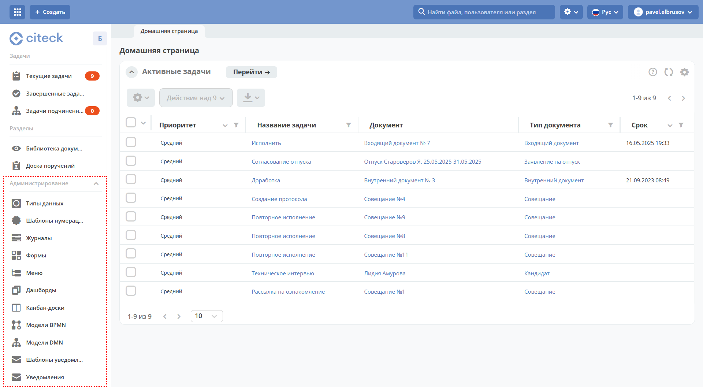

До создания самого бизнес-процесса необходимо создать ряд :ref:`артефактов<ecos_artifacts>` в следующем порядке:

- :ref:`тип данных<data_types_main>`;
- :ref:`процесс<ecos_bpmn>`.

.. _ws_artifacts_data_type:

Типы данных
------------

**Тип данных** — основной источник метаданных для работы с объектом.

В разделе **Администрирование** перейдите в пункт **Типы данных** и нажмите **+ → Создать новый тип**:

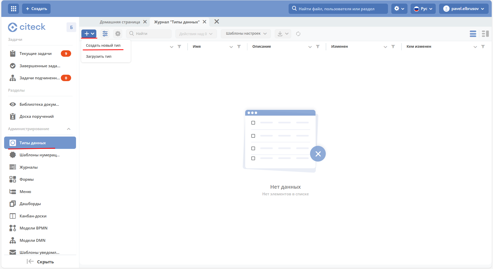

Основное
~~~~~~~~~

На вкладке расположены основные данные по типу данных:

.. list-table::
   :widths: 5 20 50
   :header-rows: 1
   :align: center
   :class: tight-table

   * - №
     - Поле
     - Значение
   * - 1
     - id
     - ``equipment-request``
   * - 2
     - Имя
     - Заявка на покупку оборудования
   * - 3
     - Родитель
     - Кейс
   * - 4
     - Форма
     - Оставить по умолчанию — система автоматически сгенерирует форму по указанным атрибутам. Автоматически сгенерированные формы нельзя редактировать.
   * - 5
     - Журнал
     - Оставить по умолчанию — система автоматически сгенерирует журнал по указанным атрибутам. Автоматически сгенерированные журналы нельзя редактировать.

Конечная настройка вкладки:

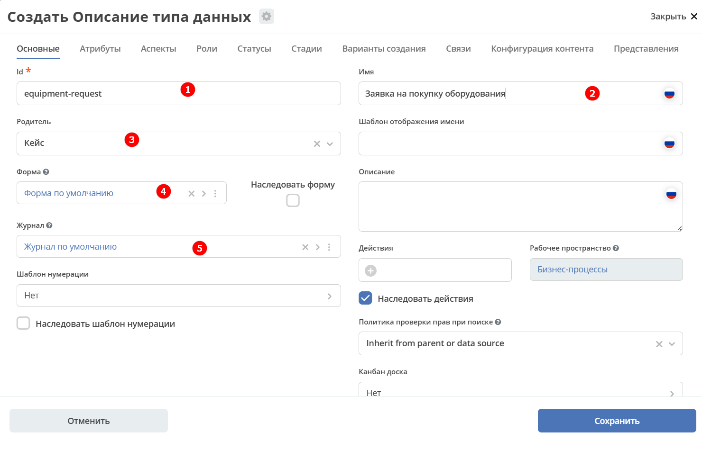

Атрибуты
~~~~~~~~~

На вкладке описываются свойства, которые будут использованы для взаимодействия с объектом.

Для создания заявки необходима следующая информация:

- что необходимо купить;
- сколько стоит;
- кто запрашивает;
- кто согласует закупку.

Соответствующие атрибуты (свойства объекта):

.. list-table::
   :widths: 20 30 20
   :header-rows: 1
   :align: center
   :class: tight-table

   * - Id **(1)**
     - Имя **(2)**
     - Тип **(3)**
   * - ``name``
     - Название оборудования
     - Text
   * - ``price``
     - Стоимость
     - Number
   * - ``requester``
     - Инициатор
     - Person
   * - ``approver``
     - Согласующий
     - Person

Конечная настройка вкладки:

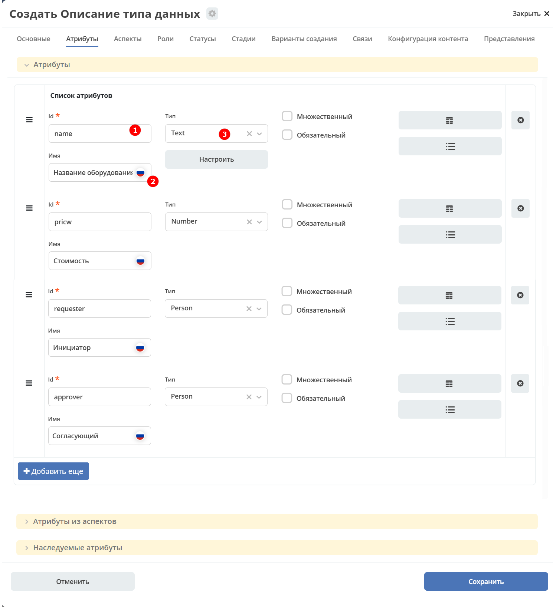

Роли
~~~~~

На вкладке описываются роли, участвующие в работе с объектом — в данном случае с заявкой.

Исходя из атрибутов, потребуется две роли: **Инициатор** и **Согласующий**.

.. note::

   Поле **Атрибут** заполняется из атрибутов, добавленных на вкладке «Атрибуты». При клике на поле отображается их список.

.. list-table::
   :widths: 20 30 30
   :header-rows: 1
   :align: center
   :class: tight-table

   * - Id **(1)**
     - Имя **(2)**
     - Атрибут **(3)**
   * - ``requestor``
     - Инициатор
     - Инициатор
   * - ``approver``
     - Согласующий
     - Согласующий

Конечная настройка вкладки:

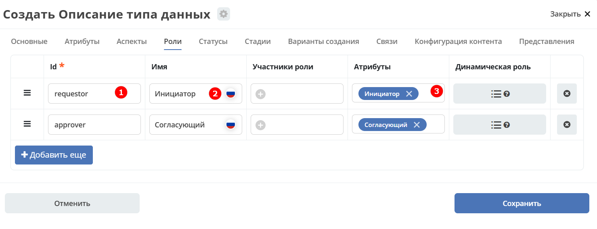

Статусы
~~~~~~~~

На вкладке описываются статусы, по которым объект (заявка) будет перемещаться в ходе бизнес-процесса.

Рассмотрим простой успешный сценарий: инициатор создаёт заявку (статус **«Заявка создана»**), отправляет её на согласование (статус **«На согласовании»**), согласующий одобряет заявку (статус **«Согласовано»**).

.. list-table::
   :widths: 25 35
   :header-rows: 1
   :align: center
   :class: tight-table

   * - Id **(1)**
     - Имя **(2)**
   * - ``request-created``
     - Заявка создана
   * - ``approving``
     - На согласовании
   * - ``approved``
     - Согласовано
   * - ``rejected``
     - Отказано

Конечная настройка вкладки:

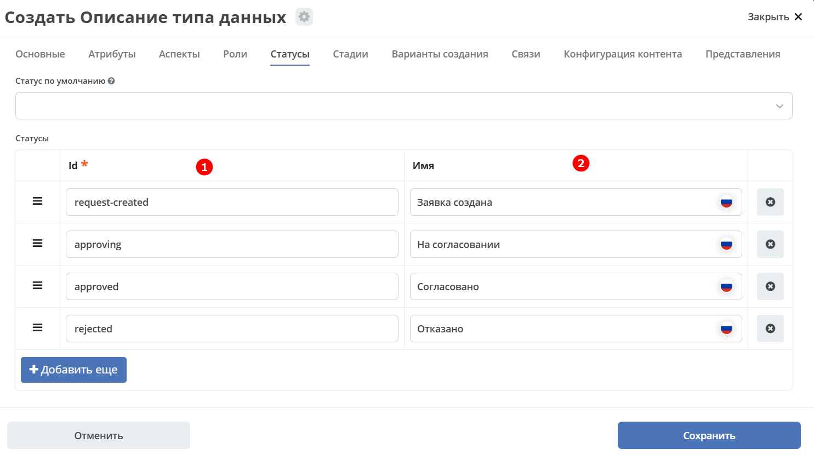

Нажмите **«Сохранить»**. Базовый вариант типа данных для заявки создан.

Промежуточный итог
~~~~~~~~~~~~~~~~~~

В результате настройки типа данных:

- указана базовая информация: id и название типа данных;
- форма и журнал сгенерированы системой автоматически на основании введённых данных;
- описаны свойства заявки для дальнейшего взаимодействия;
- добавлены роли участников работы с заявкой;
- определены статусы жизненного цикла заявки.

Журнал **«Заявка на покупку оборудования»** автоматически добавлен в меню.

.. _ws_artifacts_bpmn:

Модели BPMN
------------

В разделе **Администрирование** перейдите в пункт **Модели BPMN** и нажмите **+ → Создать BPMN модель**:

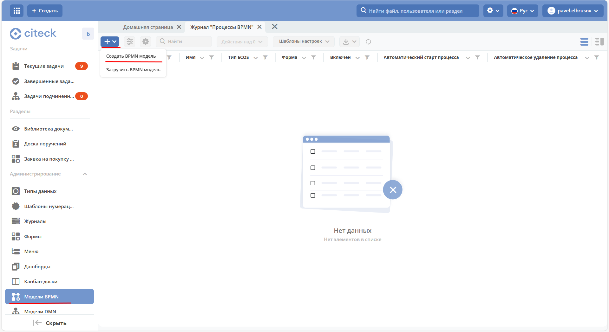

В открывшемся модальном окне заполните поля:

.. list-table::
   :widths: 5 30 50
   :header-rows: 1
   :align: center
   :class: tight-table

   * - №
     - Поле
     - Значение
   * - 1
     - Идентификатор
     - ``equipment-request``
   * - 2
     - Имя
     - Заявка на покупку оборудования
   * - 3
     - Тип данных
     - ``equipment-request``
   * - 4
     - Включён
     - True — отметка об активности процесса
   * - 5
     - Автоматический старт процесса
     - Выставить чекбокс, чтобы процесс запускался автоматически. Подробнее: :ref:`запуск процесса<new_bp_start>`
   * - 6
     - Автоматическое удаление процесса
     - При удалении объекта указанного типа процесс будет удалён автоматически. По умолчанию включено.

.. note::

   Обязательно выставите чекбоксы **Включён (4)** и **Автоматический старт процесса (5)**.

Конечная настройка бизнес-процесса:

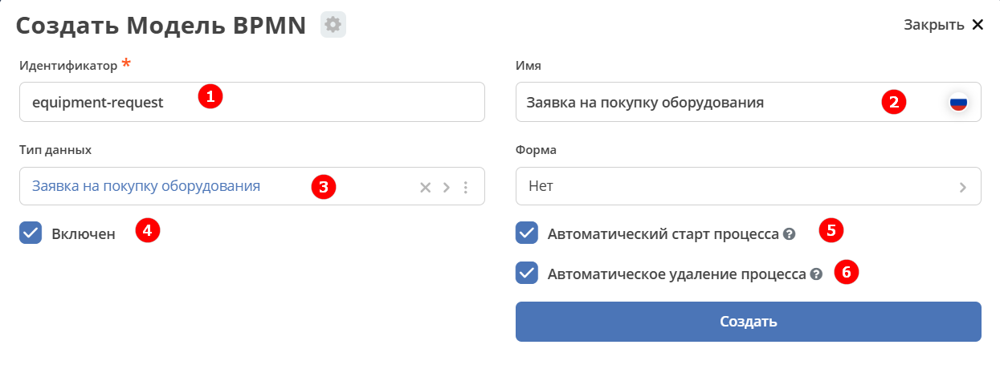

Нажмите **«Создать»**. Откроется **конструктор бизнес-процесса**:

.. image:: _static/ws_artifacts/bp/bp_03.png
   :width: 700
   :align: center

Опишем схему процесса в :ref:`редакторе бизнес-процессов<editor_bpmn>`. Маршрут заявки:

**Создать заявку → Отправить на согласование → Согласовать / Отклонить заявку**

Шаг 1. Start Event
~~~~~~~~~~~~~~~~~~~

Автоматически на схему добавляется элемент начала процесса — :ref:`Start Event<bpmn_events>`. Он отслеживает появление в системе нового объекта с нужным типом данных.

Выделите **Start Event** — рядом с элементом откроется контекстное меню для добавления новых элементов, настройки связей или редактирования текущего элемента.

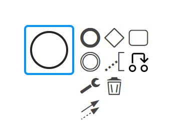

Шаг 2. Смена статуса — «Заявка создана»
~~~~~~~~~~~~~~~~~~~~~~~~~~~~~~~~~~~~~~~~~

Сразу после создания заявка должна получить статус **«Заявка создана»**. В контекстном меню нажмите на элемент :ref:`Set Status<set_status>`:

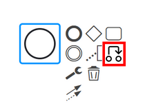

В панели настроек справа укажите:

- Имя — **Статус «Заявка создана»**;
- Статус — **Заявка создана**.

.. image:: _static/ws_artifacts/bp/set_status_prop.png
   :width: 300
   :align: center

Шаг 3. User Task — задача инициатора
~~~~~~~~~~~~~~~~~~~~~~~~~~~~~~~~~~~~~~

Когда заявка создана, инициатор должен проверить её содержимое и отправить на согласование. Для этого создайте задачу пользователя.

В контекстном меню нажмите на элемент **Task**:

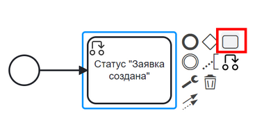

Тип элемента необходимо изменить с «Task» на :ref:`User Task<user_task>`. Нажмите на иконку гаечного ключа и выберите **«User Task»**:

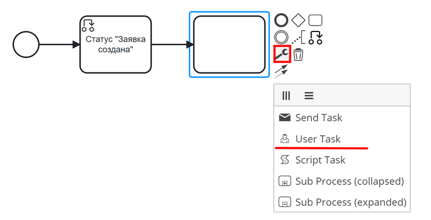

В панели настроек укажите:

- Имя — **На согласование**;
- Реципиент — **Инициатор**.

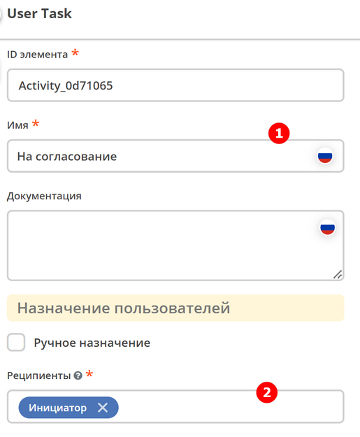

.. note::

   Форму к задаче можно не создавать вручную — система автоматически сформирует простую форму с кнопками, настроенными в поле **Результат задачи**.

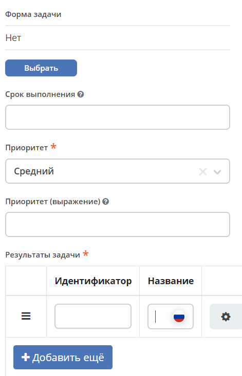

**Приоритет** по умолчанию — **Средний**.

В списке **«Результаты задачи»** укажите:

- Идентификатор — ``ToApprove``;
- Название — **На согласование**.

.. image:: _static/ws_artifacts/bp/form_to_approve_5.png
   :width: 400
   :align: center

Шаг 4. Смена статуса — «На согласовании»
~~~~~~~~~~~~~~~~~~~~~~~~~~~~~~~~~~~~~~~~~~

После отправки на согласование измените статус задачи. В контекстном меню нажмите на иконку **Set Status**:

.. image:: _static/ws_artifacts/bp/set_status_2.png
   :width: 400
   :align: center

В панели настроек укажите:

- Имя — **Статус «На согласовании»**;
- Статус — **На согласовании**.

.. image:: _static/ws_artifacts/bp/set_status_2_prop.png
   :width: 400
   :align: center

Шаг 5. User Task — задача согласующего
~~~~~~~~~~~~~~~~~~~~~~~~~~~~~~~~~~~~~~~~

Создайте аналогичную задачу для согласующего.

Добавьте элемент **Task** через контекстное меню:

.. image:: _static/ws_artifacts/bp/User_task_3.png
   :width: 500
   :align: center

Измените тип с **Task** на **User Task**:

.. image:: _static/ws_artifacts/bp/User_task_4.png
   :width: 600
   :align: center

В панели настроек укажите:

- Имя — **На согласовании согласующим**;
- Реципиент — **Согласующий**.

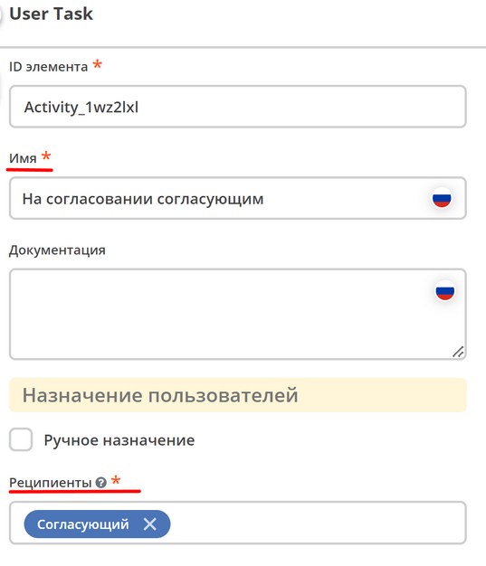

**Приоритет** по умолчанию — **Средний**.

В списке **«Результаты задачи»** укажите два варианта:

- Идентификатор — ``Approve``, Название — **Согласовать**;
- Идентификатор — ``Reject``, Название — **Отказать**.

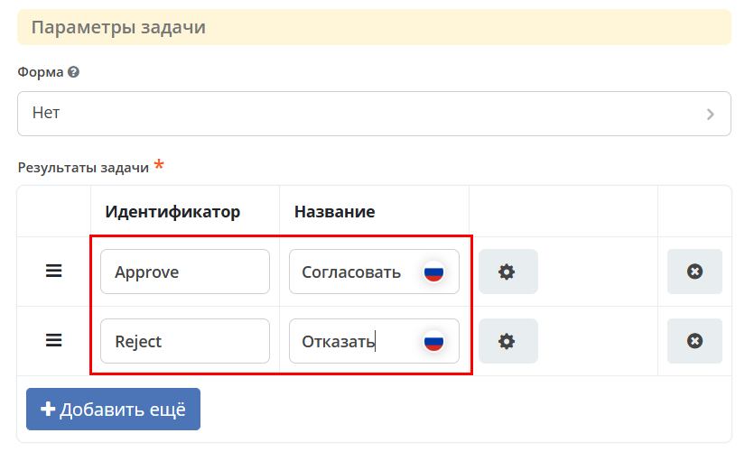

.. _approve_form_bpmn:

.. note::

   Форму к задаче можно не создавать вручную — система сформирует её автоматически и отобразит вердикты из поля **Результат задачи**.

   В данном примере создадим пользовательскую форму для ознакомления с конструктором форм.

**Формы для задач** обычно содержат комментарии и кнопки вердиктов. В данном случае достаточно кнопок исхода задачи **«На согласовании»**.

Последовательность действий:

1. На панели настроек элемента **User Task** нажмите **«Выбрать»** под полем **«Форма задачи»**:

   .. image:: _static/ws_artifacts/bp/form_common_1.png
      :width: 400
      :align: center

2. В верхней части нажмите **«Создать»** и выберите **«Создать форму»**:

   .. image:: _static/ws_artifacts/bp/form_common_2.png
      :width: 600
      :align: center

3. Заполните поля:

   - Идентификатор формы — ``equipment-request-approve-form``;
   - Название формы — **Форма согласования заявки на покупку оборудования**.

4. Нажмите **«Редактировать форму»**:

   .. image:: _static/ws_artifacts/bp/request_approve_1.png
      :width: 600
      :align: center

5. Удалите текстовый элемент **«Название»** и кнопки:

   .. image:: _static/ws_artifacts/bp/form_outcome_1.png
      :width: 600
      :align: center

6. Перейдите в **«Расширенные»** и перетащите элемент **Task Outcome** на форму:

   .. image:: _static/ws_artifacts/bp/form_outcome_2.png
      :width: 600
      :align: center

7. В поле **«Имя свойства»** введите ``outcome`` и нажмите **«Сохранить»**:

   .. image:: _static/ws_artifacts/bp/form_outcome_3.png
      :width: 600
      :align: center

   Элемент **Task Outcome** автоматически сформирует кнопки вердиктов на основании **Результатов задачи**.

8. Нажмите **«Сохранить»**:

   .. image:: _static/ws_artifacts/bp/form_outcome_4.png
      :width: 600
      :align: center

9. Выберите созданную форму.

Шаг 6. Gateway — ветвление маршрута
~~~~~~~~~~~~~~~~~~~~~~~~~~~~~~~~~~~~~

После работы согласующего процесс может пойти по двум путям: заявка согласована или отклонена. Добавьте разветвитель — :ref:`Gateway<gateways>`.

**Gateway** управляет разветвлением и слиянием потоков. Добавьте его из контекстного меню или с панели слева:

.. image:: _static/ws_artifacts/bp/gateway_1.png
   :width: 600
   :align: center

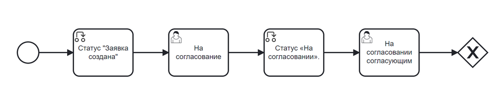

Шаг 7. Смена статуса — «Согласовано» и «Отказано»
~~~~~~~~~~~~~~~~~~~~~~~~~~~~~~~~~~~~~~~~~~~~~~~~~~~

Добавьте два элемента смены статуса после **Gateway**.

Для статуса **«Согласовано»**: в контекстном меню **Gateway** нажмите на иконку **Set Status**:

.. image:: _static/ws_artifacts/bp/set_status_3.png
   :width: 600
   :align: center

Укажите:

- Имя — **Статус «Согласовано»**;
- Статус — **Согласовано**.

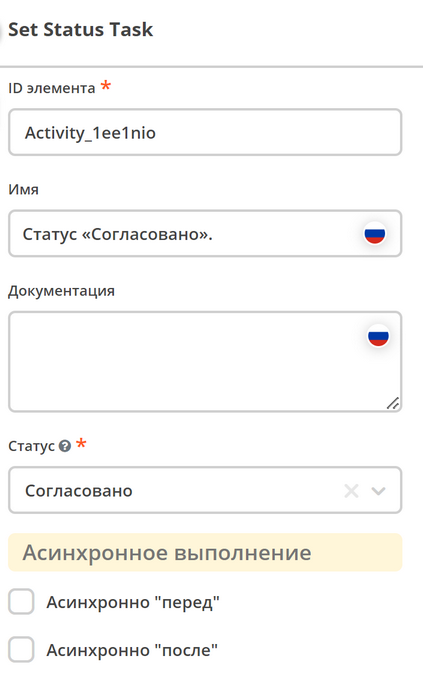

Для статуса **«Отказано»**: аналогично добавьте второй **Set Status** из контекстного меню **Gateway**:

- Имя — **Статус «Отказано»**;
- Статус — **Отказано**.

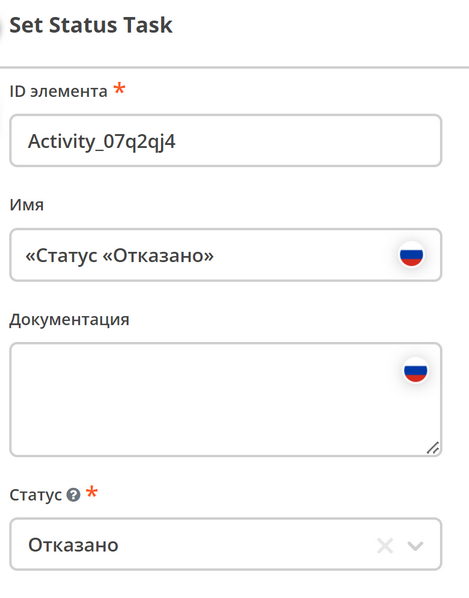

Шаг 8. Настройка потоков Sequence Flow
~~~~~~~~~~~~~~~~~~~~~~~~~~~~~~~~~~~~~~~

Система определяет маршрут по условиям на стрелках (**Sequence Flow**), выходящих из **Gateway**. Выберите нужную стрелку и настройте условие.

Для потока **«Согласовано»**:

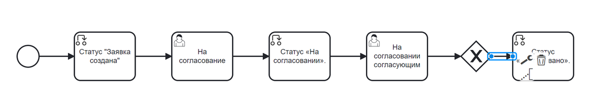

- Имя — **Согласовано**;
- Тип условия — **Исходящий**;
- Исходящий — **На согласовании согласующим - Согласовать**.

.. note::

   Варианты в поле «Исходящий» формируются автоматически из двух частей: название задачи (поле **Имя**) и название результата задачи.

.. image:: _static/ws_artifacts/bp/Sequence_Flow_2.png
   :width: 300
   :align: center

Для потока **«Отказано»**:

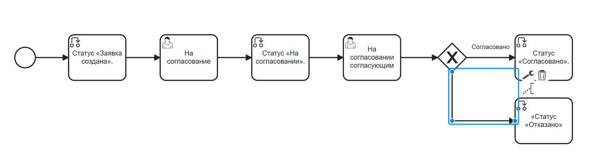

- Имя — **Отказано**;
- Тип условия — **Исходящий**;
- Исходящий — **На согласовании согласующим - Отказать**.

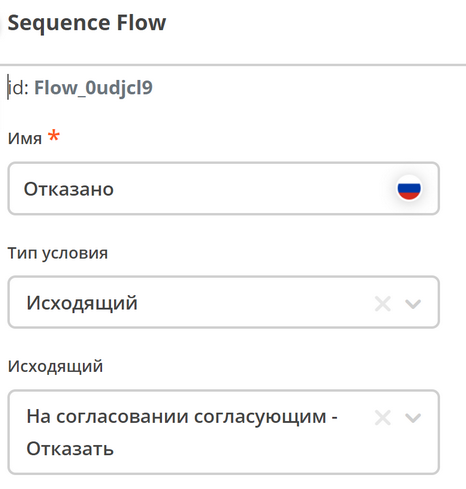

Шаг 9. End Event — завершение процесса
~~~~~~~~~~~~~~~~~~~~~~~~~~~~~~~~~~~~~~~

Добавьте элемент окончания процесса :ref:`End Event<bpmn_events>` после каждого из элементов смены статуса — **«Статус «Согласовано»** и **«Статус «Отказано»**.

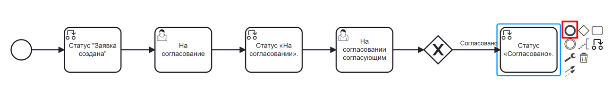

Сохраните и опубликуйте процесс:

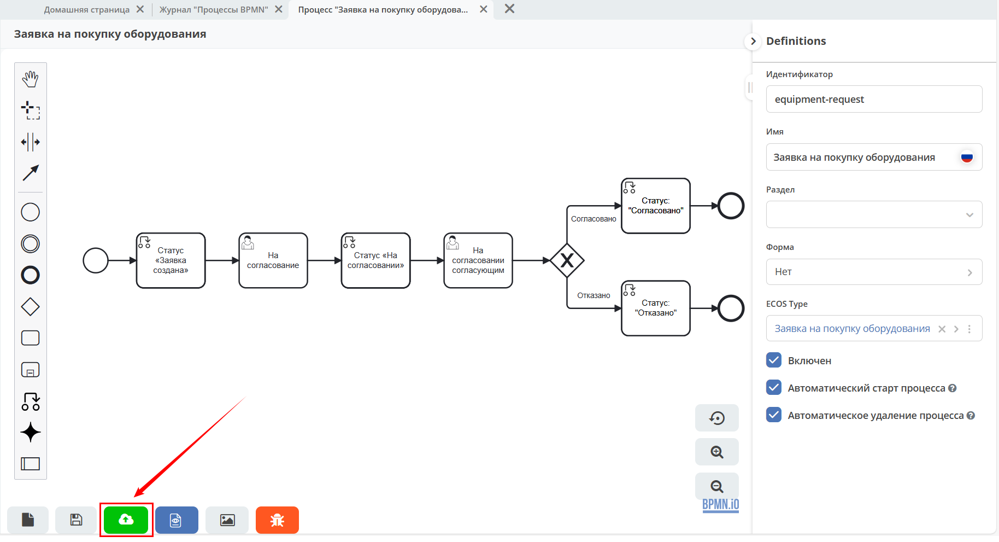

.. seealso::

   Принятие решений по заявке можно автоматизировать с помощью таблицы принятия решений. См. :ref:`подробнее<sample_request_dmn>`.

Запуск и проверка процесса
~~~~~~~~~~~~~~~~~~~~~~~~~~~

После создания типа данных, журнала, формы и бизнес-процесса можно проверить работу.

В левом меню выберите **«Заявка на покупку оборудования»** — откроется пустой журнал. Нажмите **«+»** для создания новой заявки:

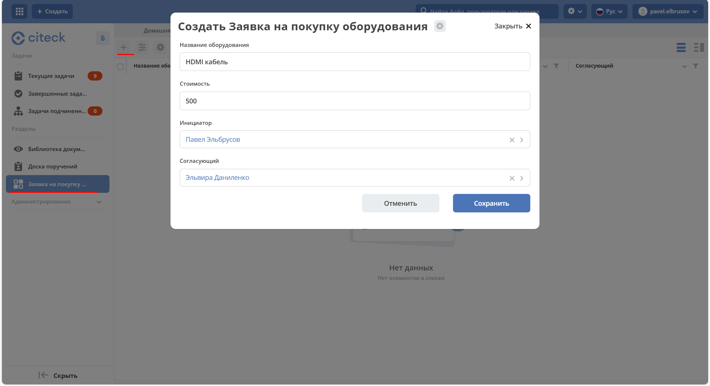

Заполните поля, например:

- Название оборудования — **HDMI кабель**;
- Стоимость — **500**;
- Инициатор — выберите сотрудника из оргструктуры;
- Согласующий — выберите сотрудника из оргструктуры (на вкладке **Все пользователи** отображаются только участники рабочего пространства).

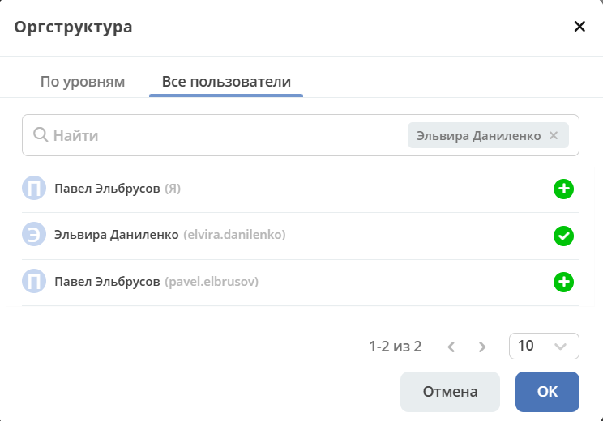

Нажмите **«Сохранить»**. Заявка перейдёт в статус **«Заявка создана»** и откроется её карточка.

В виджете **«Мои задачи»** нажмите кнопку **«На согласование»**:

.. image:: _static/ws_artifacts/bp/new_request_3.png
   :width: 700
   :align: center

Заявка перейдёт в статус **«На согласовании»**, и на согласующего будет назначена задача.

Зайдите под учётной записью согласующего, откройте персональное рабочее пространство, перейдите в **Текущие задачи** и откройте задачу:

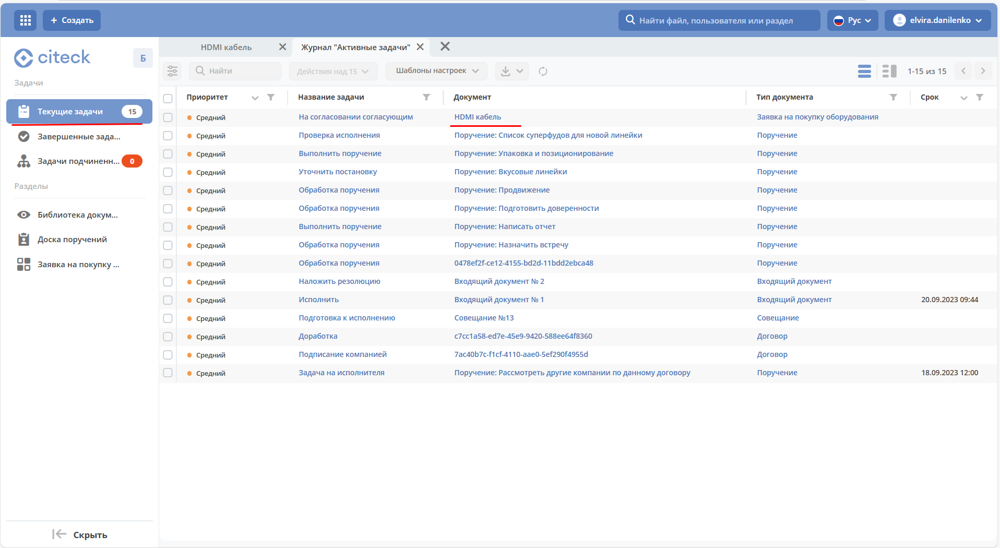

В виджете **«Мои задачи»** нажмите **«Согласовать»**:

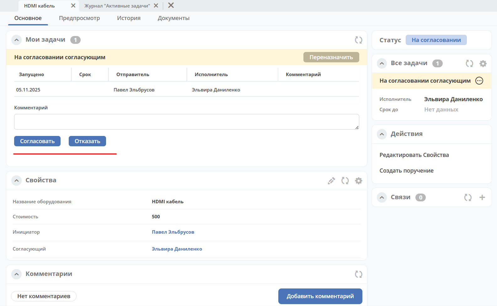

Заявка перейдёт в статус **«Согласовано»** — процесс успешно завершён.

Модели DMN
-----------

Автоматическое решение о согласовании/отказе
~~~~~~~~~~~~~~~~~~~~~~~~~~~~~~~~~~~~~~~~~~~~~

Расширим созданный процесс: добавим :ref:`таблицу принятия решений<dmn_decision>` для автоматического согласования или отказа по определённым видам оборудования.

В разделе **Администрирование** перейдите в пункт **Модели DMN** и нажмите **+ → Создать DMN модель**:

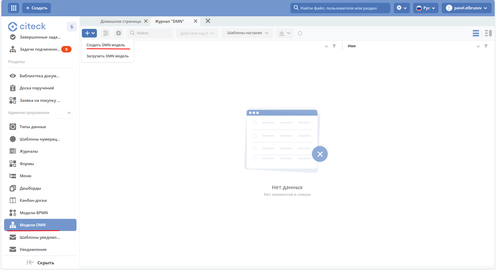

Заполните поля:

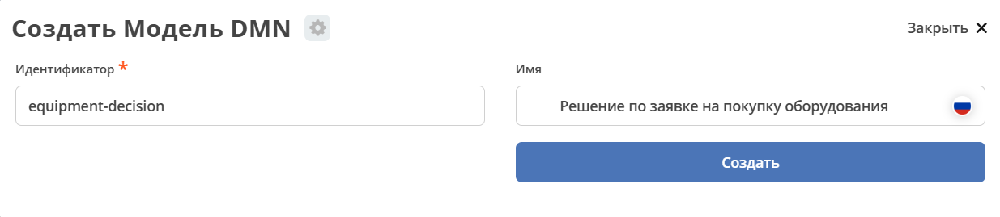

.. list-table::
   :widths: 5 25 40
   :header-rows: 1
   :align: center
   :class: tight-table

   * - №
     - Поле
     - Значение
   * - 1
     - Идентификатор
     - ``equipment-decision``
   * - 2
     - Имя
     - Решение по заявке на покупку оборудования

Нажмите **«Создать»**. Откроется редактор решения:

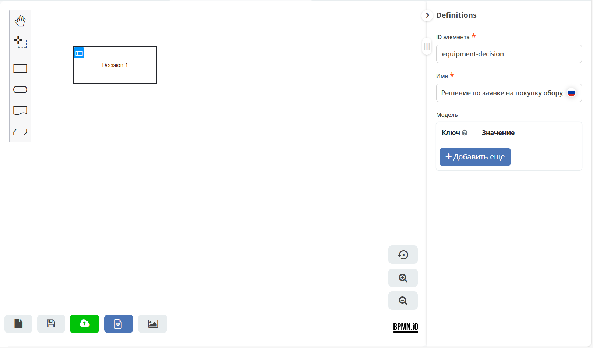

.. seealso::

   Дальнейший порядок действий описан в :ref:`статье<request_dmn_decision>`.

Использование динамической роли DMN в бизнес-процессе
~~~~~~~~~~~~~~~~~~~~~~~~~~~~~~~~~~~~~~~~~~~~~~~~~~~~~~~

В процесс можно добавить динамическую роль для автоматического выбора согласующего в зависимости от условий. Правила роли определяются в :ref:`таблице DMN<ecos-dmn>`, а сама роль задаётся в :ref:`типе данных<ws_artifacts_data_type>`.

.. seealso::

   Порядок действий описан в :ref:`статье<dynamic_role_dmn>`.
