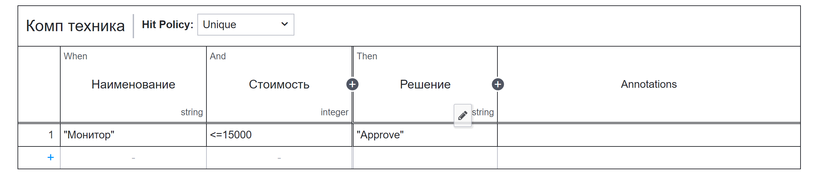
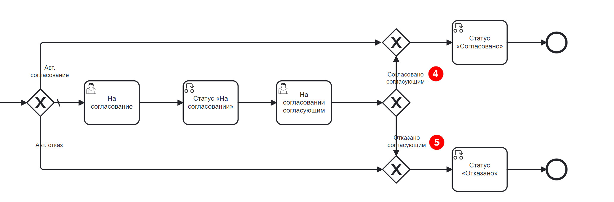

Процесс запроса на закупку оборудования. Включение DMN в процесс
=================================================================

.. _sample_request_dmn_demo:

.. note::

    Данная статья является продолжением работы с созданным ранее бизнес-процессом :ref:`Запрос на закупку оборудования<sample_request_demo>` 

Закупку оборудования всегда согласовывают, и если заявка по каким-то критериям не проходит – отклоняют.

В зависимости от условий согласование/отказ в покупке некоторых видов оборудования можно автоматизировать. Для рассмотрения данного варианта подходит использование DMN, а в частности :ref:`таблицы принятия решений<dmn_decision>` 

DMN служит для сортировки входящих данных процесса или уменьшение их количества. 

Данная функциональность, основываясь на входящих данных, помогает принять конечные или промежуточные решения по бизнес-процессу. 

Для начала работы необходимо создать саму таблицу. 

Создание таблицы принятия решений
----------------------------------

Для таблицы требуется определить критерии, по которым будет приниматься решение. Основные критерии - наименование оборудования и его стоимость. 

Для создания таблицы принятия решений перейдите левом меню в пункт **«Моделирование – Методы принятия решения»**:

 .. image:: _static/equipment_request_p2_demo/01.png
       :width: 600
       :align: center

Далее создайте DMN модель:

 .. image:: _static/equipment_request_p2_demo/02.png
       :width: 600
       :align: center

Заполните поля:

 .. image:: _static/equipment_request_p2_demo/03.png
       :width: 600
       :align: center

.. list-table:: 
      :widths: 10 20 30
      :align: center
      :class: tight-table 

      * - **1**
        - Идентификатор
        - equipment-desicion
      * - **2**
        - Имя
        - Решение по заявке на покупку оборудования

Нажмите **«Сохранить»**.

Для перехода к редактору разверните раздел **«По умолчанию»**, наведите курсор на созданную модель и нажмите:

 .. image:: _static/equipment_request_p2_demo/04.png
       :width: 600
       :align: center

Откроется **решение**:

 .. image:: _static/equipment_request_p2_demo/05.png
       :width: 600
       :align: center

Для ввода данных в таблицу кликните:

 .. image:: _static/equipment_request_p2_demo/06.png
       :width: 300
       :align: center

|

 .. image:: _static/equipment_request_p2_demo/07.png
       :width: 600
       :align: center

Двойным кликом по наименованию решения **(1)** перейдите в режим редактирования и назовите решение **Комп техника**.

**Hit policy (2)** -  :ref:`политика выбора<dmn_hit_policy>` Определим ее как **Unique** (по умолчанию).

**(3)** – входные элементы, **(4)** – выходные элементы.

Совокупность входных элементов и выходного формируют решение.

.. note::

    Указанные ниже переменные входных и выходных элементов выбраны не случайно. Они потребуются для настройки компонента **business rule task** в целевом бизнес-процессе.

Входные элементы 
~~~~~~~~~~~~~~~~~

Для установки наименования входного элемента, дважды кликните поле под **«When»** и введите **Наименование**:

 .. image:: _static/equipment_request_p2_demo/08.png
       :width: 600
       :align: center

В свойствах укажите:

.. list-table:: 
      :widths: 10 20 30
      :header-rows: 1
      :align: center
      :class: tight-table 

      * - Поле
        - Значение
        - Пояснение
      * - Input Variable
        - name
        - Соответствует атрибуту name из :ref:`типа данных<sample_request_attributes>`. Значение будет передаваться как переменная в бизнес-процесс.
      * - Type
        - string
        - Типу string соответствует text в :ref:`типе данных<sample_request_attributes>`.

Нажмите **+** для добавления второго входного элемента:

 .. image:: _static/equipment_request_p2_demo/09.png
       :width: 600
       :align: center

Для установки наименования входного элемента, дважды кликните поле под **«When»** и введите **Стоимость**:

 .. image:: _static/equipment_request_p2_demo/10.png
       :width: 600
       :align: center

В свойствах укажите:

.. list-table:: 
      :widths: 10 20 30
      :header-rows: 1
      :align: center
      :class: tight-table 

      * - Поле
        - Значение
        - Пояснение
      * - Input Variable
        - price
        - Соответствует атрибуту price из :ref:`типа данных<sample_request_attributes>`. Значение будет передаваться как переменная в бизнес-процесс.
      * - Type
        - integer
        - Типу integer соответствует number в :ref:`типе данных<sample_request_attributes>`.

Выходной элемент
~~~~~~~~~~~~~~~~~

Для установки наименования выходного элемента, дважды кликните поле под **«Then»** и введите **Решение**:

 .. image:: _static/equipment_request_p2_demo/11.png
       :width: 600
       :align: center

В свойствах укажите:

.. list-table:: 
      :widths: 10 20 30
      :header-rows: 1
      :align: center
      :class: tight-table 

      * - Поле
        - Значение
        - Пояснение
      * - Output Name
        - decision
        - Значение будет передаваться в бизнес-процесс как переменная результата.
      * - Type
        - integer
        - 

Правила
~~~~~~~~

.. _sample_request_dmn_rules:

Согласована / не согласована покупка автоматически, или необходимо согласование конкретного сотрудника зависит от оборудования и его стоимости.

Для примера выберем 3 товара: Монитор, Мышь, Ноутбук. Укажем для каждого товара лимит/ диапазон стоимости и соответствующее возможное решение:

.. list-table:: 
      :widths: 10 10
      :align: center
      :class: tight-table 

      * - "Approve"
        - Согласовано автоматически
      * - "Reject"
        - Отказано автоматически
      * - "Assign approver"
        - Согласование конкретным сотрудником

В зависимости от решения процесс по соответствующему потоку управления. 

Добавьте первое правило, указывающее, что для **«Монитора»** стоимостью **15 000 или менее** — решение **«Approve»**.

.. note::

    **Наименование** и **Решение** типа string, поэтому элементы обязательно указывать в кавычках.

Нажмите кнопку **«+»** внизу таблицы или просто нажмите в любом месте последней строки.

Добавьте второе правило, указывающее, что для **«Монитора»** стоимостью **больше 15 000** - решение **«Reject»**.

 .. image:: _static/equipment_request_p2_demo/13.png
       :width: 600
       :align: center

Финальная таблица:

.. list-table:: 
      :widths: 10 20 30
      :header-rows: 1
      :align: center
      :class: tight-table 

      * - Наименование
        - Цена
        - Решение
      * - "Монитор"
        - <=15000
        - "Approve"
      * - "Монитор"
        - >15000
        - "Reject"
      * - "Мышь"
        - <=1500
        - "Approve"
      * - "Мышь"
        - >1500
        - "Reject"
      * - "Ноутбук"
        - <=60000
        - "Approve"
      * - "Ноутбук"
        - >250000
        - "Reject"
      * - "Ноутбук"
        - [60000..249999]
        - "Assign approver"

Теперь таблицу принятия решения можно сохранить и опубликовать, нажав:

 .. image:: _static/equipment_request_p2_demo/14.png
       :width: 600
       :align: center

Добавление модели принятия решения в бизнес-процесс
----------------------------------------------------

Далее необходимо добавить модель в существующий бизнес-процесс. Для этого необходимо:

    *	Настроить **переменные процесса (1)**, чтобы модель и бизнес-процесс могли взаимодействовать друг с другом;
    *	Добавить компонент **Business rule task (2)** – чтобы встроить в процесс модель;
    *	Настроить **шлюз  и потоки управления (3)**  – чтобы объяснить системе по какому направлению необходимо идти 

 .. image:: _static/equipment_request_p2_demo/15.png
       :width: 600
       :align: center

Добавление переменной в процесс (1)
~~~~~~~~~~~~~~~~~~~~~~~~~~~~~~~~~~~~

Между элементами **Статус «Заявка создана»** и **пользовательская задача «На согласование»** необходимо добавить :ref:`скриптовую задачу<script_task>`.

Для этого сначала удалите стрелку между элементами **Set status** и **User task**:

 .. image:: _static/equipment_request_p2_demo/16.png
       :width: 300
       :align: center

Далее в  контекстном меню нажмите на компонент **«Task»**:

 .. image:: _static/equipment_request_p2_demo/17.png
       :width: 300
       :align: center

Измените его тип на **Script task**:

 .. image:: _static/equipment_request_p2_demo/18.png
       :width: 400
       :align: center

Чтобы данные входных элементов решения стали доступны в бизнес-процессе, их необходимо ввести в виде переменных.

Укажите в форме:

    *	Имя - **«Стоимость и наименование»**,
    *	в **Скрипте** указать:

    .. code-block::

        execution.setVariable('price', document.load("price?num"));
        execution.setVariable('name', document.load("name")); 

 .. image:: _static/equipment_request_p2_demo/19.png
       :width: 300
       :align: center

Добавление элемента Business rule task (2)
~~~~~~~~~~~~~~~~~~~~~~~~~~~~~~~~~~~~~~~~~~~

Следующим элементом необходимо добавить :ref:`Business rule task<business_rule_task>`.

В контекстном меню нажмите на компонент «Task», измените его тип на Business Rule Task:

 .. image:: _static/equipment_request_p2_demo/20.png
       :width: 500
       :align: center

Укажите в форме:

    *	Имя – **Решение по заявке**.
    *	Решение – выбрать из журнала созданное ранее **решение**.
    *	Связь – **Актуальное** (всегда последняя версия решения).
    *	Переменная результата - **decision** (заданная при создании Выходного элемента).
    *	Сопоставление результатов решения – **Один объект (TypedValue)** – так как у нас на выходе одно значение.

 .. image:: _static/equipment_request_p2_demo/21.png
       :width: 300
       :align: center

Обновление шлюзов и потоков управления (3)
~~~~~~~~~~~~~~~~~~~~~~~~~~~~~~~~~~~~~~~~~~~

Шлюзы и потоки управления рассмотрим на финальной схеме:

 .. image:: _static/equipment_request_p2_demo/22.png
       :width: 800
       :align: center

Следующий компонент  - **шлюз с 3 выходами** в соответствии с :ref:`правилами<sample_request_dmn_rules>`:

 .. image:: _static/equipment_request_p2_demo/23.png
       :width: 400
       :align: center

* 1 - **"Assign approver"** (Согласование согласующим)
* 2 - **"Approve"** (Авт. согласование)
* 3 - **"Reject"** (Авт. отказ)

.. list-table:: 
      :widths: 20 50
      :align: center
      :class: tight-table 

      * - **1 Согласование согласующим**
        - | Стрелка **(1)** означает поток по умолчанию и получается из стандартного потока следующим образом:

            .. image:: _static/equipment_request_p2_demo/24.png
                :width: 400
                :align: center

          | И далее за потоком по умолчанию следуют элементы базового процесса:

             .. image:: _static/equipment_request_p2_demo/25.png
                :width: 400
                :align: center         

      * - **2 Авт. согласование**
        - | Поток автоматического согласования по итогу применения таблицы принятия решения:

            -	Имя - **«Авт. согласование»**,
            -	Скрипт:
               
               .. code-block::

                decision === 'Approve';

            .. image:: _static/equipment_request_p2_demo/26.png
                :width: 300
                :align: center

      * - **3 Авт. отказ**
        - | Поток автоматического отказа по итогу применения таблицы принятия решения:

            -	Имя - **«Авт. отказ»**,
            -	Скрипт:
               
               .. code-block::

                decision === 'Reject';

            .. image:: _static/equipment_request_p2_demo/27.png
                :width: 300
                :align: center

Обратите внимание на потоки **(4)** и **(5)**. Они были настроены в базовом процессе:

.. list-table:: 
      :widths: 20 50
      :align: center
      :class: tight-table 

      * - **4 Согласовано согласующим**
        - | 

            - Укажите имя **«Согласовано согласующим»**.
            - В поле **«Тип условия»** выберите вариант **«Исходящий»**.
            - В появившемся поле **«Исходящий»** выберите вариант **«На согласовании согласующим - Согласовать»**.

            .. image:: _static/equipment_request_p2_demo/29.png
                :width: 300
                :align: center
      * - **5 Отказано согласующим**
        - | 

            - Укажите имя **«Отказано согласующим»**.
            - В поле **«Тип условия»** выберите вариант **«Исходящий»**.
            - В появившемся поле **«Исходящий»** выберите вариант **«На согласовании согласующим - Отказать»**.

            .. image:: _static/equipment_request_p2_demo/30.png
                :width: 300
                :align: center

Процесс можно сохранить и опубликовать, нажав:

 .. image:: _static/equipment_request_p2_demo/31.png
       :width: 600
       :align: center

Проверка процесса
-------------------

Проверим, как работает таблица принятия решения.

.. note::

 Чтобы решение принималось автоматически, название оборудования в форме завки должно четкое соответствовать (включая регистр) наименованию в таблице принятия решений.
 
 Будьте внимательны при сравнении строк и использовании символов в unicode.
 
Случай автоматического согласования
~~~~~~~~~~~~~~~~~~~~~~~~~~~~~~~~~~~~~~~~~~~

В журнале создадим заявку с данными:

  * Название оборудование – **Мышь**
  * Стоимость - **500**
  *	Инициатор – **выбрать себя из оргструктуры**
  *	Согласующий – **выбрать согласующего сотрудника из оргструктуры**

 .. image:: _static/equipment_request_p2_demo/32.png
       :width: 500
       :align: center

И нажмите **«Сохранить»**. Заявка создается успешно и ее статус автоматически становится **«Согласовано»**:

 .. image:: _static/equipment_request_p2_demo/33.png
       :width: 600
       :align: center

Случай автоматического отказа
~~~~~~~~~~~~~~~~~~~~~~~~~~~~~~

В журнале создадим заявку с данными:

  * Название оборудование – **Монитор**
  * Стоимость - **250001**
  *	Инициатор – **выбрать себя из оргструктуры**
  *	Согласующий – **выбрать согласующего сотрудника из оргструктуры**

 .. image:: _static/equipment_request_p2_demo/34.png
       :width: 500
       :align: center

И нажмите **«Сохранить»**. Заявка создается успешно и ее статус автоматически становится **«Отказано»**:

 .. image:: _static/equipment_request_p2_demo/35.png
       :width: 600
       :align: center

Случай хода процесса по потоку по умолчанию (с согласованием сотрудником)
~~~~~~~~~~~~~~~~~~~~~~~~~~~~~~~~~~~~~~~~~~~~~~~~~~~~~~~~~~~~~~~~~~~~~~~~~~~~

Если указать любое другое название оборудования, не указанное в таблице, или указать:

  * Название оборудование – **Ноутбук**
  * Стоимость - **65000**
  *	Инициатор – **выбрать себя из оргструктуры**
  *	Согласующий – **выбрать согласующего сотрудника из оргструктуры**

 .. image:: _static/equipment_request_p2_demo/36.png
       :width: 500
       :align: center

то процесс пойдет стандартным способом, как в первоначальном :ref:`Запросе на закупку оборудования<sample_request>`: 

 .. image:: _static/equipment_request_p2_demo/37.png
       :width: 600
       :align: center