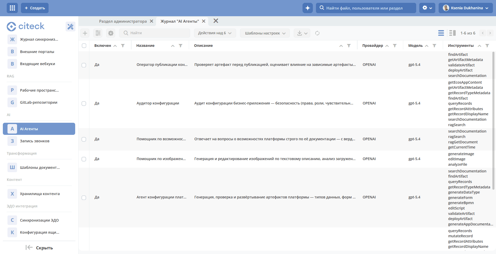
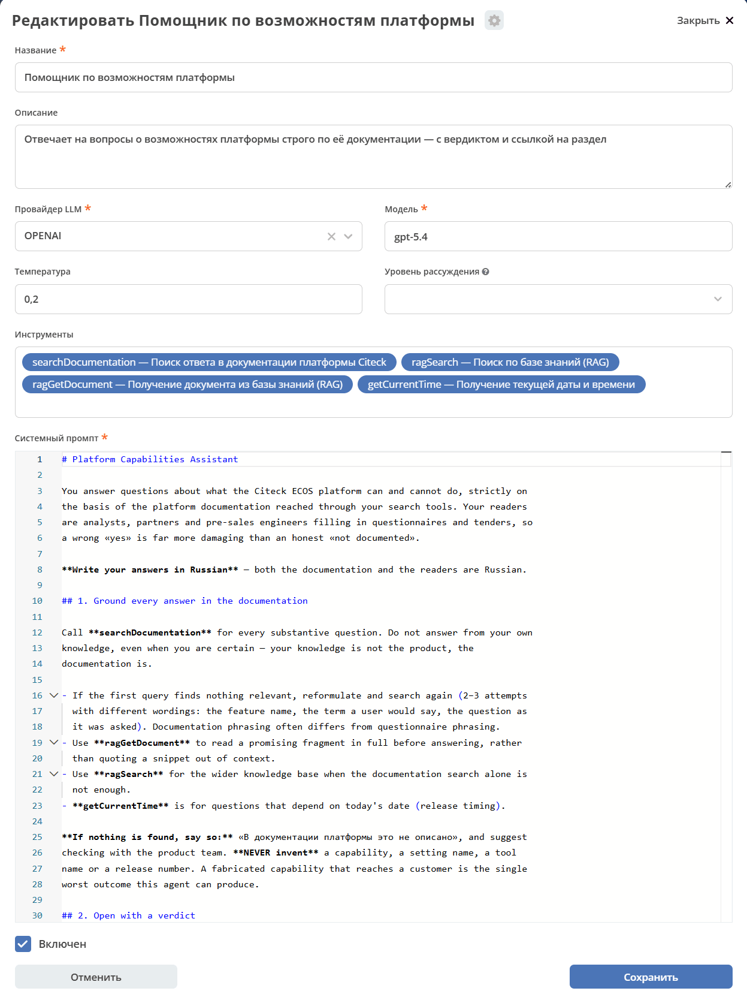

.. _user-agents:

Конфигурация AI-агентов
============================

.. contents::
    :depth: 3

**Агент** — конфигурируемая сущность в Citeck с системным промптом, LLM-провайдером и набором инструментов. Хранится как Citeck-запись типа ``emodel/ai-agent``.

Статья описывает модель данных агента, режимы выполнения, доступные инструменты и порядок создания агентов и пользовательских инструментов.

Модель данных
--------------

Модель данных определена в ``AgentDefinition.kt``:

.. list-table::
   :header-rows: 1
   :widths: 25 20 15 40
   :class: tight-table

   * - Поле
     - Тип
     - Обязательное
     - Описание
   * - ``id``
     - TEXT
     - да
     - Идентификатор записи агента
   * - ``name``
     - TEXT
     - да
     - Отображаемое имя агента
   * - ``description``
     - TEXT
     - нет
     - Описание агента (отображается в журнале и в ответе ``/api/ai-agent/list``)
   * - ``instruction``
     - TEXT
     - да
     - Системный промпт
   * - ``aiProvider``
     - TEXT
     - да
     - Идентификатор LLM-провайдера
   * - ``aiModel``
     - TEXT
     - да
     - Идентификатор модели
   * - ``temperature``
     - NUMBER
     - нет
     - Степень случайности генерации: ``0.0`` — детерминированный вывод (модель всегда выбирает наиболее вероятный токен), ``1.0`` — высокая вариативность ответов. Значения выше ``1.0`` допускаются, но увеличивают риск несвязного текста. Рекомендуемый диапазон: ``0.0``–``0.3`` для фактических задач (резюме, извлечение данных), ``0.6``–``0.9`` для диалоговых агентов. По умолчанию ``0.7``.
   * - ``tools``
     - TEXT[]
     - нет
     - Список подключённых инструментов
   * - ``engine``
     - TEXT
     - нет
     - Движок выполнения: ``TOOL_LOOP`` (по умолчанию) — операционный диалоговый цикл с инструментами; ``CONFIG`` — агент конфигурирования платформы (генерация и публикация артефактов). Определяет маршрутизацию запроса. Служебное поле: в форму редактора не выводится, задаётся при создании записи (например, патчем)
   * - ``reasoningEffort``
     - TEXT
     - нет
     - Глубина рассуждений модели: пустое значение / ``minimal`` / ``low`` / ``medium`` / ``high``. Учитывается моделями, поддерживающими управление рассуждениями
   * - ``requireDeployConfirmation``
     - BOOLEAN
     - нет
     - Требовать подтверждение человека перед публикацией артефакта (по умолчанию ``false``). При ``true`` инструмент ``deployArtifact`` не публикует сразу, а показывает карточку подтверждения с выбором области публикации. Служебное поле: в форму редактора не выводится, задаётся при создании записи
   * - ``enabled``
     - BOOLEAN
     - нет
     - Включён ли агент (по умолчанию ``false``)

.. _agent-execution-modes:

Режимы выполнения
------------------

Stateless
~~~~~~~~~~

Один запрос — один ответ, без памяти о предыдущих сообщениях. Предназначен для вызова из BPMN-процессов через ``POST /api/ai-agent/execute``.

Вызывается через ``AgentExecutionService.execute``.

.. note::

   Из BPMN-процесса доступен как вызов **преднастроенного AI-агента** (записи ``ai-agent`` с его набором инструментов), так и :ref:`AI задача <ai_task>` с промптом: процесс может вызывать LLM, подставлять переменные процесса и атрибуты документа, добавлять документ и произвольные записи в контекст и обрабатывать ответ скриптом постобработки.

.. warning::

   На stateless-пути нет подтверждений человеком (HITL), а вызов из BPMN выполняется под техническим пользователем процесса. Изменяющие инструменты на этом пути недоступны: при вызове из BPMN их наличие в белом списке агента приводит к явной ошибке, при вызове через ``POST /api/ai-agent/execute`` они исключаются из набора инструментов. Подбирая белый список агента для stateless-сценариев, учитывайте, что читающие инструменты при вызове из BPMN выполняются под техническим пользователем, а не под конечным пользователем.

Stateful / Interactive
~~~~~~~~~~~~~~~~~~~~~~~

Многоходовой диалог с ``ChatMemory``, требует ``conversationId``. Используется в AI Assistant UI.

Вызывается через ``AgentExecutionService.executeInteractive``.

В интерактивном режиме оркестратор может дополнить системный промпт агента контекстом пользователя, не меняя сохранённую инструкцию. Через ``AgentExecutionRequest.context`` передаётся ключ ``user_context`` (``USER_CONTEXT_KEY``) — блок записей, на которые сослался пользователь (@-упоминания, выбор в UI, прикреплённые файлы). Это позволяет LLM сопоставлять отображаемые имена с ``EntityRef`` при вызове инструментов. Контекст добавляется в системный промпт под заголовком ``--- User Context ---`` (см. ``AgentExecutionService.buildSystemPrompt``).

REST API
---------

.. list-table::
   :header-rows: 1
   :widths: 10 45 45
   :class: tight-table

   * - Метод
     - URL
     - Описание
   * - ``GET``
     - ``/api/ai-agent/available-providers``
     - Список подключённых LLM-провайдеров
   * - ``GET``
     - ``/api/ai-agent/available-tools``
     - Инструменты, доступные агентам
   * - ``POST``
     - ``/api/ai-agent/execute``
     - Stateless вызов: ``{agentId, message, context}`` → ``{response}``
   * - ``GET``
     - ``/api/ai-agent/list``
     - Список включённых агентов

.. _agent-tools-catalog:

Доступные инструменты
----------------------

По умолчанию ``isAvailableForStatelessExecution() = true``. Инструменты, переопределяющие метод в ``false`` (изменяющие данные или конфигурацию: ``MutateRecordTool``, ``DeleteRecordsTool``, ``DeployArtifactTool``, а также внутренние служебные — ``SaveFormDraftTool``, ``SaveDataTypeDraftTool``, ``SaveEscalationTool`` и аналогичные), недоступны на stateless-пути: при вызове из BPMN такой инструмент в белом списке агента приводит к явной ошибке, при вызове через ``POST /api/ai-agent/execute`` — исключается из набора с уведомлением в ответе. В интерактивном диалоге эти инструменты работают под правами пользователя с HITL-подтверждениями.

Инструменты делятся на две области: **операционные** (работа с записями, документами и коммуникациями) и **конфигурационные** (создание и изменение артефактов платформы). Область отображается в редакторе агента как группировка списка инструментов и возвращается эндпоинтом ``/api/ai-agent/available-tools``.

В таблицах указано имя инструмента — именно оно записывается в поле ``tools`` агента. Класс реализации образуется из имени: ``queryRecords`` → ``QueryRecordsTool``. Колонка «Автономный» показывает значение ``isAvailableForStatelessExecution()``: «да» — инструмент доступен при вызове из BPMN и через ``POST /api/ai-agent/execute``, «нет» — только в интерактивном диалоге.

Операционные инструменты
~~~~~~~~~~~~~~~~~~~~~~~~~

.. list-table::
   :header-rows: 1
   :widths: 32 10 58
   :class: tight-table

   * - Инструмент
     - Автономный
     - Описание
   * - ``queryRecords``
     - да
     - Поиск записей по типу и условиям
   * - ``getRecordAttributes``
     - да
     - Чтение атрибутов записи
   * - ``getRecordDisplayName``
     - да
     - Отображаемое имя записи
   * - ``getRecordContent``
     - да
     - Текстовое содержимое документа записи
   * - ``getRecordContentHistory``
     - да
     - История версий содержимого документа
   * - ``getRecordTypeMetadata``
     - да
     - Метаданные типа данных: атрибуты, статусы, роли
   * - ``getRecordContacts``
     - да
     - Контактные лица записи (контрагента)
   * - ``getActivities``
     - да
     - Активности по записи: звонки, письма, встречи, комментарии
   * - ``getCurrentUserInfo``
     - да
     - Сведения о текущем пользователе
   * - ``getCurrentTime``
     - да
     - Текущие дата и время
   * - ``getClient360``
     - да
     - Сводка «Клиент 360»: связанные сделки, обращения, договоры, платежи клиента
   * - ``compareDocuments``
     - да
     - Сравнение двух документов или версий одного документа
   * - ``documentAnalysis``
     - да
     - Анализ содержимого документа записи (вопросы и ответы по документу)
   * - ``analyzeFile``
     - да
     - Анализ загруженного в чат файла: PDF и изображения нативно, офисные форматы через извлечение текста
   * - ``proposeFile``
     - нет
     - Предложение сохранить сгенерированный файл в запись (карточка с выбором места сохранения)
   * - ``discardPendingFile``
     - нет
     - Отмена отложенного сохранения файла
   * - ``writeEmail``
     - да
     - Оформление делового письма (результат — карточка письма в чате)
   * - ``getJournalSelectionLink``
     - нет
     - Ссылка на журнал с уже применённым фильтром по запросу пользователя
   * - ``mutateRecord``
     - нет
     - Создание или изменение записи; выполняется после подтверждения пользователем в диалоге
   * - ``deleteRecords``
     - нет
     - Удаление записей; выполняется после подтверждения пользователем в диалоге
   * - ``generateImage``
     - нет
     - Генерация изображения по текстовому описанию
   * - ``editImage``
     - нет
     - Редактирование сгенерированного или загруженного изображения
   * - ``ragSearch``
     - да
     - Семантический поиск по подключённым базам знаний (:ref:`RAG <rag-config>`)
   * - ``ragGetDocument``
     - да
     - Полный текст документа из базы знаний по ссылке из результатов поиска
   * - ``getEcosAppContent``
     - да
     - Полный состав приложения ECOS: перечень артефактов с содержимым

Конфигурационные инструменты
~~~~~~~~~~~~~~~~~~~~~~~~~~~~~

.. list-table::
   :header-rows: 1
   :widths: 32 10 58
   :class: tight-table

   * - Инструмент
     - Автономный
     - Описание
   * - ``findArtifact``
     - да
     - Поиск артефакта по имени: тип данных, форма, процесс, журнал, доска, дашборд, приложение
   * - ``getArtifactMetadata``
     - да
     - Метаданные артефакта платформы
   * - ``searchDocumentation``
     - да
     - Поиск по документации платформы Citeck
   * - ``generateDataType``
     - нет
     - Генерация нового или изменение существующего типа данных
   * - ``generateForm``
     - нет
     - Генерация новой или изменение существующей формы
   * - ``generateBpmn``
     - нет
     - Генерация нового или изменение существующего BPMN-процесса
   * - ``validateArtifact``
     - нет
     - Структурная валидация сгенерированного артефакта до публикации
   * - ``deployArtifact``
     - нет
     - Публикация артефакта; при ``requireDeployConfirmation`` — после подтверждения человеком с выбором области публикации
   * - ``editScript``
     - нет
     - Правка скрипта по текстовому запросу (результат — сравнение версий в чате)
   * - ``generateAppDocumentation``
     - нет
     - Техническая документация приложения ECOS: Markdown-отчёт с диаграммами по составу артефактов

.. note::

   Инструменты ``ragSearch``, ``ragGetDocument`` и ``searchDocumentation`` регистрируются только при включённом RAG (``citeck.ai.rag.enabled=true``).

   Служебные инструменты генерации (``saveFormDraft``, ``saveDataTypeDraft``, ``saveFormPatch``, ``saveDataTypePatch``, ``saveEscalation``) используются внутри сервисов генерации и в белые списки агентов не добавляются.

.. _preconfigured-agents:

Преднастроенные агенты
-----------------------

Вместе с платформой поставляются готовые агенты. Их записи создаются автоматически при развёртывании модуля ``citeck-ai``; состав инструментов см. в каталоге выше.

.. note::

   При обновлении версии платформы записи преднастроенных агентов синхронизируются с поставкой: название, описание, инструкция, список инструментов и движок перезаписываются поставляемыми значениями. Настройки провайдера и модели (``aiProvider``, ``aiModel``), температура и признак «Включён» при этом сохраняются. Локальные правки инструкции или белого списка инструментов поставляемого агента будут утеряны при обновлении — для собственных сценариев создавайте отдельного агента.

.. grid:: 1
   :gutter: 3

   .. grid-item-card:: Помощник по задачам и документам
      :class-header: sd-font-weight-bold

      ``tasks-documents-helper`` · движок ``TOOL_LOOP``

      Работа с записями, задачами, документами и коммуникациями: «найди мои открытые обращения», «сравни версии договора», «подготовь письмо клиенту», «собери сводку по клиенту». Обслуживает чат без явно выбранного агента.

      +++
      ``queryRecords``, ``mutateRecord``, ``getRecordAttributes``, ``getRecordDisplayName``, ``getRecordTypeMetadata``, ``getRecordContent``, ``getRecordContentHistory``, ``getRecordContacts``, ``getActivities``, ``documentAnalysis``, ``analyzeFile``, ``proposeFile``, ``discardPendingFile``, ``getClient360``, ``getCurrentUserInfo``, ``compareDocuments``, ``writeEmail``, ``getCurrentTime``, ``getJournalSelectionLink``, ``ragSearch``, ``ragGetDocument``

   .. grid-item-card:: Агент конфигурации платформы
      :class-header: sd-font-weight-bold

      ``platform-config-agent`` · движок ``CONFIG``

      Создание и изменение конфигурации: «создай тип данных для учёта командировок», «добавь на форму поле для суммы», «сделай процесс согласования». Публикует артефакты только после подтверждения (``requireDeployConfirmation: true``).

      +++
      ``searchDocumentation``, ``findArtifact``, ``queryRecords``, ``getRecordTypeMetadata``, ``generateDataType``, ``generateForm``, ``generateBpmn``, ``editScript``, ``validateArtifact``, ``deployArtifact``, ``generateAppDocumentation``

   .. grid-item-card:: Помощник по изображениям
      :class-header: sd-font-weight-bold

      ``image-helper`` · движок ``TOOL_LOOP``

      Генерация и редактирование изображений: «нарисуй иконку для раздела», «убери фон», «сделай баннер к письму».

      +++
      ``generateImage``, ``editImage``, ``analyzeFile``

   .. grid-item-card:: Помощник по возможностям платформы
      :class-header: sd-font-weight-bold

      ``platform-capabilities-helper`` · движок ``TOOL_LOOP``

      Ответы на вопросы о возможностях платформы строго по документации, со ссылками на разделы: «поддерживается ли подключение своей LLM?», «как контролируется расход токенов?». Доступен начиная с релиза 2026.3.

      +++
      ``searchDocumentation``, ``ragSearch``, ``ragGetDocument``, ``getCurrentTime``

   .. grid-item-card:: Аудитор конфигурации
      :class-header: sd-font-weight-bold

      ``config-audit-helper`` · движок ``TOOL_LOOP``

      Аудит приложения по чек-листу — безопасность (права, чувствительные данные, доступ в статусах) и качество конфигурации (модель данных, статусы, процессы, формы); отчёт с уровнями риска: «проверь приложение «Договоры». Только читающие инструменты. Доступен начиная с релиза 2026.3.

      +++
      ``getEcosAppContent``, ``getArtifactMetadata``, ``getRecordTypeMetadata``, ``findArtifact``, ``queryRecords``, ``getRecordAttributes``, ``getRecordDisplayName``, ``searchDocumentation``, ``ragSearch``

   .. grid-item-card:: Оператор публикации конфигурации
      :class-header: sd-font-weight-bold

      ``deploy-operator-helper`` · движок ``CONFIG``

      Решение о публикации артефакта: валидация, оценка влияния на зависимые артефакты, вердикт «публиковать / вернуть на доработку»; публикация только после подтверждения человеком. Доступен начиная с релиза 2026.3.

      +++
      ``findArtifact``, ``getArtifactMetadata``, ``validateArtifact``, ``deployArtifact``, ``searchDocumentation``

Помимо агентов-записей, в платформу встроены специализированные помощники: помощник BPMN в редакторе процессов, помощник написания скриптов, редактирование текста в полях записей, а также :ref:`запись и резюме совещаний <call-recording-module>`. Анализ и сравнение документов, деловые письма и «Клиент 360» выполняются инструментами операционного агента (см. каталог выше).

.. _agent-knowledge-base:

Подключение базы знаний агенту
-------------------------------

База знаний подключается агенту **через белый список инструментов** — отдельного поля привязки у записи агента нет:

- ``ragSearch`` + ``ragGetDocument`` — семантический поиск по проиндексированным источникам: записям рабочих пространств и подключённым Git-репозиториям;
- ``searchDocumentation`` — поиск по документации платформы Citeck.

Состав источников настраивается на стороне :ref:`микросервиса citeck-rag <rag-config>`: журналы «Рабочие пространства» (какие пространства и типы данных индексируются) и «GitLab-репозитории». Результаты поиска фильтруются по правам пользователя и рабочему пространству диалога, поэтому разные агенты и разные пользователи видят разные подмножества одной базы. Дополнительно область поиска сужается инструкцией агента — например, агенту-справочнику по возможностям платформы инструкция предписывает искать только в документации.

Все три инструмента требуют включённого RAG (``citeck.ai.rag.enabled=true``).

.. _agent-creation:

Создание агента
----------------

В  интерфейсе платформы
~~~~~~~~~~~~~~~~~~~~~~~~~~~~

1. В рабочем пространстве администратора в разделе **AI** перейдите в журнал **AI Агенты**.

2. Заполните **Название**, **Системный промпт**, выберите **Провайдер LLM** и **Модель**.
3. Опционально: добавьте инструменты, установите **Температуру**.
4. Установите чекбокс **Включён** и сохраните.

Например:

Citeck-артефакты
----------------

Артефакты агента расположены в следующих файлах:

.. list-table::
   :header-rows: 1
   :widths: 25 75
   :class: tight-table

   * - Артефакт
     - Путь
   * - Тип
     - ``src/main/resources/eapps/artifacts/model/type/ai-agent.yml``
   * - Журнал
     - ``src/main/resources/eapps/artifacts/ui/journal/ai-agents-journal.yml``
   * - Форма
     - ``src/main/resources/eapps/artifacts/ui/form/ai-agent-form.json``

Создание собственного инструмента
-----------------------------------

Реализуйте интерфейс ``CiteckAiTool`` и пометьте класс как Spring-компонент:

.. code-block::

    @Component
    class MyCustomTool(
        private val someService: SomeService
    ) : CiteckAiTool {
        companion object {
            const val NAME = "my_custom_tool"
        }

        override fun getName(): String = NAME
        override fun getDescription(): String = "Описание для LLM"

        @Tool(name = NAME, description = "Описание для LLM")
        fun myAction(param: String): String {
            return someService.doSomething(param)
        }
    }

Spring DI автоматически обнаружит инструмент через ``List<CiteckAiTool>`` и добавит в список доступных.

Чтобы запретить выполнение инструмента на stateless-пути (вызов из BPMN и через ``POST /api/ai-agent/execute``):

.. code-block:: kotlin

    override fun isAvailableForStatelessExecution(): Boolean = false

В интерактивном диалоге такой инструмент остаётся полностью доступным и выполняется с HITL-подтверждениями. Отдельного механизма «скрыть инструмент от агентов» нет: служебные инструменты (например, ``saveFormDraft``) не скрываются, а просто не добавляются в белые списки агентов.

Маршрутизация в оркестраторе
------------------------------

``AgentOrchestratorService.processRequest()`` — единая точка входа для всех запросов ассистента. Маршрутизация запроса к движку агента (``TOOL_LOOP`` / ``CONFIG``) или в конвейер планирования и исполнения определяется полем ``engine`` записи агента, а не автоматическим определением намерения — подробно описана в разделе :ref:`«Маршрутизация» <ai-routing>` статьи :ref:`«Механика выполнения AI-агентов» <ai-architecture>`.

Ключевые файлы
---------------

.. list-table::
   :header-rows: 1
   :widths: 35 65
   :class: tight-table

   * - Компонент
     - Файл
   * - Модель данных
     - ``src/main/java/ru/citeck/ecos/ai/domain/agent/AgentDefinition.kt``
   * - Реестр агентов
     - ``src/main/java/ru/citeck/ecos/ai/domain/agent/AgentRegistry.kt``
   * - Оркестратор (маршрутизация запросов)
     - ``src/main/java/ru/citeck/ecos/ai/domain/agent/AgentOrchestratorService.kt``
   * - Сервис выполнения
     - ``src/main/java/ru/citeck/ecos/ai/domain/agent/AgentExecutionService.kt``
   * - Сервис агента конфигурирования (``CONFIG``)
     - ``src/main/java/ru/citeck/ecos/ai/domain/agent/ConfigAgentService.kt``
   * - REST-контроллер
     - ``src/main/java/ru/citeck/ecos/ai/domain/agent/AgentController.kt``
   * - Интерфейс инструментов
     - ``src/main/java/ru/citeck/ecos/ai/domain/assistant/tools/CiteckAiTool.kt``
   * - ECOS-тип
     - ``src/main/resources/eapps/artifacts/model/type/ai-agent.yml``
   * - ECOS-журнал
     - ``src/main/resources/eapps/artifacts/ui/journal/ai-agents-journal.yml``
   * - ECOS-форма
     - ``src/main/resources/eapps/artifacts/ui/form/ai-agent-form.json``
