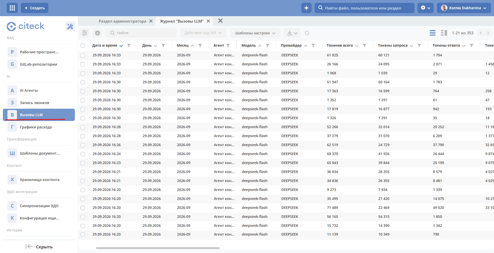

.. _llm-log:

Вызовы LLM
===============================

Журнал **«Вызовы LLM»** хранит историю обращений платформы к языковым моделям. Каждый раз, когда агент Citeck отправляет запрос в LLM, в журнал добавляется запись с параметрами этого вызова.

Журнал доступен по адресу: ``v2/journals?journalId=ai-llm-calls-journal&viewMode=table&ws=admin$workspace``

Журнал предназначен для анализа расхода токенов, отладки и оптимизации агентов, а также для аудита обращений к LLM. 

Данные журнала агрегируются и выводятся на дашборде :ref:`Расход токенов ИИ <token-consumption>`.

Поля журнала
-------------

Время вызова
~~~~~~~~~~~~~

.. list-table::
   :header-rows: 1
   :widths: 30 70
   :class: tight-table

   * - Поле
     - Описание
   * - Дата и время
     - Дата и время обращения к LLM.
   * - День
     - День, в который выполнен вызов. Используется для группировки и фильтрации по суткам.
   * - Месяц
     - Месяц, в который выполнен вызов. Используется для группировки и фильтрации по месяцам.

Агент и модель
~~~~~~~~~~~~~~~

.. list-table::
   :header-rows: 1
   :widths: 30 70
   :class: tight-table

   * - Поле
     - Описание
   * - Агент
     - Агент Citeck, который отправил запрос в LLM.
   * - Модель
     - Языковая модель, к которой выполнено обращение.
   * - Провайдер
     - Поставщик модели.

Токены
~~~~~~~

.. list-table::
   :header-rows: 1
   :widths: 30 70
   :class: tight-table

   * - Поле
     - Описание
   * - Токенов всего
     - Общее количество токенов, израсходованных на вызов.
   * - Токены запроса
     - Количество токенов во входных данных, отправленных в модель.
   * - Токены ответа
     - Количество токенов в ответе модели.
   * - Токены рассуждений
     - Количество токенов, которые модель потратила на рассуждения (для моделей с режимом рассуждений).
   * - Кэшированные
     - Количество токенов запроса, взятых из кэша провайдера.
   * - Запись кэша
     - Количество токенов, записанных в кэш провайдера.
   * - Обращений
     - Количество обращений к модели, учтённых в записи.
   * - Наибольший промпт
     - Размер самого большого промпта среди обращений, в токенах.
   * - Длительность, с
     - Время выполнения вызова в секундах.

Прогон агента
~~~~~~~~~~~~~~

Прогон — это один запуск агента. В рамках прогона агент может несколько раз обратиться к LLM.

.. list-table::
   :header-rows: 1
   :widths: 30 70
   :class: tight-table

   * - Поле
     - Описание
   * - Прогон
     - Идентификатор прогона, в рамках которого выполнен вызов.
   * - Исход прогона
     - Результат прогона: ``SUCCESS``, ``CANCELLED`` или ``FAILED``.
   * - Чистое время прогона
     - Время работы агента без учёта ожидания.
   * - Время прогона с ожиданием
     - Полное время прогона, включая время ожидания.
   * - Завершивший запрос
     - Запрос, на котором завершился прогон.
   * - Причина завершения
     - Причина, по которой завершился прогон.

Контекст вызова
~~~~~~~~~~~~~~~~

.. list-table::
   :header-rows: 1
   :widths: 30 70
   :class: tight-table

   * - Поле
     - Описание
   * - Пользователь
     - Пользователь, от имени которого выполнен вызов.
   * - Рабочее пространство
     - Рабочее пространство, в котором выполнен вызов.
   * - Диалог
     - Диалог с агентом, в рамках которого выполнен вызов.
   * - Диалог (внутренний)
     - Внутренний служебный диалог, в рамках которого выполнен вызов.

