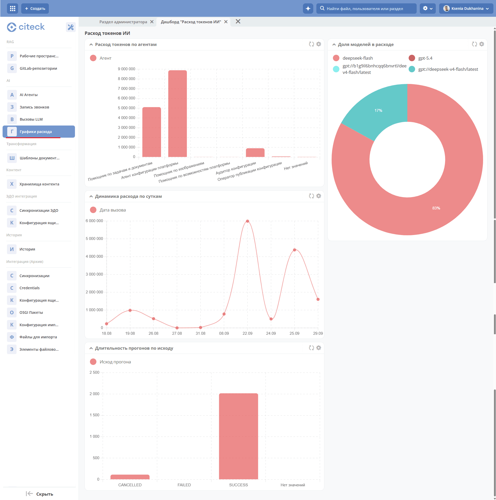

.. _token-consumption:

Расход токенов ИИ
=====================

Дашборд «Расход токенов ИИ». Он строится на данных журнала «Вызовы LLM» и показывает их в агрегированном виде: не отдельные вызовы, а общую картину расходов. Журнал отвечает на вопрос «что произошло в конкретном вызове», дашборд — «куда уходят токены в целом».

Журнал доступен по адресу: ``v2/dashboard?ws=admin$workspace&dashboardId=uiserv/dashboard@ai-usage-dashboard``

Каждый виджет показывает определённый аспект расхода токенов. На дашборде доступны 4 виджета:

1. **Расход токенов по агентам** показывает, сколько токенов потребил каждый агент. По нему видно, какие агенты создают основную нагрузку и где оптимизация даст наибольший эффект.
2. **Доля моделей в расходе** показывает, как расход распределяется между моделями.
3. **Динамика расхода по суткам** показывает, как потребление меняется день ото дня.
4. **Длительность прогонов по исходу** показывает длительность запусков агентов, сгруппированных по результату: ``SUCCESS``, ``CANCELLED``, ``FAILED``.