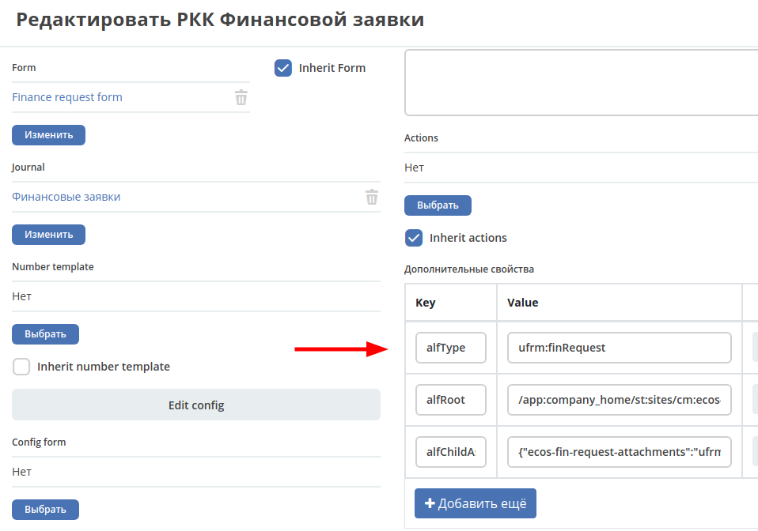

Alfresco
=========

JavaScript Records API
~~~~~~~~~~~~~~~~~~~~~~

Общее
-----

В контексте серверного JavaScript для работы с Records API добавлен сервис Records, который доступен в глобальном контексте.

Класс сервиса: ru.citeck.ecos.records.script.RepoScriptRecordsService

В сервисе предусмотрены следующие методы:

+-------------------------------------+-------------------+-----------------------------------------------------+
| Возвращаемое значение               | Название метода   | Аргументы (\* - обязательный)                       |
+=====================================+===================+=====================================================+
| Any (в зависимости от attributes)   | getAtts           | record\*: RecordRef,                                |
|                                     |                   | attributes\*: RecordAttributes                      |
+-------------------------------------+-------------------+-----------------------------------------------------+
| Record                              | get               | record\*: RecordRef                                 |
+-------------------------------------+-------------------+-----------------------------------------------------+
| QueryRes                            | query             | query\*: RecsQuery,                                 |
|                                     |                   | attributes: RecordAttributes                        |
+-------------------------------------+-------------------+-----------------------------------------------------+

Типы:

* RecordRef - ссылка на запись. Допустимые значения: NodeRef, RecordRef, ScriptNode, String;
* Record - инстанс записи, у которой можно запросить атрибуты или записать туда атрибуты;
* QueryRes - результат поиска;
* RecsQuery - запрос на поиск записей;
* RecordAttributes - атрибуты для получения. Допустимо передавать String или String[] или Map<String, String>.

Возможные варианты:

1. Если мы передаем string, то получаем обычное значение (строка, число и тд.).
2. Если мы передаем массив ["aa", "bb"], то это эквивалентно объекту (Map) {\"aa\":\"aa\",\"bb\":\"cc\"}
3. Если мы передаем объект (Map), то в результате получим тот же объект, но вместо значений исходного объекта будут значения атрибутов. Пример:

Пример::

  {"disp": "cm:title"} -> {"disp": "Договор №2"}

* getAtts - получить атрибуты по заранее известной записи или записям (допускается массив);
* get - получить инстанс записи, с которым можно проводить операции чтения/записи атрибутов;
* query - выполнить поисковый запрос для получения записей.

Описание Record:

+-------------------------------------+-------------------+--------------------------------+
| Возвращаемое значение               | Название метода   | Аргументы (\* - обязательный)  |
+=====================================+===================+================================+
| RecordRef                           | getRef            | \-                             |
+-------------------------------------+-------------------+--------------------------------+
| String                              | getLocalId        | \-                             |
+-------------------------------------+-------------------+--------------------------------+
| Any (в зависимости от attributes)   | load              | attributes\*: RecordAttributes |
+-------------------------------------+-------------------+--------------------------------+
| \-                                  | att               | name\*: String,                |
|                                     |                   | value\*: Any                   |
+-------------------------------------+-------------------+--------------------------------+
| Record                              | save              | \-                             |
+-------------------------------------+-------------------+--------------------------------+

* getRef - получить RecordRef записи;
* getLocalId - получить локальный идентификатор записи;
* load - загрузить атрибуты из записи. Описание аргумента RecordAttributes см выше;
* att - установить значение некоторого атрибута в записи. Без вызова save ничего с реальной записью не происходит;
* save - сохранить изменения, которые сделаны с записью через метод att.

Методы att и save доступны с версии ecos-community-core 4.1.0

Примеры
-------

Поиск записей::

  var result = Records.query({
    sourceId: '',
    query: 'TYPE:"cm:person"',
    language: 'fts-alfresco'
  }, ['cm:userName', 'cm:firstName']).records;

Загрузка атрибутов записи::

  var result = Records.getAtts(['people@admin', 'people@fet'], {'aa': 'cm:userName'});
  ---
  var result = Records.get('people@admin').load(['cm:userName', 'cm:firstName']) ;
  ---
  var result = Records.get('people@admin').load('cm:firstName');

Изменение записи::

  var rec = Records.get('workspace://SpacesStore/c34da292-fa35-4593-a08b-0e3a2c675db7');

  rec.att('idocs:note', 'Some Value');
  rec.att('ecos:documentAmount', 123);

  rec.save();

Использование Records API в условиях процесса
---------------------------------------------

В BPMN процессе можно использовать RecordsAPI следующим образом:

В Flow Condition::

  ${Records.get(document).load("some-attribute?bool") == true}

Связь типов ECOS и типов Alfresco
~~~~~~~~~~~~~~~~~~~~~~~~~~~~~~~~~

В типе ECOS предусмотрены настройки для связи с Alfresco. Настройка происходит в Дополнительных свойствах.

Список настроек:

1. alfType - тип alfresco, который должен устанавливаться у новых сущностей с типом ECOS;
2. alfRoot - корневая директория, которая должна использоваться для размещения новых сущностей;
3. alfChildAssocs - дочерние ассоциации. Это свойство настраивается в родительском типе и в значении у него находится json объект в виде строки, где ключ - ECOS тип дочерней сущности и значение - тип дочерней ассоциации Alfresco.

Пример::

  properties:
    alfChildAssocs: '{"ecos-fin-request-attachments":"ufrm:requestAttachments"}'

Означает, что когда будет создана дочерняя сущность с типом ECOS ecos-fin-request-attachments, то она разместится в дочерней ассоциации ufrm:requestAttachments

Миграция локализации из Share
~~~~~~~~~~~~~~~~~~~~~~~~~~~~~

Скрипт для формирования модуля локализации из alfresco-share (выполняется в консоли браузера). Работает с версии uiserv 1.14.0+
После выполнения можно зайти в системные журналы и скачать новый модуль, после чего залить его в репозиторий:

Скрипт::

  var getMessages = async (locale) => {
    var resProm = await fetch('/share/service/messages.js?locale=' + locale);
    if (resProm.status !== 200) {
        resProm = await fetch('/share/noauth/messages.js?locale=' + locale);
    }
    res = await resProm.text();
    var messagesRegexp = /global = (\{.+\})/;
    var messagesRes = res.match(messagesRegexp);
    return JSON.parse(messagesRes[1]);
  };

  var locales = ["en", "ru"];

  var module = {"moduleId": "alfresco-messages", locales, order: -1, messages: {} };

  var messagesByLocale = {};
  var keys = {};
  for (let locale of locales) {
      messagesByLocale[locale] = await getMessages(locale);
      for (let key in messagesByLocale[locale]) {
          keys[key] = true;
      }
  }

  for (let key of Object.keys(keys)) {
      module.messages[key] = locales.map(l => {
          let message = messagesByLocale[l][key];
          if (message == null) {
              for (let locale of locales) {
                  message = messagesByLocale[locale][key];
                  if (message != null) {
                      return message;
                  }
              }
              message = "";
          }
          return message;
      });
  }

  var record = Citeck.Records.get('uiserv/i18n@');
  for (let key in module) {
      record.att(key, module[key]);
  }
  record.save();

Доработки функционала Alfresco
~~~~~~~~~~~~~~~~~~~~~~~~~~~~~~

Нодбраузер
----------

Проблема: 

Нодбраузер Alfresco при открытии ноды загружает у неё все Source и Child ассоциации. 
Если количество ассоциаций у ноды исчисляется сотнями тысяч, то попытка её открыть на просмотр может привести к падению сервера.

Решение:

Переопределен класс NodeBrowserPost, чтобы лимитировать количество загружаемых ассоциаций.
По умолчанию выставлен лимит 200, но его можно настраивать через alfresco-global.properties

+---------------------------------------------+-----------------------+--------------------------------------+
| Параметр                                    | Значение по умолчанию | Описание                             | 
+=============================================+=======================+======================================+
| ecos.admin.node-browser.child-assocs-limit  | 200                   | Загружаемое кол-во Child ассоциаций  |
+---------------------------------------------+-----------------------+--------------------------------------+
| ecos.admin.node-browser.source-assocs-limit | 200                   | Загружаемое кол-во Source ассоциаций |
+---------------------------------------------+-----------------------+--------------------------------------+
