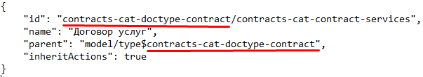

Типы данных
=============

Наследование прав
--------------------

Особенности применение прав в Alfresco
~~~~~~~~~~~~~~~~~~~~~~~~~~~~~~~~~~~~~~~~

1. Изменения прав в настройке типа подхватывается в **alfresco** с небольшой задержкой (секунд 10). Т.о. перед тестированием после изменений прав лучше выждать некоторое время;
2. Права на атрибуты вычисляются при каждом обращении к полям документа. Т.о. права на атрибуты всегда актуальны (за исключением случая из п.1);
3. Права на документ обновляются только при изменении документа (на данный момент учитывается только статус) или людей/групп в ролях. Т.о. если мы меняем права на документ в типе, то это никак не отразится на существующих документах до тех пор пока они не сменят статус или роли. 

ECOS atributes Permissions
~~~~~~~~~~~~~~~~~~~~~~~~~~~~

Компонент для обработки получения прав для атрибутов для матриц нового формата.

# Yaml-формат. Пример конфига::

  id: test-attrs-permissions
  typeRef: emodel/type@test-cat-doctype

  rules:

    - roles: [ initiator ]
      statuses: [ unilever-draft, unilever-reworking ]
      attributes:
        - name: 'cm:content'
          permissions: { read: true, edit: true }

# Регистрируется в ``emodel``. Расположение: **alfresco/module/{module-repo}/model/attrs_permission/test-attrs-permissions.yml**

Маппинг старых типов и видов на новые типы кейсов
--------------------------------------------------

Старые типы и виды кейса записываются в полях tk:type и tk:kind в виде nodeRef. Например:

* **tk:type = workspace://SpacesStore/contracts-cat-doctype-contract** (Договор),
* **tk:kind = workspace://SpacesStore/contracts-cat-contract-services** (Услуги).

Для преобразования в новый тип кейса следует взять значения из этих полей, убрать у каждого из них **workspace://SpacesStore/** и оставшиеся части объединить в одну строку через "/" (слева - ``tk:type``, а справа ``tk:kind``): **contracts-cat-doctype-contract/contracts-cat-contract-services**.

Если ``tk:kind`` не задан, то правой части и знака "/" не нужно. Например: **contracts-cat-doctype-contract**.

При добавлении новых типов кейсов следует учитывать, что тип с ``tk:kind`` должен наследоваться от типа без ``tk:kind`` чтобы унаследовать его свойства:

Связь с типом Alfresco
------------------------

Чтобы у записей с определенным типом ``alfresco`` был нужный тип ECOS можно сделать следующее (на выбор):

Для новых нод:

		1. Сделать аспект, который унаследован от **etype:hasType** и переопределить там свойство **etype:type** (!тип следует указывать *без* emodel/type@ префикса). После этого можно навесить данный аспект на тип ``alfresco`` и новые ноды будут иметь нужный тип ECOS.
		2. В варианте создания добавить атрибут **_type=emodel/type@нужный-тип**. Новые ноды, создаваемые через данный вариант создания будут иметь нужный тип.

Для новых и старых нод:

        3. Добавить **Registrar** бин, который зарегистрирует связь тип alfresco → тип ECOS:

            **ecosTypeService.register(QName nodeType, Function<AlfNodeInfo, RecordRef> evaluator)**.

Для примера см. конфигурацию **ru.citeck.ecos.node.EcosTypeConfiguration**.