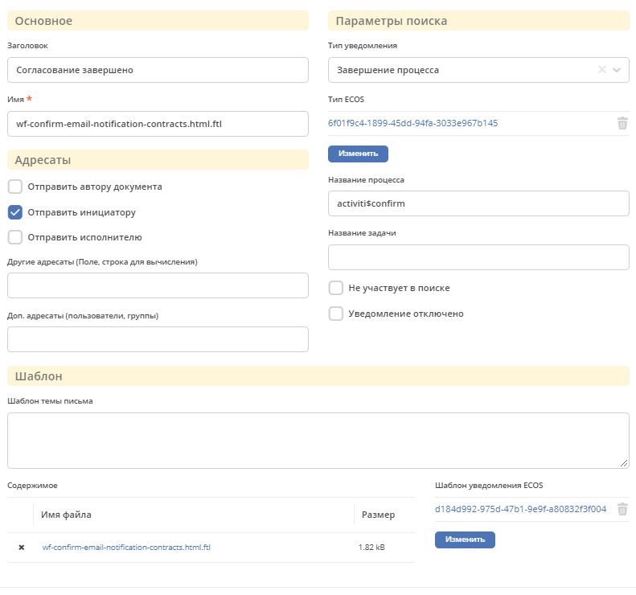
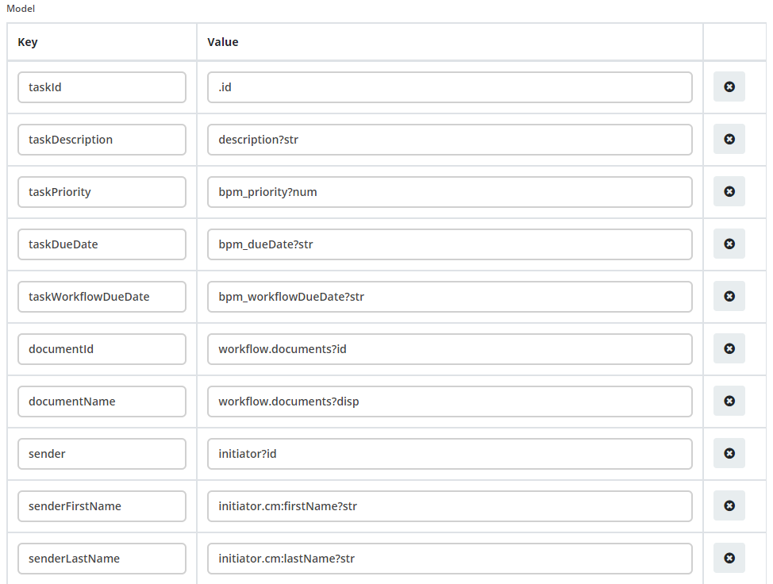

Уведомления о событиях alfresco
================================

.. contents::

Для настройки уведомлений на определённые события добавлен системный журнал “Уведомления о событиях”. 

.. warning:: 

       Данный журнал является временным решением перехода старой отправки уведомлений через новый микросервис.

.. note:: 

       При создании уведомления через журнал, уведомление складывается по пути: ``/app:company_home/app:dictionary/app:email_templates/cm:workflownotification``

1. Форма уведомления
--------------------

.. note:: 

       Имя должно быть уникальным

2. Тип уведомления
------------------

При каком либо событии, например переназначении задачи, ищется шаблон в журнале с фильтром по полю “Тип уведомления”. Если установлена галочка “Не участвует в поиске”, шаблон игнорируется.

3. Логика поиска шаблона
------------------------

Шаблон можно привязывать к типу кейса, процессу Activity/Flowable и задаче, для этого используются следующие поля соответственно “Тип ECOS”, “Название процесса”, “Название задачи”.

Приоритет выбора шаблона следующий: “Название задачи” > “Название процесса” > “Тип ECOS”.

*Пример:* мы можем задать для определенной задачи шаблон, он будет применён для всех типов кейсов и для всех процессов. Но если создадим шаблон для такой же задачи, но укажем тип кейса, то для указанного типа кейса и задачи будет выбран этот шаблон.

4. Отключение/Включении уведомлений
-----------------------------------

Для отключение уведомления по фильтру необходимо установить галочку ``Уведомление отключено``

Если по умолчанию необходимо отключить отправку уведомлений, создаём запасись с пустыми полями типа ecos, процесса и задачи. Тогда отправка по умолчанию будет отключена.

Для полного отключения уведомлений необходимого добавить properites со значением false:

.. code-block:: 

       notification.cancel.workflow.enabled=true
       notification.complete.task.enabled=true
       notification.complete.workflow.enabled=true
       notification.document.change.enabled=true
       notification.for.log.item.enabled=true
       notification.pool.task.enabled=true
       notification.reassing.task.enabled=true
       notification.start.task.enabled=true
       notification.start.workflow.enabled=true
       workflow.notification.overdue.enabled=true
       workflow.notification.workflow.overdue.enabled=true

5. Адресаты
-----------

Поля Отправить автору документа, Отправить инициатору, Отправить исполнителю, Другие адресаты (Поле, строка для вычисления), Доп. адресаты (пользователи, группы) позволяют регулировать кому будет отправлено уведомление.

.. warning:: 

       Для некоторых уведомлений выбор адресата может не работать. Проверить кому отправляется можно в классах нотификатора ``com-core ru.citeck.ecos.notification.*``
       Например, для ``DocumentNotificationSender`` не реализованы функции получения для отправки инициатору и исполнителю.

6. Шаблон
---------

В поле ``Содержимое`` находиться шаблон который отправляется на стороне Alfresco.

Для отправки уведомления через микросервис ecos-notification в поле ``Шаблон уведомления ECOS`` нужно выбрать уже созданный шаблон из журнала Шаблоны уведомлений. Поле содержимое можно оставить пустым.

7. Данные для шаблонов ECOS
---------------------------

В данных уведомлений в качестве основной записи уведомления используется ``ru.citeck.ecos.notification.task.record.TaskExecutionRecord`` с следующими полями:

* name, title, description, .id
* Map<String, Object> workflow - Свойства задачи процесса, обычно содержит id и документы (documents)
* Map<String, Object>properties - Свойства полученные из таски. Для получение свойства опускается префикс ``properties``. (например просто bpm_priority)

В переменную ``$subject`` устанавливается тема которая вычисляется в нотификаторе.

Пример модели данных:

